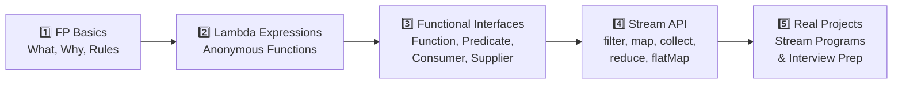
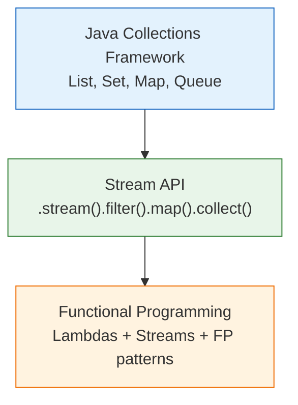

# 📘 Course Introduction — Functional Programming in Java

---

## 📌 Introduction

### 🧠 What is this about?

This is the starting point of your journey into **Functional Programming in Java**. Before we write a single lambda or stream, let's understand what this course covers, why functional programming matters, and the roadmap that will take you from beginner to confident functional programmer.

### 🌍 Real-World Problem First

Imagine you're a Java developer who's been writing code the traditional way — classes, objects, loops, if-else statements everywhere. Your codebase works, but it's **verbose**, **hard to maintain**, and **difficult to parallelize**. You look at modern Java codebases (Spring Boot, microservices) and see `.stream().filter().map().collect()` everywhere — and it looks like a foreign language.

That's exactly the gap this course bridges.

### ❓ Why does it matter?
- Modern Java (8+) is built on functional programming concepts — you **can't avoid** lambdas and streams in any serious project
- Functional code is **shorter**, **more readable**, and **easier to debug**
- Companies actively seek developers who can write functional Java — it's a career differentiator
- Frameworks like Spring, Hibernate, and reactive libraries use functional patterns extensively

### 🗺️ What we'll learn (Learning Map)
- The course roadmap: what topics we'll cover and in what order
- Why functional programming is a must-learn skill for Java developers
- How this course is structured for progressive learning

---

## 🧩 Concept 1: The Course Roadmap

### 🧠 Layer 1: The Simple Version

This course takes you from understanding what functional programming *is*, all the way to writing real-world functional Java code — step by step, with plenty of examples.

### 🔍 Layer 2: The Developer Version

The course is structured in a deliberate learning progression:



Here's the detailed breakdown:

| Phase | Topics | What You'll Be Able To Do |
|-------|--------|---------------------------|
| **FP Basics** | Pure functions, first-class functions, higher-order functions, FP rules | Understand *why* functional programming exists and its core principles |
| **Lambda Expressions** | Syntax, examples, passing lambdas, real-world use cases | Write concise anonymous functions to replace verbose class implementations |
| **Functional Interfaces** | `Function`, `Predicate`, `Consumer`, `Supplier`, `UnaryOperator`, `BinaryOperator` | Use Java's built-in functional types fluently |
| **Stream API** | `filter`, `map`, `flatMap`, `sorted`, `collect`, `forEach`, `reduce`, parallel streams | Transform, filter, and aggregate collections in one-liners |
| **Practice** | Stream programs, interview patterns, Collections framework | Solve real problems and ace interviews |

### 🌍 Layer 3: The Real-World Analogy

Think of learning functional programming like learning to cook with a new kitchen:

| Cooking Analogy | FP Course Equivalent |
|----------------|---------------------|
| Understanding what "baking" means vs "frying" | FP Basics (what is FP vs imperative?) |
| Learning to use a blender (a single tool) | Lambda Expressions (one tool, many uses) |
| Learning different blender attachments | Functional Interfaces (specialized tools) |
| Making a full recipe using all tools | Stream API (combining everything) |
| Cooking a complete meal for guests | Real-world programs & interview prep |

You don't start by making a five-course meal — you start by understanding your kitchen.

---

## 🧩 Concept 2: Why Learn Functional Programming?

### 🧠 Layer 1: The Simple Version

Functional programming lets you write **less code** that does **more work**, with **fewer bugs**.

### 🔍 Layer 2: The Developer Version

Here are the five key benefits:

| Benefit | What It Means | Example |
|---------|--------------|---------|
| **Less Code** | Lambda expressions and streams eliminate boilerplate | A 10-line loop becomes a 1-line stream pipeline |
| **Better Readability** | Code reads like a sentence: "filter even numbers, double them, collect" | `list.stream().filter(n -> n % 2 == 0).map(n -> n * 2).collect(toList())` |
| **Easier Debugging** | No hidden state changes — functions depend only on their inputs | Pure functions are predictable and testable |
| **Parallel Processing** | No shared state means threads don't conflict | `.parallelStream()` can safely split work across CPU cores |
| **Industry Standard** | Spring, Hibernate, and reactive frameworks all use FP patterns | You'll encounter lambdas in every modern Java codebase |

### 💻 Layer 5: Code — See the Difference

**❌ Imperative style (before Java 8):**
```java
// Calculate sum of even numbers — imperative way
List<Integer> numbers = List.of(1, 2, 3, 4, 5, 6, 7, 8, 9, 10);
int sum = 0;
for (int n : numbers) {
    if (n % 2 == 0) {
        sum += n;  // modifying state variable
    }
}
System.out.println(sum);  // Output: 30
```

**✅ Functional style (Java 8+):**
```java
// Calculate sum of even numbers — functional way
List<Integer> numbers = List.of(1, 2, 3, 4, 5, 6, 7, 8, 9, 10);
int sum = numbers.stream()
    .filter(n -> n % 2 == 0)   // keep even numbers
    .mapToInt(n -> n)           // unbox Integer → int
    .sum();                     // calculate total
System.out.println(sum);  // Output: 30
```

**Why is the functional version better?**
- No mutable `sum` variable that could be accidentally modified elsewhere
- No loop counter to manage
- Reads like English: "stream the numbers, filter evens, map to int, sum"
- Can trivially parallelize by changing `.stream()` to `.parallelStream()`

---

## 🧩 Concept 3: Course Prerequisites & Collections Framework

### 🧠 Layer 1: The Simple Version

The Stream API works *on top of* collections (List, Set, Map). If you don't know collections, streams will feel like magic you can't control.

### 🔍 Layer 2: The Developer Version



**Why collections first?** Every stream pipeline starts from a collection:
- `list.stream()` — turns a `List` into a `Stream`
- `.collect(Collectors.toList())` — turns a `Stream` back into a `List`
- `.collect(Collectors.groupingBy(...))` — groups stream elements into a `Map`

If you don't understand what a `List`, `Set`, or `Map` is, you won't understand what a stream produces or consumes.

> 💡 **Pro Tip:** If you already know Java Collections well, you can skip the collections sections in this course and jump straight to lambdas and streams.

---

## ✅ Key Takeaways

→ This course follows a progressive path: **FP Basics → Lambdas → Functional Interfaces → Stream API → Practice**

→ Functional programming is not optional in modern Java — it's used in every major framework and library

→ The key benefits are: **less code, better readability, easier debugging, safe parallelism**

→ Collections knowledge is a prerequisite for Stream API — streams operate on collections

→ By the end of this course, you'll think in **"what to do"** (functional) rather than **"how to do it"** (imperative)

---

## 🔗 What's Next?

Now that we have the big picture of what this course covers and why functional programming matters, let's dive into the **foundations**. In the next note, we'll explore what functional programming actually *is* — with a side-by-side comparison of imperative vs. functional code that will make the concept click immediately.
