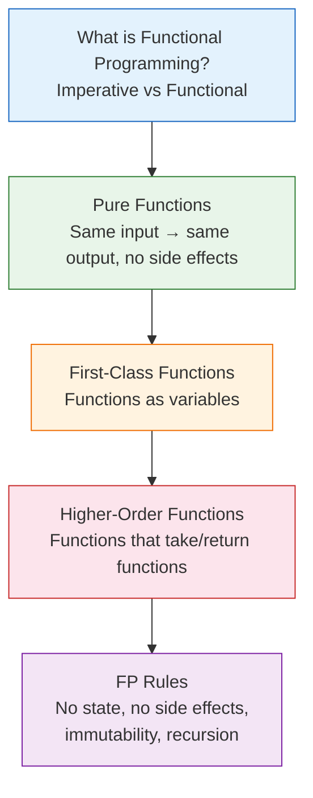

# 📘 Why Learn Java Collections Framework Before Functional Programming?

---

## 📌 Introduction

### 🧠 What is this about?

Before we dive into functional programming concepts, let's understand **why the Java Collections Framework is a prerequisite** — and get a roadmap of the key concepts and rules we'll cover in this section.

### ❓ Why does it matter?

Functional programming in Java doesn't operate in isolation — it **operates on data structures**. Lambda expressions filter lists. Streams transform maps. Collectors group elements into sets. If you don't understand the data structures, you can't understand what functional operations produce.

---

## 🧩 Section Overview: Functional Programming Foundations

This section covers the **theoretical foundations** that every Java developer needs before writing functional code:

### 🗺️ What we'll learn:

| Concept | What You'll Understand | Why It Matters |
|---------|----------------------|----------------|
| **Functional Programming** | What FP is and how it differs from imperative programming | Sets the mental model for everything that follows |
| **Pure Functions** | Functions with no side effects that always return the same output | The building block of reliable, testable code |
| **First-Class Functions** | Treating functions like variables — assign, pass, return them | Enables the flexibility that makes FP powerful |
| **Higher-Order Functions** | Functions that accept or return other functions | The pattern behind `filter()`, `map()`, and `sorted()` |
| **FP Rules** | No state, no side effects, immutable variables, recursion over loops | The strict principles that make FP code predictable |

---

## ✅ Key Takeaways

→ Collections are the **data** that functional programming **operates on** — you can't skip them

→ This section builds the **conceptual foundation** — understand these concepts and the code will make sense

→ We'll progress from simple (what is FP?) to strict (rules of pure FP) in a logical flow

---

## 🔗 What's Next?

Let's begin with the most fundamental question: **What is Functional Programming?** We'll compare it side-by-side with the imperative style you already know, so you can see exactly what changes — and what gets better.
