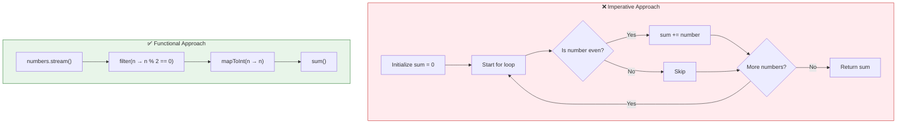
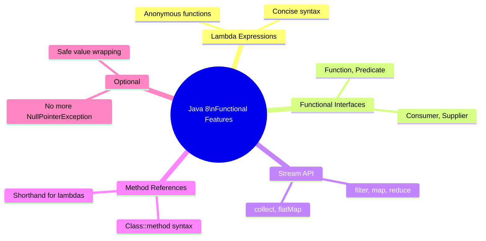

# 📘 Section Overview — Functional Programming Fundamentals

---

## 📌 Introduction

### 🧠 What is this about?

This is a roadmap for the **Functional Programming Fundamentals** section. Before we explore each concept in depth, let's understand the big picture — what functional programming is, how it compares to the imperative style you already know, and why Java 8 changed everything.

### 🌍 Real-World Problem First

Picture this: You're a Java developer maintaining a 50,000-line codebase. Bugs keep appearing because some method *somewhere* modifies a shared variable unexpectedly. Unit tests are fragile because they depend on external state. Adding parallelism causes mysterious data corruption. 

This is the world of **imperative programming** taken to its extreme. Functional programming offers an escape — code that's **predictable**, **testable**, and **safely parallelizable** by design.

### ❓ Why does it matter?
- Before Java 8, Java was purely imperative — lots of boilerplate, mutable state everywhere
- After Java 8, Java supports **both** paradigms — and modern code uses functional style heavily
- Understanding the *philosophy* behind FP makes lambda expressions and streams feel natural, not magical

### 🗺️ What we'll learn (Learning Map)
- What functional programming is vs. imperative programming
- The key advantages of the functional approach
- A preview of the concepts we'll deep-dive into next

---

## 🧩 Concept 1: Imperative vs. Functional Programming

### 🧠 Layer 1: The Simple Version

**Imperative programming** tells the computer **how** to do something, step by step — like giving turn-by-turn driving directions.

**Functional programming** tells the computer **what** you want — like telling a GPS your destination and letting it figure out the route.

### 🔍 Layer 2: The Developer Version

| Aspect | Imperative (Before Java 8) | Functional (Java 8+) |
|--------|---------------------------|---------------------|
| **Approach** | Step-by-step instructions | Declare what you want |
| **Control flow** | `for`, `while`, `if-else` | `stream()`, `filter()`, `map()` |
| **State** | Mutable variables modified in loops | No mutable variables |
| **Focus** | **How** to compute the result | **What** result you want |
| **Code volume** | Verbose — many lines | Concise — often one-liners |
| **Debugging** | Hard — state changes at many points | Easy — no hidden state changes |

**Why does this difference exist?** Imperative programming was designed for how CPUs actually work — step-by-step instructions, registers, memory addresses. Functional programming was designed for how **humans think about problems** — transformations, filters, mappings. Java 8 brought the functional model to Java so you could think at a higher level while the JVM handles the low-level details.

### 🌍 Layer 3: The Real-World Analogy

| Analogy Element | Imperative | Functional |
|----------------|-----------|------------|
| **Cooking** | Recipe with exact steps: "Heat oil to 180°C, add onions, stir for 3 minutes, add garlic..." | "Make me a stir-fry with these vegetables" (chef figures out the steps) |
| **Navigation** | "Turn left at the light, go 2 blocks, turn right at the gas station..." | "Take me to the airport" (GPS figures out the route) |
| **Ordering food** | "Take bread, spread mayo, add lettuce, add tomato, add cheese, close bread" | "I'd like a veggie sandwich" (the kitchen handles it) |

### ⚙️ Layer 4: How It Works — Side by Side

Let's look at a concrete example: **Calculate the sum of even numbers from a list.**



### 💻 Layer 5: Code — Prove It!

**❌ Imperative — "How to do it":**
```java
public static int calculateSum(List<Integer> numbers) {
    int sum = 0;                        // mutable state variable
    for (int number : numbers) {        // explicit loop
        if (number % 2 == 0) {          // explicit condition
            sum += number;              // modifying state
        }
    }
    return sum;
}
// Output: 30 (for [1, 2, 3, 4, 5, 6, 7, 8, 9, 10])
```

**What's wrong here?**
- `sum` is a **mutable state variable** — any bug could modify it unexpectedly
- The loop and if-statement are **boilerplate** — they describe *how* to iterate, not *what* you want
- This code is **not safely parallelizable** — two threads modifying `sum` simultaneously would lose data

**✅ Functional — "What to do":**
```java
public static int calculateSum(List<Integer> numbers) {
    return numbers.stream()              // convert list to stream
        .filter(n -> n % 2 == 0)         // keep only even numbers
        .mapToInt(n -> n)                // unbox Integer → int
        .sum();                          // calculate total
}
// Output: 30 (for [1, 2, 3, 4, 5, 6, 7, 8, 9, 10])
```

**Why is this better?**
- **No mutable variables** — `sum` doesn't exist; the stream pipeline produces the result directly
- **Reads like English** — "stream the numbers, filter evens, map to int, sum"
- **Safely parallelizable** — change `.stream()` to `.parallelStream()` and it works across threads with zero code changes

---

## 🧩 Concept 2: Key Advantages of Functional Programming

### 🧠 Layer 1: The Simple Version

Functional programming gives you three superpowers: **less code**, **fewer bugs**, and **free parallelism**.

### 🔍 Layer 2: The Developer Version

| Advantage | Why It Works | Impact |
|-----------|-------------|--------|
| **Concise code** | Lambdas and streams eliminate loop/if boilerplate | 10 lines → 1 line; faster development |
| **Easier debugging** | No hidden state changes — function output depends only on input | Bugs are reproducible and isolated |
| **Parallel processing** | No shared mutable state means threads can't corrupt each other | Add `.parallelStream()` for instant multi-core execution |
| **Better readability** | Code describes *what* happens, not *how* | New developers understand the code faster |
| **Modern framework alignment** | Spring, Hibernate, and reactive libraries use FP extensively | Your code fits naturally into the ecosystem |

### 💻 Layer 5: Code — The Parallelism Superpower

```java
// Sequential — runs on 1 core
int sum = numbers.stream()
    .filter(n -> n % 2 == 0)
    .mapToInt(n -> n)
    .sum();

// Parallel — automatically splits work across all CPU cores
int sum = numbers.parallelStream()    // ← only this word changes!
    .filter(n -> n % 2 == 0)
    .mapToInt(n -> n)
    .sum();
```

**Why can't imperative code do this?** Because the imperative version has `sum += number` — a shared mutable variable. If two threads execute `sum += 3` and `sum += 5` simultaneously, they might both read `sum = 10`, compute `13` and `15`, and write back — losing one update. The functional version has no shared variable, so each thread can independently filter and sum its portion, and the results are safely combined at the end.

---

## 🧩 Concept 3: What Java 8 Brought to the Table

### 🧠 Layer 1: The Simple Version

Java 8 (released 2014) was the biggest Java update ever — it added the tools that make functional programming possible in Java.

### 🔍 Layer 2: The Developer Version



| Feature | What It Does | Example |
|---------|-------------|---------|
| **Lambda Expressions** | Write anonymous functions inline | `(x) -> x * 2` |
| **Functional Interfaces** | Interfaces with exactly one abstract method — lambda targets | `Function<Integer, Integer>` |
| **Stream API** | Process collections declaratively | `list.stream().filter(...).collect(...)` |
| **Method References** | Shorthand for lambdas that just call a method | `String::toUpperCase` |

> 💡 **Pro Tip:** You don't need to learn all of these at once. This course teaches them in order: lambdas first (the building block), then functional interfaces (the contract), then streams (the powerhouse).

---

## ✅ Key Takeaways

→ **Imperative** = "how to do it" (loops, if-else, mutable variables). **Functional** = "what to do" (stream, filter, map, collect)

→ Functional programming produces **less code**, **fewer bugs**, and **safe parallelism** — not just a style preference, but a practical advantage

→ Java 8 introduced lambdas, functional interfaces, streams, and method references — making FP possible in Java

→ The functional approach doesn't replace OOP — it **complements** it. You'll use both in real projects

→ The key mental shift: stop thinking about *steps* and start thinking about *transformations*

---

## 🔗 What's Next?

Now that we understand what functional programming is and how it differs from imperative programming, let's explore the first core concept in depth: **What is Functional Programming?** We'll go beyond the comparison and understand the philosophy, the rules, and why functions are treated differently in the functional world.
