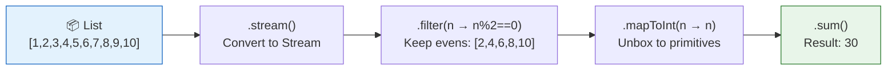
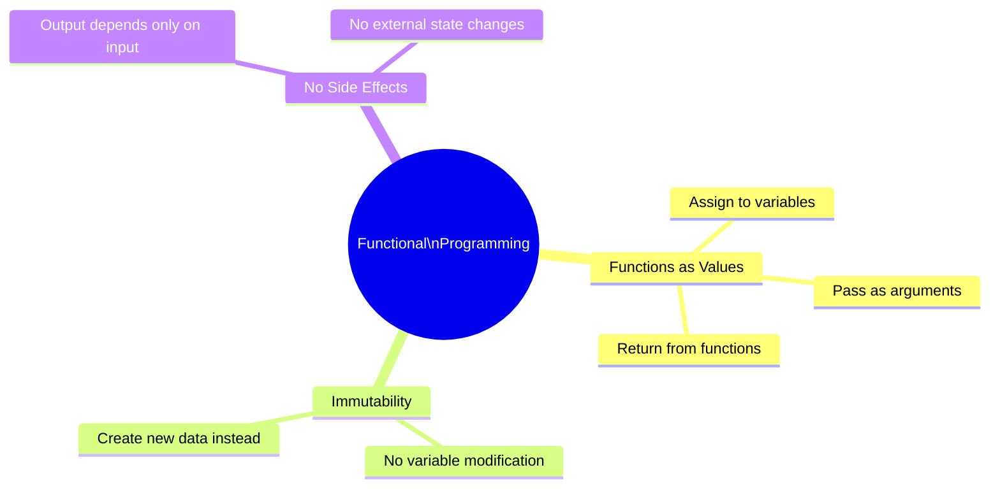

# 📘 What is Functional Programming?

---

## 📌 Introduction

### 🧠 What is this about?

Functional programming is a **programming paradigm** — a way of thinking about and writing code. Instead of giving the computer step-by-step instructions (imperative), you describe **what** transformations you want on your data, and the language figures out the rest.

### 🌍 Real-World Problem First

You're maintaining a Java application. A bug report comes in: "The total calculation is wrong sometimes." You trace the issue to a method that uses a shared `sum` variable. Another method modifies `sum` before yours finishes reading it. The variable changed out from under you. Two developers, two methods, one shared variable, one broken total.

Functional programming eliminates this entire category of bugs by saying: **no shared mutable state, ever.**

### ❓ Why does it matter?
- Every modern Java codebase uses functional patterns — you'll encounter them daily
- Without understanding FP, lambda expressions and streams will feel like memorized syntax rather than intuitive tools
- FP makes your code **predictable** — same input always produces same output, no surprises

### 🗺️ What we'll learn (Learning Map)
- The fundamental difference between imperative and functional programming
- How Java moved from purely imperative to supporting both paradigms
- The three key characteristics that define functional programming
- Why functional code is easier to debug, test, and parallelize

---

## 🧩 Concept 1: Imperative Programming — The "Before" World

### 🧠 Layer 1: The Simple Version

Imperative programming is like writing a recipe: "First do this, then do that, then check this condition, then modify this variable." You spell out every single step.

### 🔍 Layer 2: The Developer Version

In imperative programming, you:
- Use **loops** (`for`, `while`, `do-while`) to iterate
- Use **control flow** (`if`, `else`, `switch`) to make decisions
- Use **mutable variables** to accumulate results
- **Define every operation** step by step — the developer controls the flow entirely

### 💻 Code Example

```java
// Imperative: Calculate sum of even numbers
public static int calculateSum(List<Integer> numbers) {
    int sum = 0;                        // Step 1: Initialize state variable
    for (int number : numbers) {        // Step 2: Loop through each element
        if (number % 2 == 0) {          // Step 3: Check condition
            sum += number;              // Step 4: Modify state
        }
    }
    return sum;                         // Step 5: Return accumulated result
}
// Output for [1,2,3,4,5,6,7,8,9,10]: 30
```

**What makes this imperative?**
- `sum` is a **state variable** — its value changes throughout execution
- We **explicitly loop** through each element
- We **explicitly check** each condition
- We **explicitly modify** the result variable

> Think of it this way: in imperative programming, **you are the CPU**. You tell Java exactly which memory location to read, which comparison to make, which value to write. You're micromanaging every step.

---

> Now that we understand the imperative world — the world of step-by-step instructions and mutable state — let's see what happens when we flip the paradigm entirely. What if you could just *declare* what you want, and let Java figure out the steps?

---

## 🧩 Concept 2: Functional Programming — The "What, Not How" Paradigm

### 🧠 Layer 1: The Simple Version

Functional programming is telling the computer **what** result you want, without specifying **how** to compute it step by step. Instead of loops and variables, you use **functions** that transform data.

### 🔍 Layer 2: The Developer Version

In functional programming, you:
- **Don't use loops** — you call methods like `filter()`, `map()`, `reduce()`
- **Don't use if-statements** — you pass conditions as lambda expressions
- **Don't modify variables** — the stream pipeline produces the result directly
- **Describe transformations** — "filter the evens, then sum them"

### 🌍 Layer 3: The Real-World Analogy

| Analogy Element | Imperative | Functional |
|----------------|-----------|------------|
| **You at a restaurant** | "Take wheat flour, knead it for 5 minutes, roll it flat, heat the pan to 200°C, place the dough, flip after 30 seconds..." | "I'd like a chapati, please" |
| **Who does the work** | You specify every step | The kitchen (runtime) handles the steps |
| **What you control** | Every micro-operation | Just the desired outcome |
| **What if you want naan instead?** | Rewrite the entire recipe | Change your order — same kitchen |

**Why does this analogy matter?** In imperative code, changing what you compute often means rewriting the loop logic. In functional code, you just change the lambda expression — the pipeline structure stays the same.

### ⚙️ Layer 4: How It Works — The Transformation Pipeline



**Step 1 — Convert to Stream:** `numbers.stream()` converts the list into a stream — a lazy pipeline that processes elements one at a time.

**Step 2 — Filter:** `.filter(n -> n % 2 == 0)` keeps only elements where the condition is true. It doesn't create a new list — it sets up a filter in the pipeline.

**Step 3 — Map:** `.mapToInt(n -> n)` transforms each `Integer` wrapper object into a primitive `int` for efficient arithmetic.

**Step 4 — Terminal Operation:** `.sum()` triggers the pipeline to execute and produces the final result.

### 💻 Layer 5: Code — Prove It!

**✅ Functional: "What to do"**
```java
// Functional: Calculate sum of even numbers
public static int calculateSum(List<Integer> numbers) {
    return numbers.stream()              // convert to stream
        .filter(n -> n % 2 == 0)         // keep even numbers
        .mapToInt(n -> n)                // unbox to int
        .sum();                          // sum them up
}
// Output for [1,2,3,4,5,6,7,8,9,10]: 30
```

**Compare side by side:**
```java
// ❌ Imperative: 7 lines, mutable state, explicit loop
int sum = 0;
for (int n : numbers) {
    if (n % 2 == 0) {
        sum += n;
    }
}

// ✅ Functional: 1 expression, no mutable state, no loop
int sum = numbers.stream().filter(n -> n % 2 == 0).mapToInt(n -> n).sum();
```

### 📊 Layer 6: Full Comparison

| Aspect | Imperative | Functional |
|--------|-----------|------------|
| **Lines of code** | 5-7 | 1-3 |
| **Mutable variables** | Yes (`sum`) | No |
| **Loops** | `for`, `while` | None — uses `stream()` |
| **Conditions** | `if`, `else` | Lambda: `n -> n % 2 == 0` |
| **What you specify** | Every step of the computation | The transformation you want |
| **Parallelizable?** | No — shared `sum` variable | Yes — `.parallelStream()` |
| **Debuggability** | Hard — `sum` changes at many points | Easy — each stage is independent |

**Why is functional code shorter?** Because the loop, the condition check, the accumulation, and the return are all handled by the stream methods internally. You're not writing the *machinery* — you're writing the *intent*.

**Why is functional code safer for parallelism?** Because there's no shared mutable variable. In the imperative version, `sum += number` is a **read-modify-write** operation — if two threads do this simultaneously, one update gets lost. The functional version has no shared variable to fight over.

---

## 🧩 Concept 3: The Three Pillars of Functional Programming

### 🧠 Layer 1: The Simple Version

Functional programming is built on three ideas: **functions are values**, **data doesn't change**, and **functions don't have side effects**.

### 🔍 Layer 2: The Developer Version



| Pillar | What It Means | Java Example |
|--------|--------------|--------------|
| **Functions as Values** | You can store a function in a variable, pass it to a method, or return it from a method | `Function<Integer, Integer> square = x -> x * x;` |
| **Immutability** | Once data is created, it never changes — you create new data instead | `List<String> names = List.of("Alice", "Bob");` (unmodifiable) |
| **No Side Effects** | A function's result depends ONLY on its inputs — it doesn't read or write anything external | `int add(int a, int b) { return a + b; }` |

> 💡 **The Aha Moment:** These three pillars work together. If functions are values, you can pass them around freely. If data is immutable, functions can't corrupt shared state. If there are no side effects, functions are predictable and testable. Remove any one pillar, and the whole system gets weaker.

### 💻 Layer 5: Code — Each Pillar in Action

**Pillar 1 — Functions as Values:**
```java
// Store a function in a variable
Function<Integer, Integer> doubleIt = x -> x * 2;

// Pass it as an argument
List<Integer> doubled = numbers.stream()
    .map(doubleIt)         // passing the function as a value
    .collect(Collectors.toList());
// Input: [1, 2, 3] → Output: [2, 4, 6]
```

**Pillar 2 — Immutability:**
```java
// ❌ Mutable — can be changed later (dangerous)
List<String> names = new ArrayList<>();
names.add("Alice");
names.add("Bob");
names.add("Eve");   // someone adds an unexpected element

// ✅ Immutable — cannot be changed after creation (safe)
List<String> names = List.of("Alice", "Bob");
// names.add("Eve");   // ❌ Throws UnsupportedOperationException
```

**Pillar 3 — No Side Effects:**
```java
// ❌ Has side effects — modifies external state
int total = 0;
void addToTotal(int n) {
    total += n;    // modifies something OUTSIDE the function
}

// ✅ No side effects — depends only on inputs
int add(int a, int b) {
    return a + b;  // pure computation, no external state touched
}
```

---

### ⚠️ Pitfalls & Mistakes

**Mistake 1: Thinking functional means "no classes or objects"**
- 👤 What devs do: Try to avoid all OOP when writing functional code
- 💥 Why it's wrong: Java is a multi-paradigm language — functional programming **complements** OOP, it doesn't replace it
- ✅ Fix: Use OOP for your domain model (classes, inheritance) and FP for data transformations (streams, lambdas). They work beautifully together.

**Mistake 2: Using functional syntax with imperative thinking**
```java
// ❌ Using stream but still thinking imperatively
List<Integer> result = new ArrayList<>();
numbers.stream().forEach(n -> {
    if (n % 2 == 0) {
        result.add(n);  // modifying external state inside a lambda!
    }
});

// ✅ Actually functional — no external mutation
List<Integer> result = numbers.stream()
    .filter(n -> n % 2 == 0)
    .collect(Collectors.toList());
```

**Why is the first version bad?** It uses `.stream()` and a lambda, so it *looks* functional — but it's mutating `result` from inside the lambda. This breaks the "no side effects" rule and isn't thread-safe. The second version lets the stream framework handle the collection internally.

---

### 💡 Pro Tips

**Tip 1: Read functional code right-to-left in your head**
- Why it works: Each method in a stream pipeline transforms the input for the next stage
- When to use: Any time you see a chain like `.stream().filter().map().collect()`
- Read as: "Collect the result of mapping the filtered stream of numbers"

**Tip 2: Start functional gradually**
- Why it works: You don't have to rewrite everything — start with one loop, convert it to a stream, see if it's clearer
- When to use: When refactoring existing imperative code
- Example: Every time you see `for(X x : list) { if(condition) { result.add(transform(x)); } }`, that's a `filter + map + collect`

---

## ✅ Key Takeaways

→ **Imperative** programming tells Java **how** to compute (loops, conditions, mutable variables). **Functional** programming tells Java **what** you want (transformations, pipelines, immutable data).

→ Functional code is **shorter** (less boilerplate), **safer** (no shared mutable state), and **parallelizable** (`parallelStream()`)

→ The three pillars of FP: **functions as values**, **immutability**, and **no side effects**

→ Java supports **both** paradigms — use OOP for structure, FP for data transformations

→ The mental shift is from **"how do I compute this step by step?"** to **"what transformation do I want?"**

---

## 🔗 What's Next?

Now that we understand what functional programming is and how it compares to imperative programming, let's dive into the first core principle: **Pure Functions**. This is the foundational rule — the one that makes everything else possible. We'll see exactly what "no side effects" means in practice, with code that proves why pure functions are predictable and impure functions are dangerous.
