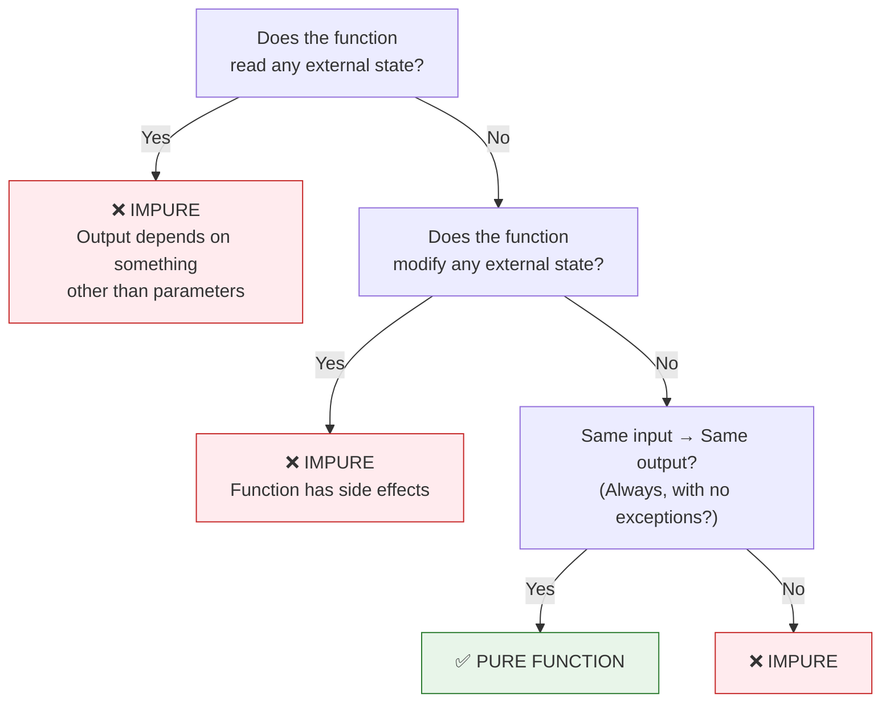
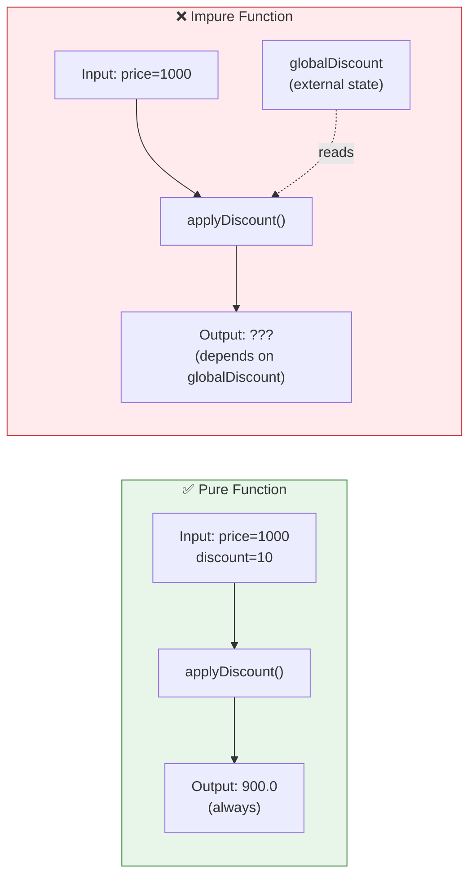
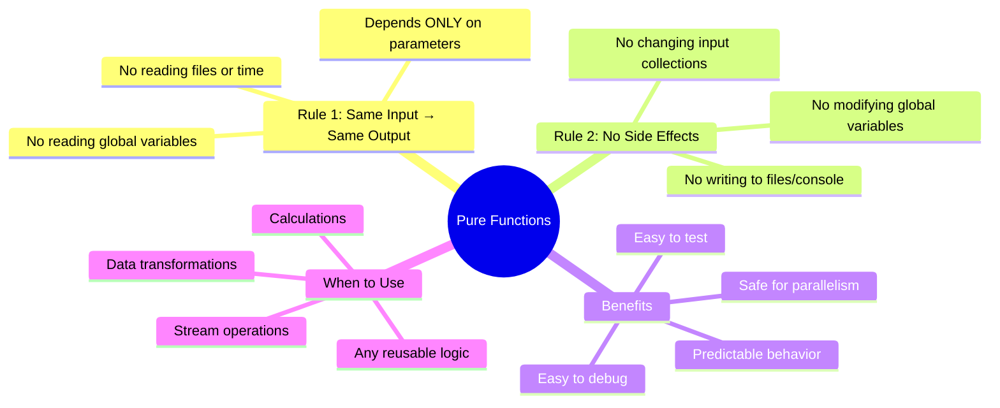

# 📘 Pure Functions in Functional Programming

---

## 📌 Introduction

### 🧠 What is this about?

Pure functions are the **single most important concept** in functional programming. They are the building block that makes functional code predictable, testable, and safe. If you understand pure functions, every other FP concept will click naturally.

### 🌍 Real-World Problem First

You call a method with the same arguments twice. The first time it returns 900. The second time it returns 800. Nothing in your code changed — but the output is different. Why?

Because somewhere, a global variable was silently modified between calls. The method depends on something *outside* its parameters, and that "something" changed without you knowing. This is the world of **impure functions** — and it's a debugging nightmare.

Pure functions **guarantee** that the same input always produces the same output. No surprises. No hidden dependencies.

### ❓ Why does it matter?
- Pure functions are **predictable** — same input = same output, always
- Pure functions are **testable** — no external setup needed, just pass inputs and check outputs
- Pure functions are **parallelizable** — they don't modify shared data, so threads can't conflict
- Without pure functions, functional programming falls apart — they're the foundation

### 🗺️ What we'll learn (Learning Map)
- The two rules that define a pure function
- The difference between pure and impure functions (with code proofs)
- Why impure functions cause bugs
- When and why to use pure functions

---

## 🧩 Concept 1: The Two Rules of Pure Functions

### 🧠 Layer 1: The Simple Version

A pure function follows just two rules:
1. **Same input → Same output** — always, no exceptions
2. **No side effects** — it doesn't change anything outside itself

That's it. If a function follows both rules, it's pure. If it breaks either one, it's impure.

### 🔍 Layer 2: The Developer Version

| Rule | What It Means | What Breaks It |
|------|--------------|----------------|
| **Same input → Same output** | `f(5)` returns `25` every single time — today, tomorrow, in any thread | Reading a global variable, current time, random number, file content |
| **No side effects** | The function doesn't modify any variable, file, database, or console outside its scope | Modifying a global variable, writing to a file, printing to console |

### 🌍 Layer 3: The Real-World Analogy

Think of a **vending machine**:
- You insert ₹10, you always get the same snack — no matter what day it is, how many people used the machine before you, or what the weather is like
- The vending machine doesn't change the power bill, rearrange your wallet, or notify your friends — it just gives you the snack

| Vending Machine | Pure Function |
|----------------|---------------|
| Insert ₹10 → Get chips | `applyDiscount(1000, 10)` → Always returns `900` |
| Doesn't change the store's inventory system | Doesn't modify any variable outside its scope |
| Same coin → same snack, every time | Same arguments → same result, every time |
| Machine has no memory of your previous purchase | Function has no memory between calls |

### ⚙️ Layer 4: How It Works — The Purity Check



### 💻 Layer 5: Code — Prove It!

**✅ Pure Function — Discount Calculator:**
```java
public class PureFunctionExample {
    // ✅ PURE: depends only on parameters, modifies nothing
    static double applyDiscount(double price, double discount) {
        return price - (price * discount / 100);
    }

    public static void main(String[] args) {
        System.out.println(applyDiscount(1000, 10));  // Output: 900.0
        System.out.println(applyDiscount(1000, 10));  // Output: 900.0
        System.out.println(applyDiscount(1000, 10));  // Output: 900.0
        // Same input → same output, EVERY time. No exceptions.
    }
}
```

**Why is this pure?**
1. ✅ It reads only `price` and `discount` — both are parameters, nothing external
2. ✅ It doesn't modify any variable outside the function
3. ✅ `applyDiscount(1000, 10)` will return `900.0` every single time, forever

---

> Now let's break a pure function by violating each rule — so you can see exactly what goes wrong.

---

## 🧩 Concept 2: Impure Functions — What Breaks and Why

### 🧠 Layer 1: The Simple Version

An impure function is one that either reads from something outside its parameters, or changes something outside itself. This makes its output **unpredictable**.

### 🔍 Layer 2: The Developer Version

There are two ways to make a function impure:

| Violation | What Happens | Why It's Dangerous |
|-----------|-------------|-------------------|
| **Reads external state** | Output changes when the external variable changes | Same input can produce different output depending on when you call the function |
| **Modifies external state** | Calling the function changes something elsewhere in your program | Other functions that depend on that state may break unexpectedly |

### 💻 Layer 5: Code — Side by Side Comparison

**❌ Impure — External state dependency:**
```java
public class ImpureFunctionExample {
    static double globalDiscount = 10;  // ⚠️ External state

    // ❌ IMPURE: reads globalDiscount (external variable)
    static double applyDiscount(double price) {
        return price - (price * globalDiscount / 100);
    }

    public static void main(String[] args) {
        System.out.println(applyDiscount(1000));  // Output: 900.0

        globalDiscount = 20;  // someone changes the global variable

        System.out.println(applyDiscount(1000));  // Output: 800.0 😱
        // Same input (1000), DIFFERENT output!
    }
}
```

**Why is this impure?**
1. ❌ `applyDiscount` reads `globalDiscount` — a variable outside its parameters
2. ❌ When `globalDiscount` changes, the same input (`1000`) produces a different output (`900` vs `800`)
3. ❌ The function's behavior is **unpredictable** — you can't know the output just by looking at the arguments

**✅ Pure — Everything comes from parameters:**
```java
public class PureFunctionExample {
    // ✅ PURE: all inputs are parameters, nothing external
    static double applyDiscount(double price, double discount) {
        return price - (price * discount / 100);
    }

    public static void main(String[] args) {
        System.out.println(applyDiscount(1000, 10));  // Output: 900.0
        System.out.println(applyDiscount(1000, 10));  // Output: 900.0
        // Same input → ALWAYS same output. No global variables to interfere.
    }
}
```

### 📊 Layer 6: Visual Comparison



---

> Let's solidify this with another example — this time showing how an impure function's side effects can create cascading bugs.

---

## 🧩 Concept 3: Side Effects — The Silent Bug Generator

### 🧠 Layer 1: The Simple Version

A **side effect** is when a function changes something outside itself — like modifying a global variable, writing to a file, or changing a list that other code depends on.

### 🔍 Layer 2: The Developer Version

Common side effects:
- Modifying a global or instance variable
- Writing to a file or database
- Printing to the console
- Modifying an input collection (like adding/removing elements)

### 💻 Layer 5: Code — Side Effects in Action

**❌ Impure — Modifies external state (side effect):**
```java
public class SideEffectExample {
    static int totalCharacters = 0;  // ⚠️ External state

    // ❌ IMPURE: modifies totalCharacters (side effect!)
    static int countCharacters(String input) {
        totalCharacters += input.length();  // SIDE EFFECT: modifying external state
        return totalCharacters;
    }

    public static void main(String[] args) {
        System.out.println(countCharacters("Hello"));  // Output: 5
        System.out.println(countCharacters("Hello"));  // Output: 10 😱
        // Same input "Hello", DIFFERENT output (5 vs 10)!
    }
}
```

**Why is this dangerous?**
- First call: `totalCharacters = 0 + 5 = 5` → returns 5
- Second call: `totalCharacters = 5 + 5 = 10` → returns 10
- The function **remembers** the previous call through the external variable
- A third call with `"Hello"` would return 15 — every call gives a different result!
- If another function reads `totalCharacters`, it gets an unexpected value

**✅ Pure — No side effects:**
```java
public class NoSideEffectExample {
    // ✅ PURE: depends only on input, modifies nothing
    static int countCharacters(String input) {
        return input.length();  // no external state read or modified
    }

    public static void main(String[] args) {
        System.out.println(countCharacters("Hello"));  // Output: 5
        System.out.println(countCharacters("Hello"));  // Output: 5
        System.out.println(countCharacters("Hello"));  // Output: 5
        // Same input → same output, ALWAYS. No side effects.
    }
}
```

---

## 🧩 Concept 4: Why Pure Functions Matter — The Practical Benefits

### 🧠 Layer 1: The Simple Version

Pure functions aren't just a theoretical concept — they give you four practical superpowers: predictability, testability, parallelism, and debuggability.

### 🔍 Layer 2: The Developer Version

| Benefit | How Pure Functions Deliver It | What Impure Functions Break |
|---------|------------------------------|---------------------------|
| **Predictable behavior** | Same input always → same output. No hidden dependencies. | Output changes based on when/where you call the function |
| **Easy to test** | Pass inputs, assert outputs. No setup, no mocking. | Need to set up global state, mock files, reset variables between tests |
| **Parallel processing** | No shared mutable state → threads can't conflict | Two threads modifying the same variable → race conditions, data loss |
| **Easy to debug** | If output is wrong, the bug is in THIS function (not in some external state) | Bug could be in any function that modifies the external variable |

### 💻 Code — Pure Functions Are Trivial to Test

```java
// ✅ Testing a pure function — simple, no setup needed
@Test
void testApplyDiscount() {
    assertEquals(900.0, applyDiscount(1000, 10));   // predictable
    assertEquals(900.0, applyDiscount(1000, 10));   // still 900 — always
    assertEquals(800.0, applyDiscount(1000, 20));   // different input → different output
    assertEquals(0.0, applyDiscount(1000, 100));    // edge case: 100% discount
}
// No setup, no teardown, no mocking. Just inputs and outputs.
```

```java
// ❌ Testing an impure function — complicated, fragile
@Test
void testCountCharacters() {
    totalCharacters = 0;  // MUST reset state before EVERY test
    assertEquals(5, countCharacters("Hello"));
    totalCharacters = 0;  // reset AGAIN before next assertion
    assertEquals(5, countCharacters("Hello"));
    // If you forget to reset, tests fail randomly. 
    // Tests that pass in isolation fail when run together.
}
```

### 🌍 Layer 3: Analogy — The Pure Calculator

| Calculator Type | Behavior | FP Equivalent |
|----------------|----------|---------------|
| **Simple calculator** | `5 + 3 = 8`, always. Doesn't remember previous calculations. | Pure function |
| **Running-total calculator** | `5 + 3 = 8`, then pressing `+ 2` gives `10` (it remembers!) | Impure function with state |

You want your functions to be simple calculators — no memory, no surprises.

---

### ⚠️ Pitfalls & Mistakes

**Mistake 1: Assuming no `return` side effect means pure**
- 👤 What devs do: Write a `void` method that prints to console and call it "pure" because it doesn't return a value
- 💥 Why it breaks: `System.out.println()` IS a side effect — it changes the state of the console output stream
- ✅ Fix: A pure function should compute and return a value. Side effects like printing should happen at the caller level, not inside pure functions.

**Mistake 2: Hidden external state through instance variables**
```java
// ❌ Looks pure at first glance — but it's not!
class PriceCalculator {
    private double taxRate = 0.18;  // instance variable = external state

    double calculateTotal(double price) {
        return price + (price * taxRate);  // reads taxRate — an external variable!
    }
}
// If someone calls setTaxRate(0.25), calculateTotal(100) changes from 118 to 125
```

```java
// ✅ Truly pure — all dependencies are parameters
static double calculateTotal(double price, double taxRate) {
    return price + (price * taxRate);
}
// calculateTotal(100, 0.18) = 118.0, always.
```

---

### 💡 Pro Tips

**Tip 1: Use `static` methods for pure functions**
- Why it works: Static methods can't access instance variables — they can only use their parameters
- When to use: Whenever you're writing utility/calculation methods that should be pure

**Tip 2: Ask "can I call this 1000 times and always get the same result?"**
- Why it works: This is the litmus test for purity — if the answer is "yes" for the same inputs, it's pure
- When to use: Code review — check every method you write

---

## 🎯 Final Summary

### 🧠 The Big Picture



### ✅ Master Takeaways

→ A pure function has exactly two rules: **same input → same output** and **no side effects**

→ If a function reads or modifies anything outside its parameters, it's **impure**

→ Pure functions are **trivially testable** — just pass inputs and assert outputs

→ Pure functions are **safely parallelizable** — no shared state means no race conditions

→ In real code, not everything can be pure (you need to read files, write to databases). The goal is to make **as much of your logic pure as possible** and push side effects to the edges of your system.

---

## 🔗 What's Next?

Now that we understand pure functions — the foundation of FP — let's explore the next building block: **Functions as First-Class Objects**. This is where things get exciting: what if you could store a function in a variable, pass it to another method, or return it from a method? That's exactly what first-class functions allow, and it's the key to writing flexible, reusable functional code.
