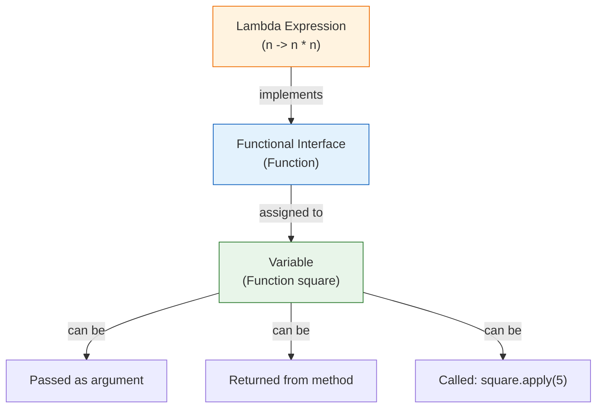
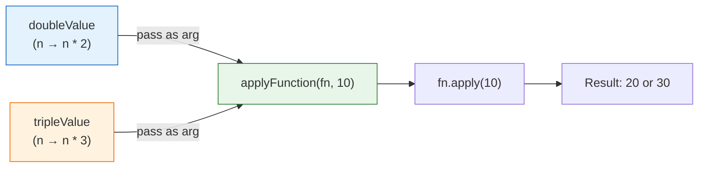
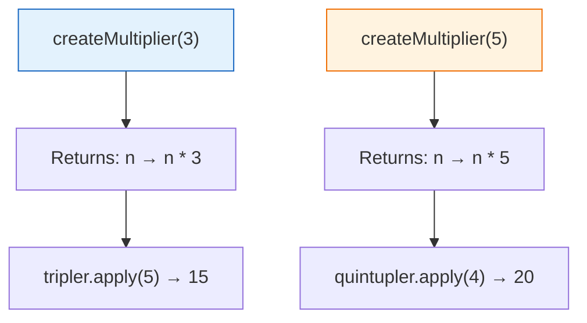
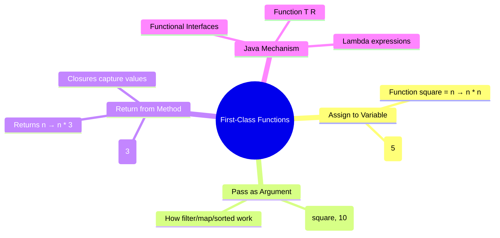

# 📘 Functions as First-Class Objects in Functional Programming

---

## 📌 Introduction

### 🧠 What is this about?

In most programming you've done so far, you store **data** in variables — numbers, strings, lists. But what if you could store an entire **function** in a variable? Pass it as a parameter? Return it from another function?

That's what **first-class functions** means — functions are treated as values, just like any other data type. This is the concept that makes lambda expressions, streams, and the entire functional programming paradigm possible in Java.

### 🌍 Real-World Problem First

You're building a payment system. You need to apply different discount strategies: percentage discount, flat discount, buy-one-get-one. In the OOP world, you'd create a `DiscountStrategy` interface, three implementing classes, wire them together... lots of code for a simple concept.

With first-class functions, you just pass a function:
```java
applyDiscount(price, discount -> price * 0.9);  // 10% off
applyDiscount(price, discount -> price - 50);    // flat ₹50 off
```

No classes, no interfaces (well, Java uses one behind the scenes), no boilerplate.

### ❓ Why does it matter?
- First-class functions are the **mechanism** behind lambda expressions
- Every time you write `.filter(x -> ...)` or `.map(x -> ...)`, you're passing a function as a value
- Without first-class functions, there's no functional programming — they're the enabler

### 🗺️ What we'll learn (Learning Map)
- What "first-class function" means — and why the name matters
- How to assign functions to variables in Java
- How to pass functions as arguments to methods
- How to return functions from methods
- How Java implements this using `Function<T, R>` (a functional interface)

---

## 🧩 Concept 1: What Does "First-Class" Mean?

### 🧠 Layer 1: The Simple Version

"First-class" means **treated like a regular citizen**. In Java, numbers and strings are first-class — you can store them in variables, pass them to methods, return them from methods. When we say functions are first-class, we mean you can do **all the same things** with functions.

### 🔍 Layer 2: The Developer Version

There are three things you can do with first-class functions:

| Operation | With Data (you already do this) | With Functions (new!) |
|-----------|-------------------------------|----------------------|
| **Assign to a variable** | `int x = 5;` | `Function<Integer, Integer> square = n -> n * n;` |
| **Pass as argument** | `printName("Alice");` | `applyFunction(square, 5);` |
| **Return from method** | `return 42;` | `return n -> n * multiplier;` |

### 🌍 Layer 3: The Real-World Analogy

Think of a **TV remote control**:

| Remote Control | First-Class Functions |
|---------------|----------------------|
| The remote has buttons (functions) | Your program has functions |
| You can **hold** the remote (assign to variable) | You can **store** a function in a variable |
| You can **hand** the remote to someone else (pass as argument) | You can **pass** a function to another method |
| A machine could **give you** a remote (return value) | A method can **return** a function |
| You don't need to know how the remote's circuit board works — you just press a button | You don't need to know the function's implementation — you just call it |

### ⚙️ Layer 4: How Java Makes This Possible

In Java, functions aren't literally "values" like in Haskell or JavaScript. Java uses **functional interfaces** as the mechanism to treat functions as values.



**Key insight:** `Function<Integer, Integer>` is a **functional interface** — an interface with exactly one abstract method (`apply`). When you write `n -> n * n`, Java creates an anonymous implementation of this interface. That's how Java treats functions as values — by wrapping them in interface implementations.

---

> Now let's see each operation in action — starting with the most fundamental: assigning a function to a variable.

---

## 🧩 Concept 2: Assigning a Function to a Variable

### 🧠 Layer 1: The Simple Version

Just like `int x = 5` stores a number, `Function<Integer, Integer> square = n -> n * n` stores a function. You can then call this function whenever you want using `square.apply(5)`.

### 🔍 Layer 2: The Developer Version

`Function<T, R>` is a built-in functional interface in `java.util.function`:
- `T` = the input type
- `R` = the return type
- `apply(T t)` = the abstract method that runs your function

### 💻 Layer 5: Code — Prove It!

```java
import java.util.function.Function;

public class FirstClassFunctions {
    public static void main(String[] args) {
        // Store a function in a variable — just like storing a number
        Function<Integer, Integer> square = n -> n * n;

        // Call the function using .apply()
        System.out.println("Square of 5: " + square.apply(5));   // Output: Square of 5: 25
        System.out.println("Square of 8: " + square.apply(8));   // Output: Square of 8: 64

        // This is a PURE function — same input always gives same output
        System.out.println(square.apply(5));  // Output: 25 (always)
        System.out.println(square.apply(5));  // Output: 25 (always)
    }
}
```

**What's happening behind the scenes?**
1. `n -> n * n` is a **lambda expression** — an anonymous function
2. Java sees it's being assigned to `Function<Integer, Integer>` and implements the `apply` method
3. `square.apply(5)` calls the lambda with `n = 5`, returning `5 * 5 = 25`
4. The function is **pure** — no external state, same input always gives same output

---

> Now that we can store functions in variables, the next natural question is: can we pass them to other methods? Absolutely — and this is where things get powerful.

---

## 🧩 Concept 3: Passing a Function as an Argument

### 🧠 Layer 1: The Simple Version

You can hand a function to another method as a parameter — just like handing a number or a string. The receiving method can then call that function whenever it needs to.

### 🔍 Layer 2: The Developer Version

This is the pattern behind everything in the Stream API:
- `.filter(n -> n % 2 == 0)` — you're **passing a function** that decides which elements to keep
- `.map(n -> n * 2)` — you're **passing a function** that transforms each element
- `.sorted((a, b) -> a.compareTo(b))` — you're **passing a function** that compares elements

### 💻 Layer 5: Code — Prove It!

```java
import java.util.function.Function;

public class PassFunctionAsArgument {
    // This method accepts a FUNCTION as a parameter
    static int applyFunction(Function<Integer, Integer> function, int value) {
        return function.apply(value);
    }

    public static void main(String[] args) {
        // Create a function that doubles a number
        Function<Integer, Integer> doubleValue = n -> n * 2;

        // Pass the function as an argument
        int result = applyFunction(doubleValue, 10);
        System.out.println("Double of 10: " + result);  // Output: Double of 10: 20

        // Create a different function — triple the number
        Function<Integer, Integer> tripleValue = n -> n * 3;

        // Pass THIS function to the SAME method
        int result2 = applyFunction(tripleValue, 10);
        System.out.println("Triple of 10: " + result2);  // Output: Triple of 10: 30
    }
}
```

**Why is this powerful?**
- `applyFunction` is **generic** — it doesn't know or care what the function does
- You can pass `doubleValue`, `tripleValue`, `squareValue`, or any function you create
- You write the method **once** and customize its behavior by passing different functions
- This is exactly how `.filter()`, `.map()`, and `.sorted()` work in the Stream API



---

> If we can store functions in variables and pass them as arguments, there's one more capability left: what if a method could *create* and *return* a function?

---

## 🧩 Concept 4: Returning a Function from a Method

### 🧠 Layer 1: The Simple Version

A method can build a function on-the-fly and hand it back to you. This lets you create **configurable functions** — like a function factory.

### 🔍 Layer 2: The Developer Version

This pattern is called a **function factory** or **closure**. The returned function "remembers" the value that was passed when it was created.

### 💻 Layer 5: Code — Prove It!

```java
import java.util.function.Function;

public class ReturnFunction {
    // This method RETURNS a function
    static Function<Integer, Integer> createMultiplier(int multiplier) {
        return n -> n * multiplier;  // the returned function "remembers" multiplier
    }

    public static void main(String[] args) {
        // Create a "multiply by 3" function
        Function<Integer, Integer> tripler = createMultiplier(3);
        System.out.println(tripler.apply(5));   // Output: 15  (5 * 3)
        System.out.println(tripler.apply(10));  // Output: 30  (10 * 3)

        // Create a "multiply by 5" function from the SAME factory
        Function<Integer, Integer> quintupler = createMultiplier(5);
        System.out.println(quintupler.apply(4));  // Output: 20  (4 * 5)
    }
}
```

**What's happening?**
1. `createMultiplier(3)` returns `n -> n * 3` — a function that multiplies by 3
2. The returned lambda "captures" the value `3` from the method parameter — this is called a **closure**
3. `tripler.apply(5)` executes `5 * 3 = 15`
4. You can create as many multiplier functions as you want from the same factory



> 💡 **The Aha Moment:** The returned function **remembers** the multiplier value even after `createMultiplier()` has finished executing. This is called a **closure** — the lambda "closes over" the variable from its enclosing scope. This is how functional programming creates configurable, reusable behavior without classes.

---

### ⚠️ Pitfalls & Mistakes

**Mistake 1: Confusing `Function` with regular methods**
- 👤 What devs do: Try to assign a regular method directly to a `Function` variable
- 💥 Why it breaks: Regular methods aren't automatically `Function` objects — you need a lambda or method reference
- ✅ Fix: Use a lambda `n -> Math.sqrt(n)` or method reference `Math::sqrt`

```java
// ❌ This doesn't compile
Function<Double, Double> sqrt = Math.sqrt;

// ✅ Use a method reference
Function<Double, Double> sqrt = Math::sqrt;

// ✅ Or use a lambda
Function<Double, Double> sqrt = n -> Math.sqrt(n);
```

**Mistake 2: Not understanding that `Function<T, R>` requires exactly one parameter**
- 👤 What devs do: Try to use `Function` for operations that need two inputs (like addition)
- 💥 Why it breaks: `Function<T, R>` has `apply(T t)` — only one parameter
- ✅ Fix: Use `BiFunction<T, U, R>` for two-input functions

```java
// ❌ Can't do this — Function takes only one input
Function<Integer, Integer> add = (a, b) -> a + b;  // compile error

// ✅ Use BiFunction for two inputs
BiFunction<Integer, Integer, Integer> add = (a, b) -> a + b;
System.out.println(add.apply(3, 5));  // Output: 8
```

---

### 💡 Pro Tips

**Tip 1: First-class functions enable the Strategy Pattern without classes**
- Why it works: Instead of creating `DiscountStrategy` interface + 3 implementing classes, just pass lambdas
- When to use: Any time you have multiple "strategies" or "behaviors" that differ by one operation

**Tip 2: Don't worry about `Function<T, R>` details yet**
- Why: Lambda expressions and functional interfaces are covered in depth in upcoming sections
- Key takeaway for now: Functions can be stored, passed, and returned — that's the concept that matters

---

## 🎯 Final Summary

### 🧠 The Big Picture



### ✅ Master Takeaways

→ "First-class" means functions can be **stored in variables**, **passed as arguments**, and **returned from methods** — just like data

→ Java uses **functional interfaces** (like `Function<T, R>`) as the mechanism to treat functions as values

→ Lambda expressions (`n -> n * n`) are the syntax for creating anonymous functions that implement functional interfaces

→ This concept is the foundation of **everything** in the Stream API — `filter()`, `map()`, `sorted()` all accept functions as arguments

→ The ability to return functions creates **closures** — functions that remember values from their creation context

---

## 🔗 What's Next?

We've seen that functions can be passed around like data. But there's a special name for methods that accept or return functions: **Higher-Order Functions**. These are the workhorses of functional programming — and understanding them will make the Stream API feel completely natural. Let's explore them next.
