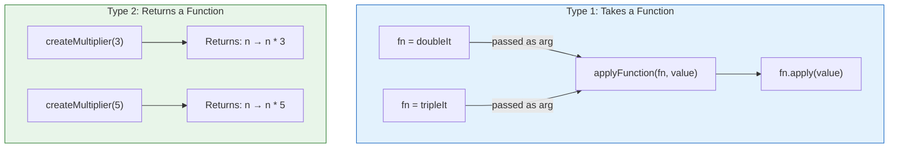
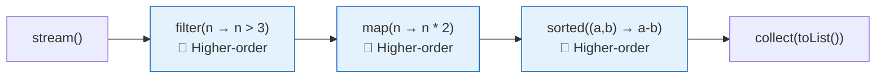

# 📘 Higher-Order Functions in Functional Programming

---

## 📌 Introduction

### 🧠 What is this about?

A **higher-order function** is a function that either **takes another function as an argument** or **returns a function as its result**. This is the concept that powers the entire Stream API — every time you write `.filter()`, `.map()`, or `.sorted()`, you're using a higher-order function.

### 🌍 Real-World Problem First

You have a list of numbers. One day you need to double every number. Next day, you need to triple them. The day after, you need to square them. Without higher-order functions, you'd write three separate methods — one for doubling, one for tripling, one for squaring.

With higher-order functions, you write **one** method that accepts a transformation function as a parameter. You pass `doubleIt`, `tripleIt`, or `squareIt` — and the same method does the job. Write once, customize forever.

### ❓ Why does it matter?
- Higher-order functions are the **mechanism** behind `filter()`, `map()`, `sorted()`, and every stream operation
- They make code **reusable** — write the logic once, pass different behaviors
- They **eliminate code duplication** — no more copy-pasting methods that differ by one line
- Understanding them turns the Stream API from "magic syntax" into "obvious design"

### 🗺️ What we'll learn (Learning Map)
- What makes a function "higher-order"
- Two types: functions that take functions, and functions that return functions
- Practical examples with reusable code
- How higher-order functions connect to the Stream API

---

## 🧩 Concept 1: What Makes a Function "Higher-Order"?

### 🧠 Layer 1: The Simple Version

A higher-order function is a function that works with other functions — either by **accepting** them or **producing** them. Think of it as a function that's one level "higher" because it operates on functions, not just data.

### 🔍 Layer 2: The Developer Version

There are exactly two ways a function becomes "higher-order":

| Type | What It Does | Java Example |
|------|-------------|--------------|
| **Takes a function as argument** | Receives behavior from the caller | `list.stream().filter(n -> n > 5)` — `filter()` takes a function |
| **Returns a function as result** | Creates and hands back a new function | `createMultiplier(3)` returns `n -> n * 3` |

If a function does **either** of these, it's a higher-order function.

### 🌍 Layer 3: The Real-World Analogy

Think of a **universal tool holder** in a workshop:

| Workshop Analogy | Higher-Order Function |
|-----------------|----------------------|
| The tool holder itself | The higher-order function (`applyFunctionToList`) |
| The tool you attach (drill, saw, sander) | The function you pass (`doubleIt`, `tripleIt`) |
| The material being worked on | The data (the list of numbers) |
| Swap the drill for a saw → different result, same holder | Pass `tripleIt` instead of `doubleIt` → different result, same method |

You don't build a separate holder for each tool — you build one universal holder and snap in whichever tool you need. That's exactly what higher-order functions do for your code.

### ⚙️ Layer 4: How It Works — Visual



---

> Let's see both types in action with concrete code examples.

---

## 🧩 Concept 2: Higher-Order Functions That Take Functions

### 🧠 Layer 1: The Simple Version

You write a method that accepts a function as one of its parameters. When you call the method, you pass in whichever function you want — and the method uses it.

### 🔍 Layer 2: The Developer Version

This is the most common type of higher-order function — and it's the pattern behind the entire Stream API.

### 💻 Layer 5: Code — Prove It!

```java
import java.util.List;
import java.util.function.Function;
import java.util.stream.Collectors;

public class HigherOrderExample {
    // ✅ This is a HIGHER-ORDER function — it takes a Function as an argument
    static List<Integer> applyFunctionToList(
            List<Integer> numbers,
            Function<Integer, Integer> function) {
        return numbers.stream()
            .map(function)              // apply the passed function to each element
            .collect(Collectors.toList());
    }

    public static void main(String[] args) {
        List<Integer> numbers = List.of(1, 2, 3, 4, 5);

        // Pass "double each number" function
        Function<Integer, Integer> doubleIt = n -> n * 2;
        List<Integer> doubled = applyFunctionToList(numbers, doubleIt);
        System.out.println("Doubled: " + doubled);
        // Output: Doubled: [2, 4, 6, 8, 10]

        // Pass "triple each number" function — SAME method, different behavior!
        Function<Integer, Integer> tripleIt = n -> n * 3;
        List<Integer> tripled = applyFunctionToList(numbers, tripleIt);
        System.out.println("Tripled: " + tripled);
        // Output: Tripled: [3, 6, 9, 12, 15]

        // Pass "square each number" function — SAME method again!
        Function<Integer, Integer> squareIt = n -> n * n;
        List<Integer> squared = applyFunctionToList(numbers, squareIt);
        System.out.println("Squared: " + squared);
        // Output: Squared: [1, 4, 9, 16, 25]
    }
}
```

**Why is this better than three separate methods?**

```java
// ❌ Without higher-order functions — three nearly identical methods
static List<Integer> doubleAll(List<Integer> numbers) {
    List<Integer> result = new ArrayList<>();
    for (int n : numbers) result.add(n * 2);   // only THIS line differs
    return result;
}
static List<Integer> tripleAll(List<Integer> numbers) {
    List<Integer> result = new ArrayList<>();
    for (int n : numbers) result.add(n * 3);   // only THIS line differs
    return result;
}
static List<Integer> squareAll(List<Integer> numbers) {
    List<Integer> result = new ArrayList<>();
    for (int n : numbers) result.add(n * n);   // only THIS line differs
    return result;
}
// Three methods that are 90% identical — copy-paste programming!

// ✅ With higher-order function — ONE method, infinite behaviors
static List<Integer> applyFunctionToList(List<Integer> numbers, Function<Integer, Integer> fn) {
    return numbers.stream().map(fn).collect(Collectors.toList());
}
// Pass doubleIt, tripleIt, squareIt, or ANY function you want
```

> 💡 **The Aha Moment:** The only thing that changes between the three methods is the operation (`n * 2`, `n * 3`, `n * n`). Higher-order functions extract that **one changing thing** into a parameter. Everything else stays the same.

---

## 🧩 Concept 3: Higher-Order Functions That Return Functions

### 🧠 Layer 1: The Simple Version

A method can create a new function and return it. You then use the returned function like any other function — call it with `.apply()`.

### 💻 Layer 5: Code — Prove It!

```java
import java.util.function.Function;

public class HigherOrderReturnExample {
    // ✅ This is a HIGHER-ORDER function — it RETURNS a function
    static Function<Integer, Integer> createMultiplier(int multiplier) {
        return n -> n * multiplier;  // returns a new function
    }

    public static void main(String[] args) {
        // Create specialized functions from the factory
        Function<Integer, Integer> doubler = createMultiplier(2);
        Function<Integer, Integer> tripler = createMultiplier(3);
        Function<Integer, Integer> tenX    = createMultiplier(10);

        System.out.println(doubler.apply(5));   // Output: 10  (5 * 2)
        System.out.println(tripler.apply(5));   // Output: 15  (5 * 3)
        System.out.println(tenX.apply(5));      // Output: 50  (5 * 10)
    }
}
```

---

## 🧩 Concept 4: Higher-Order Functions in the Stream API

### 🧠 Layer 1: The Simple Version

Every Stream API method like `filter()`, `map()`, and `sorted()` is a higher-order function — it takes a function as a parameter and uses it to process elements.

### 🔍 Layer 2: The Developer Version

| Stream Method | Higher-Order Because... | What Function You Pass |
|--------------|------------------------|----------------------|
| `filter()` | Takes a `Predicate<T>` (a function that returns boolean) | `n -> n % 2 == 0` (keep even numbers) |
| `map()` | Takes a `Function<T, R>` (a function that transforms) | `n -> n * 2` (double each number) |
| `sorted()` | Takes a `Comparator<T>` (a function that compares) | `(a, b) -> a - b` (ascending order) |
| `forEach()` | Takes a `Consumer<T>` (a function that does something) | `n -> System.out.println(n)` (print each) |



### 💻 Layer 5: Code — Stream API Is All Higher-Order Functions

```java
List<Integer> numbers = List.of(5, 1, 8, 3, 9, 2, 7);

List<Integer> result = numbers.stream()
    .filter(n -> n > 3)          // higher-order: takes a Predicate
    .map(n -> n * 2)             // higher-order: takes a Function
    .sorted((a, b) -> a - b)     // higher-order: takes a Comparator
    .collect(Collectors.toList());

System.out.println(result);  // Output: [10, 14, 16, 18]
// Steps: [5,8,9,7] → [10,16,18,14] → [10,14,16,18]
```

---

### ⚠️ Pitfalls & Mistakes

**Mistake 1: Confusing regular functions with higher-order functions**
- 👤 What devs do: Call every method a "higher-order function"
- 💥 Why it's wrong: A method is only higher-order if it **takes** or **returns** a function
- ✅ Fix: `Math.sqrt(25)` takes a number — NOT higher-order. `list.stream().filter(n -> n > 5)` — `filter` is higher-order because it takes a function (`n -> n > 5`)

---

### 💡 Pro Tips

**Tip 1: Higher-order functions are the "Strategy Pattern" in one line**
- Why it works: The GOF Strategy Pattern requires an interface + multiple classes. Higher-order functions achieve the same result with a lambda parameter.
- When to use: Any time you need pluggable behavior

**Tip 2: Use higher-order functions to eliminate code duplication**
- Why it works: If two methods are identical except for one operation, extract that operation as a function parameter
- When to use: Code review — look for methods that differ by only 1-2 lines

---

## 🎯 Final Summary

### 🧠 The Big Picture

```mermaid
mindmap
  root(("Higher-Order Functions"))
    Takes a Function
      filter takes Predicate
      map takes Function
      sorted takes Comparator
    Returns a Function
      Function factories
      createMultiplier(3) → fn
      Closures
    Benefits
      Code reusability
      No duplication
      Flexible behavior
      Clean readable code
    Stream API Connection
      Every stream method is higher-order
      You pass lambdas as behavior
```

### ✅ Master Takeaways

→ A **higher-order function** takes a function as an argument OR returns a function — it operates on functions, not just data

→ `filter()`, `map()`, `sorted()`, `forEach()` are all **higher-order functions** — they accept functions (lambdas) as parameters

→ Higher-order functions eliminate code duplication: write the structure **once**, pass different behaviors **dynamically**

→ Functions that **return** functions act as **factories** — creating specialized functions from general templates

→ Understanding higher-order functions makes the Stream API feel natural: every stream operation is just passing a function to another function

---

## 🔗 What's Next?

Now that we understand pure functions, first-class functions, and higher-order functions as individual concepts, it's time to see the **complete picture**. In the next note, we'll explore the **Rules of Pure Functional Programming** — the strict principles that tie everything together: no state, no side effects, immutable variables, and recursion over loops. These rules define what makes code truly "functional."
