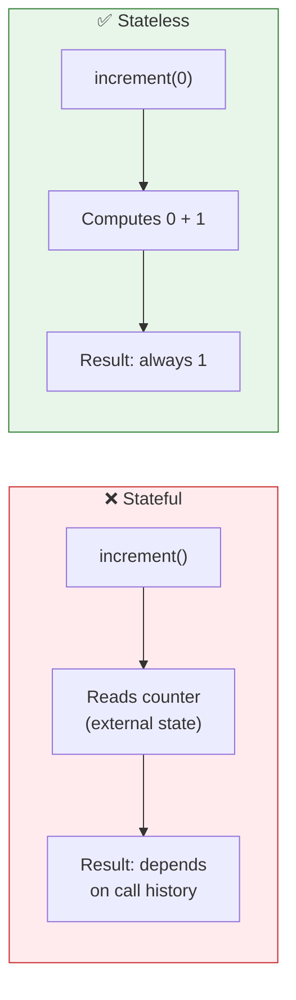
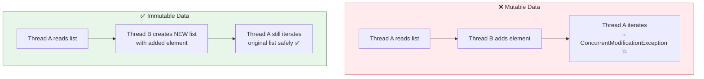
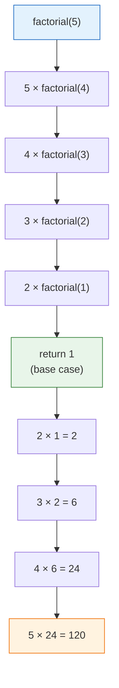
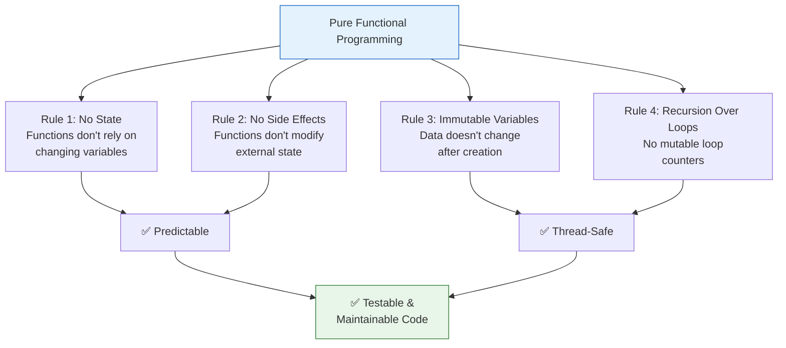
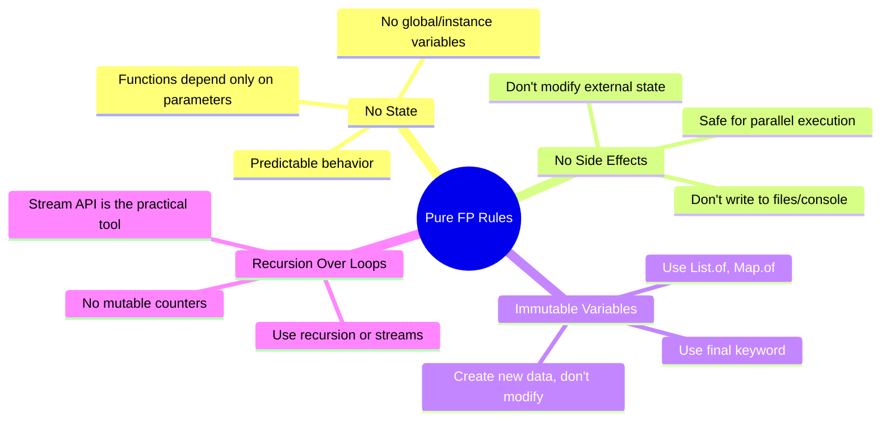

# 📘 Rules of Pure Functional Programming

---

## 📌 Introduction

### 🧠 What is this about?

We've learned the individual building blocks of functional programming — pure functions, first-class functions, and higher-order functions. Now it's time to see the **complete rulebook**: the four strict principles that, when followed together, make code truly "functional."

These rules aren't arbitrary — each one prevents a specific category of bugs.

### 🌍 Real-World Problem First

You're debugging a production issue. A method that calculates tax returns different values on different servers. After hours of investigation, you discover: the method reads a global `taxRate` variable, and one server's value was updated but the others weren't. The method has **state**. If it were stateless, you'd pass `taxRate` as a parameter, and every server would compute the same result.

That's just one rule. There are four, and each one eliminates a class of bugs.

### ❓ Why does it matter?
- These rules prevent **state bugs** (unpredictable behavior from shared variables)
- These rules prevent **side-effect bugs** (functions silently changing external data)
- These rules prevent **mutation bugs** (data changing after you thought it was finalized)
- These rules prevent **concurrency bugs** (threads corrupting shared data)

### 🗺️ What we'll learn (Learning Map)
- **Rule 1: No State** — Functions don't store or rely on changing variables
- **Rule 2: No Side Effects** — Functions don't modify external state
- **Rule 3: Immutable Variables** — Data doesn't change after creation
- **Rule 4: Recursion Over Loops** — Avoid mutating loop counters

---

## 🧩 Concept 1: Rule 1 — No State (Stateless Functions)

### 🧠 Layer 1: The Simple Version

A stateless function doesn't remember anything between calls. Every time you call it, it starts fresh — like a goldfish that forgets everything every few seconds. Its output depends **only** on what you pass in right now.

### 🔍 Layer 2: The Developer Version

"No state" means:
- The function does **not** read any instance or class variable
- The function does **not** rely on any value that can change between calls
- The function's behavior is determined **entirely** by its parameters

### 🌍 Layer 3: The Real-World Analogy

| Analogy | Stateful (Bad) | Stateless (Good) |
|---------|---------------|------------------|
| **Cashier** | Remembers your previous order and adds to it: "You already had ₹500, so now it's ₹800" | Starts fresh: "Your order is ₹300" — doesn't know or care about previous orders |
| **Calculator** | Running total mode: each `+` adds to what's already there | Fresh calculation mode: each `=` computes from scratch |

### 💻 Layer 5: Code — Prove It!

**❌ Stateful — Output depends on external counter:**
```java
public class StatefulExample {
    static int counter = 0;  // ⚠️ STATE — stored between calls

    static int increment() {
        counter++;           // modifies external state
        return counter;      // output depends on how many times this was called
    }

    public static void main(String[] args) {
        System.out.println(increment());  // Output: 1
        System.out.println(increment());  // Output: 2  ← DIFFERENT!
        // Same function, no arguments, but different output each time.
        // That's unpredictable behavior caused by state.
    }
}
```

**Why is this bad?**
- Calling `increment()` with no arguments gives `1`, then `2`, then `3`...
- The output depends on **when** you call it, not **what** you pass
- In a multi-threaded app, two threads calling `increment()` simultaneously could both read `counter = 5`, both write `counter = 6`, and you've lost an increment

**✅ Stateless — Output depends only on input:**
```java
public class StatelessExample {
    // ✅ No state — depends only on the input parameter
    static int increment(int value) {
        return value + 1;    // pure computation from input only
    }

    public static void main(String[] args) {
        System.out.println(increment(0));  // Output: 1
        System.out.println(increment(0));  // Output: 1  ← SAME! Always.
        System.out.println(increment(5));  // Output: 6
        System.out.println(increment(5));  // Output: 6  ← SAME! Always.
    }
}
```



---

> Now that we understand stateless functions, let's look at the second rule: what happens when a function changes things outside itself?

---

## 🧩 Concept 2: Rule 2 — No Side Effects

### 🧠 Layer 1: The Simple Version

A function with no side effects is like a **guest at a hotel who leaves the room exactly as they found it**. They might use the room (compute a result), but when they leave, nothing in the room has changed.

### 🔍 Layer 2: The Developer Version

A **side effect** is any observable change outside the function's scope:

| Side Effect | Example | Why It's Dangerous |
|------------|---------|-------------------|
| Modifying a global variable | `total += amount;` | Other functions reading `total` get unexpected values |
| Writing to console | `System.out.println(...)` | Interleaved output in multi-threaded code |
| Modifying input collection | `list.add(newItem);` | Caller's list changes without their knowledge |
| Writing to file/database | `file.write(data)` | External system state changes unpredictably |

### 💻 Layer 5: Code — Prove It!

**❌ Has side effects — modifies external state:**
```java
public class SideEffectExample {
    static int total = 0;  // external state

    // ❌ IMPURE: modifies 'total' — a side effect
    static int addToTotal(int amount) {
        total += amount;   // SIDE EFFECT: changes external variable
        return total;
    }

    public static void main(String[] args) {
        System.out.println(addToTotal(10));  // Output: 10
        System.out.println(addToTotal(10));  // Output: 20  ← DIFFERENT!
        // Same input (10), different output — because of the side effect
    }
}
```

**✅ No side effects — pure computation:**
```java
public class NoSideEffectExample {
    // ✅ PURE: no side effects, depends only on parameters
    static int add(int a, int b) {
        return a + b;  // no external state modified
    }

    public static void main(String[] args) {
        System.out.println(add(10, 20));  // Output: 30
        System.out.println(add(10, 20));  // Output: 30  ← ALWAYS 30
        System.out.println(add(10, 20));  // Output: 30  ← ALWAYS 30
    }
}
```

**The difference:**
- `addToTotal` changes `total` every time it's called → each call produces a different result
- `add` doesn't change anything → it's predictable, testable, and thread-safe

---

> Rules 1 and 2 deal with functions. Rule 3 deals with the data itself — once you create it, you don't change it.

---

## 🧩 Concept 3: Rule 3 — Immutable Variables

### 🧠 Layer 1: The Simple Version

Once you create a value, you **never change it**. If you need a different value, you create a **new one**. Think of it like a printed photograph — you can't edit the photo, but you can print a new one with modifications.

### 🔍 Layer 2: The Developer Version

In Java, immutability is achieved through:
- `final` keyword for variables
- `List.of()` for unmodifiable lists
- `Map.of()` for unmodifiable maps
- Returning new objects instead of modifying existing ones

### 💻 Layer 5: Code — Prove It!

**❌ Mutable — variable changes after assignment:**
```java
// ❌ Mutable variable — can be changed later
int sum = 0;
sum = 10;    // changed!
sum = 20;    // changed again!
// Any code reading 'sum' gets a different value depending on WHEN it reads
```

**✅ Immutable — variable cannot change:**
```java
// ✅ Immutable variable — cannot be changed after assignment
final int sum = 10;
// sum = 20;   // ❌ Compile error: cannot assign a value to final variable 'sum'
```

**❌ Mutable list — contents can change:**
```java
// ❌ Mutable list — anyone can add, remove, or modify elements
List<String> names = new ArrayList<>(List.of("Alice", "Bob"));
names.add("Eve");       // ⚠️ List changed! Anyone holding a reference to 'names' sees "Eve" now
names.remove("Alice");  // ⚠️ Changed again!
```

**✅ Immutable list — contents are fixed:**
```java
// ✅ Immutable list — contents cannot change after creation
List<String> names = List.of("Alice", "Bob");
// names.add("Eve");    // ❌ Throws UnsupportedOperationException

// To "change" it, create a NEW list with the modifications
List<String> updatedNames = Stream.concat(names.stream(), Stream.of("Eve"))
    .collect(Collectors.toList());
// names is still ["Alice", "Bob"] — untouched
// updatedNames is ["Alice", "Bob", "Eve"] — a new list
```

### 🌍 Layer 3: Analogy — The Printed Photograph

| Photograph | Immutable Data |
|-----------|---------------|
| Once printed, the photo can't be edited | Once created, the data can't be changed |
| Want a cropped version? Print a new copy | Want a filtered list? Create a new list |
| Original stays intact forever | Original data stays intact forever |
| Anyone with a copy of the original sees the same image | Any code referencing the original sees the same data |

### ⚙️ Layer 4: Why Immutability Prevents Bugs



**The key insight:** With mutable data, one thread's changes can corrupt another thread's work. With immutable data, each thread works with its own snapshot — no interference possible.

---

> The final rule addresses a subtle form of mutation that most developers don't think about: loop counters.

---

## 🧩 Concept 4: Rule 4 — Recursion Over Loops

### 🧠 Layer 1: The Simple Version

Loops use a **counter variable** that changes on every iteration — that's mutation! Functional programming avoids loops entirely and uses **recursion** (a function calling itself) instead.

### 🔍 Layer 2: The Developer Version

| Loop Style | Problem | FP Alternative |
|-----------|---------|---------------|
| `for (int i = 0; i < n; i++)` | `i` is a mutable variable that changes each iteration | Recursion: function calls itself with `i + 1` |
| `while (condition)` | Loop variable changes in the body | Recursion or stream operations |
| `for (item : collection)` | Accumulator variable inside the loop | `stream().reduce()` or `stream().collect()` |

### 💻 Layer 5: Code — Prove It!

**❌ Imperative — Loop with mutable counter:**
```java
// ❌ Uses a loop with mutable variable 'result'
static int factorial(int n) {
    int result = 1;                  // mutable state
    for (int i = 1; i <= n; i++) {   // 'i' mutates each iteration
        result *= i;                 // 'result' mutates each iteration
    }
    return result;
}
System.out.println(factorial(5));  // Output: 120
```

**✅ Functional — Recursion with no mutable variables:**
```java
// ✅ No loops, no mutable variables — pure recursion
static int factorial(int n) {
    if (n <= 1) return 1;            // base case
    return n * factorial(n - 1);     // recursive case
}
System.out.println(factorial(5));  // Output: 120
// How it works: 5 * 4 * 3 * 2 * 1 = 120
```

**Trace the recursion:**
```
factorial(5)
  = 5 * factorial(4)
  = 5 * 4 * factorial(3)
  = 5 * 4 * 3 * factorial(2)
  = 5 * 4 * 3 * 2 * factorial(1)
  = 5 * 4 * 3 * 2 * 1
  = 120
```



> 💡 **Practical Note:** In real Java, you'll more often use **stream operations** (`reduce`, `collect`) instead of manual recursion. Streams are the idiomatic way to avoid loops in Java FP. Recursion is the theoretical foundation; streams are the practical tool.

```java
// ✅ Most practical: use streams instead of loops
int sumOfEvens = numbers.stream()
    .filter(n -> n % 2 == 0)
    .reduce(0, Integer::sum);  // no loop, no mutable variable
```

---

## 🧩 Concept 5: All Four Rules Together — The Complete Picture

### 📊 Layer 6: Summary Table

| Rule | What It Prevents | How to Follow It in Java |
|------|-----------------|-------------------------|
| **No State** | Unpredictable behavior from global variables | Use only method parameters — no instance/class variables in pure functions |
| **No Side Effects** | Hidden data corruption | Don't modify external variables, files, or databases inside pure functions |
| **Immutable Variables** | Concurrent modification bugs, unexpected value changes | Use `final`, `List.of()`, create new objects instead of modifying |
| **Recursion Over Loops** | Mutable counters and accumulators | Use recursion or (more practically) stream operations |



---

### ⚠️ Pitfalls & Mistakes

**Mistake 1: Thinking ALL code must be purely functional**
- 👤 What devs do: Try to make database writes, API calls, and file operations "pure"
- 💥 Why it's wrong: Some operations are inherently side-effectful — you MUST write to the database at some point
- ✅ Fix: Make your **business logic** pure (calculations, transformations, validations). Push side effects (I/O, database, logging) to the **edges** of your system.

```java
// ✅ Pure business logic
static double calculateDiscount(double price, double rate) {
    return price * (1 - rate);  // pure — no side effects
}

// Side effects at the edge
void processOrder(Order order) {
    double total = calculateDiscount(order.getPrice(), 0.1);  // pure logic
    database.save(order.withTotal(total));                     // side effect at the edge
    logger.info("Order processed: " + total);                  // side effect at the edge
}
```

**Mistake 2: Overusing recursion in Java**
- 👤 What devs do: Replace every loop with recursion
- 💥 Why it breaks: Java doesn't optimize tail recursion — deep recursion causes `StackOverflowError`
- ✅ Fix: Use streams for most loop replacements. Reserve recursion for tree-like problems where it's natural.

---

### 💡 Pro Tips

**Tip 1: "Pure core, impure shell" architecture**
- Why it works: Keep all calculations and transformations pure. Handle I/O and state at the outermost layer only.
- When to use: Every application — separate logic from side effects.

**Tip 2: Use `final` by default for local variables**
- Why it works: Forces you to think about whether a variable really needs to change
- When to use: Always. Many Java style guides recommend `final` for every local variable.

---

## 🎯 Final Summary

### 🧠 The Big Picture



### ✅ Master Takeaways

→ The four rules of pure FP: **No State**, **No Side Effects**, **Immutable Variables**, **Recursion Over Loops**

→ Each rule prevents a specific bug category: unpredictable behavior, hidden data corruption, concurrent modification, mutable counters

→ In practice, make your **business logic pure** and push side effects to the **edges** of your system

→ Use **streams** (not manual recursion) as the practical Java tool for avoiding loops

→ Following these rules makes code **predictable**, **testable**, **thread-safe**, and **maintainable**

---

## 🔗 What's Next?

We've built the complete theoretical foundation of functional programming: pure functions, first-class functions, higher-order functions, and the four rules. Now it's time to put theory into practice with the **single most important tool** in Java functional programming: **Lambda Expressions**. Lambdas are how Java implements all of these concepts in actual code. Let's learn their syntax, their mechanics, and see them in action.
