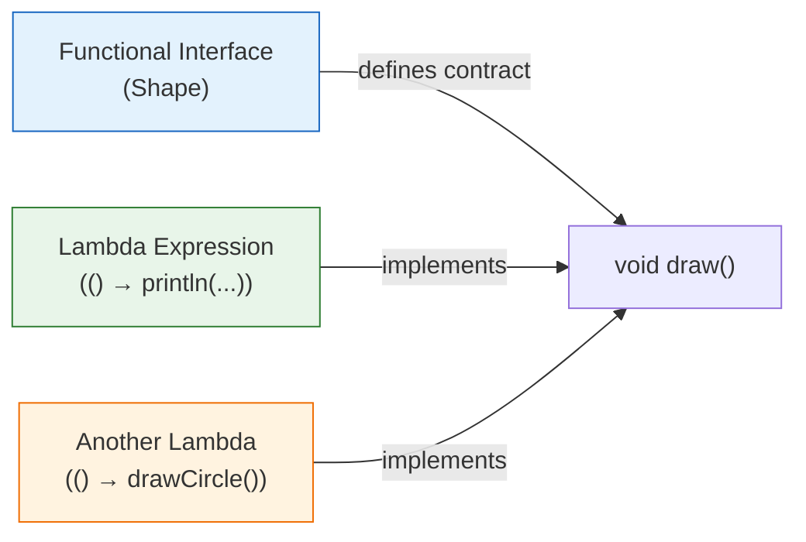
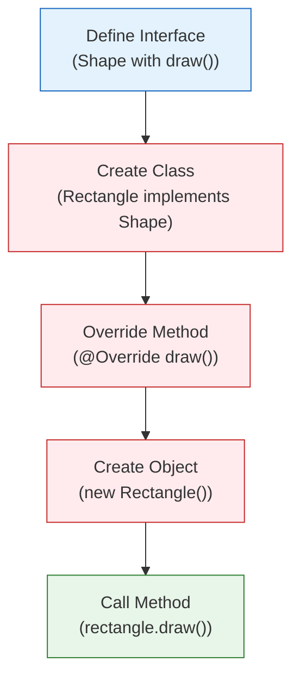
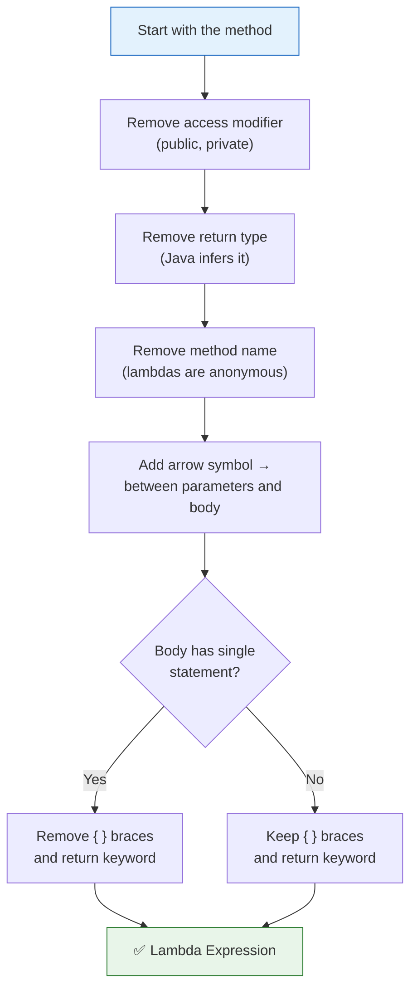
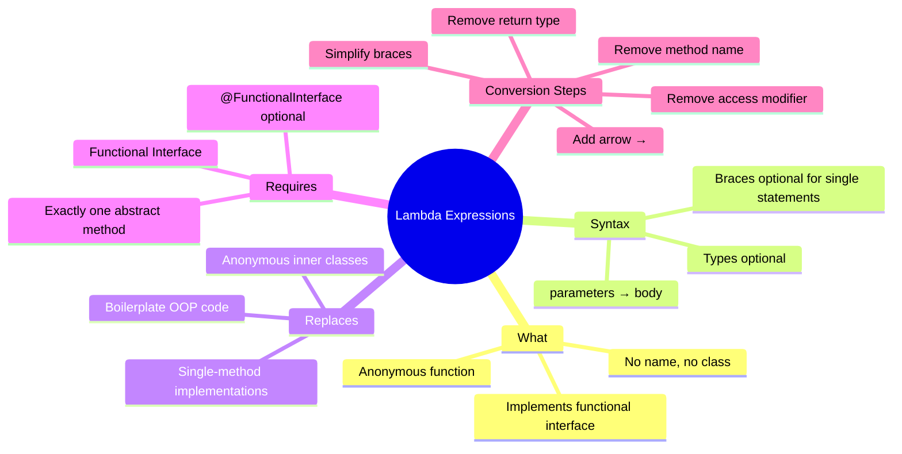

# 📘 What is Lambda Expression?

---

## 📌 Introduction

### 🧠 What is this about?

A **lambda expression** is an anonymous function — a function without a name. It's the primary tool Java provides to write functional code. Instead of creating a class, implementing an interface, and overriding a method, you write the logic in a single expression.

Lambda expressions were introduced in **Java 8** and are the bridge between Java's object-oriented world and functional programming.

### 🌍 Real-World Problem First

You want to implement a simple interface — say, a `Shape` with a `draw()` method. In the OOP world, you'd create a class (`Rectangle`), implement the interface, override the method, create an object, and call the method. That's 10+ lines for what is essentially one line of logic: `System.out.println("Rectangle is drawing")`.

Lambda expressions reduce those 10+ lines down to **one line**. Same result. Same type safety. A fraction of the code.

### ❓ Why does it matter?
- Lambda expressions **eliminate boilerplate** — no more anonymous inner classes for simple implementations
- They're the syntax behind `.filter()`, `.map()`, `.sorted()` — you can't use streams without them
- They implement **functional interfaces** — the contract that connects OOP and FP in Java
- Every modern Java codebase uses them — they're not optional knowledge

### 🗺️ What we'll learn (Learning Map)
- What a lambda expression is and its syntax
- What a functional interface is (the prerequisite for lambdas)
- How to convert OOP code to lambda expressions step by step
- The practical technique to transform any method into a lambda

---

## 🧩 Concept 1: Functional Interfaces — The Prerequisite

### 🧠 Layer 1: The Simple Version

Before you can write a lambda, you need a **functional interface** — an interface with **exactly one abstract method**. The lambda provides the implementation for that one method.

### 🔍 Layer 2: The Developer Version

A functional interface is defined by:
- **Exactly one** abstract method (the method the lambda implements)
- **Any number** of `default` and `static` methods (these don't count)
- Optionally annotated with `@FunctionalInterface` (not required, but good practice)

```java
// ✅ This IS a functional interface — exactly one abstract method
interface Shape {
    void draw();           // the ONE abstract method
    // default void m1() { ... }   ← allowed (doesn't count)
    // static void m2() { ... }    ← allowed (doesn't count)
}

// ❌ This is NOT a functional interface — two abstract methods
interface NotFunctional {
    void method1();
    void method2();        // second abstract method → NOT functional
}
```

### 🌍 Layer 3: The Real-World Analogy

| Analogy Element | Functional Interface |
|----------------|---------------------|
| A **power socket** (standardized shape) | The functional interface (standardized contract) |
| A **plug** that fits the socket | The lambda expression (provides the implementation) |
| Any appliance with the right plug works | Any lambda with matching parameters/return type works |
| The socket defines the shape; the appliance defines the behavior | The interface defines the method signature; the lambda defines the logic |



---

> Now that we know what a functional interface is, let's see the "before" picture — the traditional OOP way of implementing it — so we can appreciate what lambdas simplify.

---

## 🧩 Concept 2: The Traditional Way (Before Lambdas)

### 🧠 Layer 1: The Simple Version

Before Java 8, to implement an interface, you had to: create a class → implement the interface → override the method → create an object → call the method. That's a lot of ceremony for a simple action.

### 💻 Layer 5: Code — The Old Way

```java
// Step 1: Define the functional interface
interface Shape {
    void draw();
}

// Step 2: Create a class that implements it
class Rectangle implements Shape {
    @Override
    public void draw() {
        System.out.println("Rectangle is drawing");
    }
}

// Step 3: Create another implementing class
class Circle implements Shape {
    @Override
    public void draw() {
        System.out.println("Circle is drawing");
    }
}

// Step 4: In main(), create objects and call methods
public class LambdaExample {
    public static void main(String[] args) {
        Shape rectangle = new Rectangle();
        rectangle.draw();  // Output: Rectangle is drawing

        Shape circle = new Circle();
        circle.draw();     // Output: Circle is drawing
    }
}
```

**Count the lines:** We wrote ~20 lines of code just to print two strings. Each implementing class is mostly boilerplate — the only unique part is the string inside `println()`.



The red boxes are **boilerplate** — code that exists only because Java's type system requires it, not because it adds meaning.

---

> Here's the key insight: each class has exactly ONE meaningful line — the `println()`. Everything else is ceremony. Lambda expressions strip away that ceremony.

---

## 🧩 Concept 3: Lambda Expression Syntax

### 🧠 Layer 1: The Simple Version

A lambda expression has three parts: **parameters**, an **arrow** (`->`), and a **body**. That's it.

```
(parameters) -> { body }
```

### 🔍 Layer 2: The Developer Version

```
┌─────────────┐     ┌───────┐     ┌─────────────────────────┐
│  Parameters  │ ──→ │   →   │ ──→ │       Lambda Body        │
│  (input)     │     │ arrow │     │  (implementation)         │
└─────────────┘     └───────┘     └─────────────────────────┘

Examples:
  ()           ->   System.out.println("Hello")      // no parameters
  (n)          ->   n * n                             // one parameter
  (a, b)       ->   a + b                             // two parameters
```

### ⚙️ Layer 4: Syntax Rules

| Rule | Example | Why |
|------|---------|-----|
| No parameters → empty parentheses | `() -> println("Hi")` | `draw()` has no parameters |
| One parameter → parentheses optional | `n -> n * 2` or `(n) -> n * 2` | Shorthand for convenience |
| Multiple parameters → parentheses required | `(a, b) -> a + b` | Need parentheses to separate them |
| Single statement body → no braces needed | `n -> n * 2` | Implicit return for expressions |
| Multi-statement body → braces + return needed | `(n) -> { int r = n * 2; return r; }` | Multiple statements need explicit structure |
| Type inference → types optional | `(a, b) -> a + b` instead of `(int a, int b) -> a + b` | Compiler infers types from the functional interface |

### 💻 Layer 5: Code — Lambda Replacing Traditional Code

```java
interface Shape {
    void draw();
}

public class LambdaExample {
    public static void main(String[] args) {
        // ✅ Lambda expression — replaces the entire Rectangle class
        Shape rectangle = () -> System.out.println("Rectangle is drawing");
        rectangle.draw();  // Output: Rectangle is drawing

        // ✅ Another lambda — replaces the entire Circle class
        Shape circle = () -> System.out.println("Circle is drawing");
        circle.draw();     // Output: Circle is drawing

        // ✅ One more — replaces any Shape implementation
        Shape square = () -> System.out.println("Square is drawing");
        square.draw();     // Output: Square is drawing
    }
}
```

**Compare the reduction:**

| Approach | Lines of Code | Classes Needed |
|----------|:------------:|:--------------:|
| Traditional OOP | ~20 lines | 3 classes (Rectangle, Circle, Square) |
| Lambda expressions | ~6 lines | 0 extra classes |

Each lambda replaces an entire class definition + method override + object creation.

---

## 🧩 Concept 4: How to Convert a Method to a Lambda (Step-by-Step)

### 🧠 Layer 1: The Simple Version

There's a simple mechanical process to convert any method into a lambda expression — you just strip away the parts that Java can infer.

### ⚙️ Layer 4: The Conversion Process



### 💻 Layer 5: Code — Watch the Conversion

Let's convert the `Circle.draw()` method into a lambda, step by step:

```java
// STEP 0: Start with the original method
@Override
public void draw() {
    System.out.println("Circle is drawing");
}

// STEP 1: Remove @Override (not needed for lambdas)
public void draw() {
    System.out.println("Circle is drawing");
}

// STEP 2: Remove 'public' (lambdas don't have access modifiers)
void draw() {
    System.out.println("Circle is drawing");
}

// STEP 3: Remove return type 'void' (compiler infers it from the interface)
draw() {
    System.out.println("Circle is drawing");
}

// STEP 4: Remove method name 'draw' (lambdas are anonymous)
() {
    System.out.println("Circle is drawing");
}

// STEP 5: Add the arrow → between parameters and body
() -> {
    System.out.println("Circle is drawing");
}

// STEP 6: Single statement → remove { } braces
() -> System.out.println("Circle is drawing")

// STEP 7: Assign to a variable of the functional interface type
Shape circle = () -> System.out.println("Circle is drawing");
```

**The complete transformation:**
```
@Override                                          ← removed (not for lambdas)
public                                             ← removed (no access modifiers)
void                                               ← removed (compiler infers)
draw                                               ← removed (anonymous)
()                                                 ← kept (parameters)
→                                                  ← added (arrow symbol)
System.out.println("Circle is drawing")            ← kept (the actual logic)
```

> 💡 **Pro Tip:** This mechanical process works for ANY method. Find the class that implements an interface with a single method, copy the method, and strip away the parts one by one. You'll have a lambda every time.

---

### ⚠️ Pitfalls & Mistakes

**Mistake 1: Trying to use lambdas with non-functional interfaces**
- 👤 What devs do: Try to assign a lambda to an interface with two abstract methods
- 💥 Why it breaks: Lambdas can only implement exactly ONE abstract method — the compiler doesn't know which one the lambda is for
- ✅ Fix: Ensure your interface has exactly one abstract method (or use `@FunctionalInterface` to enforce this at compile time)

```java
// ❌ Two abstract methods — NOT a functional interface
interface Calculator {
    int add(int a, int b);
    int subtract(int a, int b);
}
// Calculator c = (a, b) -> a + b;  // ❌ Compile error: which method?

// ✅ One abstract method — IS a functional interface  
@FunctionalInterface
interface Calculator {
    int calculate(int a, int b);
}
Calculator add = (a, b) -> a + b;        // ✅ Implements calculate()
Calculator subtract = (a, b) -> a - b;   // ✅ Different lambda, same interface
```

**Mistake 2: Forgetting that lambdas are tied to functional interfaces**
- 👤 What devs do: Think lambdas are standalone functions like in JavaScript
- 💥 Why it's wrong: In Java, every lambda implements a functional interface — there's always a type behind it
- ✅ Fix: Always know which functional interface your lambda targets (`Function`, `Predicate`, `Consumer`, `Runnable`, or your custom one)

---

### 💡 Pro Tips

**Tip 1: Use `@FunctionalInterface` annotation as documentation and safety**
- Why it works: If you accidentally add a second abstract method, the compiler gives an error instead of silently breaking lambdas
- When to use: Every custom functional interface you create

**Tip 2: Remember the key points about lambda expressions**
1. Introduced in **Java 8**
2. An **anonymous function** (no name)
3. Used to implement **functional interfaces**
4. Facilitates **functional programming** in Java
5. **Not** tied to any class or object — they exist independently

---

## 🎯 Final Summary

### 🧠 The Big Picture



### ✅ Master Takeaways

→ A lambda expression is an **anonymous function** — `(parameters) -> body`

→ Lambdas implement **functional interfaces** — interfaces with exactly one abstract method

→ The conversion process is mechanical: remove access modifier → return type → method name → add arrow → simplify

→ Lambdas reduce 10+ lines of OOP boilerplate to 1-2 lines of functional code

→ Every stream operation (`.filter()`, `.map()`, `.sorted()`) takes a lambda as its argument

---

## 🔗 What's Next?

Now that we understand what lambda expressions are and how they connect to functional interfaces, let's dive deeper with a more complex example. In the next note, we'll build a **Calculator** using lambdas — implementing addition, subtraction, multiplication, and division — to see how lambdas handle parameters, return values, and multiple implementations of the same interface.
