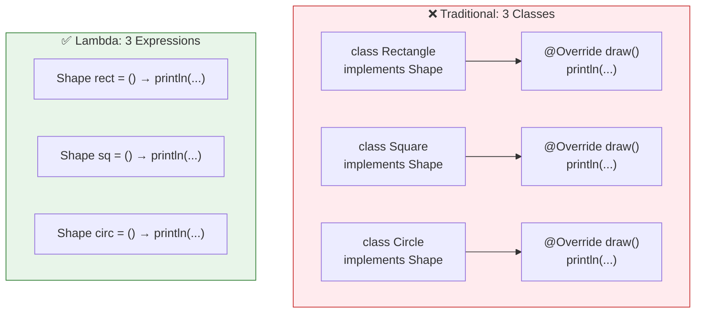
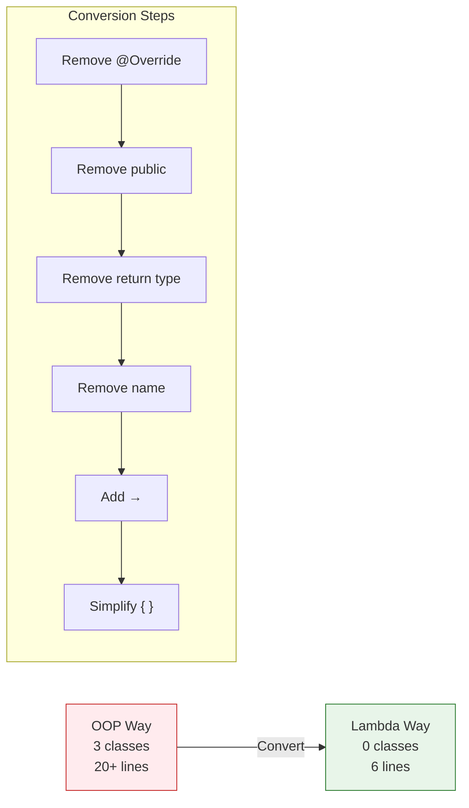

# 📘 Lambda Expression with Example — Shape Interface

---

## 📌 Introduction

### 🧠 What is this about?

In the previous note, we learned what lambda expressions are and the step-by-step process to create them. Now let's **practice** — we'll build a complete example from scratch, starting with a functional interface, implementing it the traditional way, and then converting everything to lambda expressions.

This is a hands-on walkthrough that solidifies the conversion technique.

### 🌍 Real-World Problem First

You're building a drawing application. Different shapes have different drawing behaviors. In OOP, you'd create a `Shape` interface and one class per shape — `Rectangle`, `Square`, `Circle`. Each class has 5+ lines of boilerplate for 1 line of actual logic.

With lambdas, each shape's drawing behavior is a single expression.

### ❓ Why does it matter?
- Practicing the conversion process makes it second nature
- Seeing the before/after comparison cements why lambdas matter
- You'll learn the simplified syntax rules for real-world use

### 🗺️ What we'll learn (Learning Map)
- Building a complete functional interface + lambda example from scratch
- Traditional OOP implementation vs. lambda implementation side by side
- The personal technique for converting methods to lambdas
- Lambda syntax simplification rules in practice

---

## 🧩 Concept 1: Setting Up the Functional Interface

### 🧠 Layer 1: The Simple Version

We start by defining a contract: "Every shape must be able to draw itself." That contract is a functional interface with one abstract method: `draw()`.

### 💻 Layer 5: Code — Define the Interface

```java
// The functional interface — our contract
@FunctionalInterface
interface Shape {
    void draw();   // exactly ONE abstract method → functional interface ✅
}
```

**Key points:**
- `draw()` has **no parameters** (nothing needed to draw)
- `draw()` returns **void** (just performs an action, doesn't produce a value)
- `@FunctionalInterface` is optional but recommended — it tells the compiler to enforce the "one abstract method" rule

---

## 🧩 Concept 2: Traditional OOP Implementation

### 🧠 Layer 1: The Simple Version

The traditional way: create a separate class for each shape, implement the interface, override the method. It works, but it's verbose.

### 💻 Layer 5: Code — The OOP Way

```java
// Three classes — each implementing the same interface
class Rectangle implements Shape {
    @Override
    public void draw() {
        System.out.println("Rectangle is drawing");
    }
}

class Square implements Shape {
    @Override
    public void draw() {
        System.out.println("Square is drawing");
    }
}

class Circle implements Shape {
    @Override
    public void draw() {
        System.out.println("Circle is drawing");
    }
}

// Usage
public class ShapeExample {
    public static void main(String[] args) {
        Shape rectangle = new Rectangle();
        rectangle.draw();   // Output: Rectangle is drawing

        Shape square = new Square();
        square.draw();      // Output: Square is drawing

        Shape circle = new Circle();
        circle.draw();      // Output: Circle is drawing
    }
}
```

### 📊 The Cost Analysis

| What | Count |
|------|:-----:|
| Classes created | 3 |
| Methods overridden | 3 |
| `@Override` annotations | 3 |
| Lines of boilerplate | ~15 |
| Lines of actual unique logic | 3 (`println` statements) |
| **Boilerplate ratio** | **5:1** — five lines of ceremony for every line of meaning |



---

> Now let's convert each of these classes into a lambda expression — following the exact step-by-step technique.

---

## 🧩 Concept 3: Converting to Lambda — Step by Step

### 🧠 Layer 1: The Simple Version

Take the method from the class, strip away everything Java can infer, and what's left is the lambda.

### ⚙️ Layer 4: The Conversion — Rectangle

Let's convert `Rectangle` step by step:

```java
// START: The method from Rectangle class
@Override
public void draw() {
    System.out.println("Rectangle is drawing");
}

// STEP 1: Remove @Override → not needed for lambdas
public void draw() {
    System.out.println("Rectangle is drawing");
}

// STEP 2: Remove 'public' → lambdas don't have access modifiers
void draw() {
    System.out.println("Rectangle is drawing");
}

// STEP 3: Remove return type 'void' → compiler infers from Shape interface
draw() {
    System.out.println("Rectangle is drawing");
}

// STEP 4: Remove method name → lambdas are anonymous
() {
    System.out.println("Rectangle is drawing");
}

// STEP 5: Add arrow → between parameters and body
() -> {
    System.out.println("Rectangle is drawing");
}

// STEP 6: Single statement → remove { }
() -> System.out.println("Rectangle is drawing")

// STEP 7: Assign to functional interface variable
Shape rectangle = () -> System.out.println("Rectangle is drawing");
```

### 💻 Layer 5: The Complete Lambda Version

```java
@FunctionalInterface
interface Shape {
    void draw();
}

public class LambdaExample {
    public static void main(String[] args) {
        // ✅ Each lambda replaces an entire class
        Shape rectangle = () -> System.out.println("Rectangle is drawing");
        Shape square    = () -> System.out.println("Square is drawing");
        Shape circle    = () -> System.out.println("Circle is drawing");

        // Call them exactly the same way as before
        rectangle.draw();   // Output: Rectangle is drawing
        square.draw();      // Output: Square is drawing
        circle.draw();      // Output: Circle is drawing
    }
}
```

**The result:**
- 3 classes → **0 extra classes**
- ~20 lines → **~6 lines**
- Same output, same type safety, same interface contract

---

## 🧩 Concept 4: What Gets Removed and Why

### 📊 Layer 6: Removal Reasoning Table

| Removed Element | Why Java Doesn't Need It |
|----------------|-------------------------|
| `@Override` | Lambdas don't override — they implement. The annotation is for class methods. |
| `public` | Lambdas are not class members — they don't have access modifiers. They exist as values. |
| Return type (`void`) | The compiler knows the return type from the functional interface's abstract method signature. `Shape.draw()` returns `void`, so the lambda must too. |
| Method name (`draw`) | Lambdas are **anonymous** — they don't need names. The interface already defines the method name. When you call `rectangle.draw()`, Java knows which lambda body to execute. |
| `{ }` braces | When the body is a single expression, braces are optional — the expression IS the body. |

### 🌍 Layer 3: Analogy — Filing a Form

| Form Field | Method Element | Lambda |
|-----------|---------------|--------|
| "Department: IT" | `public` (access modifier) | Doesn't need it — you're not filing to a department |
| "Form type: Expense Report" | `void` (return type) | Doesn't need it — the form template already says the type |
| "Your name: John Smith" | `draw` (method name) | Doesn't need it — you're anonymous |
| "Description: ..." | `println("...")` (the logic) | ✅ **This is the ONLY part that matters** |

> 💡 **The Aha Moment:** When you strip away everything the compiler can figure out on its own, all that's left is the **actual logic** — the part that's different for each implementation. That's the lambda.

---

## 🧩 Concept 5: Lambda Syntax Simplification Rules

### 📊 Quick Reference

| Scenario | Full Syntax | Simplified | Rule |
|----------|------------|------------|------|
| No parameters | `() -> { System.out.println("Hi"); }` | `() -> System.out.println("Hi")` | Single statement → remove `{ }` |
| One parameter | `(n) -> { return n * 2; }` | `n -> n * 2` | Remove `( )`, `{ }`, `return` |
| Two parameters | `(int a, int b) -> { return a + b; }` | `(a, b) -> a + b` | Remove types, `{ }`, `return` |
| Multi-line body | N/A — must keep braces | `(a, b) -> { int sum = a + b; return sum; }` | `{ }` and `return` required |

```java
// All of these are equivalent:
Function<Integer, Integer> square;

// Full verbose syntax
square = (Integer n) -> { return n * n; };

// Remove type (compiler infers from Function<Integer, Integer>)
square = (n) -> { return n * n; };

// Remove parentheses (single parameter)
square = n -> { return n * n; };

// Remove braces and return (single expression)
square = n -> n * n;    // ✅ Most concise form
```

---

### ⚠️ Pitfalls & Mistakes

**Mistake 1: Adding `return` when there are no braces**
```java
// ❌ Compile error — can't use 'return' without { }
Function<Integer, Integer> square = n -> return n * n;

// ✅ Either use braces with return:
Function<Integer, Integer> square = n -> { return n * n; };

// ✅ Or omit both (preferred):
Function<Integer, Integer> square = n -> n * n;
```

**Mistake 2: Mixing parameter types — specify all or none**
```java
// ❌ Compile error — can't specify type for one but not the other
BiFunction<Integer, Integer, Integer> add = (int a, b) -> a + b;

// ✅ Either specify ALL types:
BiFunction<Integer, Integer, Integer> add = (int a, int b) -> a + b;

// ✅ Or specify NONE (preferred — let compiler infer):
BiFunction<Integer, Integer, Integer> add = (a, b) -> a + b;
```

---

### 💡 Pro Tips

**Tip 1: The conversion technique works for ANY interface implementation**
- Identify a class implementing an interface with one abstract method
- Copy the method body
- Strip away: annotation → access modifier → return type → name → add arrow → simplify
- You have a lambda every time

**Tip 2: Lambda expressions are NOT tied to any class or object**
- They exist independently — you can assign them, pass them, and return them
- This is what makes them "first-class functions" in Java

---

## 🎯 Final Summary

### 🧠 The Big Picture



### ✅ Master Takeaways

→ The conversion process is **mechanical**: strip access modifier → return type → method name → add arrow → simplify braces

→ Each lambda replaces an **entire class** that implements a functional interface

→ Lambda syntax simplification: single parameter → no `()`, single expression → no `{ }` or `return`, types → optional

→ Lambdas are **anonymous** and **independent** — not tied to any class or object

→ The only thing that survives the conversion is the **actual logic** — everything else is inferred by the compiler

---

## 🔗 What's Next?

We've mastered the basic lambda syntax with a no-parameter `void` method. But real-world interfaces usually have **parameters and return values**. In the next note, we'll build a **Calculator** with lambdas — implementing `calculate(int a, int b)` for addition, subtraction, multiplication, and division — to see how lambdas handle the full range of method signatures.
