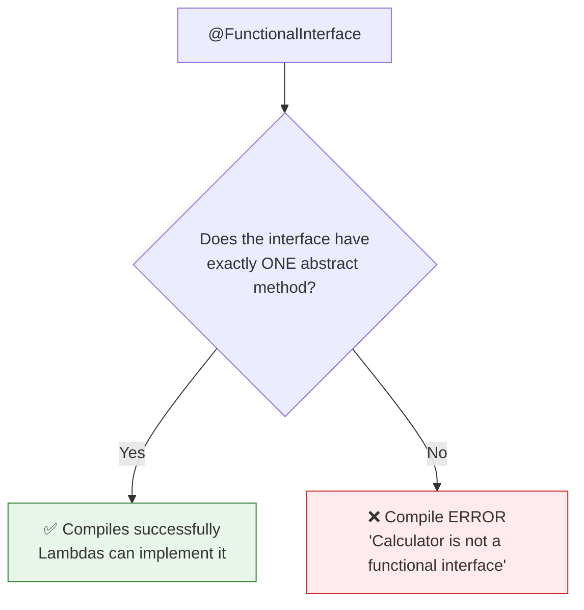
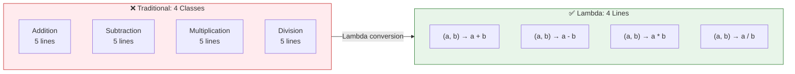
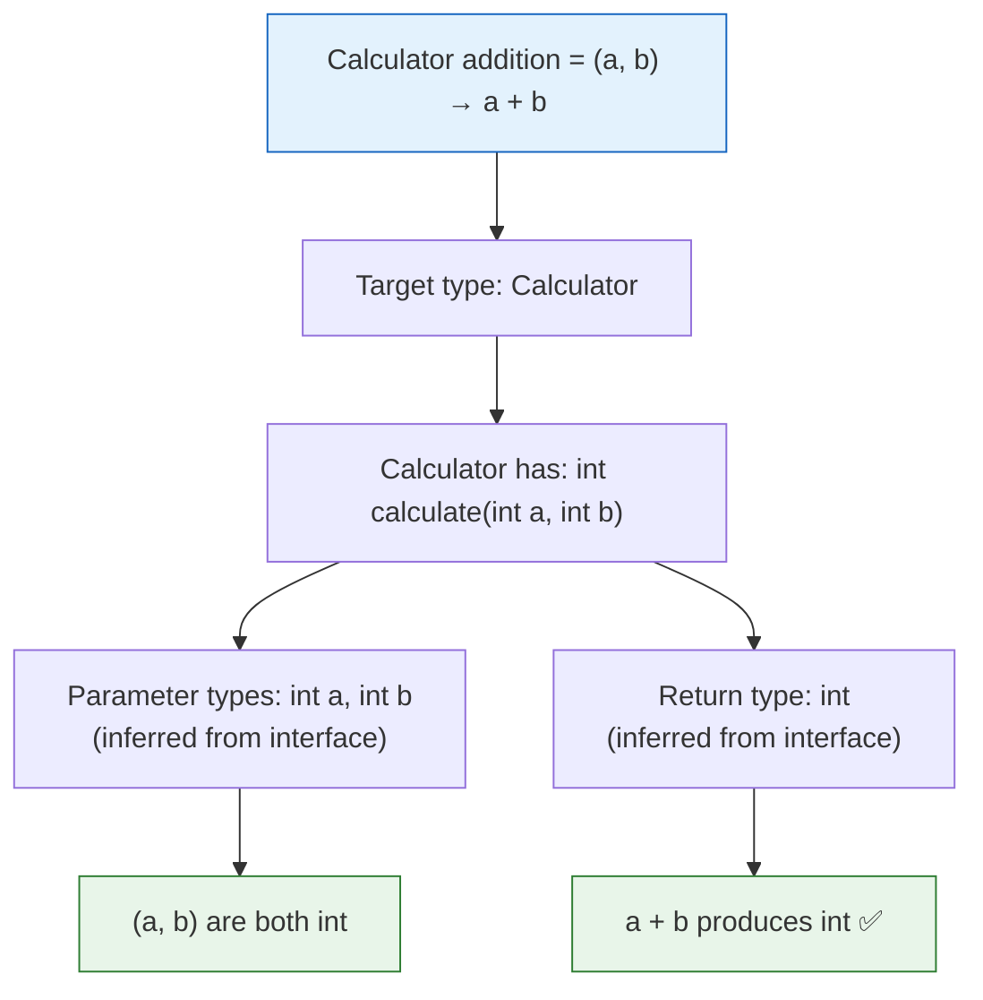
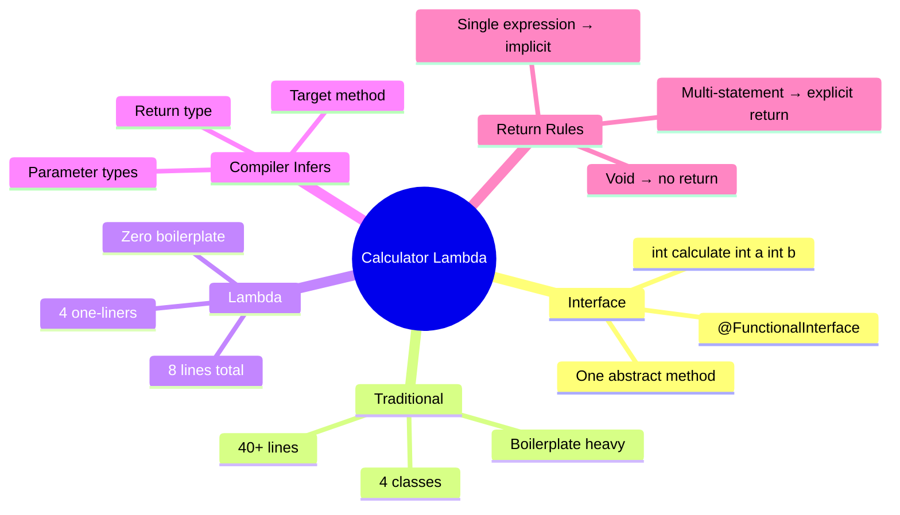

# 📘 Lambda Expression — Calculator Example

---

## 📌 Introduction

### 🧠 What is this about?

In the previous notes, we worked with a simple `Shape` interface — no parameters, `void` return type. Now let's level up: we'll build a **Calculator** using lambdas, working with a functional interface that has **parameters** and a **return value**.

This example demonstrates how lambdas handle the full range of method signatures and shows the power of having **multiple lambda implementations** of the same interface.

### 🌍 Real-World Problem First

You need four arithmetic operations: add, subtract, multiply, divide. The traditional way requires four separate classes, each implementing a `Calculator` interface. That's ~40 lines of code for what is essentially four one-line expressions: `a + b`, `a - b`, `a * b`, `a / b`.

With lambdas, four operations = four one-liners.

### ❓ Why does it matter?
- Shows how lambdas work with **parameters and return values** (not just `void`)
- Demonstrates **type inference** — the compiler figures out parameter types and return types
- Shows how one interface can have **unlimited implementations** via different lambdas
- Builds muscle memory for the conversion technique

### 🗺️ What we'll learn (Learning Map)
- Creating a functional interface with parameters and return type
- The `@FunctionalInterface` annotation
- Converting four OOP classes to four lambda one-liners
- Parameter type inference and return value inference
- Side-by-side comparison: OOP vs. Lambda

---

## 🧩 Concept 1: The Calculator Functional Interface

### 🧠 Layer 1: The Simple Version

We define a contract: "A calculator takes two integers and returns an integer result." That's our functional interface.

### 💻 Layer 5: Code — Define the Interface

```java
@FunctionalInterface
interface Calculator {
    int calculate(int a, int b);  // takes two ints, returns an int
}
```

**What's different from Shape?**
- `Shape.draw()` → no parameters, returns `void`
- `Calculator.calculate(int a, int b)` → two parameters, returns `int`
- Lambdas for `Calculator` will need to handle both inputs and produce a return value

### ⚙️ Layer 4: The `@FunctionalInterface` Annotation



**The annotation is optional** — Java will treat any single-abstract-method interface as functional. But adding `@FunctionalInterface` gives you a compile-time safety net: if someone accidentally adds a second abstract method, the compiler catches it immediately.

---

## 🧩 Concept 2: Traditional OOP — Four Classes for Four Operations

### 💻 Layer 5: Code — The Old Way

```java
class Addition implements Calculator {
    @Override
    public int calculate(int a, int b) {
        return a + b;
    }
}

class Subtraction implements Calculator {
    @Override
    public int calculate(int a, int b) {
        return a - b;
    }
}

class Multiplication implements Calculator {
    @Override
    public int calculate(int a, int b) {
        return a * b;
    }
}

class Division implements Calculator {
    @Override
    public int calculate(int a, int b) {
        return a / b;
    }
}

// Usage
public class CalculatorExample {
    public static void main(String[] args) {
        Calculator addition = new Addition();
        System.out.println(addition.calculate(10, 20));       // Output: 30

        Calculator subtraction = new Subtraction();
        System.out.println(subtraction.calculate(20, 10));    // Output: 10

        Calculator multiplication = new Multiplication();
        System.out.println(multiplication.calculate(10, 20)); // Output: 200

        Calculator division = new Division();
        System.out.println(division.calculate(20, 10));       // Output: 2
    }
}
```

**The problem:** Four classes. Four `@Override` annotations. Four `public int calculate` declarations. The only lines that differ are: `a + b`, `a - b`, `a * b`, `a / b`.

---

> Let's convert each class into a lambda — and watch 40+ lines collapse into 8.

---

## 🧩 Concept 3: Converting to Lambda — With Parameters and Return Values

### ⚙️ Layer 4: Step-by-Step Conversion (Addition)

```java
// STEP 0: Original method from Addition class
@Override
public int calculate(int a, int b) {
    return a + b;
}

// STEP 1: Remove @Override
public int calculate(int a, int b) {
    return a + b;
}

// STEP 2: Remove 'public'
int calculate(int a, int b) {
    return a + b;
}

// STEP 3: Remove return type 'int' (compiler infers from Calculator interface)
calculate(int a, int b) {
    return a + b;
}

// STEP 4: Remove method name (lambda is anonymous)
(int a, int b) {
    return a + b;
}

// STEP 5: Remove parameter types (compiler infers from Calculator.calculate(int, int))
(a, b) {
    return a + b;
}

// STEP 6: Add arrow →
(a, b) -> {
    return a + b;
}

// STEP 7: Single expression → remove { } and 'return'
(a, b) -> a + b

// STEP 8: Assign to Calculator variable
Calculator addition = (a, b) -> a + b;
```

### 💻 Layer 5: Code — All Four Operations as Lambdas

```java
@FunctionalInterface
interface Calculator {
    int calculate(int a, int b);
}

public class CalculatorLambdaExample {
    public static void main(String[] args) {
        // ✅ Four operations — four lambdas — four lines
        Calculator addition       = (a, b) -> a + b;
        Calculator subtraction    = (a, b) -> a - b;
        Calculator multiplication = (a, b) -> a * b;
        Calculator division       = (a, b) -> a / b;

        // Use them
        System.out.println(addition.calculate(10, 20));       // Output: 30
        System.out.println(subtraction.calculate(20, 10));    // Output: 10
        System.out.println(multiplication.calculate(10, 20)); // Output: 200
        System.out.println(division.calculate(20, 10));       // Output: 2
    }
}
```

### 📊 Layer 6: Before vs. After

| Metric | Traditional OOP | Lambda |
|--------|:--------------:|:------:|
| Classes created | 4 | 0 |
| Lines of code | ~40 | ~8 |
| Unique logic lines | 4 (`a+b`, `a-b`, `a*b`, `a/b`) | 4 (same) |
| Boilerplate lines | ~36 | 0 |



---

## 🧩 Concept 4: What the Compiler Infers (and How)

### 🧠 Layer 1: The Simple Version

When you write `(a, b) -> a + b`, the compiler looks at the target type (`Calculator`) and figures out everything else automatically.

### ⚙️ Layer 4: The Inference Chain



**What the compiler infers:**
1. **Parameter types** — `a` and `b` are `int` because `Calculator.calculate(int a, int b)` declares them as `int`
2. **Return type** — the result of `a + b` is `int`, which matches `Calculator.calculate()`'s return type
3. **Which method** — `Calculator` has only one abstract method (`calculate`), so the lambda must implement that one

**This is why you DON'T write:**
```java
// ❌ Unnecessary — compiler already knows these types
Calculator addition = (int a, int b) -> { return a + b; };

// ✅ Concise — compiler infers everything
Calculator addition = (a, b) -> a + b;
```

---

## 🧩 Concept 5: The Return Keyword Rule

### 🧠 Layer 1: The Simple Version

When a lambda has a single expression, the result of that expression is **automatically returned**. You don't write `return`. But if the lambda has multiple statements, you **must** use `return` and braces.

### 💻 Layer 5: Code — When to Use `return`

```java
// ✅ Single expression → implicit return, no braces
Calculator addition = (a, b) -> a + b;
// The result of 'a + b' is automatically returned

// ✅ Multi-statement → explicit return, braces required
Calculator safeDivision = (a, b) -> {
    if (b == 0) {
        return 0;          // explicit return needed
    }
    return a / b;          // explicit return needed
};
System.out.println(safeDivision.calculate(20, 0));   // Output: 0
System.out.println(safeDivision.calculate(20, 10));  // Output: 2
```

| Scenario | Syntax | Return |
|----------|--------|--------|
| Single expression | `(a, b) -> a + b` | **Implicit** — expression result is returned |
| Multi-statement | `(a, b) -> { ... return result; }` | **Explicit** — must write `return` |
| `void` method | `() -> System.out.println("Hi")` | **No return** — nothing to return |

---

### ⚠️ Pitfalls & Mistakes

**Mistake 1: Using `return` without braces**
```java
// ❌ Compile error — 'return' requires braces
Calculator add = (a, b) -> return a + b;

// ✅ Either use braces with return:
Calculator add = (a, b) -> { return a + b; };

// ✅ Or omit both (preferred):
Calculator add = (a, b) -> a + b;
```

**Mistake 2: Forgetting the semicolon inside braces**
```java
// ❌ Compile error — missing semicolons inside the block
Calculator add = (a, b) -> { return a + b }; 

// ✅ Correct — semicolons inside the block, and after the closing brace
Calculator add = (a, b) -> { return a + b; };
```

---

### 💡 Pro Tips

**Tip 1: One interface, unlimited implementations**
```java
// The SAME Calculator interface with completely different behaviors
Calculator add      = (a, b) -> a + b;
Calculator subtract = (a, b) -> a - b;
Calculator max      = (a, b) -> a > b ? a : b;
Calculator power    = (a, b) -> (int) Math.pow(a, b);
Calculator modulo   = (a, b) -> a % b;
// All use the same interface — lambdas make it trivial to create new implementations
```

**Tip 2: Prefer the most concise form that's still readable**
- `(a, b) -> a + b` — perfect, clean, readable
- `(int a, int b) -> { return a + b; }` — too verbose, types are inferred
- Choose readability over cleverness

---

## 🎯 Final Summary

### 🧠 The Big Picture



### ✅ Master Takeaways

→ Lambdas with **parameters**: `(a, b) -> a + b` — parameter types are inferred from the functional interface

→ Lambdas with **return values**: single expressions automatically return the result — no `return` keyword needed

→ One functional interface can have **unlimited lambda implementations** — each one is just a different expression

→ The `@FunctionalInterface` annotation provides compile-time safety — prevents accidental second abstract methods

→ Four classes with ~40 lines of OOP code → four lambdas with ~8 lines — **same functionality, 80% less code**

---

## 🔗 What's Next?

We've assigned lambdas to variables and called them. But there's an even more powerful pattern: **passing lambdas directly as method parameters**. In the next note, we'll see how to pass lambda expressions to methods — eliminating even the variable assignment step and making code even more concise. This is the pattern you'll use most often with the Stream API.
