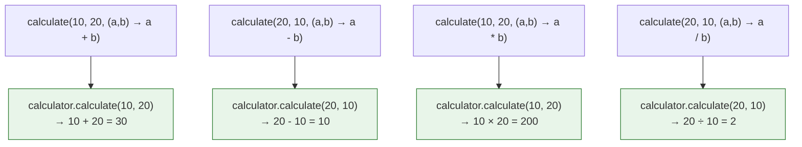
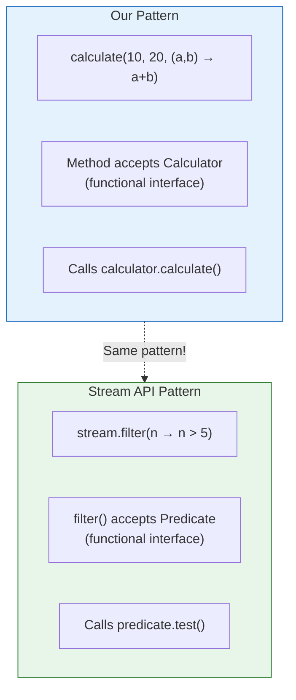
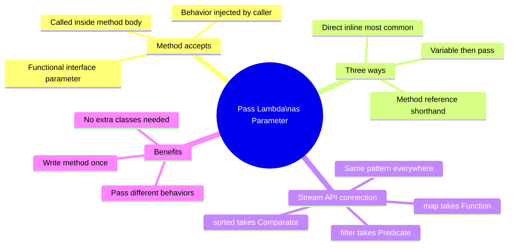

# 📘 Pass Lambda as Parameter Example

---

## 📌 Introduction

### 🧠 What is this about?

So far, we've assigned lambdas to variables and called them. But the real power of lambdas emerges when you **pass them directly as arguments to methods**. This eliminates even the variable declaration step and is the pattern behind every Stream API operation.

When you write `.filter(n -> n > 5)`, you're passing a lambda directly to a method. This note teaches you exactly how that works.

### 🌍 Real-World Problem First

You have a `drawing()` method that draws shapes. Instead of creating a `Shape` variable, assigning a lambda, and then passing the variable — you want to pass the lambda expression **inline**, right where it's needed. Less ceremony, more clarity.

### ❓ Why does it matter?
- This is how you'll use lambdas 90% of the time — as inline arguments to methods
- It's the pattern behind `.filter()`, `.map()`, `.sorted()`, `.forEach()` — all stream operations
- It creates **higher-order functions** — methods that accept behavior as parameters
- Further reduces code — no intermediate variable needed

### 🗺️ What we'll learn (Learning Map)
- How to create methods that accept functional interface parameters
- Three ways to pass lambdas: via variable, directly inline, or mixed
- Applying this pattern to both the Shape and Calculator examples
- Connection to how Stream API works internally

---

## 🧩 Concept 1: Creating a Method That Accepts a Lambda

### 🧠 Layer 1: The Simple Version

You create a method with a functional interface as one of its parameters. When someone calls your method, they can pass a lambda expression for that parameter — and your method calls it.

### 🔍 Layer 2: The Developer Version

The method doesn't know (or care) what the lambda does. It just knows the lambda matches the functional interface contract and calls the appropriate method on it.

### 💻 Layer 5: Code — Shape Example

```java
@FunctionalInterface
interface Shape {
    void draw();
}

public class PassLambdaExample {
    // ✅ This method accepts a Shape (functional interface) as parameter
    private static void drawing(Shape shape) {
        shape.draw();    // calls whatever implementation was passed
    }

    public static void main(String[] args) {
        // Option 1: Create lambda variable, then pass it
        Shape rectangle = () -> System.out.println("Rectangle is drawing");
        drawing(rectangle);
        // Output: Rectangle is drawing

        // Option 2: Pass lambda DIRECTLY — no variable needed!
        drawing(() -> System.out.println("Circle is drawing"));
        // Output: Circle is drawing

        // Option 3: Pass different behavior each time
        drawing(() -> System.out.println("Square is drawing"));
        // Output: Square is drawing
        
        drawing(() -> System.out.println("Triangle is drawing"));
        // Output: Triangle is drawing
    }
}
```

### ⚙️ Layer 4: What Happens When You Pass a Lambda Directly

```mermaid
flowchart LR
    A["drawing(\n  () → println(\"Circle\")\n)"] 
    --> B["drawing(Shape shape)"]
    --> C["shape.draw()"]
    --> D["println(\"Circle is drawing\")"]
    
    style A fill:#e3f2fd,stroke:#1565c0
    style D fill:#e8f5e9,stroke:#2e7d32
```

**Step 1:** You call `drawing()` with a lambda `() -> System.out.println("Circle is drawing")`

**Step 2:** Java sees the parameter type is `Shape` (a functional interface). It wraps the lambda as a `Shape` implementation.

**Step 3:** Inside `drawing()`, `shape.draw()` executes the lambda body.

**Step 4:** `System.out.println("Circle is drawing")` runs.

### 📊 Layer 6: Three Ways to Pass Lambdas — Compared

| Approach | Code | When to Use |
|----------|------|-------------|
| **Variable + pass** | `Shape r = () -> ...; drawing(r);` | When you reuse the lambda multiple times |
| **Inline direct** | `drawing(() -> ...);` | When you use the lambda exactly once (most common) |
| **Method reference** | `drawing(this::drawCircle);` | When the lambda just calls an existing method |

---

> Now let's apply the same pattern to the Calculator example — this time with parameters and return values.

---

## 🧩 Concept 2: Passing Lambdas with Parameters and Return Values

### 🧠 Layer 1: The Simple Version

The pattern works exactly the same when the lambda has parameters and returns a value. You create a method that accepts the functional interface, and inside it, you call the interface's method with actual arguments.

### 💻 Layer 5: Code — Calculator Example

```java
@FunctionalInterface
interface Calculator {
    int calculate(int a, int b);
}

public class CalculatorPassLambda {
    // ✅ Accepts two numbers AND a Calculator (functional interface)
    private static int calculate(int a, int b, Calculator calculator) {
        return calculator.calculate(a, b);
    }

    public static void main(String[] args) {
        // Pass different lambdas to the SAME method
        System.out.println(calculate(10, 20, (a, b) -> a + b));   // Output: 30
        System.out.println(calculate(20, 10, (a, b) -> a - b));   // Output: 10
        System.out.println(calculate(10, 20, (a, b) -> a * b));   // Output: 200
        System.out.println(calculate(20, 10, (a, b) -> a / b));   // Output: 2
    }
}
```

**What's happening:**
- `calculate(10, 20, (a, b) -> a + b)` → calls `(a, b) -> a + b` with `a=10, b=20` → returns `30`
- `calculate(20, 10, (a, b) -> a - b)` → calls `(a, b) -> a - b` with `a=20, b=10` → returns `10`
- Same method, different behavior each time — because the lambda is the behavior



---

## 🧩 Concept 3: The Evolution — Variable → Direct → Inline

### 🧠 Layer 1: The Simple Version

Let's see how the code gets progressively more concise as we move from variable-based to direct inline passing.

### 💻 Layer 5: Code — The Three Stages

```java
// STAGE 1: Lambda in variable, then pass variable
Calculator addition = (a, b) -> a + b;
System.out.println(addition.calculate(10, 20));
// 2 lines — lambda stored separately

// STAGE 2: Lambda in variable, pass to method
Calculator addition = (a, b) -> a + b;
System.out.println(calculate(10, 20, addition));
// 2 lines — slightly better with helper method

// STAGE 3: Lambda passed directly inline (most concise)
System.out.println(calculate(10, 20, (a, b) -> a + b));
// 1 line — no intermediate variable!
```

**Stage 3 is how you'll write code most often.** It's the pattern behind every stream operation:

```java
// This is EXACTLY the same pattern as stream operations!
numbers.stream()
    .filter(n -> n > 5)              // passing lambda inline to filter()
    .map(n -> n * 2)                 // passing lambda inline to map()
    .sorted((a, b) -> a - b)         // passing lambda inline to sorted()
    .forEach(n -> System.out.println(n));  // passing lambda inline to forEach()
```

> 💡 **The Aha Moment:** Every time you see `(n -> ...)` inside a stream operation, you're looking at a lambda being passed directly as a parameter to a higher-order function. It's the exact same pattern we just learned — applied to the Stream API's built-in methods.

---

## 🧩 Concept 4: Why This Pattern Matters — Connection to Stream API

### 🧠 Layer 1: The Simple Version

The `calculate(int a, int b, Calculator calculator)` method we created is **structurally identical** to how `filter()`, `map()`, and `sorted()` work. They're all methods that accept a function (lambda) as a parameter.

### 📊 Layer 6: Pattern Comparison

| Our Code | Stream API | Pattern |
|----------|-----------|---------|
| `calculate(10, 20, (a, b) -> a + b)` | `stream.filter(n -> n > 5)` | Pass lambda to method |
| `Calculator` interface | `Predicate<T>` interface | Functional interface as parameter type |
| `calculator.calculate(a, b)` | `predicate.test(element)` | Method calls the lambda internally |
| Different lambdas → different behavior | Different lambdas → different filtering | Same method, pluggable behavior |



---

### ⚠️ Pitfalls & Mistakes

**Mistake 1: Passing a lambda with wrong parameter count**
```java
// ❌ Calculator expects (int, int) → int, but lambda has one parameter
System.out.println(calculate(10, 20, n -> n * 2));  // compile error

// ✅ Match the functional interface's method signature
System.out.println(calculate(10, 20, (a, b) -> a + b));  // correct
```

**Mistake 2: Confusing which lambda goes where (when methods have multiple functional interface parameters)**
```java
// If a method takes TWO functional interfaces, be careful about order
// ✅ Read the method signature carefully to know which lambda goes where
```

---

### 💡 Pro Tips

**Tip 1: Inline lambdas when used once, extract to variable when reused**
```java
// Used once → inline
drawing(() -> System.out.println("Triangle"));

// Used multiple times → variable
Shape triangle = () -> System.out.println("Triangle");
drawing(triangle);
anotherMethod(triangle);
```

**Tip 2: This is the "Strategy Pattern" without the ceremony**
- Traditional Strategy: Interface + 4 classes + factory = ~60 lines
- Lambda Strategy: 4 inline lambdas = ~4 lines
- Same design pattern, dramatically less code

---

## 🎯 Final Summary

### 🧠 The Big Picture



### ✅ Master Takeaways

→ Create methods that accept **functional interface parameters** — callers pass lambdas to customize behavior

→ **Inline lambdas** (passed directly to methods) are the most common pattern — `method(() -> ...)`

→ This is **exactly how the Stream API works**: `filter()`, `map()`, `sorted()` all accept lambdas as parameters

→ One method + different lambdas = unlimited behaviors without code duplication

→ This pattern replaces the traditional **Strategy Design Pattern** with zero boilerplate

---

## 🔗 What's Next?

We've been creating our own functional interfaces (`Shape`, `Calculator`). But Java comes with **built-in functional interfaces** that you don't need to create yourself. In the next note, we'll see a practical example: using the built-in `Runnable` functional interface with lambda expressions to create threads — demonstrating that lambdas work seamlessly with Java's existing API.
