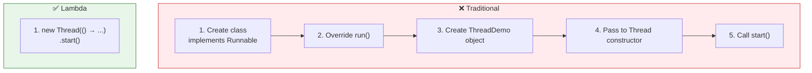
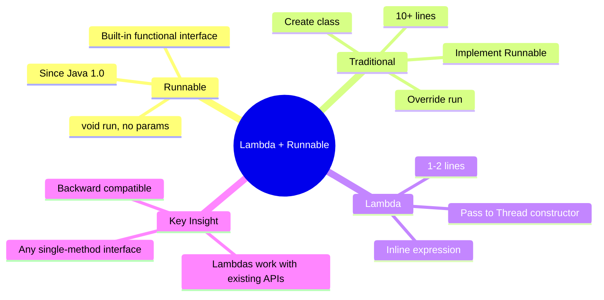

# 📘 Lambda Expression — Runnable Example

---

## 📌 Introduction

### 🧠 What is this about?

So far, we've created our own custom functional interfaces (`Shape`, `Calculator`) and implemented them with lambdas. But Java's standard library is **full of functional interfaces** that were there before Java 8 — and lambdas work perfectly with them.

In this note, we'll use the built-in `Runnable` interface — one of Java's oldest interfaces — with lambda expressions to create threads. This demonstrates that lambdas aren't just for new code; they simplify **existing** Java APIs.

### 🌍 Real-World Problem First

You need to run a task in a separate thread. The traditional way: create a class → implement `Runnable` → override `run()` → create a `Thread` object → pass your class → call `start()`. That's 10+ lines for what is essentially one action.

With lambdas, it's **two lines**.

### ❓ Why does it matter?
- Shows lambdas work with **existing Java interfaces** — not just custom ones
- `Runnable` is one of the most common functional interfaces in Java
- Demonstrates passing lambdas to **constructors** (not just methods)
- Real-world use case: creating threads, scheduling tasks, parallel processing

### 🗺️ What we'll learn (Learning Map)
- Why `Runnable` is a functional interface
- Traditional way to create a thread (verbose)
- Lambda way to create a thread (concise)
- Passing lambdas to constructors
- The progressive simplification journey

---

## 🧩 Concept 1: Runnable — Java's Built-In Functional Interface

### 🧠 Layer 1: The Simple Version

`Runnable` is an interface with exactly one abstract method: `run()`. That makes it a **functional interface** — and therefore a valid target for lambda expressions.

### 🔍 Layer 2: The Developer Version

```java
// From java.lang — Runnable's source code (simplified)
@FunctionalInterface
public interface Runnable {
    void run();   // exactly ONE abstract method → functional interface ✅
}
```

**Key observations:**
- `run()` takes **no parameters** and returns **void** — just like our `Shape.draw()`
- `@FunctionalInterface` annotation is present — confirming it's designed for lambdas
- It's been in Java since **Java 1.0** (1996) — but only became lambda-compatible in Java 8 (2014)

### 🌍 Layer 3: The Real-World Analogy

| Analogy | Traditional Thread Creation | Lambda Thread Creation |
|---------|---------------------------|----------------------|
| Hiring a worker | Post job listing → receive applications → interview → hire → assign task | Just tell someone: "Do this" |
| The actual work | Printing "Hello from thread" | Printing "Hello from thread" |
| The ceremony | Everything except the actual work | Zero ceremony |

```mermaid
flowchart LR
    A["Runnable Interface\n(since Java 1.0)"] -->|"Java 8 adds"| B["Lambda Support"]
    B --> C["() → println(\"Hello\")"]
    C --> D["new Thread(lambda).start()"]
    
    style A fill:#e3f2fd,stroke:#1565c0
    style B fill:#fff3e0,stroke:#ef6c00
    style D fill:#e8f5e9,stroke:#2e7d32
```

---

## 🧩 Concept 2: The Traditional Way — Creating a Thread

### 🧠 Layer 1: The Simple Version

The old way: create a class, implement `Runnable`, override `run()`, create a `Thread` with your class, call `start()`.

### 💻 Layer 5: Code — Verbose Version

```java
// Step 1: Create a class that implements Runnable
class ThreadDemo implements Runnable {
    @Override
    public void run() {
        System.out.println("Run method is calling");
    }
}

// Step 2: Create a Thread with it, and start it
public class LambdaThreadExample {
    public static void main(String[] args) {
        Thread thread = new Thread(new ThreadDemo());
        thread.start();
        // Output: Run method is calling
    }
}
```

**Line count:** ~10 lines for one `println()`.

**The boilerplate breakdown:**
```
class ThreadDemo implements Runnable {    ← boilerplate: class declaration
    @Override                              ← boilerplate: annotation
    public void run() {                    ← boilerplate: method signature
        System.out.println("...");         ← THE ACTUAL WORK (1 line)
    }                                      ← boilerplate: closing brace
}                                          ← boilerplate: closing brace
Thread thread = new Thread(new ThreadDemo());  ← boilerplate: wiring
thread.start();                            ← the actual start
```

That's **7 lines of ceremony** for **1 line of work**.

---

> Now watch what happens when we replace all that ceremony with a lambda.

---

## 🧩 Concept 3: The Lambda Way — Two Lines

### 🧠 Layer 1: The Simple Version

Since `Runnable` is a functional interface, we can replace the entire class with a lambda expression. And since `Thread`'s constructor accepts a `Runnable`, we can pass the lambda directly.

### ⚙️ Layer 4: The Three-Stage Simplification

**Stage 1 — Lambda assigned to variable:**
```java
Runnable withLambda = () -> System.out.println("Run method is calling from Lambda");
Thread thread = new Thread(withLambda);
thread.start();
// Output: Run method is calling from Lambda
```

**Stage 2 — Lambda passed directly to constructor:**
```java
Thread thread = new Thread(() -> System.out.println("Run method is calling from Lambda"));
thread.start();
// Output: Run method is calling from Lambda
```

**Stage 3 — One-liner (create + start in one chain):**
```java
new Thread(() -> System.out.println("Run method is calling from Lambda")).start();
// Output: Run method is calling from Lambda
```

### 💻 Layer 5: Code — Complete Comparison

```java
public class LambdaThreadExample {
    public static void main(String[] args) {
        // ❌ Traditional: 10+ lines
        class ThreadDemo implements Runnable {
            @Override
            public void run() {
                System.out.println("Traditional way");
            }
        }
        Thread t1 = new Thread(new ThreadDemo());
        t1.start();

        // ✅ Lambda: 1 line
        new Thread(() -> System.out.println("Lambda way")).start();
    }
}
// Output:
// Traditional way
// Lambda way
```

### 📊 Layer 6: Side-by-Side

| Aspect | Traditional | Lambda |
|--------|:---------:|:------:|
| Lines of code | ~10 | 1-2 |
| Extra classes | 1 (`ThreadDemo`) | 0 |
| Interface knowledge needed | Same | Same |
| Readability | Buried in boilerplate | Intent is clear immediately |
| Flexibility | New class per task | New lambda per task (inline) |



---

## 🧩 Concept 4: Passing Lambdas to Constructors

### 🧠 Layer 1: The Simple Version

Just as you can pass a lambda to a method, you can pass it to a **constructor** — anywhere the parameter type is a functional interface.

### 🔍 Layer 2: The Developer Version

`Thread` has a constructor: `Thread(Runnable target)`. Since `Runnable` is a functional interface, you can pass a lambda directly:

```java
// The constructor signature
public Thread(Runnable target) { ... }

// Passing a lambda to it
new Thread(() -> System.out.println("Hello from thread"));
//         ^^^^^^^^^^^^^^^^^^^^^^^^^^^^^^^^^^^^^^^^^^^^^^^^^
//         This lambda IS the Runnable implementation
```

**This pattern works anywhere a constructor takes a functional interface:**
```java
// Timer task (another common example)
Timer timer = new Timer();
timer.schedule(new TimerTask() {        // ← Anonymous inner class (old way)
    @Override
    public void run() {
        System.out.println("Timer fired");
    }
}, 1000);

// Note: TimerTask is a class (not interface), so lambdas can't replace it
// But Runnable, Callable, Comparator — all work with lambdas!
```

---

## 🧩 Concept 5: Custom vs. Built-In Functional Interfaces

### 🧠 Layer 1: The Simple Version

You've now seen lambdas with both custom interfaces (`Shape`, `Calculator`) and built-in interfaces (`Runnable`). The pattern is **identical** — the only difference is who defined the interface.

### 📊 Layer 6: Comparison

| | Custom (`Shape`) | Built-in (`Runnable`) |
|---|---|---|
| **Who defines it** | You | Java standard library |
| **Where it lives** | Your project | `java.lang.Runnable` |
| **Lambda syntax** | `() -> println("Drawing")` | `() -> println("Running")` |
| **Usage** | Assign to `Shape` variable | Pass to `Thread` constructor |
| **Pattern** | Identical | Identical |

> 💡 **Key Insight:** Java 8 didn't just add new functional interfaces — it made **existing** interfaces like `Runnable`, `Comparator`, and `Callable` lambda-compatible. Any old interface with exactly one abstract method automatically became a functional interface. This means lambdas work with APIs written 20 years before lambdas existed!

### 🔍 Common Built-In Functional Interfaces

| Interface | Package | Method | What It Does |
|-----------|---------|--------|-------------|
| `Runnable` | `java.lang` | `run()` | Executes a task (no input, no output) |
| `Callable<V>` | `java.util.concurrent` | `call()` | Executes a task that returns a value |
| `Comparator<T>` | `java.util` | `compare(T, T)` | Compares two objects |
| `Function<T, R>` | `java.util.function` | `apply(T)` | Transforms input → output |
| `Predicate<T>` | `java.util.function` | `test(T)` | Tests a condition → boolean |
| `Consumer<T>` | `java.util.function` | `accept(T)` | Performs action on input (no output) |
| `Supplier<T>` | `java.util.function` | `get()` | Produces a value (no input) |

---

### ⚠️ Pitfalls & Mistakes

**Mistake 1: Trying to use lambdas with abstract classes**
- 👤 What devs do: Try to create a lambda for `TimerTask` (which is an abstract class, not an interface)
- 💥 Why it breaks: Lambdas only work with **interfaces** — specifically functional interfaces. Abstract classes require anonymous inner classes.
- ✅ Fix: Check if the target type is an interface with one abstract method. If it's a class, use anonymous inner class or a named subclass.

---

### 💡 Pro Tips

**Tip 1: Multi-line thread tasks still work with lambdas**
```java
new Thread(() -> {
    System.out.println("Step 1: Connecting to database...");
    System.out.println("Step 2: Fetching data...");
    System.out.println("Step 3: Processing complete!");
}).start();
// Multi-statement lambdas need { } braces
```

**Tip 2: Lambdas with Runnable are the foundation of modern async Java**
- `CompletableFuture.runAsync(() -> ...)` — runs a lambda asynchronously
- `ExecutorService.submit(() -> ...)` — submits a lambda to a thread pool
- All built on the same `Runnable` functional interface

---

## 🎯 Final Summary

### 🧠 The Big Picture



### ✅ Master Takeaways

→ `Runnable` is a **built-in functional interface** — `void run()` with no parameters

→ Lambdas work with **existing Java APIs** — any single-abstract-method interface is lambda-compatible

→ Lambdas can be passed to **constructors** just like methods — `new Thread(() -> ...)`

→ The traditional thread creation (class + implement + override + object) is replaced by **one line**: `new Thread(() -> ...).start()`

→ Java 8 made old interfaces like `Runnable`, `Comparator`, and `Callable` automatically lambda-compatible — no code changes needed

---

## 🔗 What's Next?

We've covered lambda syntax, custom interfaces, passing lambdas as parameters, and built-in functional interfaces. Now let's see a **real-world use case** that every Java developer encounters: **sorting objects by custom criteria**. In the next note, we'll sort a list of Employee objects by salary using lambda expressions with the `Comparator` functional interface — ascending and descending.
