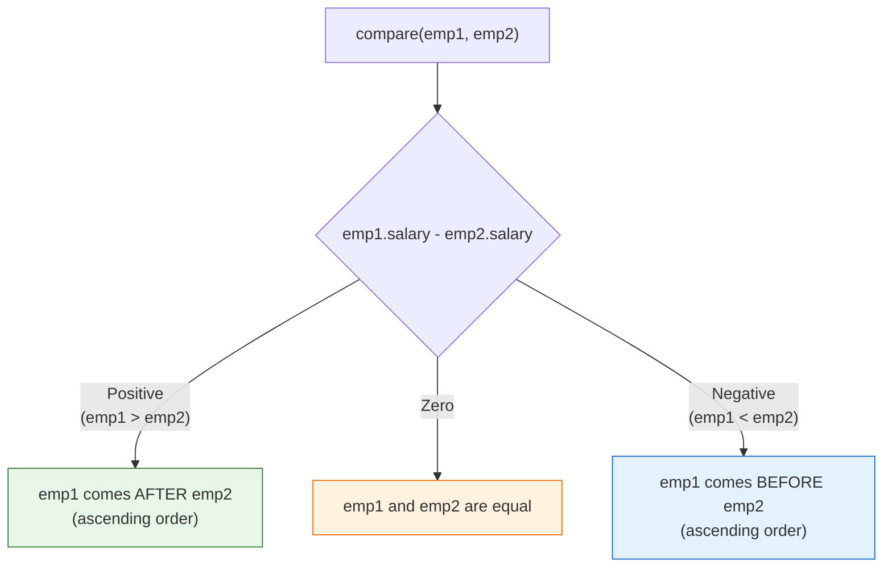
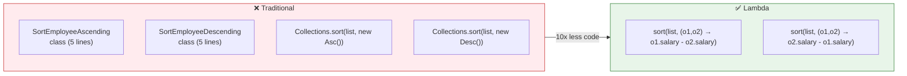

# 📘 Sort Employee Objects by Salary Using Lambda

---

## 📌 Introduction

### 🧠 What is this about?

This is a **real-world use case** that brings everything together: sorting a list of custom objects (Employees) by a specific field (salary) using lambda expressions. We'll use the `Comparator` functional interface — one of Java's most commonly used built-in functional interfaces — and show how lambdas make sorting incredibly concise.

### 🌍 Real-World Problem First

You're building an HR dashboard. Users want to see employees sorted by salary — highest paid first, or lowest paid first. You have a `List<Employee>` and need to sort it both ways.

The traditional way requires creating separate `Comparator` classes for ascending and descending order. With lambdas, each sort is a **one-liner**.

### ❓ Why does it matter?
- Sorting custom objects is one of the **most common operations** in Java applications
- `Comparator` is a **functional interface** — perfect for lambdas
- This pattern applies to sorting by any field: name, age, date, salary, etc.
- You'll use this in REST APIs, reports, data processing, and interviews

### 🗺️ What we'll learn (Learning Map)
- How the `Comparator` functional interface works
- Traditional sorting with Comparator classes
- Lambda-based sorting (one-liners)
- Ascending vs. descending order — the swap technique
- Passing lambda Comparators directly to `Collections.sort()`

---

## 🧩 Concept 1: The Employee Class and Setup

### 💻 Layer 5: Code — The Setup

```java
class Employee {
    private int id;
    private String name;
    private int age;
    private int salary;

    // Constructor
    public Employee(int id, String name, int age, int salary) {
        this.id = id;
        this.name = name;
        this.age = age;
        this.salary = salary;
    }

    // Getters
    public int getSalary() { return salary; }
    public String getName() { return name; }

    @Override
    public String toString() {
        return "Employee{id=" + id + ", name='" + name + "', age=" + age + ", salary=" + salary + "}";
    }
}
```

```java
// Create a list of employees
List<Employee> employees = new ArrayList<>();
employees.add(new Employee(1, "Ramesh", 30, 50000));
employees.add(new Employee(2, "Suresh", 28, 45000));
employees.add(new Employee(3, "Naresh", 35, 75000));
employees.add(new Employee(4, "Mahesh", 32, 25000));
```

---

## 🧩 Concept 2: The Comparator Functional Interface

### 🧠 Layer 1: The Simple Version

`Comparator` is an interface that tells Java **how to compare two objects**. It has one abstract method: `compare(T o1, T o2)`. Since it has exactly one abstract method, it's a **functional interface** — and we can use lambdas.

### 🔍 Layer 2: The Developer Version

```java
// Comparator's core method (simplified)
@FunctionalInterface
public interface Comparator<T> {
    int compare(T o1, T o2);
    // Returns:
    //   positive → o1 is "greater" (comes after o2)
    //   zero     → o1 equals o2
    //   negative → o1 is "lesser" (comes before o2)
}
```

### ⚙️ Layer 4: How `compare()` Works



**The trick for ascending vs. descending:**
- **Ascending:** `o1.getSalary() - o2.getSalary()` → smaller salaries come first
- **Descending:** `o2.getSalary() - o1.getSalary()` → larger salaries come first (just swap o1 and o2!)

---

## 🧩 Concept 3: Traditional Sorting — The OOP Way

### 💻 Layer 5: Code — Verbose Comparator Classes

```java
// ❌ Ascending — requires a whole class
class SortEmployeeAscending implements Comparator<Employee> {
    @Override
    public int compare(Employee o1, Employee o2) {
        return o1.getSalary() - o2.getSalary();
    }
}

// ❌ Descending — another whole class (just swaps o1 and o2)
class SortEmployeeDescending implements Comparator<Employee> {
    @Override
    public int compare(Employee o1, Employee o2) {
        return o2.getSalary() - o1.getSalary();  // swapped!
    }
}

// Usage
public class SortExample {
    public static void main(String[] args) {
        // ... create employees list ...

        // Sort ascending
        Collections.sort(employees, new SortEmployeeAscending());
        System.out.println("Ascending: " + employees);
        // Output: [salary=25000, salary=45000, salary=50000, salary=75000]

        // Sort descending
        Collections.sort(employees, new SortEmployeeDescending());
        System.out.println("Descending: " + employees);
        // Output: [salary=75000, salary=50000, salary=45000, salary=25000]
    }
}
```

**The problem:**
- Two classes for two sort orders
- Each class is 5+ lines
- The ONLY difference is `o1...o2` vs `o2...o1` — one swap

---

> Now let's convert these Comparator classes to lambda expressions — the same conversion technique we've practiced.

---

## 🧩 Concept 4: Lambda Sorting — The Concise Way

### ⚙️ Layer 4: Step-by-Step Conversion

```java
// START: Method from SortEmployeeAscending class
@Override
public int compare(Employee o1, Employee o2) {
    return o1.getSalary() - o2.getSalary();
}

// STEP 1: Remove @Override
// STEP 2: Remove 'public'
// STEP 3: Remove return type 'int'
// STEP 4: Remove method name 'compare'
// STEP 5: Remove parameter types 'Employee'
// STEP 6: Add arrow →
// STEP 7: Single expression → remove { } and return

// RESULT:
(o1, o2) -> o1.getSalary() - o2.getSalary()
```

### 💻 Layer 5: Code — Lambda Version

```java
public class SortEmployeeLambda {
    public static void main(String[] args) {
        List<Employee> employees = new ArrayList<>();
        employees.add(new Employee(1, "Ramesh", 30, 50000));
        employees.add(new Employee(2, "Suresh", 28, 45000));
        employees.add(new Employee(3, "Naresh", 35, 75000));
        employees.add(new Employee(4, "Mahesh", 32, 25000));

        // ✅ Sort ascending — lambda passed directly to sort()
        Collections.sort(employees, (o1, o2) -> o1.getSalary() - o2.getSalary());
        System.out.println("Ascending: " + employees);
        // Output: [...salary=25000, salary=45000, salary=50000, salary=75000]

        // ✅ Sort descending — just swap o1 and o2!
        Collections.sort(employees, (o1, o2) -> o2.getSalary() - o1.getSalary());
        System.out.println("Descending: " + employees);
        // Output: [...salary=75000, salary=50000, salary=45000, salary=25000]
    }
}
```

### 📊 Layer 6: Before vs. After

| Metric | Traditional | Lambda |
|--------|:---------:|:------:|
| Extra classes | 2 | 0 |
| Lines for ascending | ~8 | 1 |
| Lines for descending | ~8 | 1 |
| Total sort code | ~20 lines | 2 lines |
| Logic difference | `o1...o2` vs `o2...o1` | Same — just swap in the lambda |



---

## 🧩 Concept 5: The Ascending/Descending Swap Trick

### 🧠 Layer 1: The Simple Version

To flip sort order, just **swap which object comes first** in the subtraction:
- `o1 - o2` → ascending (small first)
- `o2 - o1` → descending (big first)

### ⚙️ Layer 4: Why the Swap Works

```
Ascending: o1.getSalary() - o2.getSalary()
  If o1=25000, o2=50000: 25000 - 50000 = -25000 (negative) → o1 comes FIRST ✅ (smaller first)
  If o1=50000, o2=25000: 50000 - 25000 = +25000 (positive) → o1 comes AFTER ✅ (smaller first)

Descending: o2.getSalary() - o1.getSalary()  (swapped!)
  If o1=25000, o2=50000: 50000 - 25000 = +25000 (positive) → o1 comes AFTER ✅ (larger first)
  If o1=50000, o2=25000: 25000 - 50000 = -25000 (negative) → o1 comes FIRST ✅ (larger first)
```

> 💡 **Pro Tip:** There's an even cleaner way to sort — using `Comparator.comparing()`:

```java
// ✅ Most idiomatic Java — using method references
// Ascending
Collections.sort(employees, Comparator.comparing(Employee::getSalary));

// Descending
Collections.sort(employees, Comparator.comparing(Employee::getSalary).reversed());

// Or using List.sort() directly
employees.sort(Comparator.comparing(Employee::getSalary));
employees.sort(Comparator.comparing(Employee::getSalary).reversed());
```

**Why this is the best version:**
- `Comparator.comparing(Employee::getSalary)` reads like English: "compare by salary"
- `.reversed()` is crystal clear — no need to remember the swap trick
- `Employee::getSalary` is a **method reference** — a shorthand for `e -> e.getSalary()`

---

## 🧩 Concept 6: Sorting by Multiple Fields

### 🧠 Layer 1: The Simple Version

What if two employees have the same salary? You can chain comparators to break ties.

### 💻 Layer 5: Code — Multi-Field Sorting

```java
// Sort by salary ascending, then by name alphabetically (for ties)
employees.sort(
    Comparator.comparing(Employee::getSalary)
              .thenComparing(Employee::getName)
);

// Sort by salary descending, then by name ascending (for ties)
employees.sort(
    Comparator.comparing(Employee::getSalary).reversed()
              .thenComparing(Employee::getName)
);
```

**How it works:**
1. First, compare by salary
2. If salaries are equal (compare returns 0), break the tie by name
3. `.thenComparing()` chains comparators — unlimited levels

---

### ⚠️ Pitfalls & Mistakes

**Mistake 1: Integer overflow in subtraction-based comparisons**
```java
// ❌ DANGEROUS — can overflow for large integers!
(o1, o2) -> o1.getSalary() - o2.getSalary()
// If o1.salary = Integer.MAX_VALUE and o2.salary = -1
// Then MAX_VALUE - (-1) = MAX_VALUE + 1 → OVERFLOW → wrong result!

// ✅ Safe — uses Integer.compare() which handles overflow
(o1, o2) -> Integer.compare(o1.getSalary(), o2.getSalary())

// ✅ Best — use Comparator.comparing()
Comparator.comparing(Employee::getSalary)
```

**Why does overflow happen?** `Integer.MAX_VALUE` is `2,147,483,647`. Adding 1 wraps around to `-2,147,483,648` (the most negative int). The comparison returns a negative number when it should be positive → wrong sort order. `Integer.compare()` handles this correctly by using comparisons (`<`, `>`) instead of subtraction.

**Mistake 2: Forgetting that `Collections.sort()` modifies the list in-place**
```java
// ⚠️ The original list is CHANGED after sorting
List<Employee> original = new ArrayList<>(employees);
Collections.sort(employees, (o1, o2) -> o1.getSalary() - o2.getSalary());
// 'employees' is now sorted — the original order is LOST

// ✅ If you need the original, make a copy first
List<Employee> sorted = new ArrayList<>(employees);
Collections.sort(sorted, Comparator.comparing(Employee::getSalary));
// 'employees' unchanged, 'sorted' has the sorted version
```

---

### 💡 Pro Tips

**Tip 1: Use `List.sort()` instead of `Collections.sort()`**
```java
// Old style
Collections.sort(employees, Comparator.comparing(Employee::getSalary));

// Modern style (Java 8+) — cleaner, same result
employees.sort(Comparator.comparing(Employee::getSalary));
```

**Tip 2: Use streams for a non-destructive sorted copy**
```java
// Creates a NEW sorted list — original unchanged
List<Employee> sorted = employees.stream()
    .sorted(Comparator.comparing(Employee::getSalary))
    .collect(Collectors.toList());
```

---

## 🎯 Final Summary

### 🧠 The Big Picture

```mermaid
mindmap
  root(("Sort with Lambda"))
    Comparator
      Functional interface
      compare T o1 T o2
      Returns int: pos/zero/neg
    Traditional
      Separate class per sort order
      20+ lines for 2 sorts
    Lambda
      Inline one-liner
      2 lines for 2 sorts
      Swap o1/o2 for order
    Best Practice
      Comparator.comparing()
      Method references
      .reversed() for desc
      .thenComparing() for ties
    Watch Out
      Integer overflow
      In-place modification
      Use Integer.compare()
```

### ✅ Master Takeaways

→ `Comparator` is a **functional interface** — `int compare(T o1, T o2)` — perfect for lambdas

→ **Ascending:** `(o1, o2) -> o1.getSalary() - o2.getSalary()` | **Descending:** swap `o1` and `o2`

→ **Best practice:** Use `Comparator.comparing(Employee::getSalary).reversed()` — readable, safe, no overflow risk

→ Chain comparators with `.thenComparing()` for multi-field sorting

→ Two Comparator classes (~20 lines) → two inline lambdas (~2 lines) — same functionality, 90% less code

---

## 🔗 What's Next?

We've now covered the complete foundation of functional programming: the theory (pure functions, first-class functions, higher-order functions, FP rules) and the primary tool (lambda expressions with various interfaces). In the upcoming sections, we'll explore **Functional Interfaces in depth** — Java's built-in `Function`, `Predicate`, `Consumer`, `Supplier`, and more — which provide the type system that makes lambdas work with the Stream API. These are the power tools that turn lambdas from useful into indispensable.
