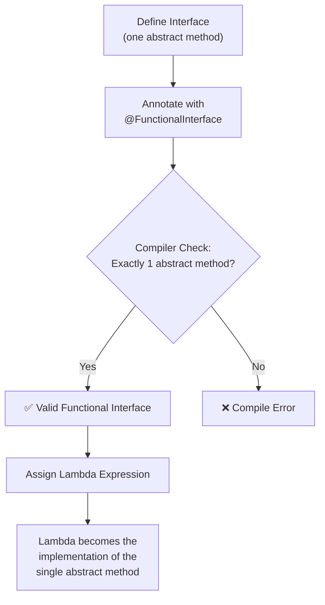
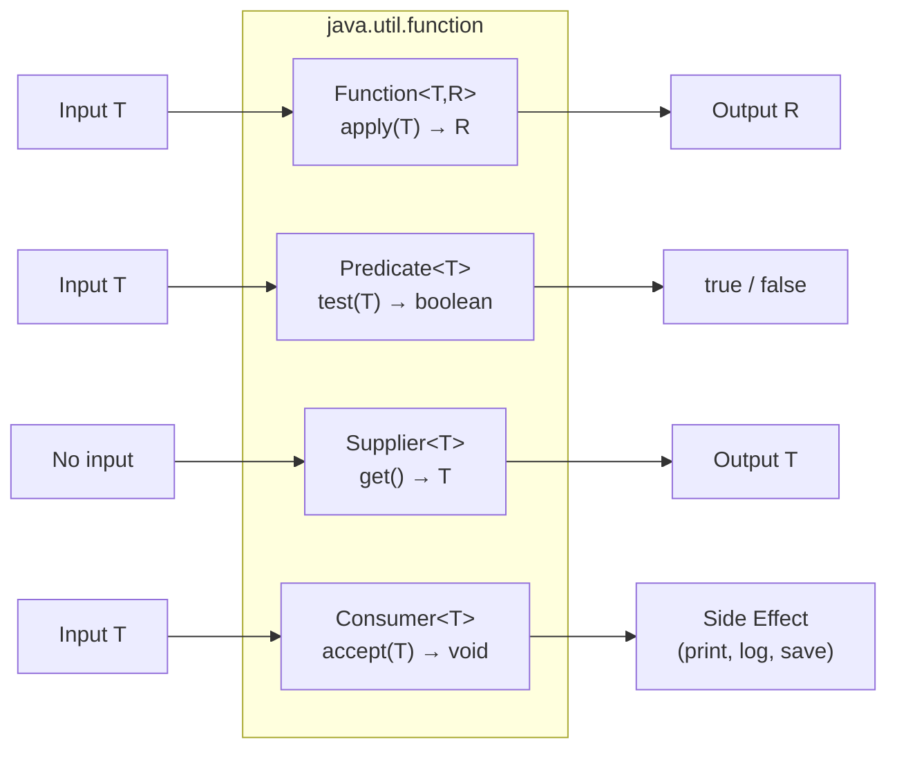

# 📘 Introduction to Functional Interfaces

---

## 📌 Introduction

### 🧠 What is this about?

A **Functional Interface** is an interface in Java that has **exactly one abstract method** — no more, no less. It can have as many `default` and `static` methods as it wants, but the abstract method count must be exactly one. This single-method constraint is what makes it compatible with **lambda expressions**.

### 🌍 Real-World Problem First

Before Java 8, if you wanted to pass a small piece of behavior — like "print this message" or "double this number" — you had to create an entire anonymous inner class. That's a lot of boilerplate for a tiny action:

```java
// ❌ Before Java 8 — verbose and painful
Runnable task = new Runnable() {
    @Override
    public void run() {
        System.out.println("Hello!");
    }
};
```

Five lines of code just to say "print Hello." Java 8 introduced functional interfaces + lambda expressions to fix this verbosity problem:

```java
// ✅ After Java 8 — clean and concise
Runnable task = () -> System.out.println("Hello!");
```

### ❓ Why does it matter?

- Without functional interfaces, **lambda expressions wouldn't exist** — lambdas need a target type with exactly one abstract method
- They are the **foundation of Java's functional programming** support
- Every Stream operation (`filter`, `map`, `forEach`) uses functional interfaces internally
- They reduce boilerplate code dramatically

### 🗺️ What we'll learn (Learning Map)

- What a functional interface is and its rules
- The `@FunctionalInterface` annotation and why you should use it
- How to create your own custom functional interface
- Java 8's built-in functional interfaces in `java.util.function`

---

## 🧩 Concept 1: What Is a Functional Interface?

### 🧠 Layer 1: The Simple Version

A functional interface is like a **job posting with exactly one role**. The posting can have extra perks (default/static methods), but there's only **one position to fill** (the abstract method). A lambda expression is the applicant who fills that role.

### 🔍 Layer 2: The Developer Version

A functional interface is an interface with:
- **Exactly one** abstract method (the SAM — Single Abstract Method)
- **Any number** of `default` methods (methods with a body)
- **Any number** of `static` methods (utility methods on the interface)

The key constraint: **one and only one abstract method**. This is what allows the Java compiler to map a lambda expression to the interface — the lambda *becomes* the implementation of that single method.

### 🌍 Layer 3: The Real-World Analogy

| Analogy (Restaurant Menu) | Functional Interface |
|---|---|
| A menu with ONE blank line for a special | An interface with ONE abstract method |
| The chef fills in today's special | A lambda fills in the method implementation |
| Pre-printed items (soup, salad) | `default` and `static` methods (already implemented) |
| Only one blank = clear expectation | Only one abstract method = clear lambda target |

If there were **two blanks** on the menu, the chef wouldn't know which one to fill. Similarly, if there are two abstract methods, the compiler can't figure out which one the lambda implements.

### ⚙️ Layer 4: How It Works Internally

**Step 1 — Define the interface:** You create an interface with a single abstract method.

**Step 2 — Compiler checks:** When you annotate with `@FunctionalInterface`, the compiler verifies there's exactly one abstract method at compile time.

**Step 3 — Lambda assignment:** When you write a lambda, the compiler matches it to the single abstract method — the lambda's parameters map to the method's parameters, and the lambda body becomes the method body.

**Step 4 — Runtime:** Under the hood, Java uses `invokedynamic` (not anonymous inner classes!) to efficiently create the implementation at runtime.



### 💻 Layer 5: Code — Prove It!

**🔍 Structure of a Functional Interface:**

```java
@FunctionalInterface
interface Printable {
    void print(String message);  // The ONE abstract method

    // ✅ Default methods are allowed (they have a body)
    default void defaultMethod() {
        System.out.println("Default method");
    }

    // ✅ Static methods are allowed (they have a body)
    static void staticMethod() {
        System.out.println("Static method");
    }
}
```

**🔍 Using a Lambda to Implement It:**

```java
public class FunctionalInterfaceDemo {
    public static void main(String[] args) {
        // Lambda implements the single abstract method 'print'
        Printable printable = message -> System.out.println(message);

        printable.print("Hello Functional Interface!");
        // Output: Hello Functional Interface!
    }
}
```

**❌ Common Mistake — Adding Two Abstract Methods:**

```java
@FunctionalInterface
interface InvalidInterface {
    void method1();
    void method2();  // ❌ Compile Error: Multiple non-overriding abstract methods
}
```

**Why it breaks:** The `@FunctionalInterface` annotation triggers a compile-time check. Two abstract methods means the compiler can't determine which one a lambda should implement — so it rejects the interface entirely.

**✅ The Fix — Keep exactly one abstract method:**

```java
@FunctionalInterface
interface ValidInterface {
    void method1();                     // The ONE abstract method
    default void method2() { /* ... */ } // ✅ This is a default method, not abstract
}
```

---

## 🧩 Concept 2: The `@FunctionalInterface` Annotation

### 🧠 Layer 1: The Simple Version

`@FunctionalInterface` is a **safety label** you put on your interface. It tells the compiler: "I intend this to have exactly one abstract method — yell at me if I mess that up."

### 🔍 Layer 2: The Developer Version

The annotation is **optional** — an interface with one abstract method is still a functional interface even without it. But adding it provides:

1. **Compile-time safety** — If someone accidentally adds a second abstract method, the compiler immediately flags it
2. **Documentation** — It signals intent to other developers: "This is meant for lambdas"
3. **Best practice** — The JDK's own functional interfaces (`Predicate`, `Function`, `Consumer`, `Supplier`) all use it

### 💻 Layer 5: Code — Prove It!

```java
// Without annotation — still a functional interface, but no safety net
interface Calculator {
    int calculate(int a, int b);
}

// ✅ With annotation — compiler protects you
@FunctionalInterface
interface SafeCalculator {
    int calculate(int a, int b);
}

// Using it:
SafeCalculator add = (a, b) -> a + b;
SafeCalculator multiply = (a, b) -> a * b;

System.out.println(add.calculate(5, 3));       // Output: 8
System.out.println(multiply.calculate(5, 3));  // Output: 15
```

> 💡 **Pro Tip:** Always add `@FunctionalInterface` to your custom functional interfaces. It costs nothing, prevents mistakes, and communicates intent clearly.

---

## 🧩 Concept 3: Java 8's Built-in Functional Interfaces

### 🧠 Layer 1: The Simple Version

Java 8 realized that developers create the same patterns of functional interfaces again and again — "take input, return output," "test a condition," "supply a value," "consume a value." So it ships a whole **library of pre-built functional interfaces** in the `java.util.function` package.

### 🔍 Layer 2: The Developer Version

The `java.util.function` package contains 40+ functional interfaces. The **four most important ones** are:

| Interface | Abstract Method | Input | Output | Use Case |
|-----------|----------------|-------|--------|----------|
| `Function<T, R>` | `R apply(T t)` | One value | One value | Transform data (map) |
| `Predicate<T>` | `boolean test(T t)` | One value | `boolean` | Filter / validate |
| `Supplier<T>` | `T get()` | None | One value | Generate / provide data |
| `Consumer<T>` | `void accept(T t)` | One value | None | Perform side effects (print, log) |

**Why these four exist:** They cover the four fundamental patterns of behavior:
- **Transform** something → `Function`
- **Test** something → `Predicate`
- **Produce** something from nothing → `Supplier`
- **Do something** with a value → `Consumer`



📊 DIAGRAM PROMPT:
────────────────────────────────────────────────────────────
"Draw four boxes in a 2x2 grid, each representing a Java functional interface: Function (input → output), Predicate (input → boolean), Supplier (nothing → output), Consumer (input → nothing). Use arrows showing data flow in/out. Color: blue for Function, green for Predicate, orange for Supplier, red for Consumer. Clean whiteboard style."
────────────────────────────────────────────────────────────

### 💻 Layer 5: Code — Quick Preview

```java
import java.util.function.*;

// Function: transform data
Function<String, Integer> length = str -> str.length();
System.out.println(length.apply("Hello"));  // Output: 5

// Predicate: test a condition
Predicate<Integer> isPositive = num -> num > 0;
System.out.println(isPositive.test(42));    // Output: true

// Supplier: produce data
Supplier<String> greeting = () -> "Hello World!";
System.out.println(greeting.get());         // Output: Hello World!

// Consumer: perform an action
Consumer<String> printer = msg -> System.out.println(msg);
printer.accept("Logged!");                  // Output: Logged!
```

---

### ✅ Key Takeaways

→ A **functional interface** has exactly **one abstract method** (but can have many `default`/`static` methods)

→ Always use the **`@FunctionalInterface` annotation** — it catches mistakes at compile time and documents intent

→ **Lambda expressions** are the way you implement functional interfaces — they replace verbose anonymous classes

→ Java 8 provides **built-in functional interfaces** in `java.util.function` — use them before creating custom ones

→ The **Big Four**: `Function` (transform), `Predicate` (test), `Supplier` (produce), `Consumer` (consume)

---

### 🔗 What's Next?

> Now that we understand what functional interfaces are and have seen the Big Four, let's dive deep into each one. We'll start with the **`Function` interface** — the workhorse for data transformation. We'll explore its `apply()`, `andThen()`, `compose()`, and `identity()` methods with hands-on examples.
