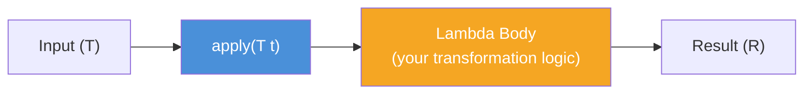

# 📘 Understanding Function Interface with Example

---

## 📌 Introduction

### 🧠 What is this about?

The `Function<T, R>` interface is one of Java 8's most important built-in functional interfaces. It represents a **transformation** — you give it an input of type `T`, it performs some operation, and returns an output of type `R`. Think of it as a **converter** or **mapper**.

### 🌍 Real-World Problem First

Imagine you're building an application where you constantly need to transform data — convert strings to uppercase, extract lengths, parse numbers, format dates. Before Java 8, each transformation required either a utility method or a full anonymous class. With `Function`, you can treat transformations as **first-class values** — store them in variables, pass them around, and chain them together.

### ❓ Why does it matter?

- `Function` is the backbone of **Stream's `map()` operation** — every time you write `.map(...)`, you're passing a `Function`
- It enables **function composition** — chaining multiple transformations together with `andThen()` and `compose()`
- It replaces verbose transformation code with clean, reusable lambda expressions

### 🗺️ What we'll learn (Learning Map)

- The `Function<T, R>` interface and its `apply()` method
- Traditional anonymous class vs. lambda approach
- Writing real transformations (uppercase, string reversal)
- How `Function` powers Stream operations

---

## 🧩 Concept 1: The `Function<T, R>` Interface

### 🧠 Layer 1: The Simple Version

`Function` is like a **machine with one input slot and one output slot**. You put something in, it does its work, and something (possibly different) comes out. The input type (`T`) and output type (`R`) can be different — that's what makes it a *function*.

### 🔍 Layer 2: The Developer Version

`Function<T, R>` is a generic functional interface in `java.util.function` with:

- **`T`** — the type of the input argument
- **`R`** — the type of the result
- **`apply(T t)`** — the single abstract method that takes `T` and returns `R`

It also provides three additional methods: `andThen()`, `compose()`, and `identity()` — which we'll explore in the next lectures.

```java
@FunctionalInterface
public interface Function<T, R> {
    R apply(T t);               // Core method — transform T into R
    // + default: andThen(), compose()
    // + static: identity()
}
```

### 🌍 Layer 3: The Real-World Analogy

| Analogy (Currency Converter Machine) | Function Interface |
|---|---|
| You insert USD (input) | `T` — the input type |
| The machine converts it | `apply()` — the transformation logic |
| EUR comes out (output) | `R` — the result type |
| The conversion rate | The lambda body (the actual logic) |
| Different machines for USD→EUR, USD→GBP | Different `Function` instances with different lambdas |

### ⚙️ Layer 4: How It Works Internally



**Step 1 — Define:** You create a `Function<T, R>` and assign a lambda that describes the transformation.

**Step 2 — Call `apply()`:** When you call `apply(input)`, it executes your lambda body with the input.

**Step 3 — Get result:** The lambda returns the transformed value as type `R`.

### 💻 Layer 5: Code — Prove It!

**❌ Before Java 8 — Anonymous Inner Class (Verbose):**

```java
Function<String, String> toUppercase = new Function<String, String>() {
    @Override
    public String apply(String s) {
        return s.toUpperCase();
    }
};
String result = toUppercase.apply("ramesh");
System.out.println(result);  // Output: RAMESH
```

That's **6 lines** for a single transformation.

**✅ After Java 8 — Lambda Expression (Clean):**

```java
Function<String, String> toUppercase = message -> message.toUpperCase();

String result = toUppercase.apply("ramesh");
System.out.println(result);  // Output: RAMESH
```

**Two lines.** Same result. The lambda `message -> message.toUpperCase()` becomes the implementation of `apply()`.

> 💡 **Why this works:** Since `Function` has exactly one abstract method (`apply`), the compiler knows the lambda maps to `apply`. The parameter `message` maps to `apply`'s parameter `T`, and the body `message.toUpperCase()` is the return value `R`.

---

> Now that we've seen the basic `apply()` usage, let's try a more interesting transformation — **reversing a string**.

---

## 🧩 Concept 2: Building Real Transformations

### 🧠 Layer 1: The Simple Version

A `Function` isn't limited to simple operations. You can put **any transformation logic** inside the lambda body — string manipulation, calculations, object conversions, anything.

### 💻 Layer 5: Code — Prove It!

**🔍 Example: Reverse a String**

```java
Function<String, String> reverseString = str ->
    new StringBuilder(str).reverse().toString();

System.out.println(reverseString.apply("Hello"));
// Output: olleH

System.out.println(reverseString.apply("Java"));
// Output: avaJ
```

**How it works:**
1. `str` is the input string (type `T` = `String`)
2. `new StringBuilder(str)` wraps it in a mutable builder
3. `.reverse()` reverses the character sequence in-place
4. `.toString()` converts back to a `String` (type `R` = `String`)

**🔍 Example: Different Input and Output Types**

The power of `Function<T, R>` is that `T` and `R` can be **different types**:

```java
// Input: String, Output: Integer
Function<String, Integer> stringLength = str -> str.length();

System.out.println(stringLength.apply("Hello World"));
// Output: 11

// Input: Integer, Output: String
Function<Integer, String> intToHex = num -> "0x" + Integer.toHexString(num);

System.out.println(intToHex.apply(255));
// Output: 0xff
```

### 📊 Layer 6: Function vs. Manual Approach

| Aspect | Manual Methods | Function Interface |
|--------|---------------|-------------------|
| Reusability | Must call specific method name | Store in variable, pass around |
| Composability | Nested method calls | Chain with `andThen()` / `compose()` |
| Flexibility | Fixed at compile time | Swap implementations at runtime |
| Stream integration | Adapter needed | Direct `map()` argument |

**Why use `Function` over a regular method?** A regular method is tied to its class. A `Function` is a **value** — you can store it in a variable, put it in a `Map`, pass it as a parameter, or return it from another method. This is the essence of "functions as first-class citizens."

---

### ⚠️ Pitfalls & Mistakes

**Mistake 1: Forgetting that `T` and `R` can be different**

```java
// ❌ Don't force same types when they should differ
Function<String, String> getLength = str -> str.length();
// Compile Error: int cannot be converted to String
```

```java
// ✅ Match the return type correctly
Function<String, Integer> getLength = str -> str.length();
System.out.println(getLength.apply("Hello"));  // Output: 5
```

**Why it breaks:** `str.length()` returns an `int`, but the function declares its return type `R` as `String`. The types must align.

---

### 💡 Pro Tips

**Tip 1:** Use method references for cleaner code when the lambda just delegates to an existing method.

```java
// Lambda
Function<String, String> upper = str -> str.toUpperCase();

// Method reference — even cleaner
Function<String, String> upper = String::toUpperCase;
```

- Why it works: `String::toUpperCase` is shorthand for `str -> str.toUpperCase()`
- When to use: Whenever your lambda simply calls a single existing method

---

### ✅ Key Takeaways

→ `Function<T, R>` represents a **transformation** — input type `T`, output type `R`

→ The core method is **`apply(T t)`** — it executes the transformation and returns the result

→ Lambda expressions replace verbose anonymous class implementations — **2 lines instead of 6**

→ `T` and `R` can be **different types** — that's the whole point (e.g., `String` → `Integer`)

→ `Function` objects are values — **store them, pass them, compose them**

---

### 🔗 What's Next?

> We've now created individual `Function` instances. But what if you want to apply **two transformations in sequence** — like first convert to uppercase, then get the length? That's where `andThen()` comes in. Let's see how to **chain functions** together.
