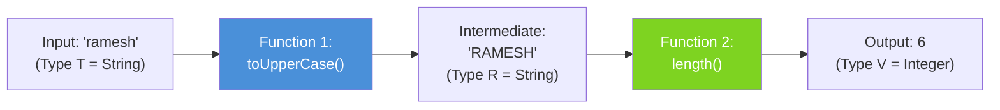

# 📘 Function andThen() Method with Example

---

## 📌 Introduction

### 🧠 What is this about?

The `andThen()` method lets you **chain two functions together** into a pipeline. First, the current function runs. Then, the second function runs on the **result** of the first. It's like an assembly line — step 1 finishes, passes its output to step 2.

### 🌍 Real-World Problem First

Imagine you need to: (1) convert a user's name to uppercase, then (2) count the characters. Without chaining, you'd call one function, capture the result, then call the second function. With `andThen()`, you build a **single composed function** that does both steps — no intermediate variables needed.

### ❓ Why does it matter?

- Enables **function composition** — building complex transformations from simple building blocks
- Eliminates intermediate variables and makes data pipelines clean
- This is exactly how Stream's `map().map()` chains work under the hood

### 🗺️ What we'll learn (Learning Map)

- How `andThen()` chains two functions
- The execution order (current → after)
- Building multi-step transformation pipelines

---

## 🧩 Concept 1: How `andThen()` Works

### 🧠 Layer 1: The Simple Version

`andThen()` is like saying: **"Do this first, THEN do that."** You connect two machines — the output of the first machine feeds directly into the input of the second machine.

### 🔍 Layer 2: The Developer Version

The signature: `Function<T, R>.andThen(Function<R, V>)` returns `Function<T, V>`

- **Current function:** `T → R` (takes T, produces R)
- **After function:** `R → V` (takes R, produces V)
- **Composed result:** `T → V` (takes T, produces V — R is the hidden intermediate)

The execution order:
1. **First:** the current function applies → produces intermediate result
2. **Then:** the `after` function applies to that intermediate result → produces final result

### 🌍 Layer 3: The Real-World Analogy

| Analogy (Factory Assembly Line) | andThen() |
|---|---|
| Station 1: Raw material → painted part | First function: `String → String` (toUpperCase) |
| Conveyor belt carries painted part to Station 2 | Intermediate result passed automatically |
| Station 2: Painted part → measured and labeled | After function: `String → Integer` (length) |
| Final product comes off the line | Composed function: `String → Integer` |

### ⚙️ Layer 4: How It Works Internally (Step-by-Step)



**Step 1 — First function executes:** Input `"ramesh"` → `toUpperCase()` → `"RAMESH"`

**Step 2 — Result flows to second function:** `"RAMESH"` → `length()` → `6`

**Step 3 — Final result returned:** The composed function returns `6`

### 💻 Layer 5: Code — Prove It!

**🔍 Defining Two Separate Functions:**

```java
// Function 1: Convert string to uppercase
Function<String, String> toUpperCase = str -> str.toUpperCase();

// Function 2: Calculate string length
Function<String, Integer> stringLength = str -> str.length();
```

**🔍 Chaining with andThen():**

```java
// Chain: toUpperCase THEN stringLength
Function<String, Integer> uppercaseThenLength = toUpperCase.andThen(stringLength);

int length = uppercaseThenLength.apply("ramesh");
System.out.println(length);  // Output: 6
```

**What happens step by step:**
1. `toUpperCase.apply("ramesh")` → `"RAMESH"` (intermediate)
2. `stringLength.apply("RAMESH")` → `6` (final)

**🔍 You Can Chain More Than Two:**

```java
Function<String, String> trim = str -> str.trim();
Function<String, String> toUpper = str -> str.toUpperCase();
Function<String, Integer> length = str -> str.length();

// Chain three operations: trim → uppercase → length
Function<String, Integer> pipeline = trim
    .andThen(toUpper)
    .andThen(length);

int result = pipeline.apply("  hello  ");
System.out.println(result);  // Output: 5
// "  hello  " → "hello" → "HELLO" → 5
```

> 💡 **The Aha Moment:** Each `andThen()` creates a **new** composed function. The original functions (`trim`, `toUpper`, `length`) are not modified. This is a functional programming principle — **functions are immutable**.

---

### ⚠️ Pitfalls & Mistakes

**Mistake 1: Type Mismatch Between Functions**

```java
Function<String, String> toUpper = str -> str.toUpperCase();
Function<Integer, String> intToString = num -> "Number: " + num;

// ❌ Compile Error! toUpper returns String, but intToString expects Integer
Function<String, String> broken = toUpper.andThen(intToString);
```

**Why it breaks:** `andThen(after)` requires the `after` function's input type to match the current function's output type. Here, `toUpper` outputs `String`, but `intToString` expects `Integer`.

**✅ The Fix — Ensure types align:**

```java
Function<String, String> toUpper = str -> str.toUpperCase();
Function<String, Integer> length = str -> str.length();  // Input = String ✅

Function<String, Integer> correct = toUpper.andThen(length);
```

---

### 💡 Pro Tips

**Tip 1:** Think of `andThen()` as reading **left to right** — the natural English order: "do A, then do B."

```java
// Read left-to-right: trim → uppercase → length
Function<String, Integer> pipeline = trim.andThen(toUpper).andThen(length);
```

- Why it works: `andThen()` preserves the chronological order of operations
- When to use: When you want your code to read like a step-by-step recipe

---

### ✅ Key Takeaways

→ `andThen()` chains two functions: **current function executes first**, then the **after function** runs on its result

→ The type signature is `Function<T,R>.andThen(Function<R,V>)` → returns `Function<T,V>` — the intermediate type `R` is hidden

→ You can chain **multiple** `andThen()` calls to build longer pipelines

→ The original functions are **never modified** — `andThen()` returns a new composed function

→ Types must align: the output of function 1 must match the input of function 2

---

### 🔗 What's Next?

> `andThen()` runs in left-to-right order (current → after). But what if you want to **pre-process the input** before the main function runs? That's exactly what `compose()` does — it reverses the order. Let's see how.
