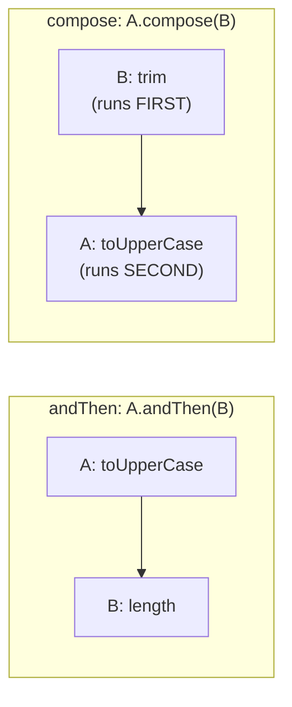

# 📘 Function compose() Method with Example

---

## 📌 Introduction

### 🧠 What is this about?

The `compose()` method is the **mirror image** of `andThen()`. While `andThen()` runs the current function first and then the after function, `compose()` runs the **before function first**, then the current function. It's for when you need to **pre-process the input** before applying the main transformation.

### 🌍 Real-World Problem First

You have a function that converts text to uppercase. But the incoming text has leading/trailing whitespace. You need to **trim first, then uppercase**. With `compose()`, you tell your uppercase function: "Before you run, run this trim function on the input first."

### ❓ Why does it matter?

- Enables **input pre-processing** — clean data before the main transformation
- Provides the reverse execution order of `andThen()`
- Together, `andThen()` and `compose()` give you full control over function pipeline direction

### 🗺️ What we'll learn (Learning Map)

- How `compose()` works (reverse of `andThen()`)
- When to use `compose()` vs. `andThen()`
- Practical examples with string transformations

---

## 🧩 Concept 1: How `compose()` Works

### 🧠 Layer 1: The Simple Version

`compose()` is like saying: **"Do THAT first, then do this."** The **before** function runs first to prepare the input, then the **current** function runs on the prepared input.

### 🔍 Layer 2: The Developer Version

The signature: `Function<T, R>.compose(Function<V, T>)` returns `Function<V, R>`

- **Before function:** `V → T` (runs first, prepares the input)
- **Current function:** `T → R` (runs second, on the prepared input)
- **Composed result:** `V → R`

The execution order:
1. **First:** the `before` function applies → produces prepared input
2. **Then:** the current function applies to the prepared input → produces final result

### 🌍 Layer 3: The Real-World Analogy

| Analogy (Cooking) | compose() |
|---|---|
| Step 1: Wash vegetables (before) | Before function: `trim()` |
| Step 2: Cook vegetables (main) | Current function: `toUpperCase()` |
| compose = "wash, then cook" | `toUpperCase.compose(trim)` |

The cook says: "Before I can cook (my main job), the veggies need to be washed first."

### ⚙️ Layer 4: `andThen()` vs `compose()` — Side by Side



**The critical difference:**
- `a.andThen(b)` = run `a` first, then `b` → **left to right**
- `a.compose(b)` = run `b` first, then `a` → **right to left** (mathematical order)

> 💡 **The Aha Moment:** `compose()` follows the **mathematical notation** of function composition: `f(g(x))` means `g` runs first, then `f`. So `f.compose(g)` = `f(g(x))`. The `andThen()` is the programmer-friendly version that reads left-to-right.

### 💻 Layer 5: Code — Prove It!

**🔍 Define Two Functions:**

```java
// Function that trims whitespace
Function<String, String> trim = str -> str.trim();

// Function that converts to uppercase
Function<String, String> toUpperCase = str -> str.toUpperCase();
```

**🔍 Using compose():**

```java
// compose: trim runs FIRST, then toUpperCase
Function<String, String> trimThenUppercase = toUpperCase.compose(trim);

String result = trimThenUppercase.apply("  hello  ");
System.out.println(result);  // Output: HELLO
```

**What happens step by step:**
1. `trim.apply("  hello  ")` → `"hello"` (before function runs first)
2. `toUpperCase.apply("hello")` → `"HELLO"` (current function runs second)

**🔍 Same result with andThen() (for comparison):**

```java
// andThen: trim runs FIRST, then toUpperCase — same result, different syntax
Function<String, String> trimThenUppercase = trim.andThen(toUpperCase);

String result = trimThenUppercase.apply("  hello  ");
System.out.println(result);  // Output: HELLO
```

Both produce the same result! The difference is the **reading direction**:
- `toUpperCase.compose(trim)` → "toUpperCase, but compose with trim running first"
- `trim.andThen(toUpperCase)` → "trim, and then toUpperCase"

---

## 🧩 Concept 2: When to Use `compose()` vs `andThen()`

### 📊 Comparison

| Aspect | `andThen()` | `compose()` |
|--------|-------------|-------------|
| Execution order | Current → After | Before → Current |
| Reading direction | Left to right | Right to left (mathematical) |
| Mental model | "Do A, then B" | "Before A, do B" |
| Common use | Building pipelines | Pre-processing input |
| Equivalent | `a.andThen(b)` | `b.andThen(a)` |

**Why both exist?** They express **different intent**. `andThen()` says "I'm building a pipeline, step by step." `compose()` says "I have a main function, but I need to pre-process the input first." In practice, most developers prefer `andThen()` because it reads more naturally left-to-right.

```java
// These two are IDENTICAL in behavior:
Function<String, String> pipeline1 = trim.andThen(toUpperCase);
Function<String, String> pipeline2 = toUpperCase.compose(trim);

// Both: "  hello  " → "hello" → "HELLO"
```

---

### 💡 Pro Tips

**Tip 1:** Prefer `andThen()` for readability in most cases. Use `compose()` only when you want to emphasize pre-processing intent.

- Why: `andThen()` reads like English (left-to-right), while `compose()` reads like math (right-to-left)
- When to use `compose()`: When decorating an existing function — "I have a main function, and I want to add pre-processing to it"

---

### ✅ Key Takeaways

→ `compose()` runs the **before function first**, then the **current function** — the reverse of `andThen()`

→ `a.compose(b)` is equivalent to `b.andThen(a)` — same result, different perspective

→ `compose()` follows **mathematical function composition**: `f.compose(g)` = `f(g(x))`

→ In practice, prefer `andThen()` for readability — it reads left-to-right like a pipeline

→ Use `compose()` when you want to express **pre-processing** before a main transformation

---

### 🔗 What's Next?

> We've covered `apply()`, `andThen()`, and `compose()`. There's one more utility in the `Function` toolbox: **`identity()`** — a function that does absolutely nothing to its input. Sounds useless? It's surprisingly handy. Let's see why.
