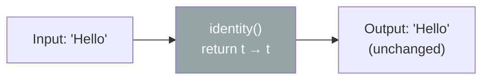

# 📘 Function identity() Method with Example

---

## 📌 Introduction

### 🧠 What is this about?

`Function.identity()` is a static method that returns a function which **does absolutely nothing** to its input — it returns exactly what it receives. It sounds useless at first, but it's a crucial utility in functional programming pipelines.

### 🌍 Real-World Problem First

Imagine you have a method that accepts a `Function<T, T>` as a parameter to optionally transform data. Sometimes you **don't want any transformation** — you just want the data passed through untouched. You can't pass `null` (that would cause a `NullPointerException`). Instead, you pass `Function.identity()` — a safe "do nothing" function.

### ❓ Why does it matter?

- Serves as a **no-op placeholder** in functional pipelines
- Commonly used in `Collectors.toMap()` when the key or value is the element itself
- Avoids null checks in APIs that require a `Function` parameter

### 🗺️ What we'll learn (Learning Map)

- What `identity()` returns and how it works
- Where `identity()` is used in real code
- `identity()` vs. writing `x -> x`

---

## 🧩 Concept 1: What `identity()` Does

### 🧠 Layer 1: The Simple Version

`identity()` is like a **transparent pipe** — whatever goes in comes out unchanged. Water in, water out. String in, same string out.

### 🔍 Layer 2: The Developer Version

```java
// This is literally what identity() returns:
Function<T, T> identity = t -> t;
```

It's a static factory method on the `Function` interface that returns a `Function` which simply returns its input. The input type and output type are always the same (`T`).

### ⚙️ Layer 4: How It Works Internally

If you look at the JDK source code:

```java
static <T> Function<T, T> identity() {
    return t -> t;  // That's it. That's the whole implementation.
}
```



### 💻 Layer 5: Code — Prove It!

**🔍 Basic Usage:**

```java
Function<String, String> identity = Function.identity();

String result = identity.apply("Hello");
System.out.println(result);  // Output: Hello  (unchanged)
```

**🔍 Where It's Actually Useful — `Collectors.toMap()`:**

```java
List<String> names = List.of("Alice", "Bob", "Charlie");

// Create a map where key = name, value = name (identity)
Map<String, String> nameMap = names.stream()
    .collect(Collectors.toMap(
        Function.identity(),  // key = the element itself
        Function.identity()   // value = the element itself
    ));
// Output: {Alice=Alice, Bob=Bob, Charlie=Charlie}
```

**🔍 As a Default/No-Op in Optional Transformations:**

```java
public static <T> List<T> processList(List<T> items, Function<T, T> transform) {
    return items.stream().map(transform).collect(Collectors.toList());
}

// Sometimes you want transformation:
processList(names, String::toUpperCase);  // ["ALICE", "BOB", "CHARLIE"]

// Sometimes you want NO transformation:
processList(names, Function.identity());  // ["Alice", "Bob", "Charlie"] — untouched
```

### 📊 `identity()` vs `x -> x`

| Aspect | `Function.identity()` | `x -> x` |
|--------|----------------------|----------|
| Readability | Clear intent: "pass through" | Requires reader to parse |
| Object creation | May reuse the same instance | Creates a new lambda each time |
| Convention | Standard, well-known | Ad-hoc |
| Meaning | "I explicitly want no transformation" | "I happen to return the input" |

**Why prefer `Function.identity()`?** It communicates **intent**. When another developer sees `Function.identity()`, they immediately know: "this is a deliberate pass-through." When they see `x -> x`, they have to stop and think about whether it's intentionally doing nothing or is incomplete code.

---

### ✅ Key Takeaways

→ `Function.identity()` returns a function that **returns its input unchanged** — equivalent to `t -> t`

→ It's a **static method** — called as `Function.identity()`, not on an instance

→ Most common real-world use: **`Collectors.toMap()`** when the key or value is the element itself

→ Prefer `Function.identity()` over `x -> x` for **readability and intent**

→ It's the functional equivalent of a "no-op" — a safe placeholder when a `Function` is required but no transformation is needed

---

### 🔗 What's Next?

> We've now mastered the `Function` interface and all its methods. Next, we move to a different kind of functional interface — **`Predicate`**. Unlike `Function` which transforms data, `Predicate` **tests** data. It takes an input and returns `true` or `false`. It's the backbone of filtering and validation in Java 8.
