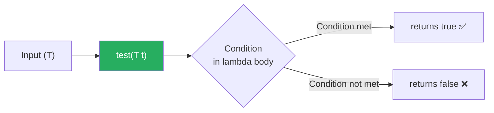

# 📘 Understanding Predicate Interface with Example

---

## 📌 Introduction

### 🧠 What is this about?

The `Predicate<T>` interface represents a **condition** — a yes/no question about a value. You give it an input, and it returns `true` or `false`. It's the functional interface behind every `filter()` call in Streams and every validation check in modern Java.

### 🌍 Real-World Problem First

You're building a user registration system. You need to validate input: Is the email non-empty? Is the password long enough? Is the age above 18? Each of these is a **condition** — a function that takes an input and returns a boolean. Before Java 8, you'd write separate `if` blocks or utility methods for each check. With `Predicate`, each condition becomes a **reusable, composable object** that you can combine with `and()`, `or()`, and `negate()`.

### ❓ Why does it matter?

- `Predicate` is the backbone of **Stream's `filter()`** operation
- Enables **composable validation** — combine conditions with `and()`, `or()`, `negate()`
- Makes filtering logic **reusable** and **testable** as standalone objects

### 🗺️ What we'll learn (Learning Map)

- The `Predicate<T>` interface and its `test()` method
- How predicates represent boolean conditions
- Writing predicates with lambda expressions

---

## 🧩 Concept 1: The `Predicate<T>` Interface

### 🧠 Layer 1: The Simple Version

A `Predicate` is like a **gatekeeper**. It looks at each item and says "yes, you pass" (`true`) or "no, you don't" (`false`). Streams use predicates to decide which elements to keep and which to discard.

### 🔍 Layer 2: The Developer Version

`Predicate<T>` is a functional interface in `java.util.function` with:

- **`T`** — the type of the input to test
- **`test(T t)`** — the single abstract method: evaluates the condition and returns `boolean`
- Additional methods: `and()`, `or()`, `negate()`, `isEqual()` (covered in next lectures)

```java
@FunctionalInterface
public interface Predicate<T> {
    boolean test(T t);           // Core method — returns true or false
    // + default: and(), or(), negate()
    // + static: isEqual()
}
```

### 🌍 Layer 3: The Real-World Analogy

| Analogy (Airport Security) | Predicate Interface |
|---|---|
| The security scanner | The `Predicate` instance |
| Each passenger (input) | The value of type `T` |
| "Clear to board" / "Flagged for check" | `true` / `false` |
| Scanning criteria (metal detection rules) | The lambda body (your condition logic) |
| Only cleared passengers board | Only `true` elements pass through `filter()` |

### ⚙️ Layer 4: How It Works



**Step 1 — Define:** You create a `Predicate<T>` and assign a lambda that expresses your condition.

**Step 2 — Call `test()`:** When you call `test(input)`, it evaluates the condition against the input.

**Step 3 — Get boolean result:** Returns `true` if the condition holds, `false` otherwise.

### 💻 Layer 5: Code — Prove It!

**🔍 Basic Predicate — Is a Number Greater Than 10?**

```java
Predicate<Integer> isGreaterThanTen = num -> num > 10;

System.out.println(isGreaterThanTen.test(15));  // Output: true
System.out.println(isGreaterThanTen.test(5));   // Output: false
System.out.println(isGreaterThanTen.test(10));  // Output: false (not greater, equal)
```

**🔍 Predicate for String Validation:**

```java
Predicate<String> isNotEmpty = str -> !str.isEmpty();

System.out.println(isNotEmpty.test("Hello"));  // Output: true
System.out.println(isNotEmpty.test(""));        // Output: false
```

**🔍 Predicate with Streams — Filtering:**

```java
List<Integer> numbers = List.of(3, 8, 12, 5, 20, 1, 15);

Predicate<Integer> isGreaterThanTen = num -> num > 10;

List<Integer> filtered = numbers.stream()
    .filter(isGreaterThanTen)  // Only keep numbers > 10
    .collect(Collectors.toList());

System.out.println(filtered);  // Output: [12, 20, 15]
```

> 💡 **The Aha Moment:** Notice that `filter()` takes a `Predicate`. Every time you write `.filter(x -> x > 10)`, you're creating an inline `Predicate`. By naming it (`isGreaterThanTen`), you make it **reusable and self-documenting**.

---

### 📊 Function vs. Predicate

| Aspect | `Function<T, R>` | `Predicate<T>` |
|--------|------------------|----------------|
| Purpose | Transform data | Test a condition |
| Returns | Any type `R` | Always `boolean` |
| Core method | `apply(T)` | `test(T)` |
| Stream usage | `map()` | `filter()` |
| Composition | `andThen()`, `compose()` | `and()`, `or()`, `negate()` |

**Why separate interfaces?** You could technically use `Function<T, Boolean>` instead of `Predicate<T>`. But `Predicate` provides **boolean-specific composition methods** (`and()`, `or()`, `negate()`) that `Function` doesn't have. It also avoids autoboxing (`boolean` vs `Boolean`), which matters for performance.

---

### ⚠️ Pitfalls & Mistakes

**Mistake 1: Using `==` instead of `.equals()` for object comparison inside predicates**

```java
// ❌ This compares references, not content!
Predicate<String> isJava = str -> str == "Java";
System.out.println(isJava.test(new String("Java")));  // Output: false (different object!)
```

```java
// ✅ Use .equals() for content comparison
Predicate<String> isJava = str -> str.equals("Java");
System.out.println(isJava.test(new String("Java")));  // Output: true
```

**Why it breaks:** `==` compares **memory addresses** (are they the same object?). `.equals()` compares **content** (do they hold the same value?). `new String("Java")` creates a new object at a different address, so `==` returns `false`.

---

### ✅ Key Takeaways

→ `Predicate<T>` represents a **boolean condition** — takes input, returns `true` or `false`

→ The core method is **`test(T t)`** — evaluates the condition against the input

→ It's the functional interface behind **`Stream.filter()`**

→ Name your predicates for reusability and readability: `isGreaterThanTen` is clearer than `x -> x > 10` everywhere

→ Additional methods `and()`, `or()`, `negate()` enable **boolean composition** (coming next)

---

### 🔗 What's Next?

> A single predicate tests one condition. But real-world validation often needs **multiple conditions combined** — "Is the string non-empty AND longer than 5 characters?" That's where `and()` comes in. Let's see how to combine predicates.
