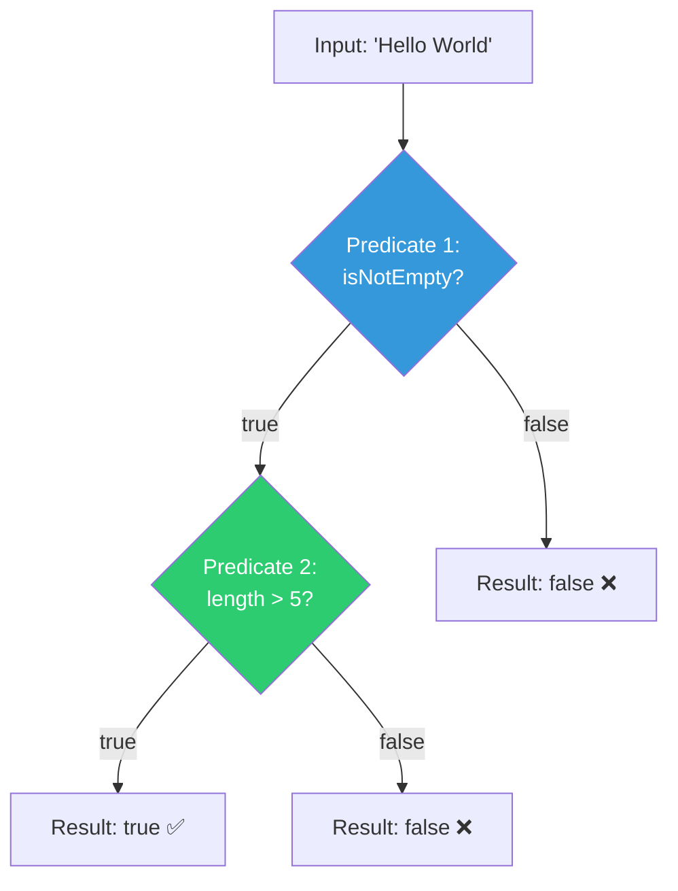

# 📘 Predicate and() Method with Example

---

## 📌 Introduction

### 🧠 What is this about?

The `and()` method combines two predicates using **logical AND**. The composed predicate returns `true` **only if both** conditions are `true`. If either one is `false`, the result is `false`. It's the predicate equivalent of the `&&` operator.

### 🌍 Real-World Problem First

You're validating user input for a username: it must be **non-empty** AND **longer than 5 characters**. Instead of cramming both checks into one predicate, you write two clean, reusable predicates and combine them with `and()`.

### ❓ Why does it matter?

- Enables **composable validation** — build complex conditions from simple, reusable pieces
- Each predicate stays **single-responsibility** — tests one thing only
- The composed predicate can be passed to `filter()`, reused, and tested independently

### 🗺️ What we'll learn (Learning Map)

- How `and()` combines two predicates
- The logical AND truth table
- Building multi-condition validation with `and()`

---

## 🧩 Concept 1: Combining Predicates with `and()`

### 🧠 Layer 1: The Simple Version

`and()` is like two security checkpoints. You must pass **both** to get through. Fail either one, and you're stopped.

### 🔍 Layer 2: The Developer Version

The signature: `Predicate<T>.and(Predicate<T> other)` returns `Predicate<T>`

The internal logic is essentially:
```java
return (t) -> this.test(t) && other.test(t);
```

It evaluates the first predicate, and **only if it's true**, evaluates the second. This is **short-circuit evaluation** — if the first is `false`, the second is never called.

### 🌍 Layer 3: The Real-World Analogy

| Analogy (Two-Factor Authentication) | Predicate.and() |
|---|---|
| Check 1: Correct password? | Predicate 1: `isNotEmpty` |
| Check 2: Correct OTP? | Predicate 2: `hasMoreThanFiveChars` |
| Both must pass to log in | Both must return `true` for `and()` to return `true` |
| If password wrong → don't even check OTP | Short-circuit: if first is `false`, skip second |

### ⚙️ Layer 4: How It Works



**Logical AND Truth Table:**

| Predicate 1 | Predicate 2 | `and()` Result |
|:-----------:|:-----------:|:--------------:|
| `true` | `true` | `true` ✅ |
| `true` | `false` | `false` ❌ |
| `false` | `true` | `false` ❌ |
| `false` | `false` | `false` ❌ |

**Both** must be `true`. Any `false` → result is `false`.

### 💻 Layer 5: Code — Prove It!

**🔍 Define Two Predicates:**

```java
// Predicate 1: Check if string is not empty
Predicate<String> isNotEmpty = str -> !str.isEmpty();

// Predicate 2: Check if string has more than 5 characters
Predicate<String> hasMoreThanFiveChars = str -> str.length() > 5;
```

**🔍 Combine with and():**

```java
// Both conditions must be true
Predicate<String> isValid = isNotEmpty.and(hasMoreThanFiveChars);

System.out.println(isValid.test("Hello World"));  // Output: true  (non-empty AND length > 5)
System.out.println(isValid.test("Hi"));            // Output: false (non-empty BUT length ≤ 5)
System.out.println(isValid.test(""));              // Output: false (empty — first check fails)
```

**🔍 Chaining Multiple and() Calls:**

```java
Predicate<String> isNotEmpty = str -> !str.isEmpty();
Predicate<String> hasMoreThanFive = str -> str.length() > 5;
Predicate<String> startsWithH = str -> str.startsWith("H");

// All three conditions must be true
Predicate<String> strictCheck = isNotEmpty
    .and(hasMoreThanFive)
    .and(startsWithH);

System.out.println(strictCheck.test("Hello World"));  // Output: true
System.out.println(strictCheck.test("Hello"));          // Output: false (length ≤ 5)
System.out.println(strictCheck.test("Goodbye World"));  // Output: false (doesn't start with H)
```

**🔍 Using with Streams:**

```java
List<String> names = List.of("Alice", "Bo", "", "Charlotte", "Dan", "Elizabeth");

List<String> validNames = names.stream()
    .filter(isNotEmpty.and(hasMoreThanFive))
    .collect(Collectors.toList());

System.out.println(validNames);  // Output: [Charlotte, Elizabeth]
```

---

### 💡 Pro Tips

**Tip 1:** Order your `and()` predicates with the **cheapest/most-likely-to-fail** check first.

```java
// ✅ Good: isEmpty() is O(1) and commonly fails — check it first
Predicate<String> isValid = isNotEmpty.and(hasMoreThanFiveChars);

// Avoidable: expensive regex check runs even on empty strings
Predicate<String> isValid = matchesRegex.and(isNotEmpty);
```

- Why it works: `and()` short-circuits — if the first predicate is `false`, the second never runs
- When to use: Always order by cost (cheapest first) or failure likelihood (most likely to fail first)

---

### ✅ Key Takeaways

→ `and()` combines two predicates with **logical AND** — both must be `true` for the result to be `true`

→ It **short-circuits**: if the first predicate is `false`, the second is never evaluated

→ You can chain **multiple `and()` calls** for multi-condition validation

→ Each predicate stays **single-responsibility** — combine them instead of writing monolithic conditions

→ Order predicates with the **cheapest or most-likely-to-fail** check first for efficiency

---

### 🔗 What's Next?

> `and()` requires ALL conditions to be true. But sometimes you need "at least one of these conditions." That's `or()` — let's see how it works.
