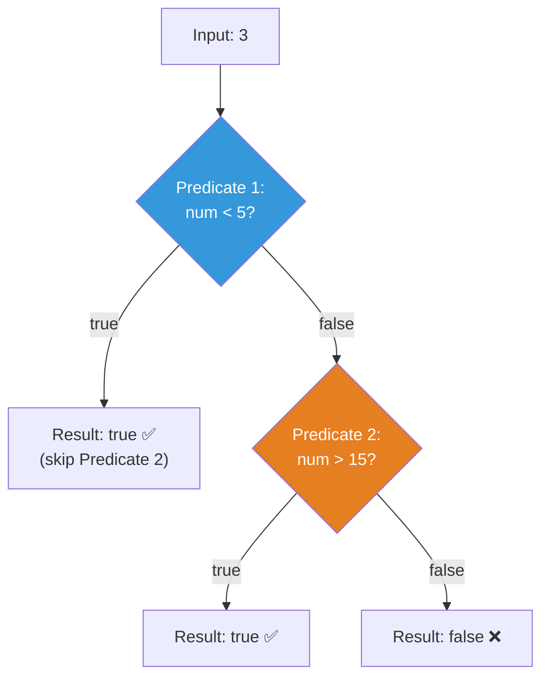

# 📘 Predicate or() Method with Example

---

## 📌 Introduction

### 🧠 What is this about?

The `or()` method combines two predicates using **logical OR**. The composed predicate returns `true` if **at least one** of the conditions is `true`. It returns `false` only when **both** are `false`. It's the predicate equivalent of the `||` operator.

### 🌍 Real-World Problem First

You're building a discount system: a customer qualifies for a discount if they are **under 18** (youth discount) OR **over 60** (senior discount). Either condition being `true` is enough. You don't need both — just one.

### ❓ Why does it matter?

- Enables "**any one of these conditions**" logic in a composable way
- Combined with `and()` and `negate()`, you can express **any boolean logic** as reusable predicates
- Essential for building flexible filtering criteria

### 🗺️ What we'll learn (Learning Map)

- How `or()` combines two predicates with logical OR
- The truth table and short-circuit behavior
- Practical filtering with `or()`

---

## 🧩 Concept 1: Combining Predicates with `or()`

### 🧠 Layer 1: The Simple Version

`or()` is like having **two doors** — you only need to get through **one** to enter. Pass either check, and you're in.

### 🔍 Layer 2: The Developer Version

The signature: `Predicate<T>.or(Predicate<T> other)` returns `Predicate<T>`

The internal logic is essentially:
```java
return (t) -> this.test(t) || other.test(t);
```

It evaluates the first predicate, and **if it's already true**, skips the second entirely. This is **short-circuit evaluation** — if the first is `true`, the result is `true` regardless of the second.

### ⚙️ Layer 4: How It Works



**Logical OR Truth Table:**

| Predicate 1 | Predicate 2 | `or()` Result |
|:-----------:|:-----------:|:-------------:|
| `true` | `true` | `true` ✅ |
| `true` | `false` | `true` ✅ |
| `false` | `true` | `true` ✅ |
| `false` | `false` | `false` ❌ |

**At least one** must be `true`. Only when **both** are `false` → result is `false`.

### 💻 Layer 5: Code — Prove It!

**🔍 Define Two Predicates:**

```java
// Predicate 1: Number is less than 5
Predicate<Integer> isLessThanFive = num -> num < 5;

// Predicate 2: Number is greater than 15
Predicate<Integer> isGreaterThanFifteen = num -> num > 15;
```

**🔍 Combine with or():**

```java
// Either condition can be true
Predicate<Integer> isOutsideRange = isLessThanFive.or(isGreaterThanFifteen);

System.out.println(isOutsideRange.test(3));   // Output: true  (3 < 5 ✅)
System.out.println(isOutsideRange.test(20));  // Output: true  (20 > 15 ✅)
System.out.println(isOutsideRange.test(10));  // Output: false (neither condition met)
```

**🔍 Using with Streams — Filtering:**

```java
List<Integer> numbers = List.of(1, 3, 7, 10, 12, 18, 25);

List<Integer> outsideRange = numbers.stream()
    .filter(isLessThanFive.or(isGreaterThanFifteen))
    .collect(Collectors.toList());

System.out.println(outsideRange);  // Output: [1, 3, 18, 25]
```

**🔍 Combining and() with or():**

```java
Predicate<Integer> isPositive = num -> num > 0;
Predicate<Integer> isEven = num -> num % 2 == 0;
Predicate<Integer> isGreaterThan100 = num -> num > 100;

// Must be positive AND (even OR greater than 100)
Predicate<Integer> complex = isPositive.and(isEven.or(isGreaterThan100));

System.out.println(complex.test(4));    // Output: true  (positive AND even)
System.out.println(complex.test(150));  // Output: true  (positive AND > 100)
System.out.println(complex.test(-2));   // Output: false (not positive)
System.out.println(complex.test(7));    // Output: false (positive but neither even nor > 100)
```

---

### 📊 and() vs or() Comparison

| Aspect | `and()` | `or()` |
|--------|---------|--------|
| Logic | Logical AND (`&&`) | Logical OR (`\|\|`) |
| Returns `true` when | **Both** conditions are `true` | **At least one** condition is `true` |
| Returns `false` when | **Any** condition is `false` | **Both** conditions are `false` |
| Short-circuits on | First `false` | First `true` |
| Use case | "Must satisfy ALL requirements" | "Must satisfy ANY requirement" |

**Why both exist as separate methods:** Together, `and()` and `or()` let you build any boolean expression as composable, reusable predicate objects. You get the full power of boolean algebra without writing monolithic `if` statements.

---

### ✅ Key Takeaways

→ `or()` combines two predicates with **logical OR** — at least one must be `true`

→ It **short-circuits**: if the first predicate is `true`, the second is never evaluated

→ Combine `and()` and `or()` for complex conditions: `isPositive.and(isEven.or(isLarge))`

→ Each predicate stays focused on **one condition** — compose them for complex logic

---

### 🔗 What's Next?

> We've covered combining predicates with `and()` and `or()`. But what about **flipping** a predicate — turning "is empty" into "is NOT empty"? That's what `negate()` does. We'll also look at `isEqual()` for simple equality checks. Let's go!
