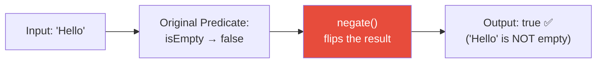
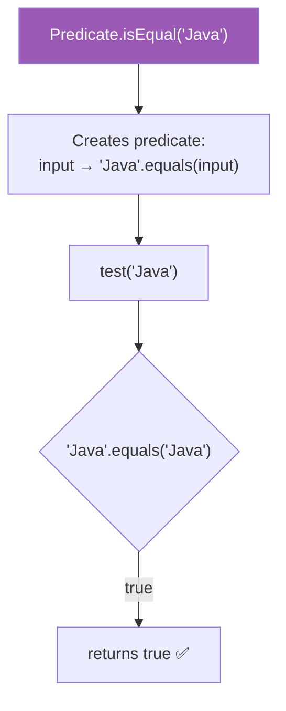
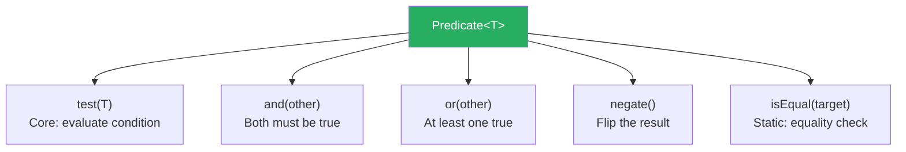

# 📘 Predicate negate() and isEqual() Methods with Example

---

## 📌 Introduction

### 🧠 What is this about?

This lecture covers two utility methods on `Predicate`:
- **`negate()`** — flips a predicate's result (`true` becomes `false`, `false` becomes `true`)
- **`isEqual()`** — creates a predicate that checks if the input equals a target object

Together with `and()` and `or()`, these complete the full toolkit for predicate composition.

### ❓ Why does it matter?

- `negate()` lets you **reuse existing predicates** for the opposite condition without rewriting logic
- `isEqual()` provides a clean, functional way to create **equality checks** as predicates
- Both eliminate redundant code and keep your predicate library DRY

### 🗺️ What we'll learn (Learning Map)

- `negate()` — reversing predicate logic
- `isEqual()` — static equality predicate
- How `isEqual()` works internally (uses `.equals()`, not `==`)

---

## 🧩 Concept 1: The `negate()` Method

### 🧠 Layer 1: The Simple Version

`negate()` is like a **NOT switch** — it flips the answer. If the predicate says "yes," `negate()` says "no," and vice versa. You already have "is empty"? Great — now you automatically have "is NOT empty" without writing new logic.

### 🔍 Layer 2: The Developer Version

The signature: `Predicate<T>.negate()` returns `Predicate<T>`

Internally, it's simply:
```java
return (t) -> !this.test(t);
```

It wraps the original predicate and applies logical NOT to its result.

### ⚙️ Layer 4: How It Works



| Original `test()` | After `negate()` |
|:-----------------:|:----------------:|
| `true` | `false` |
| `false` | `true` |

### 💻 Layer 5: Code — Prove It!

**🔍 Building "is NOT empty" from "is empty":**

```java
// Original predicate: checks if string IS empty
Predicate<String> isEmpty = str -> str.isEmpty();

// Negated predicate: checks if string is NOT empty
Predicate<String> isNotEmpty = isEmpty.negate();

System.out.println(isNotEmpty.test("Hello"));  // Output: true  (not empty)
System.out.println(isNotEmpty.test(""));        // Output: false (is empty)
```

**Why this is powerful:** You wrote the logic **once** (`isEmpty`). The opposite condition (`isNotEmpty`) is derived automatically. If the definition of "empty" ever changes (e.g., you also consider whitespace-only strings as empty), you update one predicate and the negated version updates automatically.

**🔍 Using negate() with Streams:**

```java
List<String> items = List.of("Java", "", "Spring", "", "Hibernate");

Predicate<String> isEmpty = String::isEmpty;

// Keep only non-empty strings
List<String> nonEmpty = items.stream()
    .filter(isEmpty.negate())
    .collect(Collectors.toList());

System.out.println(nonEmpty);  // Output: [Java, Spring, Hibernate]
```

---

> Now that we can flip predicates, let's look at creating equality predicates with `isEqual()`.

---

## 🧩 Concept 2: The `isEqual()` Method

### 🧠 Layer 1: The Simple Version

`isEqual()` creates a predicate that checks if the input **equals** a specific target value. It's a quick way to make an equality check without writing `str -> str.equals("Java")` yourself.

### 🔍 Layer 2: The Developer Version

The signature: `Predicate.isEqual(Object targetRef)` — a **static** method that returns `Predicate<T>`

Internally:
```java
public static <T> Predicate<T> isEqual(Object targetRef) {
    return (null == targetRef)
        ? Objects::isNull
        : targetRef::equals;  // Uses .equals(), NOT ==
}
```

**Key detail:** It uses **`.equals()`** for comparison, not `==`. This means it compares **content**, not memory addresses. It's also null-safe — if the target is `null`, it returns a predicate that checks for `null`.

### ⚙️ Layer 4: How It Works



### 💻 Layer 5: Code — Prove It!

**🔍 Basic Usage:**

```java
// Create a predicate that checks if input equals "Java"
Predicate<String> isJava = Predicate.isEqual("Java");

System.out.println(isJava.test("Java"));   // Output: true  (content matches)
System.out.println(isJava.test("java"));   // Output: false (case-sensitive!)
System.out.println(isJava.test("Python")); // Output: false
```

**🔍 Case-Sensitivity Matters:**

```java
Predicate<String> isJava = Predicate.isEqual("Java");

System.out.println(isJava.test("java"));  // Output: false
// Why? Because .equals() is case-sensitive for Strings
```

**🔍 isEqual() vs Manual Lambda:**

```java
// These are functionally equivalent:
Predicate<String> isJava1 = Predicate.isEqual("Java");
Predicate<String> isJava2 = str -> "Java".equals(str);

// Both produce the same results
System.out.println(isJava1.test("Java"));  // Output: true
System.out.println(isJava2.test("Java"));  // Output: true
```

**🔍 Combining isEqual() with Other Predicates:**

```java
Predicate<String> isJava = Predicate.isEqual("Java");
Predicate<String> isPython = Predicate.isEqual("Python");

// Is the input either Java or Python?
Predicate<String> isJavaOrPython = isJava.or(isPython);

System.out.println(isJavaOrPython.test("Java"));   // Output: true
System.out.println(isJavaOrPython.test("Python")); // Output: true
System.out.println(isJavaOrPython.test("Go"));     // Output: false
```

---

### 📊 Complete Predicate Methods Summary

| Method | Type | What It Does | Returns |
|--------|------|-------------|---------|
| `test(T)` | Abstract | Evaluates the condition | `boolean` |
| `and(Predicate)` | Default | Logical AND — both must be true | `Predicate<T>` |
| `or(Predicate)` | Default | Logical OR — at least one true | `Predicate<T>` |
| `negate()` | Default | Logical NOT — flips the result | `Predicate<T>` |
| `isEqual(Object)` | Static | Creates equality predicate (uses `.equals()`) | `Predicate<T>` |

**Why this toolkit is complete:** With `and()`, `or()`, and `negate()`, you have the three fundamental boolean operators (AND, OR, NOT). Any boolean expression can be built from these three. `isEqual()` adds a convenient shortcut for the most common predicate: equality checking.



---

### ⚠️ Pitfalls & Mistakes

**Mistake 1: Assuming `isEqual()` uses `==`**

```java
String str1 = new String("Java");
Predicate<String> isJava = Predicate.isEqual("Java");

// ✅ This works because isEqual() uses .equals(), not ==
System.out.println(isJava.test(str1));  // Output: true
```

If `isEqual()` used `==`, this would return `false` because `str1` and `"Java"` are different objects in memory. But it uses `.equals()`, which compares content.

---

### ✅ Key Takeaways

→ `negate()` **flips** a predicate's result — `true` → `false`, `false` → `true`

→ Use `negate()` to derive opposite conditions from existing predicates without duplicating logic

→ `Predicate.isEqual(target)` creates an equality predicate using **`.equals()`** (content comparison, not reference)

→ `isEqual()` is a **static** method — called as `Predicate.isEqual(target)`, not on an instance

→ With `test()`, `and()`, `or()`, `negate()`, and `isEqual()`, you have the **complete predicate toolkit**

---

### 🔗 What's Next?

> We've mastered the `Predicate` interface and all its composition methods. Now let's move to a fundamentally different functional interface — **`Supplier<T>`**. Unlike `Function` and `Predicate` which take input, `Supplier` takes **no input at all** — it just produces values. Think of it as a factory or a data generator.
