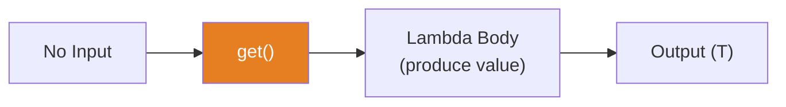
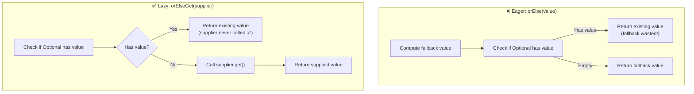

# 📘 Understanding Supplier Interface with Example

---

## 📌 Introduction

### 🧠 What is this about?

The `Supplier<T>` interface represents a **supplier of results** — it takes **no input** and **produces a value**. It's the simplest functional interface: no parameters, just output. Think of it as a factory, a data source, or a value generator.

### 🌍 Real-World Problem First

Imagine you're building a logging framework. You want to log the current timestamp whenever an event occurs, but you don't want to compute the timestamp unless the log level is actually enabled (expensive computation for nothing). With `Supplier`, you pass a "recipe" for computing the timestamp — it only runs when you actually need it. This is **lazy evaluation**.

### ❓ Why does it matter?

- Enables **lazy evaluation** — compute values only when needed
- Provides **default values** and **fallback mechanisms** (like `Optional.orElseGet()`)
- Serves as **factories** for creating objects on demand
- Used extensively in `Optional`, `Stream`, and logging APIs

### 🗺️ What we'll learn (Learning Map)

- The `Supplier<T>` interface and its `get()` method
- Supplying constant values and computed values
- Lazy evaluation pattern with `Supplier`

---

## 🧩 Concept 1: The `Supplier<T>` Interface

### 🧠 Layer 1: The Simple Version

A `Supplier` is like a **vending machine**. You don't put anything in — you just press a button and something comes out. No input, just output.

### 🔍 Layer 2: The Developer Version

`Supplier<T>` is a functional interface in `java.util.function` with:

- **`T`** — the type of the result
- **`get()`** — the single abstract method: takes nothing, returns `T`
- No other methods — it's the most minimal functional interface

```java
@FunctionalInterface
public interface Supplier<T> {
    T get();  // That's it. No input, just output.
}
```

### 🌍 Layer 3: The Real-World Analogy

| Analogy (Vending Machine) | Supplier Interface |
|---|---|
| No coins needed (free vending) | No input parameters |
| Press the button | Call `get()` |
| A drink comes out | Returns value of type `T` |
| Different machines for coffee, water, juice | Different `Supplier` instances for different data |
| Machine doesn't make the drink until you press the button | Value isn't computed until `get()` is called (lazy) |

### ⚙️ Layer 4: How It Works



### 💻 Layer 5: Code — Prove It!

**🔍 Supplying a Constant Value:**

```java
Supplier<String> constantSupplier = () -> "Hello World!";

String result = constantSupplier.get();
System.out.println(result);  // Output: Hello World!
```

Notice the lambda: `() -> "Hello World!"` — the empty `()` means **no parameters**. The body produces the value.

**🔍 Supplying the Current Date/Time:**

```java
Supplier<LocalDateTime> dateTimeSupplier = () -> LocalDateTime.now();

LocalDateTime currentDateTime = dateTimeSupplier.get();
System.out.println(currentDateTime);
// Output: 2024-01-15T14:30:45.123 (current date/time when called)
```

Every time you call `get()`, it computes a **fresh** value — `LocalDateTime.now()` runs at the moment of the call, not at the moment of definition.

**🔍 Supplying Random Numbers:**

```java
Supplier<Integer> randomSupplier = () -> new Random().nextInt(100);

System.out.println(randomSupplier.get());  // Output: 42 (random)
System.out.println(randomSupplier.get());  // Output: 73 (different random)
System.out.println(randomSupplier.get());  // Output: 15 (different random)
```

---

> Now that we see the basics, let's understand why `Supplier` is so powerful for **lazy evaluation**.

---

## 🧩 Concept 2: Lazy Evaluation with Supplier

### 🧠 Layer 1: The Simple Version

**Lazy evaluation** means "don't compute it until you actually need it." A `Supplier` holds a **recipe** for computing a value, not the value itself. The recipe only runs when you call `get()`.

### 🔍 Layer 2: The Developer Version

This is where `Supplier` shines in the JDK:

```java
// Optional.orElseGet() takes a Supplier — only computes fallback if value is absent
Optional<String> name = Optional.empty();
String result = name.orElseGet(() -> expensiveComputation());
// expensiveComputation() ONLY runs because 'name' is empty

Optional<String> name2 = Optional.of("Alice");
String result2 = name2.orElseGet(() -> expensiveComputation());
// expensiveComputation() is NEVER called — "Alice" is returned directly
```

Compare this with `orElse()` (no Supplier):

```java
// ❌ orElse() — always computes the fallback, even when not needed!
String result = name2.orElse(expensiveComputation());
// expensiveComputation() runs EVEN THOUGH "Alice" exists!
```

### ⚙️ Layer 4: Eager vs Lazy



### 💻 Layer 5: Code — Prove It!

```java
// Expensive operation — imagine a database call
Supplier<String> expensiveDefault = () -> {
    System.out.println("Computing expensive default...");
    return "Default Value";
};

Optional<String> present = Optional.of("Alice");
Optional<String> empty = Optional.empty();

// With a present value — supplier is NEVER called
String result1 = present.orElseGet(expensiveDefault);
// No output printed! Supplier was never invoked.
System.out.println(result1);  // Output: Alice

// With an empty value — supplier IS called
String result2 = empty.orElseGet(expensiveDefault);
// Output: Computing expensive default...
System.out.println(result2);  // Output: Default Value
```

---

### 📊 Supplier vs Function Comparison

| Aspect | `Supplier<T>` | `Function<T, R>` |
|--------|---------------|-------------------|
| Input | **None** | One value of type `T` |
| Output | Value of type `T` | Value of type `R` |
| Core method | `get()` | `apply(T)` |
| Analogy | Vending machine | Converter machine |
| Use case | Generate/provide data | Transform data |

**Why a separate interface?** You could use `Function<Void, T>`, but that's awkward (you'd have to pass `null`). `Supplier` makes the "no input" intent explicit and clean.

---

### ✅ Key Takeaways

→ `Supplier<T>` takes **no input** and returns a value of type `T` via its `get()` method

→ It's the simplest functional interface — just a **value factory**

→ **Lazy evaluation** is its superpower: the value isn't computed until `get()` is called

→ Used in `Optional.orElseGet()`, logging frameworks, and anywhere you need **deferred computation**

→ Prefer `orElseGet(supplier)` over `orElse(value)` when the fallback is expensive to compute

---

### 🔗 What's Next?

> We've seen `Supplier` producing constant and computed values. In the next lecture, we'll see a **real-world use case** — using `Supplier` to provide **default configurations** when custom settings aren't available. This is a common pattern in enterprise applications.
