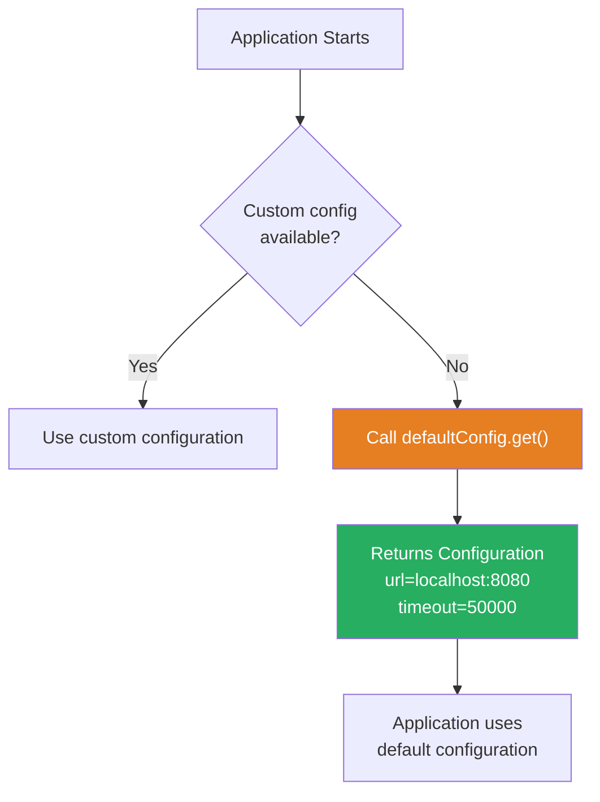

# 📘 Supplier — Real-World Use Case Example

---

## 📌 Introduction

### 🧠 What is this about?

This lecture demonstrates a **real-world use case** for the `Supplier` interface: providing **default configurations** for an application when no custom configuration is available. This is a common pattern in enterprise applications — fall back to sensible defaults when user settings aren't provided.

### 🌍 Real-World Problem First

Your application needs configuration — a database URL, a timeout value, API keys. Normally, these come from a config file or environment variables. But what if the config file is missing? The app shouldn't crash. It should fall back to **default configuration**. A `Supplier` is the perfect way to encapsulate that default.

### ❓ Why does it matter?

- Demonstrates how `Supplier` fits into **real enterprise code patterns**
- Shows the **factory pattern** with `Supplier` — create objects on demand
- Illustrates why `Supplier` is more flexible than hardcoded defaults

### 🗺️ What we'll learn (Learning Map)

- Creating a configuration class
- Using `Supplier` to provide default configuration
- Why `Supplier` is better than static constants for defaults

---

## 🧩 Concept 1: Default Configuration with Supplier

### 🧠 Layer 1: The Simple Version

Instead of hardcoding default values everywhere, you create a `Supplier` that **produces** a default configuration object whenever you need one. It's like having a "factory reset" button — press it anytime to get a clean set of defaults.

### 🔍 Layer 2: The Developer Version

The pattern:
1. Create a data class to hold configuration (URL, timeout, etc.)
2. Create a `Supplier<Configuration>` that produces a pre-filled default instance
3. Use `supplier.get()` wherever you need the default

This is better than a static constant because:
- Each `get()` call produces a **fresh object** (no shared mutable state)
- The supplier can be **swapped** at runtime (e.g., different defaults for test vs. production)
- It integrates with `Optional.orElseGet()` for elegant fallback logic

### ⚙️ Layer 4: How It Works



### 💻 Layer 5: Code — Prove It!

**🔍 Step 1 — Define the Configuration Class:**

```java
class Configuration {
    private String url;
    private int timeout;

    public Configuration(String url, int timeout) {
        this.url = url;
        this.timeout = timeout;
    }

    // Getters
    public String getUrl() { return url; }
    public int getTimeout() { return timeout; }

    @Override
    public String toString() {
        return "Configuration{url='" + url + "', timeout=" + timeout + "}";
    }
}
```

**🔍 Step 2 — Create a Supplier for Default Configuration:**

```java
Supplier<Configuration> defaultConfig = () ->
    new Configuration("http://localhost:8080", 50000);
```

That's it — one line. The supplier encapsulates the "recipe" for creating a default configuration.

**🔍 Step 3 — Use the Supplier:**

```java
// Get default configuration
Configuration config = defaultConfig.get();
System.out.println(config);
// Output: Configuration{url='http://localhost:8080', timeout=50000}
```

**🔍 Real-World Usage — Fallback with Optional:**

```java
public Configuration loadConfiguration() {
    Optional<Configuration> customConfig = loadFromFile();  // might be empty

    Supplier<Configuration> defaultConfig = () ->
        new Configuration("http://localhost:8080", 50000);

    // Use custom if available, otherwise fall back to default
    return customConfig.orElseGet(defaultConfig);
}
```

If `loadFromFile()` returns `Optional.empty()`, the supplier produces the default. If custom config exists, the supplier is **never called** (lazy evaluation!).

---

## 🧩 Concept 2: Why Supplier Over a Static Constant?

### 📊 Comparison

| Approach | Supplier | Static Constant |
|----------|----------|----------------|
| Object creation | Fresh object on each `get()` | Same shared object |
| Mutation risk | ✅ No risk — new object each time | ❌ If someone mutates it, ALL code sees the change |
| Swappable | ✅ Can pass different suppliers | ❌ Constant is hardcoded |
| Lazy | ✅ Only computes when needed | ❌ Created at class load time |

**Why mutation matters:**

```java
// ❌ Danger with static constant:
static final Configuration DEFAULT = new Configuration("localhost", 5000);

// Somewhere in code:
DEFAULT.setTimeout(0);  // Mutates the shared constant! Every user now sees timeout=0

// ✅ Safe with Supplier:
Supplier<Configuration> defaultConfig = () -> new Configuration("localhost", 5000);
Configuration config = defaultConfig.get();  // Fresh object every time
config.setTimeout(0);  // Only this instance is affected
```

---

### 💡 Pro Tips

**Tip 1:** Use `Supplier` whenever you need a **factory** that produces objects with consistent default values.

- Why it works: Each call to `get()` creates an independent object — no shared mutable state
- When to use: Default configs, test data generators, object pools

**Tip 2:** Combine `Supplier` with method parameters for flexible APIs:

```java
public <T> T getOrDefault(T value, Supplier<T> defaultSupplier) {
    return value != null ? value : defaultSupplier.get();
}

// Usage:
String name = getOrDefault(userInput, () -> "Anonymous");
```

---

### ✅ Key Takeaways

→ `Supplier` is perfect for **default/fallback values** — encapsulate the "recipe" once, use it anywhere

→ Each `get()` call produces a **fresh object** — no shared mutable state issues

→ Integrates naturally with `Optional.orElseGet()` for **lazy fallback** patterns

→ Prefer `Supplier` over static constants when the default is a mutable object

→ Think of `Supplier` as a **factory method in a variable** — portable, swappable, and lazy

---

### 🔗 What's Next?

> We've covered `Function` (transform), `Predicate` (test), and `Supplier` (produce). There's one more core functional interface to go — **`Consumer`**. Unlike the others, `Consumer` takes input but returns **nothing**. It's all about **side effects** — printing, logging, saving. Let's explore it.
