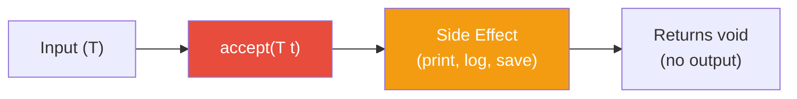
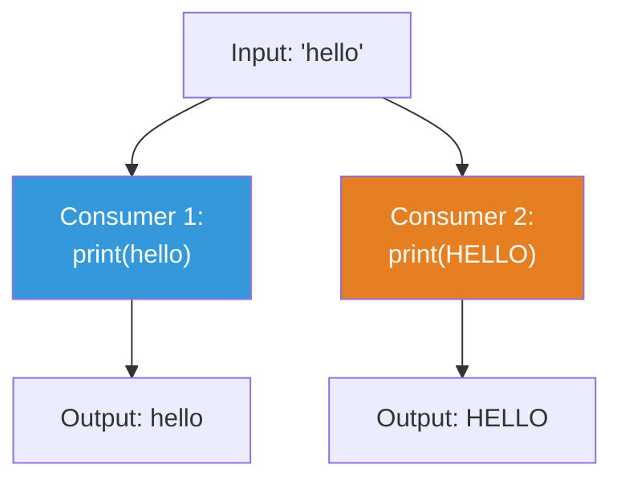

# 📘 Understanding Consumer Interface with Examples

---

## 📌 Introduction

### 🧠 What is this about?

The `Consumer<T>` interface represents an operation that **accepts a single input** and **returns no result**. It's the "do something with this" interface — it performs **side effects** like printing, logging, saving to a database, or sending a notification.

### 🌍 Real-World Problem First

You're processing a list of orders. For each order, you need to: (1) print the order details, (2) send a confirmation email, (3) update the inventory. Each of these is an **action** — it takes input (the order) and does something with it, but doesn't return a transformed version. These are `Consumer` operations.

### ❓ Why does it matter?

- `Consumer` is the functional interface behind **`Stream.forEach()`** and **`Iterable.forEach()`**
- Enables **chainable side effects** with `andThen()` — perform multiple actions on the same input
- Separates "what to do" from "when to do it" — pass behavior as a parameter

### 🗺️ What we'll learn (Learning Map)

- The `Consumer<T>` interface and its `accept()` method
- Performing side effects with consumers
- Chaining consumers with `andThen()`

---

## 🧩 Concept 1: The `Consumer<T>` Interface

### 🧠 Layer 1: The Simple Version

A `Consumer` is like a **black hole** — things go in, nothing comes back out. But useful things happen inside! It's the "action performer" of functional interfaces.

### 🔍 Layer 2: The Developer Version

`Consumer<T>` is a functional interface in `java.util.function` with:

- **`T`** — the type of the input
- **`accept(T t)`** — the single abstract method: performs an action on the input, returns `void`
- **`andThen(Consumer<T>)`** — chains two consumers: run the first, then the second, on the same input

```java
@FunctionalInterface
public interface Consumer<T> {
    void accept(T t);                           // Core method — perform action
    default Consumer<T> andThen(Consumer<T> after); // Chain actions
}
```

### 🌍 Layer 3: The Real-World Analogy

| Analogy (Mail Delivery) | Consumer Interface |
|---|---|
| A package (input) | Value of type `T` |
| Deliver to the door | `accept(T t)` — perform action |
| Nothing comes back to the sender | Returns `void` |
| Deliver, then get signature, then take photo | Chain with `andThen()` |

### ⚙️ Layer 4: How It Works



### 📊 Consumer vs Other Functional Interfaces

| Interface | Input | Output | Purpose |
|-----------|-------|--------|---------|
| `Function<T, R>` | T | R | **Transform** data |
| `Predicate<T>` | T | boolean | **Test** data |
| `Supplier<T>` | None | T | **Produce** data |
| `Consumer<T>` | T | None (void) | **Consume** data (side effects) |

**Why `Consumer` exists separately:** In functional programming, operations that **return void** (side effects) are fundamentally different from pure functions. `Consumer` makes this distinction explicit — when you see a `Consumer`, you know it's doing something observable (printing, saving, sending) rather than computing a result.

### 💻 Layer 5: Code — Prove It!

**🔍 Basic Consumer — Print a String:**

```java
Consumer<String> printConsumer = message -> System.out.println(message);

printConsumer.accept("Hello World");
// Output: Hello World
```

The lambda takes `message` as input, prints it, and returns nothing.

**🔍 Consumer for Logging:**

```java
Consumer<String> logger = message ->
    System.out.println("[LOG] " + LocalDateTime.now() + " - " + message);

logger.accept("Application started");
// Output: [LOG] 2024-01-15T14:30:00 - Application started

logger.accept("Processing order #123");
// Output: [LOG] 2024-01-15T14:30:01 - Processing order #123
```

**🔍 Consumer with forEach():**

```java
List<String> names = List.of("Alice", "Bob", "Charlie");

Consumer<String> greet = name -> System.out.println("Hello, " + name + "!");

names.forEach(greet);
// Output:
// Hello, Alice!
// Hello, Bob!
// Hello, Charlie!
```

> 💡 **The Aha Moment:** Every time you write `list.forEach(x -> ...)`, you're passing a `Consumer`. The `forEach()` method signature is literally `void forEach(Consumer<T> action)`.

---

## 🧩 Concept 2: Chaining Consumers with `andThen()`

### 🧠 Layer 1: The Simple Version

`andThen()` lets you perform **multiple actions** on the same input in sequence. First action runs, then the second action runs — both receive the **same original input**.

### 🔍 Layer 2: The Developer Version

The signature: `Consumer<T>.andThen(Consumer<T> after)` returns `Consumer<T>`

**Important difference from Function's `andThen()`:** With `Function`, the output of the first feeds into the second. With `Consumer`, **both consumers receive the same original input** — because consumers don't produce output to pass along.

### ⚙️ Layer 4: How It Works



Both consumers receive the same original input `"hello"`. Consumer 1 prints it as-is, Consumer 2 prints it uppercased.

### 💻 Layer 5: Code — Prove It!

**🔍 Define Two Consumers:**

```java
// Consumer 1: Print the string as-is
Consumer<String> printOriginal = str -> System.out.println("Original: " + str);

// Consumer 2: Print the string in uppercase
Consumer<String> printUppercase = str -> System.out.println("Uppercase: " + str.toUpperCase());
```

**🔍 Chain with andThen():**

```java
// Chain: print original, THEN print uppercase
Consumer<String> printBoth = printOriginal.andThen(printUppercase);

printBoth.accept("hello");
// Output:
// Original: hello
// Uppercase: HELLO
```

Both consumers received the same input `"hello"`. The first printed it as-is, then the second printed it uppercased.

**🔍 Chaining Multiple Consumers:**

```java
Consumer<String> log = msg -> System.out.println("[LOG] " + msg);
Consumer<String> save = msg -> System.out.println("[SAVE] Saving: " + msg);
Consumer<String> notify = msg -> System.out.println("[NOTIFY] Sent notification for: " + msg);

Consumer<String> processOrder = log.andThen(save).andThen(notify);

processOrder.accept("Order #42");
// Output:
// [LOG] Order #42
// [SAVE] Saving: Order #42
// [NOTIFY] Sent notification for: Order #42
```

---

### ⚠️ Pitfalls & Mistakes

**Mistake 1: Expecting Consumer's `andThen()` to pass output like Function's `andThen()`**

```java
// ❌ Wrong mental model:
// "Consumer 1 transforms, then Consumer 2 gets the transformed value"
// NO! Both get the ORIGINAL input.

Consumer<String> upper = str -> System.out.println(str.toUpperCase());
Consumer<String> length = str -> System.out.println(str.length());

upper.andThen(length).accept("hello");
// Output:
// HELLO        ← Consumer 1 uppercased "hello"
// 5            ← Consumer 2 got ORIGINAL "hello" (length 5, not "HELLO")
```

**Why:** `Consumer` returns void — there's nothing to "pass" to the next consumer. Both receive the same original input independently.

---

### ✅ Key Takeaways

→ `Consumer<T>` accepts input and returns **nothing** — it's for side effects (print, log, save)

→ The core method is **`accept(T t)`** — performs an action on the input

→ `Consumer` is the type behind **`forEach()`** — every `list.forEach(...)` takes a `Consumer`

→ **`andThen()`** chains multiple consumers — both receive the **same original input** (not piped like `Function`)

→ Use consumers to separate "what action to perform" from "when to perform it"

---

### 🔗 What's Next?

> We've now covered all four core functional interfaces: `Function` (transform), `Predicate` (test), `Supplier` (produce), and `Consumer` (consume). But what if you need a function that takes **two** inputs instead of one? That's where **`BiFunction`** comes in. Let's explore it.
