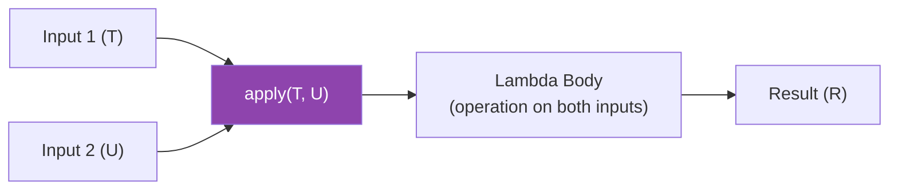
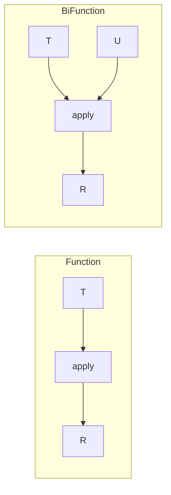

# 📘 Understanding BiFunction with Example

---

## 📌 Introduction

### 🧠 What is this about?

The `BiFunction<T, U, R>` interface is like `Function`, but it accepts **two input arguments** instead of one. It takes two values, performs some operation on them, and returns a result. The "Bi" prefix means "two" — two inputs, one output.

### 🌍 Real-World Problem First

You need to calculate the total price of an item: `price × quantity`. That requires **two inputs** — the price and the quantity. A regular `Function<T, R>` only takes one input. You could wrap both values in an object, but that's ugly. `BiFunction` solves this naturally — it's designed for operations that need two inputs.

### ❓ Why does it matter?

- Handles operations that naturally require **two inputs** — addition, comparison, string concatenation
- Used in `Map.replaceAll()`, `Map.merge()`, and `Map.compute()`
- Cleaner than wrapping two parameters into a container just to use `Function`

### 🗺️ What we'll learn (Learning Map)

- The `BiFunction<T, U, R>` interface and its `apply()` method
- Arithmetic operations with `BiFunction`
- How `BiFunction` relates to `Function`

---

## 🧩 Concept 1: The `BiFunction<T, U, R>` Interface

### 🧠 Layer 1: The Simple Version

If `Function` is a machine with **one input slot and one output slot**, then `BiFunction` is a machine with **two input slots and one output slot**. Two things go in, one thing comes out.

### 🔍 Layer 2: The Developer Version

`BiFunction<T, U, R>` is a functional interface in `java.util.function` with:

- **`T`** — the type of the first argument
- **`U`** — the type of the second argument
- **`R`** — the type of the result
- **`apply(T t, U u)`** — the core method: takes two inputs, returns one output
- **`andThen(Function<R, V>)`** — chains a `Function` after the `BiFunction` to transform the result

```java
@FunctionalInterface
public interface BiFunction<T, U, R> {
    R apply(T t, U u);                              // Two inputs → one output
    default <V> BiFunction<T, U, V> andThen(Function<R, V> after); // Chain transformation
}
```

### 🌍 Layer 3: The Real-World Analogy

| Analogy (Blender) | BiFunction |
|---|---|
| Put in fruit (input 1) | First argument `T` |
| Put in milk (input 2) | Second argument `U` |
| Press blend | Call `apply(T, U)` |
| Smoothie comes out (output) | Result `R` |

A blender takes two ingredients and produces one result — exactly what `BiFunction` does.

### ⚙️ Layer 4: How It Works



### 💻 Layer 5: Code — Prove It!

**🔍 Addition of Two Numbers:**

```java
BiFunction<Integer, Integer, Integer> addition = (num1, num2) -> num1 + num2;

int result = addition.apply(10, 20);
System.out.println("Addition: " + result);  // Output: Addition: 30
```

**🔍 All Four Arithmetic Operations:**

```java
BiFunction<Integer, Integer, Integer> add = (a, b) -> a + b;
BiFunction<Integer, Integer, Integer> subtract = (a, b) -> a - b;
BiFunction<Integer, Integer, Integer> multiply = (a, b) -> a * b;
BiFunction<Integer, Integer, Integer> divide = (a, b) -> a / b;

System.out.println("Add: " + add.apply(10, 20));       // Output: Add: 30
System.out.println("Subtract: " + subtract.apply(20, 10)); // Output: Subtract: 10
System.out.println("Multiply: " + multiply.apply(20, 10)); // Output: Multiply: 200
System.out.println("Divide: " + divide.apply(20, 10));     // Output: Divide: 2
```

**🔍 Mixed Types — String Concatenation:**

```java
BiFunction<String, Integer, String> repeat = (str, times) ->
    str.repeat(times);

System.out.println(repeat.apply("Ha", 3));  // Output: HaHaHa
```

Here `T` = `String`, `U` = `Integer`, `R` = `String` — the types don't have to be the same.

---

## 🧩 Concept 2: BiFunction vs Function

### 📊 Comparison

| Aspect | `Function<T, R>` | `BiFunction<T, U, R>` |
|--------|------------------|----------------------|
| Inputs | **One** (`T`) | **Two** (`T`, `U`) |
| Output | One (`R`) | One (`R`) |
| Core method | `apply(T)` | `apply(T, U)` |
| Composition | `andThen()`, `compose()` | `andThen()` only |
| Use case | Transform one value | Combine two values |

**Why no `compose()` on BiFunction?** The `compose()` method needs to feed the output of one function into the input of another. But `BiFunction` takes **two** inputs — how would a single output from a composed function split into two inputs? The math doesn't work. That's why `BiFunction` only supports `andThen()` (which feeds the single output forward).



---

### ⚠️ Pitfalls & Mistakes

**Mistake 1: Trying to use `compose()` on BiFunction**

```java
// ❌ BiFunction does NOT have compose()
BiFunction<Integer, Integer, Integer> add = (a, b) -> a + b;
// add.compose(...);  // Compile Error: method compose not found
```

**Why:** `compose()` would need to map a single output to two separate inputs — that's ambiguous. Use `andThen()` instead to transform the output.

**Mistake 2: Integer division truncation**

```java
BiFunction<Integer, Integer, Integer> divide = (a, b) -> a / b;

System.out.println(divide.apply(7, 2));  // Output: 3 (not 3.5!)
// Integer division truncates the decimal
```

```java
// ✅ Use Double if you need decimal precision
BiFunction<Double, Double, Double> divide = (a, b) -> a / b;
System.out.println(divide.apply(7.0, 2.0));  // Output: 3.5
```

---

### ✅ Key Takeaways

→ `BiFunction<T, U, R>` takes **two inputs** and returns **one output** — use it when an operation naturally requires two values

→ The core method is **`apply(T, U)`** — takes both inputs and returns the result

→ It has `andThen()` but **not `compose()`** — you can transform the output but can't pre-process two inputs with a single function

→ All three type parameters can be **different types** — `BiFunction<String, Integer, Boolean>` is valid

→ Commonly used for arithmetic, combining, and merging operations

---

### 🔗 What's Next?

> We've seen `BiFunction`'s `apply()` method for combining two inputs. But what if you want to **transform the result** after the combination? That's where `BiFunction.andThen()` comes in — let's chain a post-processing step onto our BiFunction.
