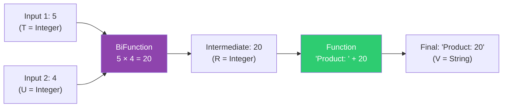

# 📘 BiFunction andThen() Method with Example

---

## 📌 Introduction

### 🧠 What is this about?

The `andThen()` method on `BiFunction` lets you **chain a `Function` after a `BiFunction`**. First, the `BiFunction` combines two inputs into a result. Then, the `Function` transforms that result further. It's a two-step pipeline: combine → transform.

### 🌍 Real-World Problem First

You're calculating the product of two numbers (using `BiFunction`), but you need the result formatted as a string — like `"Product: 20"`. Without chaining, you'd need an intermediate variable. With `andThen()`, you build a single composed operation that calculates AND formats in one step.

### ❓ Why does it matter?

- Enables **post-processing** the result of a two-input operation
- Eliminates intermediate variables for multi-step computations
- Builds clean, readable data transformation pipelines

### 🗺️ What we'll learn (Learning Map)

- How `BiFunction.andThen()` chains with a `Function`
- Why it takes a `Function` (not another `BiFunction`)
- Practical example: calculate then format

---

## 🧩 Concept 1: How `BiFunction.andThen()` Works

### 🧠 Layer 1: The Simple Version

`andThen()` says: "After I combine these two inputs into a result, pass that result through **one more transformation**." The BiFunction does the heavy lifting (two inputs → one output), then a regular Function refines the output.

### 🔍 Layer 2: The Developer Version

The signature:
```java
BiFunction<T, U, R>.andThen(Function<R, V>) returns BiFunction<T, U, V>
```

- **BiFunction:** `(T, U) → R` (combine two inputs into result)
- **Function (after):** `R → V` (transform the result)
- **Composed result:** `(T, U) → V` (two inputs → transformed result)

**Why does `andThen()` take a `Function`, not a `BiFunction`?** Because the first step already reduced two inputs to one result. The second step only has **one value** to work with — so it's a `Function`, not a `BiFunction`.

### ⚙️ Layer 4: How It Works (Step-by-Step)



**Step 1 — BiFunction executes:** Takes two inputs (5, 4) → multiplies → produces `20`

**Step 2 — Function executes on the result:** Takes `20` → formats → produces `"Product: 20"`

### 💻 Layer 5: Code — Prove It!

**🔍 Step 1 — Define the BiFunction:**

```java
// BiFunction: multiply two numbers
BiFunction<Integer, Integer, Integer> multiplyNumbers = (num1, num2) -> num1 * num2;
```

**🔍 Step 2 — Define the Function for Post-Processing:**

```java
// Function: convert the integer result to a formatted string
Function<Integer, String> convertToString = num -> "Product: " + num;
```

**🔍 Step 3 — Chain with andThen():**

```java
// Chain: multiply THEN format
BiFunction<Integer, Integer, String> multiplyAndConvert =
    multiplyNumbers.andThen(convertToString);

String result = multiplyAndConvert.apply(5, 4);
System.out.println(result);  // Output: Product: 20
```

The composed `BiFunction` takes two integers and returns a formatted string — the intermediate integer is never exposed.

**🔍 Another Example — Calculate and Classify:**

```java
// BiFunction: add two numbers
BiFunction<Integer, Integer, Integer> add = (a, b) -> a + b;

// Function: classify the sum
Function<Integer, String> classify = sum ->
    sum > 100 ? "Large" : sum > 50 ? "Medium" : "Small";

// Chain: add THEN classify
BiFunction<Integer, Integer, String> addAndClassify = add.andThen(classify);

System.out.println(addAndClassify.apply(30, 80));  // Output: Large  (110 > 100)
System.out.println(addAndClassify.apply(20, 20));   // Output: Small  (40 ≤ 50)
System.out.println(addAndClassify.apply(30, 40));   // Output: Medium (70 > 50, ≤ 100)
```

---

### 📊 andThen() Comparison: Function vs BiFunction

| Aspect | `Function.andThen()` | `BiFunction.andThen()` |
|--------|---------------------|----------------------|
| Takes | `Function<R, V>` | `Function<R, V>` |
| First step | One input → result | **Two** inputs → result |
| Second step | Transform result | Transform result |
| Returns | `Function<T, V>` | `BiFunction<T, U, V>` |

**Key insight:** Both `andThen()` methods take a `Function` as the "after" step — because after the first step, there's always **one result** to transform, regardless of how many inputs started the pipeline.

---

### ⚠️ Pitfalls & Mistakes

**Mistake 1: Trying to pass a BiFunction to andThen()**

```java
BiFunction<Integer, Integer, Integer> multiply = (a, b) -> a * b;
BiFunction<Integer, Integer, String> format = (a, b) -> a + " x " + b;

// ❌ Compile Error! andThen() expects Function, not BiFunction
// multiply.andThen(format);
```

**Why:** After `multiply` runs, there's only **one result** (an integer). A `BiFunction` would need two inputs, but there's only one value available. Use a `Function` instead:

```java
// ✅ Use Function for the after step
Function<Integer, String> format = result -> "Result: " + result;
multiply.andThen(format);
```

---

### ✅ Key Takeaways

→ `BiFunction.andThen(Function)` chains a **post-processing Function** onto a BiFunction's result

→ The `after` parameter is a **`Function`**, not a `BiFunction` — because the BiFunction already reduced two inputs to one result

→ The composed operation still takes **two inputs** but returns the transformed output type

→ This pattern is great for **calculate-then-format** or **combine-then-classify** pipelines

→ `BiFunction` has **no `compose()` method** — only `andThen()` is available

---

### 🔗 What's Next?

> Let's put `BiFunction` to work in a practical exercise — **calculating the area of a rectangle**. This simple example will solidify your understanding of how two-input functions work in real code.
