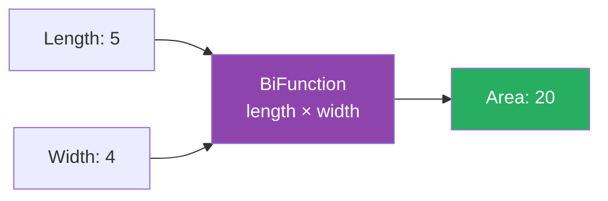

# 📘 Solution — Calculate the Area of a Rectangle

---

## 📌 Introduction

### 🧠 What is this about?

This is a hands-on exercise that uses `BiFunction` to solve a simple geometric problem: **calculating the area of a rectangle**. The area formula `length × width` naturally requires two inputs — making it a perfect `BiFunction` use case.

### ❓ Why does it matter?

- Reinforces `BiFunction` concepts with a tangible, relatable example
- Shows how `BiFunction` maps to **real-world formulas** that take multiple inputs
- Demonstrates the clean, functional approach vs. traditional method calls

### 🗺️ What we'll learn (Learning Map)

- Modeling a mathematical formula as a `BiFunction`
- Comparing functional vs. traditional approach
- Extending the pattern to other geometric calculations

---

## 🧩 Concept 1: Rectangle Area with BiFunction

### 🧠 Layer 1: The Simple Version

The area of a rectangle = length × width. Two numbers go in, one number comes out. That's `BiFunction<Integer, Integer, Integer>`.

### 🔍 Layer 2: The Developer Version

We model the formula `Area = Length × Width` as:

```java
BiFunction<Integer, Integer, Integer> calculateArea = (length, width) -> length * width;
```

- `T` = `Integer` (length)
- `U` = `Integer` (width)
- `R` = `Integer` (area)

### ⚙️ Layer 4: Visual Representation



### 💻 Layer 5: Code — Prove It!

**🔍 The Solution:**

```java
import java.util.function.BiFunction;

public class RectangleAreaBiFunctionExample {
    public static void main(String[] args) {
        // Define BiFunction to calculate area of rectangle
        BiFunction<Integer, Integer, Integer> calculateArea =
            (length, width) -> length * width;

        // Calculate area
        int area = calculateArea.apply(5, 4);
        System.out.println("Area of rectangle: " + area);
        // Output: Area of rectangle: 20
    }
}
```

**🔍 Extended — Multiple Rectangles:**

```java
BiFunction<Integer, Integer, Integer> calculateArea = (length, width) -> length * width;

System.out.println("5 x 4 = " + calculateArea.apply(5, 4));    // Output: 5 x 4 = 20
System.out.println("10 x 3 = " + calculateArea.apply(10, 3));  // Output: 10 x 3 = 30
System.out.println("7 x 7 = " + calculateArea.apply(7, 7));    // Output: 7 x 7 = 49
```

**🔍 Extended — With andThen() for Formatted Output:**

```java
BiFunction<Integer, Integer, Integer> calculateArea = (length, width) -> length * width;
Function<Integer, String> formatResult = area -> "Area = " + area + " sq units";

BiFunction<Integer, Integer, String> calculateAndFormat =
    calculateArea.andThen(formatResult);

System.out.println(calculateAndFormat.apply(5, 4));
// Output: Area = 20 sq units
```

---

## 🧩 Concept 2: Functional vs. Traditional Approach

### 📊 Comparison

```java
// ❌ Traditional approach — utility method
public static int calculateArea(int length, int width) {
    return length * width;
}
// Usage: int area = calculateArea(5, 4);

// ✅ Functional approach — BiFunction
BiFunction<Integer, Integer, Integer> calculateArea = (l, w) -> l * w;
// Usage: int area = calculateArea.apply(5, 4);
```

| Aspect | Traditional Method | BiFunction |
|--------|-------------------|-----------|
| Definition | Tied to a class | Stored in a variable |
| Passable | Via method reference | Directly as a value |
| Composable | Nesting calls | `andThen()` chaining |
| Swappable | Requires refactoring | Reassign the variable |

**When to use which:** For simple, one-off calculations, a traditional method is fine. Use `BiFunction` when you need to **pass the calculation as a parameter**, **swap strategies at runtime**, or **compose it with other operations**.

---

### 💡 Pro Tips

**Tip 1:** Use `BiFunction` for any formula with two inputs — not just area.

```java
// Perimeter: 2 × (length + width)
BiFunction<Integer, Integer, Integer> perimeter = (l, w) -> 2 * (l + w);
System.out.println(perimeter.apply(5, 4));  // Output: 18

// Hypotenuse: √(a² + b²)
BiFunction<Double, Double, Double> hypotenuse = (a, b) ->
    Math.sqrt(a * a + b * b);
System.out.println(hypotenuse.apply(3.0, 4.0));  // Output: 5.0

// Discount price: price × (1 - discount)
BiFunction<Double, Double, Double> discountedPrice = (price, discount) ->
    price * (1 - discount);
System.out.println(discountedPrice.apply(100.0, 0.2));  // Output: 80.0
```

---

### 🎯 Final Summary

### 🧠 The Big Picture — Functional Interfaces Covered So Far

```mermaid
mindmap
  root((Functional Interfaces))
    Function
      apply: T → R
      andThen: chain forward
      compose: chain backward
      identity: pass-through
    Predicate
      test: T → boolean
      and: logical AND
      or: logical OR
      negate: logical NOT
      isEqual: equality check
    Supplier
      get: () → T
      Lazy evaluation
      Default values
    Consumer
      accept: T → void
      andThen: chain actions
      Side effects
    BiFunction
      apply: (T, U) → R
      andThen: post-process result
      Two inputs, one output
```

### ✅ Master Takeaways

→ **`Function<T,R>`** transforms one input → one output. Chain with `andThen()` / `compose()`.

→ **`Predicate<T>`** tests conditions → returns boolean. Compose with `and()`, `or()`, `negate()`.

→ **`Supplier<T>`** takes no input → produces a value. Perfect for lazy evaluation and defaults.

→ **`Consumer<T>`** takes input → returns nothing. For side effects like printing and logging.

→ **`BiFunction<T,U,R>`** takes **two** inputs → one output. For calculations and combinations.

→ All of these are in **`java.util.function`** — use them before creating custom functional interfaces.

### 🔗 What's Next?

> We've now covered the five most important functional interfaces. In upcoming lectures, we'll see how these interfaces power **Streams**, **Optional**, and other Java 8 features — putting everything together into real-world data processing pipelines.
