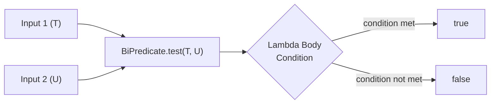
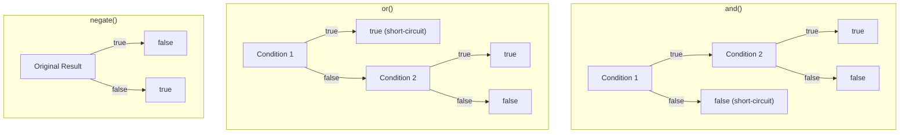
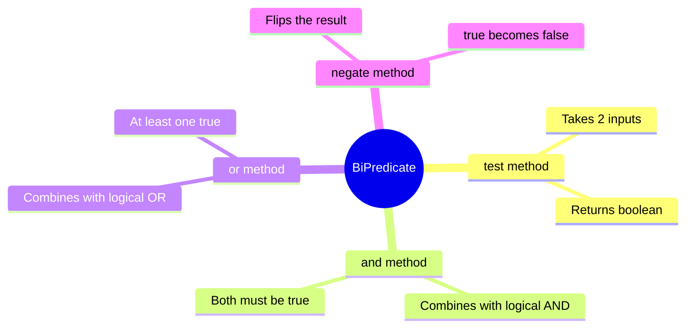

# 📘 Understanding BiPredicate Interface with Example

---

## 📌 Introduction

### 🧠 What is this about?
The `BiPredicate` interface is a functional interface introduced in Java 8 that takes **two input arguments** and returns a **boolean** (`true` or `false`). Think of it as the big sibling of `Predicate` — same job (testing conditions), but with two inputs instead of one.

### 🌍 Real-World Problem First
Imagine you're building a user registration system. You need to check if a user's **password** matches a **confirmation password**. With a regular `Predicate`, you can only test one value at a time. You'd have to awkwardly pass both values some other way. What if there was a clean, functional way to test a condition that naturally involves *two* inputs?

### ❓ Why does it matter?
- Without `BiPredicate`, you'd need to write custom interfaces or use clumsy workarounds for two-input boolean checks
- It integrates seamlessly with lambda expressions and method references
- It provides `and()`, `or()`, and `negate()` methods for composing complex conditions

### 🗺️ What we'll learn (Learning Map)
- What `BiPredicate` is and how it differs from `Predicate`
- How to use the `test()` method with two arguments
- The complete method set: `test()`, `and()`, `or()`, `negate()`
- Practical examples with string comparisons

---

## 🧩 Concept 1: What is BiPredicate?

### 🧠 Layer 1: The Simple Version
A `BiPredicate` is a yes/no question that needs **two** pieces of information to answer. "Are these two strings the same length?" — that's a `BiPredicate`.

### 🔍 Layer 2: The Developer Version
`BiPredicate<T, U>` is a functional interface in `java.util.function` with one abstract method `test(T t, U u)` that returns a `boolean`. It accepts two generically-typed parameters, making it flexible for any two-input boolean check.

```java
@FunctionalInterface
public interface BiPredicate<T, U> {
    boolean test(T t, U u);           // Core abstract method
    
    default BiPredicate<T, U> and(BiPredicate<? super T, ? super U> other);
    default BiPredicate<T, U> or(BiPredicate<? super T, ? super U> other);
    default BiPredicate<T, U> negate();
}
```

### 🌍 Layer 3: The Real-World Analogy
Think of `BiPredicate` as a **border checkpoint officer** who needs to see **two documents** (passport + visa) before giving a yes/no answer: "Can this person enter?"

| Analogy Part | Technical Mapping |
|---|---|
| Border officer | `BiPredicate` instance |
| Passport (document 1) | First argument `T` |
| Visa (document 2) | Second argument `U` |
| "Allowed" or "Denied" | `true` or `false` return |
| Officer's rulebook | Lambda body logic |

### ⚙️ Layer 4: How It Works Internally

**Step 1 — Declaration:** You declare a `BiPredicate<T, U>` variable with the types of both inputs.

**Step 2 — Lambda Assignment:** You assign a lambda expression that accepts two parameters and returns a boolean condition.

**Step 3 — Invocation:** You call `test(arg1, arg2)` which passes both arguments into the lambda body and returns the boolean result.



### 💻 Layer 5: Code — Prove It!

**🔍 BiPredicate vs Predicate — The Key Difference:**
```java
// Predicate — one input
Predicate<String> isLong = s -> s.length() > 5;
isLong.test("Hello");  // Output: false

// BiPredicate — two inputs
BiPredicate<String, String> sameLength = (s1, s2) -> s1.length() == s2.length();
sameLength.test("Hello", "World");  // Output: true
```

**🔍 Basic Usage — Check if Two Strings Have Same Length:**
```java
import java.util.function.BiPredicate;

public class BiPredicateTestExample {
    public static void main(String[] args) {
        // BiPredicate to check if two strings have the same length
        BiPredicate<String, String> sameLength = (s1, s2) -> s1.length() == s2.length();

        System.out.println(sameLength.test("Hello", "Hello"));  // Output: true
        System.out.println(sameLength.test("Hello", "Hi"));     // Output: false
    }
}
```

**Why does this work?** When `test("Hello", "Hello")` is called, the lambda receives `s1 = "Hello"` and `s2 = "Hello"`. It compares `5 == 5` → `true`. When `test("Hello", "Hi")` is called, it compares `5 == 2` → `false`.

### 📊 Layer 6: Predicate vs BiPredicate Comparison

| Feature | `Predicate<T>` | `BiPredicate<T, U>` |
|---------|----------------|----------------------|
| Input count | 1 | 2 |
| Type parameters | `T` | `T, U` |
| Abstract method | `test(T t)` | `test(T t, U u)` |
| Use case | Single-value checks | Two-value relationship checks |
| Composition methods | `and()`, `or()`, `negate()` | `and()`, `or()`, `negate()` |

**Why the difference exists:** `Predicate` handles conditions about a single thing ("Is this number even?"). `BiPredicate` handles conditions about the *relationship* between two things ("Do these two strings match?"). Java couldn't extend `Predicate` to accept two arguments because generics are fixed at declaration time — so a separate interface was needed.

---

### ✅ Key Takeaways for This Concept

→ `BiPredicate<T, U>` takes two inputs and returns a boolean — use it when your condition naturally involves two values  
→ The core method is `test(T t, U u)` — it evaluates the lambda body and returns `true` or `false`  
→ Think of it as: `Predicate` = "Is X true?" vs `BiPredicate` = "Is X related to Y in this way?"

---

> Now that we understand what `BiPredicate` is and how `test()` works, let's explore how to **combine** multiple BiPredicate conditions together — starting with the `and()` method.

---

## 🧩 Concept 2: BiPredicate Methods Overview

### 🧠 Layer 1: The Simple Version
`BiPredicate` comes with three helper methods that let you combine or flip conditions: `and()` (both must be true), `or()` (at least one must be true), and `negate()` (flip the result).

### 🔍 Layer 2: The Developer Version
These are **default methods** on the `BiPredicate` interface. They return a *new* `BiPredicate` that wraps the original logic with additional conditions. This lets you compose complex checks from simple building blocks.

### ⚙️ Layer 4: How Each Method Works Internally



| Method | Internal Logic | Returns `true` when |
|--------|---------------|---------------------|
| `and(other)` | `this.test(t, u) && other.test(t, u)` | **Both** conditions are true |
| `or(other)` | `this.test(t, u) \|\| other.test(t, u)` | **At least one** condition is true |
| `negate()` | `!this.test(t, u)` | Original was **false** |

### 💻 Layer 5: Code — Prove It!

**🔍 All Three Methods in Action:**
```java
import java.util.function.BiPredicate;

public class BiPredicateMethodsDemo {
    public static void main(String[] args) {
        BiPredicate<Integer, Integer> bothPositive = (a, b) -> a > 0 && b > 0;
        BiPredicate<Integer, Integer> bothEven = (a, b) -> a % 2 == 0 && b % 2 == 0;

        // and() — both conditions must be true
        BiPredicate<Integer, Integer> positiveAndEven = bothPositive.and(bothEven);
        System.out.println(positiveAndEven.test(4, 6));    // Output: true  (both positive AND both even)
        System.out.println(positiveAndEven.test(-4, 6));   // Output: false (not both positive)
        System.out.println(positiveAndEven.test(5, 6));    // Output: false (5 is not even)

        // or() — at least one condition must be true
        BiPredicate<Integer, Integer> positiveOrEven = bothPositive.or(bothEven);
        System.out.println(positiveOrEven.test(3, 5));     // Output: true  (both positive, even though odd)
        System.out.println(positiveOrEven.test(-2, -4));   // Output: true  (both even, even though negative)
        System.out.println(positiveOrEven.test(-3, -5));   // Output: false (neither positive nor even)

        // negate() — flips the result
        BiPredicate<String, String> isEqual = (s1, s2) -> s1.equals(s2);
        BiPredicate<String, String> isNotEqual = isEqual.negate();
        System.out.println(isNotEqual.test("Hello", "Hello"));  // Output: false (equal → negated to false)
        System.out.println(isNotEqual.test("Hello", "Hi"));     // Output: true  (not equal → negated to true)
    }
}
```

---

### ⚠️ Pitfalls & Mistakes

**Mistake 1: Confusing `and()` return type**
- 👤 What devs do: Try to store the result of `and()` in a `boolean`
- 💥 Why it breaks: `and()` returns a **new BiPredicate**, not a boolean. You still need to call `test()` on it.
- ✅ Fix:
```java
// ❌ Wrong — and() returns BiPredicate, not boolean
boolean result = bothPositive.and(bothEven);

// ✅ Correct — chain and() then call test()
BiPredicate<Integer, Integer> combined = bothPositive.and(bothEven);
boolean result = combined.test(4, 6);
```

---

### 💡 Pro Tips

**Tip 1:** Chain multiple compositions fluently
- Why it works: Each `and()`/`or()` returns a new `BiPredicate`, so you can keep chaining
- When to use: Complex multi-condition validations
```java
BiPredicate<Integer, Integer> complex = bothPositive
    .and(bothEven)
    .and((a, b) -> a + b > 10);  // All three conditions must hold
```

---

### ✅ Key Takeaways for This Concept

→ `and()` = logical AND between two BiPredicates — both must pass  
→ `or()` = logical OR — at least one must pass  
→ `negate()` = logical NOT — flips the result  
→ All three methods return a **new BiPredicate** — they don't modify the original

---

## 🎯 Final Summary

### 🧠 The Big Picture



### ✅ Master Takeaways
→ Use `BiPredicate` when your condition naturally involves **two** inputs — don't force two values through a single `Predicate`  
→ Composition methods (`and`, `or`, `negate`) let you build complex conditions from simple ones — like LEGO blocks  
→ `BiPredicate` is part of the `java.util.function` package — import it from there  
→ The lambda body must return a boolean expression  

### 🔗 What's Next?
In the next notes, we'll look at each BiPredicate composition method (`and()`, `or()`, `negate()`) with dedicated examples to see exactly how they evaluate different inputs.
