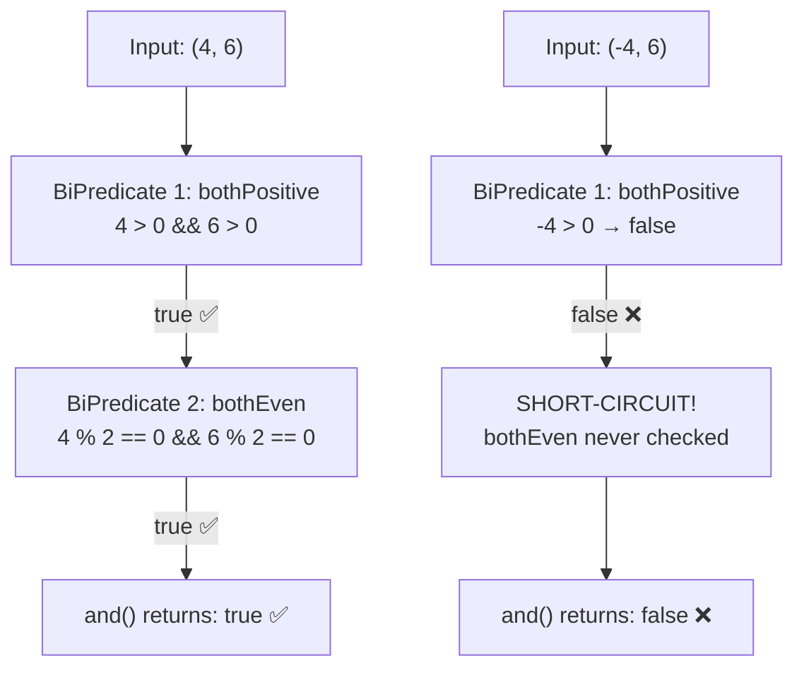

# 📘 BiPredicate and() Method with Example

---

## 📌 Introduction

### 🧠 What is this about?
The `and()` method on `BiPredicate` lets you **combine two conditions** with a logical AND — meaning **both** conditions must be true for the combined result to be true. It's how you say: "Is this pair of values good on *both* criteria?"

### 🌍 Real-World Problem First
You're validating user input for a number game. A pair of numbers must be **both positive** AND **both even** to win. Checking each condition separately and then combining with `if (cond1 && cond2)` works, but it's not composable or reusable. What if you could snap two pre-built checks together like puzzle pieces?

### ❓ Why does it matter?
- Allows building complex validations from simple, reusable predicates
- Returns a new `BiPredicate` — the originals stay unchanged (immutability)
- Uses short-circuit evaluation: if the first condition is `false`, the second isn't even checked

### 🗺️ What we'll learn (Learning Map)
- How `and()` works internally (source code level)
- Step-by-step evaluation with real values
- Building a combined "positive AND even" check

---

## 🧩 Concept 1: The and() Method in Depth

### 🧠 Layer 1: The Simple Version
`and()` takes two yes/no questions about a pair of values and creates a *new* question: "Did *both* original questions say yes?"

### 🔍 Layer 2: The Developer Version
`and()` is a **default method** on `BiPredicate<T, U>`. It accepts another `BiPredicate` as a parameter and returns a new `BiPredicate` that evaluates `this.test(t, u) && other.test(t, u)`.

```java
// Inside BiPredicate.java (actual source code)
default BiPredicate<T, U> and(BiPredicate<? super T, ? super U> other) {
    Objects.requireNonNull(other);
    return (T t, U u) -> test(t, u) && other.test(t, u);
}
```

**Key observations from the source:**
- It first null-checks the `other` predicate (defensive programming)
- It returns a **new lambda** that calls both predicates with `&&`
- The `&&` operator **short-circuits** — if `test(t, u)` returns `false`, `other.test(t, u)` never executes

### 🌍 Layer 3: The Real-World Analogy
Think of two bouncers at a nightclub entrance. Bouncer 1 checks your ID (age ≥ 21), Bouncer 2 checks the dress code. The `and()` method is like chaining them: you get in **only if both** approve you.

| Analogy Part | Technical Mapping |
|---|---|
| Bouncer 1 (ID check) | First `BiPredicate` |
| Bouncer 2 (dress code) | Second `BiPredicate` passed to `and()` |
| Customer's two attributes | The two arguments `(T t, U u)` |
| "Both bouncers approve" | `and()` returns `true` |
| "Either bouncer rejects" | `and()` returns `false` |
| Short-circuit: Bouncer 1 rejects, Bouncer 2 doesn't even look | `&&` short-circuit evaluation |

### ⚙️ Layer 4: How It Works Step-by-Step

Let's trace through `and()` with concrete values `(4, 6)`:



**Step 1 — First predicate evaluates:** The `and()` method calls `bothPositive.test(4, 6)`. Since `4 > 0` and `6 > 0`, this returns `true`.

**Step 2 — Second predicate evaluates (only if Step 1 was true):** Now `bothEven.test(4, 6)` runs. Since `4 % 2 == 0` and `6 % 2 == 0`, this returns `true`.

**Step 3 — Result:** Both returned `true`, so `and()` returns `true`.

### 💻 Layer 5: Code — Prove It!

```java
import java.util.function.BiPredicate;

public class BiPredicateAndExample {
    public static void main(String[] args) {
        // BiPredicate to check if both numbers are positive
        BiPredicate<Integer, Integer> positiveNumbers = (num1, num2) -> num1 > 0 && num2 > 0;

        // BiPredicate to check if both numbers are even
        BiPredicate<Integer, Integer> evenNumbers = (num1, num2) -> num1 % 2 == 0 && num2 % 2 == 0;

        // Using and() to combine both conditions
        BiPredicate<Integer, Integer> positiveAndEven = positiveNumbers.and(evenNumbers);

        // Test case 1: Both positive AND both even → true
        System.out.println(positiveAndEven.test(4, 6));     // Output: true

        // Test case 2: -4 is negative → first predicate fails → false
        System.out.println(positiveAndEven.test(-4, 6));    // Output: false

        // Test case 3: 5 is odd → second predicate fails → false
        System.out.println(positiveAndEven.test(5, 6));     // Output: false
    }
}
```

**Why test case 3 fails:** Both 5 and 6 are positive, so `positiveNumbers` returns `true`. But `5 % 2 == 0` is `false` — 5 is odd. Since `evenNumbers` returns `false`, the combined `and()` also returns `false`. Both conditions must hold.

---

### ⚠️ Pitfalls & Mistakes

**Mistake 1: Assuming `and()` modifies the original predicate**
- 👤 What devs do: Call `bothPositive.and(bothEven)` and expect `bothPositive` itself to now check both conditions
- 💥 Why it breaks: `and()` returns a **new** `BiPredicate`. The original `bothPositive` is unchanged.
- ✅ Fix: Always capture the return value:
```java
// ❌ Wrong — result is lost
positiveNumbers.and(evenNumbers);
positiveNumbers.test(4, 6);  // Only checks positive!

// ✅ Correct — store the combined predicate
BiPredicate<Integer, Integer> combined = positiveNumbers.and(evenNumbers);
combined.test(4, 6);  // Checks BOTH conditions
```

---

### 💡 Pro Tips

**Tip 1:** Order predicates by cost — put the cheapest/most-likely-to-fail first
- Why it works: Short-circuit evaluation means if the first predicate fails, the second is never called
- When to use: When one predicate involves expensive operations (database calls, complex calculations)

---

### ✅ Key Takeaways for This Concept

→ `and()` combines two BiPredicates with logical AND — **both must return true**  
→ It returns a **new** BiPredicate, leaving the originals unchanged  
→ Uses `&&` short-circuit: if the first fails, the second is skipped  
→ Always store the result of `and()` in a variable — calling it without capturing is a no-op  

---

## 🎯 Final Summary

### ✅ Master Takeaways
→ `and()` = "Both conditions must pass" — like requiring both a valid ID *and* a ticket  
→ Internally, it creates a new lambda: `(t, u) -> this.test(t, u) && other.test(t, u)`  
→ Short-circuits on first `false` — efficient for expensive second checks  

### 🔗 What's Next?
Now that we've seen how to require *both* conditions with `and()`, what if we want to pass when *at least one* condition is true? That's exactly what the `or()` method does — let's explore it next.
