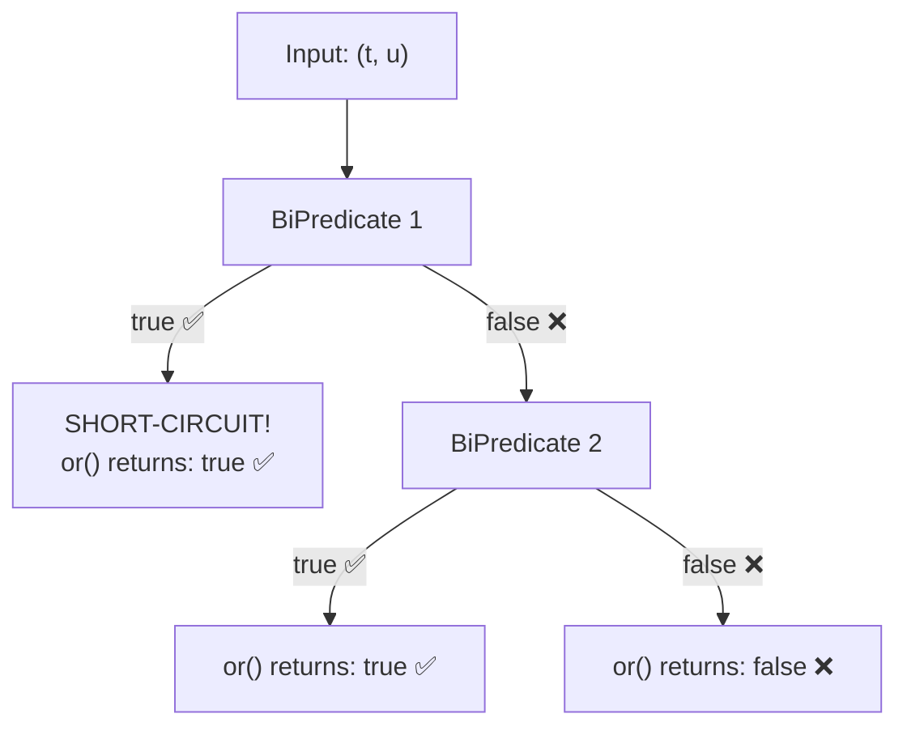

# 📘 BiPredicate or() Method with Example

---

## 📌 Introduction

### 🧠 What is this about?
The `or()` method on `BiPredicate` combines two conditions with a logical OR — meaning **at least one** condition must be true for the combined result to be true. It's the lenient cousin of `and()`.

### 🌍 Real-World Problem First
You're building a discount eligibility checker. A customer gets a discount if their purchase amount is above $100 **OR** they have a loyalty membership. You have two separate checks — now you need to combine them where passing *either* one is enough.

### ❓ Why does it matter?
- Lets you build flexible "pass if any condition matches" logic
- Complements `and()` for complete boolean composition
- Short-circuits on the first `true` — skips the second check when the first already passes

### 🗺️ What we'll learn (Learning Map)
- How `or()` works internally
- Truth table and evaluation flow
- Practical example with string equality checks

---

## 🧩 Concept 1: The or() Method in Depth

### 🧠 Layer 1: The Simple Version
`or()` takes two yes/no questions and creates a new one: "Did *at least one* of the original questions say yes?"

### 🔍 Layer 2: The Developer Version
`or()` is a default method on `BiPredicate`. It returns a new `BiPredicate` that evaluates `this.test(t, u) || other.test(t, u)`.

```java
// Inside BiPredicate.java (actual source code)
default BiPredicate<T, U> or(BiPredicate<? super T, ? super U> other) {
    Objects.requireNonNull(other);
    return (T t, U u) -> test(t, u) || other.test(t, u);
}
```

### 🌍 Layer 3: The Real-World Analogy
Think of a VIP lounge with two ways to get in: either show a VIP pass **or** be on the guest list. You only need one.

| Analogy Part | Technical Mapping |
|---|---|
| VIP pass check | First `BiPredicate` |
| Guest list check | Second `BiPredicate` passed to `or()` |
| "Has VIP pass" → enters immediately | First returns `true` → short-circuit, skip second |
| "No pass, but on guest list" → enters | First `false`, second `true` → result `true` |
| "Neither" → denied | Both `false` → result `false` |

### ⚙️ Layer 4: How It Works Step-by-Step



**Truth table for `or()`:**

| Predicate 1 | Predicate 2 | `or()` Result |
|:-----------:|:-----------:|:-------------:|
| `true` | *(not checked)* | `true` |
| `false` | `true` | `true` |
| `false` | `false` | `false` |

### 💻 Layer 5: Code — Prove It!

```java
import java.util.function.BiPredicate;

public class BiPredicateOrExample {
    public static void main(String[] args) {
        BiPredicate<Integer, Integer> bothPositive = (a, b) -> a > 0 && b > 0;
        BiPredicate<Integer, Integer> bothEven = (a, b) -> a % 2 == 0 && b % 2 == 0;

        // or() — at least one condition must be true
        BiPredicate<Integer, Integer> positiveOrEven = bothPositive.or(bothEven);

        // Both positive (odd is fine) → true
        System.out.println(positiveOrEven.test(3, 5));     // Output: true

        // Both even (negative is fine) → true
        System.out.println(positiveOrEven.test(-2, -4));   // Output: true

        // Neither positive nor even → false
        System.out.println(positiveOrEven.test(-3, -5));   // Output: false
    }
}
```

**Why `(-2, -4)` returns true:** `-2` and `-4` are **not** positive, so `bothPositive` returns `false`. But `-2 % 2 == 0` and `-4 % 2 == 0`, so `bothEven` returns `true`. Since `or()` only needs one `true`, the result is `true`.

---

### ⚠️ Pitfalls & Mistakes

**Mistake 1: Confusing `or()` with `and()`**
- 👤 What devs do: Use `or()` thinking both conditions must pass
- 💥 Why it breaks: `or()` passes if *either* condition is true — this is more permissive than expected
- ✅ Fix: Use `and()` when both must pass, `or()` when either is sufficient

```java
// ❌ Too permissive — allows invalid cases through
BiPredicate<Integer, Integer> check = isPositive.or(isEven);  // -4 passes!

// ✅ Strict — requires both conditions
BiPredicate<Integer, Integer> check = isPositive.and(isEven); // -4 fails
```

---

### ✅ Key Takeaways for This Concept

→ `or()` combines BiPredicates with logical OR — at least one must return `true`  
→ Short-circuits on first `true` — the second predicate is skipped if the first passes  
→ Use `or()` when *any* passing condition is sufficient (flexible validation)  
→ Use `and()` when *all* conditions must pass (strict validation)

---

## 🎯 Final Summary

### ✅ Master Takeaways
→ `or()` internally wraps with `||` — it's the lenient combiner  
→ Returns a new `BiPredicate` — originals are unchanged  
→ Together with `and()` and `negate()`, you have complete boolean algebra on BiPredicates  

### 🔗 What's Next?
We've seen how to combine conditions with `and()` (both must pass) and `or()` (either can pass). But what if you want to **flip** a condition entirely? That's what `negate()` does — let's see it in action.
