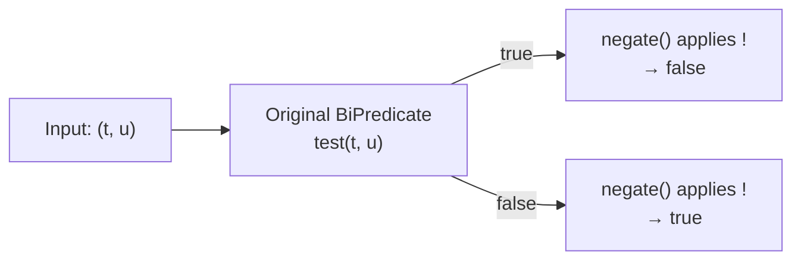
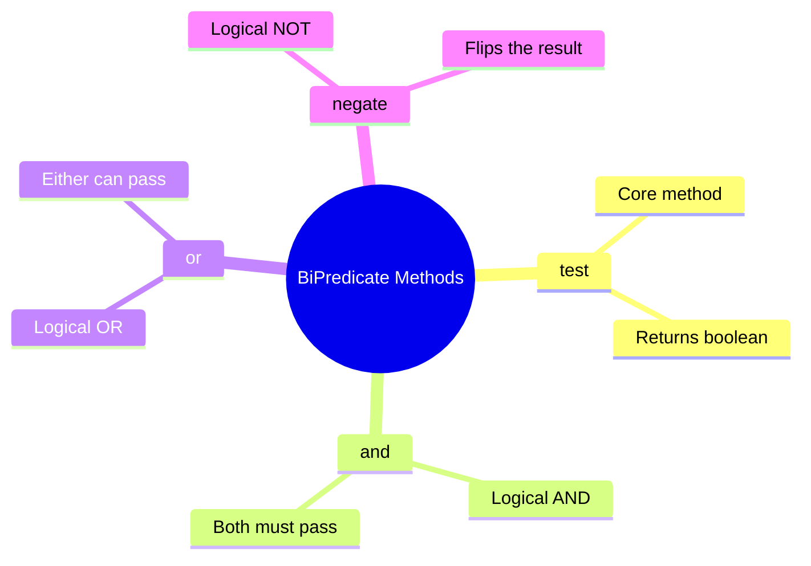

# 📘 BiPredicate negate() Method with Example

---

## 📌 Introduction

### 🧠 What is this about?
The `negate()` method on `BiPredicate` **flips the result** of a condition. If the original returns `true`, the negated version returns `false` — and vice versa. It's how you say "NOT" in functional programming.

### 🌍 Real-World Problem First
You've built a `BiPredicate` that checks if two strings are **equal**. Now you need the opposite check — are they **not equal**? You could write a whole new lambda, or you could simply call `negate()` on the existing one. One line, zero duplication.

### ❓ Why does it matter?
- Eliminates duplicate lambda expressions for opposite conditions
- Makes code read naturally: `isEqual.negate()` reads as "is NOT equal"
- Completes the boolean algebra toolkit alongside `and()` and `or()`

### 🗺️ What we'll learn (Learning Map)
- How `negate()` works internally
- Practical example: turning "equals" into "not equals"
- When to use `negate()` vs writing a new lambda

---

## 🧩 Concept 1: The negate() Method in Depth

### 🧠 Layer 1: The Simple Version
`negate()` is a "reverse switch." Whatever the original answer is, `negate()` gives you the opposite.

### 🔍 Layer 2: The Developer Version
`negate()` is a default method that returns a new `BiPredicate` wrapping the original with logical negation `!`.

```java
// Inside BiPredicate.java (actual source code)
default BiPredicate<T, U> negate() {
    return (T t, U u) -> !test(t, u);
}
```

That's it — one line. It calls the original `test()` and flips the result with `!`.

### 🌍 Layer 3: The Real-World Analogy
Think of a light switch inverter. If the original switch turns the light ON (`true`), the inverter makes it OFF (`false`). If the switch is OFF, the inverter makes it ON.

### ⚙️ Layer 4: How It Works Step-by-Step



**Truth table:**

| Original `test()` Result | After `negate()` |
|:------------------------:|:----------------:|
| `true` | `false` |
| `false` | `true` |

### 💻 Layer 5: Code — Prove It!

```java
import java.util.function.BiPredicate;

public class BiPredicateNegateExample {
    public static void main(String[] args) {
        // BiPredicate to check if two strings are equal
        BiPredicate<String, String> isEqual = (s1, s2) -> s1.equals(s2);

        // negate() to reverse — now checks if strings are NOT equal
        BiPredicate<String, String> isNotEqual = isEqual.negate();

        // "Hello" equals "Hello" → isEqual would return true → negate flips to false
        System.out.println(isNotEqual.test("Hello", "Hello"));  // Output: false

        // "Hello" does not equal "Hi" → isEqual would return false → negate flips to true
        System.out.println(isNotEqual.test("Hello", "Hi"));     // Output: true
    }
}
```

**Why this is better than writing a new lambda:**
```java
// ❌ Duplicating logic — now you have two lambdas to maintain
BiPredicate<String, String> isEqual = (s1, s2) -> s1.equals(s2);
BiPredicate<String, String> isNotEqual = (s1, s2) -> !s1.equals(s2);

// ✅ Single source of truth — negate() derives the opposite
BiPredicate<String, String> isEqual = (s1, s2) -> s1.equals(s2);
BiPredicate<String, String> isNotEqual = isEqual.negate();
```

If you later change the equality logic (e.g., to case-insensitive), the `negate()` version automatically updates. The manually written version would need a separate change.

---

### ⚠️ Pitfalls & Mistakes

**Mistake 1: Double negation confusion**
- 👤 What devs do: Call `negate()` twice thinking it adds emphasis
- 💥 Why it breaks: `negate().negate()` brings you back to the original — it's a double negative
- ✅ Fix: One `negate()` is all you need
```java
// ❌ Pointless — double negation = original
BiPredicate<String, String> same = isEqual.negate().negate();
same.test("a", "a");  // Output: true (same as isEqual!)

// ✅ Just use the original
isEqual.test("a", "a");  // Output: true
```

---

### 💡 Pro Tips

**Tip 1:** Combine `negate()` with `and()` or `or()` for readable complex conditions
```java
// "Both positive but NOT both even"
BiPredicate<Integer, Integer> positiveButNotBothEven = 
    bothPositive.and(bothEven.negate());
```

---

### ✅ Key Takeaways for This Concept

→ `negate()` flips `true` → `false` and `false` → `true`  
→ Internally it's simply `!test(t, u)` — one character of logic  
→ Prefer `negate()` over writing a duplicate lambda — single source of truth  
→ Combines beautifully with `and()` and `or()` for complex expressions

---

## 🎯 Final Summary

### 🧠 The Big Picture — Complete BiPredicate Toolkit



### ✅ Master Takeaways
→ With `and()`, `or()`, and `negate()`, you can build *any* boolean expression from simple BiPredicates  
→ All three return **new** BiPredicates — the originals are never modified  
→ This is the power of functional composition: build complex logic from simple, testable pieces  

### 🔗 What's Next?
We've mastered `BiPredicate` — the two-input boolean tester. Next, we'll explore `BiConsumer` — another "Bi" interface, but instead of returning a boolean, it **performs an action** on two inputs without returning anything. Think of it as "do something with these two values."
