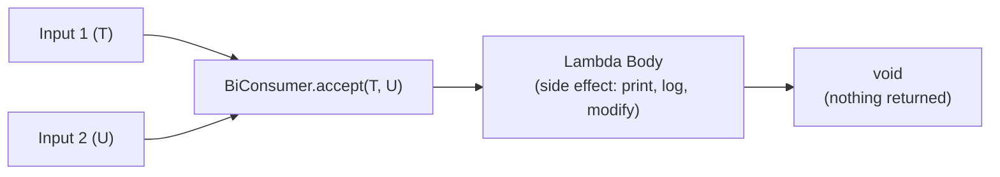
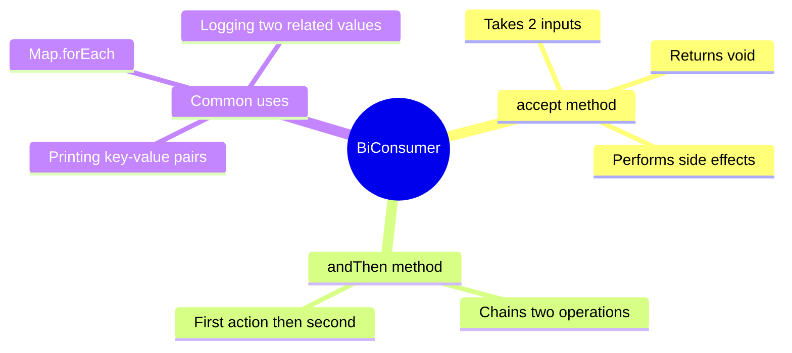

# 📘 Understanding BiConsumer Interface with Example

---

## 📌 Introduction

### 🧠 What is this about?
The `BiConsumer` interface is a functional interface that takes **two input arguments** and **returns nothing**. It *consumes* two values — performs an action like printing, logging, or modifying — without producing a result.

### 🌍 Real-World Problem First
You're building a user profile display. You need to print a user's **first name** and **last name** together. With a regular `Consumer`, you can only accept one value. You'd have to concatenate the name beforehand or use some workaround. `BiConsumer` lets you naturally accept two inputs and act on them.

### ❓ Why does it matter?
- Handles operations that naturally take two inputs (key-value pairs, coordinates, name components)
- Perfect for `Map.forEach()` which passes key and value as two arguments
- The `andThen()` method lets you chain multiple actions together

### 🗺️ What we'll learn (Learning Map)
- What `BiConsumer` is and how it differs from `Consumer`
- Using `accept()` with two arguments
- Practical examples: printing names, logging credentials
- How `BiConsumer` fits into the functional interfaces family

---

## 🧩 Concept 1: What is BiConsumer?

### 🧠 Layer 1: The Simple Version
`BiConsumer` is a worker that takes **two things** and does something with them — but doesn't hand anything back. Like a printer that takes paper and ink to produce a printed page, but you don't get the paper and ink back.

### 🔍 Layer 2: The Developer Version
`BiConsumer<T, U>` is a functional interface in `java.util.function` with one abstract method `accept(T t, U u)` that returns `void`. It has one default method `andThen()` for chaining.

```java
@FunctionalInterface
public interface BiConsumer<T, U> {
    void accept(T t, U u);                    // Core method — takes 2 inputs, returns nothing
    
    default BiConsumer<T, U> andThen(BiConsumer<? super T, ? super U> after);
}
```

### 🌍 Layer 3: The Real-World Analogy
Think of a **label printer**. You feed it two pieces of information — a **name** and an **address** — and it prints a shipping label. It doesn't return anything to you; it just *does the work*.

| Analogy Part | Technical Mapping |
|---|---|
| Label printer | `BiConsumer` instance |
| Name (input 1) | First argument `T` |
| Address (input 2) | Second argument `U` |
| Printed label (side effect) | `System.out.println()` or logging |
| No return value | `void` return type |

### ⚙️ Layer 4: How It Works Internally



### 💻 Layer 5: Code — Prove It!

**🔍 Consumer vs BiConsumer — The Key Difference:**
```java
// Consumer — one input, no return
Consumer<String> greet = name -> System.out.println("Hello, " + name);
greet.accept("Alice");  // Output: Hello, Alice

// BiConsumer — two inputs, no return
BiConsumer<String, String> greetFull = (first, last) -> 
    System.out.println("Hello, " + first + " " + last);
greetFull.accept("Alice", "Smith");  // Output: Hello, Alice Smith
```

**🔍 Practical Example — Print Name and Credentials:**
```java
import java.util.function.BiConsumer;

public class BiConsumerExample {
    public static void main(String[] args) {
        // BiConsumer to print full name
        BiConsumer<String, String> printFullName = (firstName, lastName) ->
            System.out.println("Full Name: " + firstName + " " + lastName);

        printFullName.accept("Ramesh", "Fadatare");  // Output: Full Name: Ramesh Fadatare

        // BiConsumer to print email and password (multi-statement lambda)
        BiConsumer<String, String> printCredentials = (email, password) -> {
            System.out.println("Email: " + email);
            System.out.println("Password: " + password);
        };

        printCredentials.accept("ramesh@gmail.com", "ramesh_secret");
        // Output:
        // Email: ramesh@gmail.com
        // Password: ramesh_secret
    }
}
```

**Important detail about multi-statement lambdas:** When the lambda body has **multiple statements**, you must keep the curly braces `{}`. When it has a **single statement**, you can omit them. Notice how `printFullName` has no braces but `printCredentials` does.

### 📊 Layer 6: Consumer vs BiConsumer Comparison

| Feature | `Consumer<T>` | `BiConsumer<T, U>` |
|---------|---------------|---------------------|
| Input count | 1 | 2 |
| Return type | `void` | `void` |
| Abstract method | `accept(T t)` | `accept(T t, U u)` |
| Chaining | `andThen()` | `andThen()` |
| Common use | `List.forEach()` | `Map.forEach()` |

**Why `BiConsumer` matters for Maps:** `Map.forEach()` passes both **key** and **value** to its callback, which is exactly what `BiConsumer` accepts:
```java
Map<String, Integer> scores = Map.of("Alice", 95, "Bob", 87);
scores.forEach((name, score) -> System.out.println(name + ": " + score));
// Output:
// Alice: 95
// Bob: 87
```

---

### ✅ Key Takeaways for This Concept

→ `BiConsumer<T, U>` takes two inputs and returns nothing — it's for *side effects* (printing, logging, modifying)  
→ Use `accept(T t, U u)` to invoke the BiConsumer  
→ Multi-statement lambdas need curly braces `{}`; single-statement lambdas don't  
→ `BiConsumer` is the natural fit for `Map.forEach()` operations

---

## 🎯 Final Summary

### 🧠 The Big Picture



### ✅ Master Takeaways
→ `BiConsumer` = "Do something with these two values, but don't give me anything back"  
→ It's the `void`-returning sibling of `BiFunction` (which returns a value)  
→ Perfect for key-value operations, especially with `Map.forEach()`  

### 🔗 What's Next?
We know how to use `BiConsumer` for single operations. But what if you want to **chain** two BiConsumer actions together — like first printing, then logging? That's where `andThen()` comes in. Let's explore it next.
