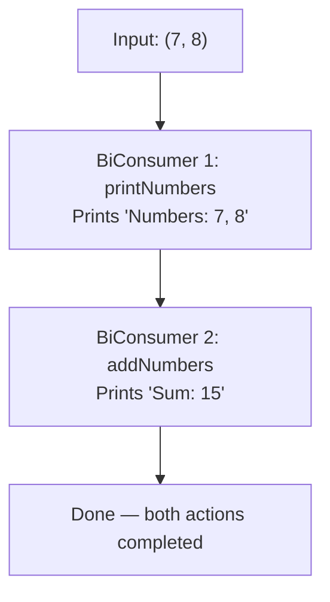

# 📘 BiConsumer andThen() Method with Example

---

## 📌 Introduction

### 🧠 What is this about?
The `andThen()` method on `BiConsumer` lets you **chain two BiConsumer operations** together. The first action executes, then the second — both receiving the same two input values. It's sequential composition for side-effect operations.

### 🌍 Real-World Problem First
You're processing a pair of numbers. First, you want to **display** them. Then, you want to **add them and show the sum**. These are two separate concerns, and you want to keep them in separate, testable BiConsumers — but execute them in sequence on the same inputs.

### ❓ Why does it matter?
- Keeps individual operations small and focused (Single Responsibility)
- Chains execute in guaranteed order — first operation, then second
- The same two inputs are passed to both operations — no data loss between steps

### 🗺️ What we'll learn (Learning Map)
- How `andThen()` works internally on BiConsumer
- Chaining two operations with a practical example
- The execution flow and ordering guarantee

---

## 🧩 Concept 1: The andThen() Method for BiConsumer

### 🧠 Layer 1: The Simple Version
`andThen()` says: "After you do your thing with these two values, let me also do my thing with the same two values."

### 🔍 Layer 2: The Developer Version
`andThen()` is a default method that accepts another `BiConsumer` and returns a new `BiConsumer`. When the combined consumer's `accept()` is called, it first runs the original, then runs the `after` consumer — both with the same arguments.

```java
// Inside BiConsumer.java (actual source code)
default BiConsumer<T, U> andThen(BiConsumer<? super T, ? super U> after) {
    Objects.requireNonNull(after);
    return (l, r) -> {
        accept(l, r);        // Step 1: run the original
        after.accept(l, r);  // Step 2: run the chained one
    };
}
```

### 🌍 Layer 3: The Real-World Analogy
Think of an **assembly line** with two stations. A car part arrives at Station 1 (paint it), then moves to Station 2 (polish it). Both stations work on the same car part, in order.

| Analogy Part | Technical Mapping |
|---|---|
| Car part | The two input arguments `(T, U)` |
| Station 1 (paint) | First `BiConsumer` |
| Station 2 (polish) | Second `BiConsumer` passed to `andThen()` |
| Assembly line order | Sequential execution guaranteed |

### ⚙️ Layer 4: How It Works Step-by-Step



**Step 1 — First BiConsumer executes:** `printNumbers.accept(7, 8)` runs → prints "Numbers: 7, 8"

**Step 2 — Second BiConsumer executes (same inputs):** `addNumbers.accept(7, 8)` runs → prints "Sum: 15"

Both receive the exact same `(7, 8)` — the inputs are not modified between steps.

### 💻 Layer 5: Code — Prove It!

```java
import java.util.function.BiConsumer;

public class AndThenBiConsumerExample {
    public static void main(String[] args) {
        // BiConsumer to print two numbers
        BiConsumer<Integer, Integer> printNumbers = (num1, num2) ->
            System.out.println("Numbers: " + num1 + ", " + num2);

        // BiConsumer to add two numbers and print the sum
        BiConsumer<Integer, Integer> addNumbers = (num1, num2) ->
            System.out.println("Sum: " + (num1 + num2));

        // Chain them: print first, then add
        BiConsumer<Integer, Integer> printAndAdd = printNumbers.andThen(addNumbers);

        printAndAdd.accept(7, 8);
        // Output:
        // Numbers: 7, 8
        // Sum: 15
    }
}
```

**Why the order matters:** `andThen()` guarantees `printNumbers` runs **before** `addNumbers`. If the first consumer threw an exception, the second would never execute.

**🔍 Chaining Multiple Operations:**
```java
BiConsumer<Integer, Integer> multiply = (a, b) ->
    System.out.println("Product: " + (a * b));

BiConsumer<Integer, Integer> allThree = printNumbers
    .andThen(addNumbers)
    .andThen(multiply);

allThree.accept(7, 8);
// Output:
// Numbers: 7, 8
// Sum: 15
// Product: 56
```

---

### ⚠️ Pitfalls & Mistakes

**Mistake 1: Expecting `andThen()` to pass the *result* of the first to the second**
- 👤 What devs do: Think the sum computed in `addNumbers` gets passed to the next consumer
- 💥 Why it breaks: `BiConsumer` returns `void` — there's no result to pass. Both consumers receive the **original inputs**.
- ✅ Fix: Understand that `andThen()` for BiConsumer is about **sequencing side effects**, not data pipelines. If you need to pass results, use `BiFunction` + `andThen()` instead.

---

### ✅ Key Takeaways for This Concept

→ `andThen()` chains two BiConsumer operations — first action, then second, same inputs  
→ Both consumers receive the **original two inputs** — nothing is passed between them  
→ Returns a **new** BiConsumer — the originals are unchanged  
→ You can chain multiple `andThen()` calls for a sequence of 3+ operations

---

## 🎯 Final Summary

### ✅ Master Takeaways
→ `andThen()` = "Do this, THEN do that" — sequential composition of side effects  
→ Internally: `(l, r) -> { first.accept(l, r); second.accept(l, r); }`  
→ Unlike `Function.andThen()`, there's no result to pipe — both get the raw inputs  

### 🔗 What's Next?
We've now covered the "Bi" variants: `BiPredicate` (test two inputs), `BiConsumer` (consume two inputs), and earlier `BiFunction` (transform two inputs). Next, we'll explore `UnaryOperator` — a specialized `Function` where the input type and output type are **the same**.
