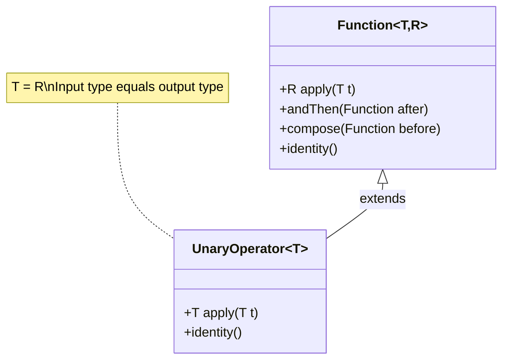
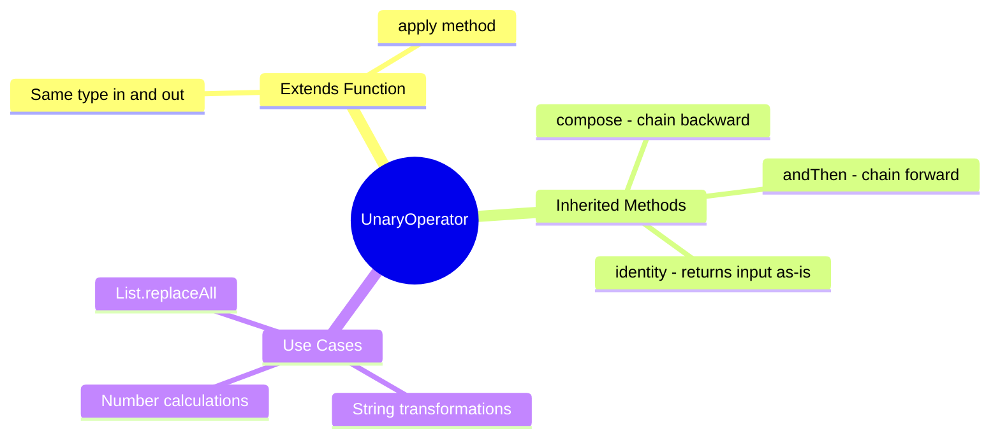

# 📘 UnaryOperator Interface with Examples

---

## 📌 Introduction

### 🧠 What is this about?
`UnaryOperator<T>` is a specialized version of `Function<T, T>` where the **input type and output type are the same**. Instead of transforming a value from one type to another, it transforms a value within the same type — like squaring a number (int → int) or uppercasing a string (String → String).

### 🌍 Real-World Problem First
You're writing a `Function<Integer, Integer>` to square a number. You declare `Function<Integer, Integer>` — notice how `Integer` appears twice? That's redundant. When both types are always the same, there should be a cleaner way to express that intent. Enter `UnaryOperator`.

### ❓ Why does it matter?
- Cleaner API: one type parameter instead of two identical ones
- Communicates intent: "this operation doesn't change the type"
- Used extensively in `List.replaceAll()`, `Stream.map()`, and other Java APIs
- Inherits `andThen()` and `compose()` from `Function`

### 🗺️ What we'll learn (Learning Map)
- How `UnaryOperator` relates to `Function`
- When to use `UnaryOperator` vs `Function`
- Chaining with `andThen()` — trim + uppercase in one pipeline
- Real examples: squaring numbers, transforming strings

---

## 🧩 Concept 1: UnaryOperator vs Function

### 🧠 Layer 1: The Simple Version
`Function` turns one thing into a *different kind* of thing (String → Integer). `UnaryOperator` turns a thing into *the same kind* of thing (String → String).

### 🔍 Layer 2: The Developer Version
`UnaryOperator<T>` extends `Function<T, T>`. It inherits `apply()`, `andThen()`, `compose()`, and `identity()` — it adds no new methods. The only difference is the **type constraint**: input and output must match.

```java
@FunctionalInterface
public interface UnaryOperator<T> extends Function<T, T> {
    // Inherits: T apply(T t)
    // Inherits: andThen(), compose(), identity()
    
    static <T> UnaryOperator<T> identity() {
        return t -> t;
    }
}
```

### 🌍 Layer 3: The Real-World Analogy
Think of **filters on a photo app**. A filter takes a photo (Image) and returns a modified photo (Image). The type doesn't change — it's still a photo — but the content transforms. That's `UnaryOperator`. A *converter* that takes a photo and returns a text description would be a `Function<Image, String>` — different types.

| Analogy Part | Technical Mapping |
|---|---|
| Photo filter (brightness, contrast) | `UnaryOperator<Image>` |
| Photo → text description converter | `Function<Image, String>` |
| Stacking filters (brightness + contrast) | `andThen()` chaining |
| Original photo | Input of type `T` |
| Filtered photo (same type) | Output of type `T` |

### ⚙️ Layer 4: How It Works Internally



**The key inheritance:** Since `UnaryOperator<T>` extends `Function<T, T>`, it can be used **anywhere** a `Function<T, T>` is expected. It's a drop-in replacement that makes your code more expressive.

### 💻 Layer 5: Code — Prove It!

**🔍 Function vs UnaryOperator — Side by Side:**
```java
// Function<Integer, Integer> — works, but redundant types
Function<Integer, Integer> squareFunction = num -> num * num;
System.out.println(squareFunction.apply(2));  // Output: 4

// UnaryOperator<Integer> — cleaner, same intent
UnaryOperator<Integer> squareOperator = num -> num * num;
System.out.println(squareOperator.apply(2));  // Output: 4
```

**Both produce identical results.** The difference is purely about expressing intent — `UnaryOperator` tells readers: "input and output types are the same."

**🔍 String Transformation Example:**
```java
UnaryOperator<String> toUpperCase = str -> str.toUpperCase();
System.out.println(toUpperCase.apply("hello"));  // Output: HELLO
```

### 📊 Layer 6: When to Use Which

| Scenario | Use This | Why |
|----------|----------|-----|
| `String → Integer` (length) | `Function<String, Integer>` | Types differ |
| `String → String` (uppercase) | `UnaryOperator<String>` | Same type in/out |
| `Integer → Integer` (square) | `UnaryOperator<Integer>` | Same type in/out |
| `Employee → String` (name) | `Function<Employee, String>` | Types differ |

**Rule of thumb:** If you're writing `Function<X, X>` with the same type twice → replace with `UnaryOperator<X>`.

---

### ✅ Key Takeaways for This Concept

→ `UnaryOperator<T>` = `Function<T, T>` — same type in, same type out  
→ Use it when you're transforming a value without changing its type  
→ Replaces `Function<X, X>` for cleaner, more intentional code  
→ Inherits all methods from `Function`: `apply()`, `andThen()`, `compose()`

---

> Now that we know what `UnaryOperator` is, let's see how to **chain** multiple operators using `andThen()`.

---

## 🧩 Concept 2: Chaining with andThen()

### 🧠 Layer 1: The Simple Version
You can snap together multiple `UnaryOperator`s so they execute in sequence — like stacking photo filters. Trim → then uppercase.

### 🔍 Layer 2: The Developer Version
Since `UnaryOperator` extends `Function`, it inherits `andThen()`. When you call `operatorA.andThen(operatorB)`, it creates a new operator that first applies A to the input, then applies B to A's result.

### ⚙️ Layer 4: How the Chain Executes


**Step 1 — trim executes:** Input `"  hello  "` → trim removes leading/trailing spaces → `"hello"`

**Step 2 — toUpperCase executes on Step 1's result:** `"hello"` → `"HELLO"`

### 💻 Layer 5: Code — Prove It!

```java
import java.util.function.UnaryOperator;

public class UnaryOperatorChainingExample {
    public static void main(String[] args) {
        // Operator 1: trim whitespace
        UnaryOperator<String> trim = str -> str.trim();

        // Operator 2: convert to uppercase
        UnaryOperator<String> toUpperCase = str -> str.toUpperCase();

        // Chain: trim first, THEN uppercase
        UnaryOperator<String> trimAndUpperCase = trim.andThen(toUpperCase)::apply;

        System.out.println(trimAndUpperCase.apply("  hello  "));  // Output: HELLO
    }
}
```

**Why the method reference `::apply`?** The `andThen()` method on `Function` returns a `Function<T, T>`, not `UnaryOperator<T>`. To assign it back to a `UnaryOperator`, we use `::apply` to convert. Alternatively:

```java
// Alternative — store as Function (no conversion needed)
Function<String, String> trimAndUpperCase = trim.andThen(toUpperCase);
System.out.println(trimAndUpperCase.apply("  hello  "));  // Output: HELLO
```

---

### ⚠️ Pitfalls & Mistakes

**Mistake 1: Using `Function<X, X>` when types are the same**
- 👤 What devs do: Write `Function<String, String>` out of habit
- 💥 Why it breaks: It doesn't *break*, but it's a missed opportunity for clearer code
- ✅ Fix: Use `UnaryOperator<String>` to signal "same type transformation"

```java
// ❌ Works but unclear intent
Function<String, String> transform = s -> s.toUpperCase();

// ✅ Clear intent — "this doesn't change the type"
UnaryOperator<String> transform = s -> s.toUpperCase();
```

---

### ✅ Key Takeaways for This Concept

→ `andThen()` chains operators: A.andThen(B) = first A, then B on A's result  
→ The output of operator A becomes the input of operator B  
→ `andThen()` returns `Function<T, T>`, so you may need a method reference to assign back to `UnaryOperator`

---

## 🎯 Final Summary

### 🧠 The Big Picture



### ✅ Master Takeaways
→ `UnaryOperator<T>` = `Function<T, T>` — use it when input and output types match  
→ It's not a new concept — it's `Function` with a type constraint  
→ Chaining with `andThen()` creates clean transformation pipelines  
→ Whenever you see `Function<X, X>`, refactor to `UnaryOperator<X>`

### 🔗 What's Next?
`UnaryOperator` works with one input. But what if you need to combine **two values of the same type** and return the same type? That's `BinaryOperator` — the two-input version. Let's explore it next.
