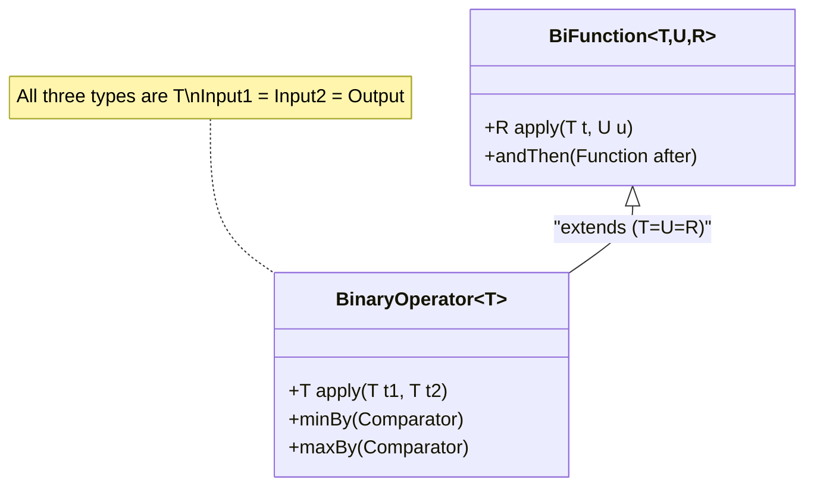
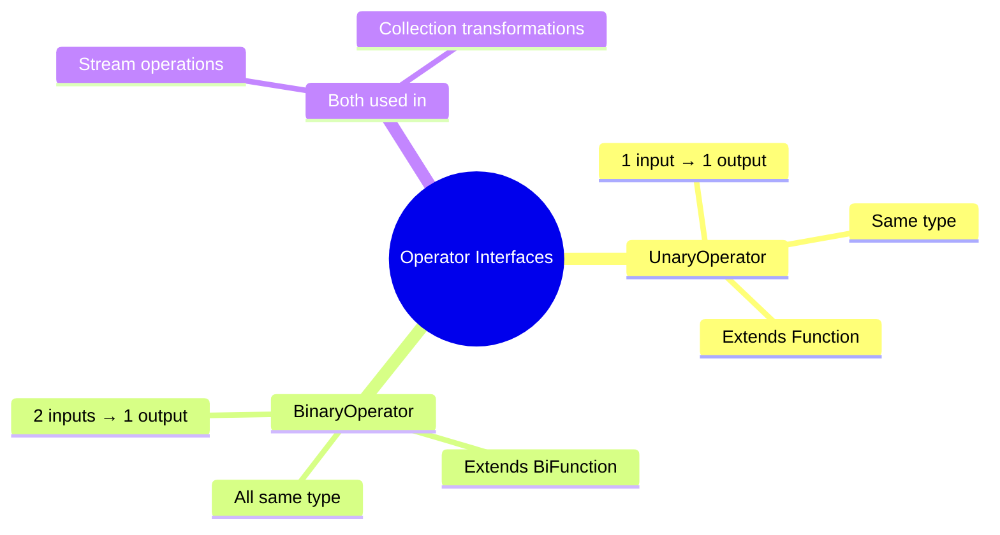

# 📘 BinaryOperator Interface with Examples

---

## 📌 Introduction

### 🧠 What is this about?
`BinaryOperator<T>` is a specialized version of `BiFunction<T, T, T>` where **both input types AND the output type are the same**. It takes two values of the same type, combines or processes them, and returns a result of that same type.

### 🌍 Real-World Problem First
You need to add two integers and return an integer. With `BiFunction<Integer, Integer, Integer>`, you'd write `Integer` three times — once for each input and once for the output. That's noisy. When all three types are identical, there should be a simpler way. `BinaryOperator<Integer>` says it all with one type parameter.

### ❓ Why does it matter?
- Cleaner than `BiFunction<T, T, T>` when all types match
- Used in `Stream.reduce()` — one of the most powerful stream operations
- Natural fit for arithmetic, string concatenation, collection merging
- Provides `minBy()` and `maxBy()` static methods

### 🗺️ What we'll learn (Learning Map)
- How `BinaryOperator` relates to `BiFunction`
- When to use `BinaryOperator` vs `BiFunction`
- Examples: addition, string concatenation, list merging
- The Operator family tree

---

## 🧩 Concept 1: BinaryOperator vs BiFunction

### 🧠 Layer 1: The Simple Version
`BiFunction` takes two things and produces a *potentially different* thing. `BinaryOperator` takes two things of the *same kind* and produces the *same kind*.

### 🔍 Layer 2: The Developer Version
`BinaryOperator<T>` extends `BiFunction<T, T, T>`. It inherits `apply(T t1, T t2)` and `andThen()`. The only constraint: input types and output type must all be `T`.

```java
@FunctionalInterface
public interface BinaryOperator<T> extends BiFunction<T, T, T> {
    // Inherits: T apply(T t1, T t2)
    // Inherits: andThen()
    
    static <T> BinaryOperator<T> minBy(Comparator<? super T> comparator);
    static <T> BinaryOperator<T> maxBy(Comparator<? super T> comparator);
}
```

### 🌍 Layer 3: The Real-World Analogy
Think of a **blender**. You put in two fruits (same category: fruit) and get out a smoothie (still food/drink). The "type" stays consistent. A `BiFunction` would be more like putting in fruits and getting out a number (calorie count) — different output type.

| Analogy Part | Technical Mapping |
|---|---|
| Two fruits (same type) | Two inputs of type `T` |
| Blender | `BinaryOperator` |
| Smoothie (still food) | Output of type `T` |
| Calorie calculator (fruit → number) | `BiFunction<Fruit, Fruit, Integer>` |

### ⚙️ Layer 4: How It Works Internally



### 💻 Layer 5: Code — Prove It!

**🔍 BiFunction vs BinaryOperator — Side by Side:**
```java
// BiFunction — three type parameters (all Integer)
BiFunction<Integer, Integer, Integer> addBiFunc = (a, b) -> a + b;
System.out.println(addBiFunc.apply(10, 20));  // Output: 30

// BinaryOperator — one type parameter (cleaner!)
BinaryOperator<Integer> addBinOp = (a, b) -> a + b;
System.out.println(addBinOp.apply(10, 20));   // Output: 30
```

**Both produce identical results.** `BinaryOperator` is simply cleaner when types match.

### 📊 Layer 6: Comparison

| Feature | `BiFunction<T, U, R>` | `BinaryOperator<T>` |
|---------|----------------------|----------------------|
| Type parameters | 3 (can differ) | 1 (all same) |
| Use when | Types differ | Types match |
| Example | `BiFunction<String, String, Integer>` | `BinaryOperator<Integer>` |
| Extends | — | `BiFunction<T, T, T>` |

**Rule of thumb:** If you're writing `BiFunction<X, X, X>` with the same type three times → replace with `BinaryOperator<X>`.

---

### ✅ Key Takeaways for This Concept

→ `BinaryOperator<T>` = `BiFunction<T, T, T>` — all types match  
→ Drop-in replacement wherever `BiFunction<X, X, X>` is used  
→ Extends `BiFunction`, so inherits `apply()` and `andThen()`

---

> Now let's see `BinaryOperator` in action with different data types.

---

## 🧩 Concept 2: Practical Examples

### 🧠 Layer 1: The Simple Version
`BinaryOperator` isn't just for numbers — you can use it with strings, lists, and any type where two inputs produce the same type output.

### 💻 Layer 5: Code — Prove It!

**🔍 String Concatenation:**
```java
BinaryOperator<String> fullName = (first, last) -> first + " " + last;
System.out.println(fullName.apply("Ramesh", "Fadatare"));  // Output: Ramesh Fadatare
```

**🔍 Merging Two Lists:**
```java
import java.util.function.BinaryOperator;
import java.util.*;

public class BinaryOperatorListExample {
    public static void main(String[] args) {
        List<Integer> list1 = Arrays.asList(1, 2, 3, 4, 5);
        List<Integer> list2 = Arrays.asList(6, 7, 8, 9, 10);

        BinaryOperator<List<Integer>> mergeLists = (l1, l2) -> {
            List<Integer> merged = new ArrayList<>(l1);  // Copy list1
            merged.addAll(l2);                            // Add all from list2
            return merged;                                // Return combined list
        };

        List<Integer> result = mergeLists.apply(list1, list2);
        System.out.println(result);  // Output: [1, 2, 3, 4, 5, 6, 7, 8, 9, 10]
    }
}
```

**Why this works with `BinaryOperator`:** Both inputs are `List<Integer>` and the output is also `List<Integer>`. All three types match — perfect for `BinaryOperator`.

**🔍 Used with Stream.reduce():**
```java
List<Integer> numbers = List.of(1, 2, 3, 4, 5);
BinaryOperator<Integer> sum = (a, b) -> a + b;
int total = numbers.stream().reduce(0, sum);
System.out.println(total);  // Output: 15
```

This is where `BinaryOperator` truly shines — `reduce()` requires a `BinaryOperator` to combine elements.

---

### ⚠️ Pitfalls & Mistakes

**Mistake 1: Using `BinaryOperator` when types differ**
- 👤 What devs do: Try to use `BinaryOperator` for `(String, String) → Integer`
- 💥 Why it breaks: `BinaryOperator<T>` requires all types to be `T`. Different output type = compile error.
- ✅ Fix: Use `BiFunction<String, String, Integer>` when types differ

```java
// ❌ Compile error — BinaryOperator needs same type for all
BinaryOperator<String> toLength = (s1, s2) -> s1.length() + s2.length(); // Returns int, not String!

// ✅ Use BiFunction when output type differs
BiFunction<String, String, Integer> toLength = (s1, s2) -> s1.length() + s2.length();
```

---

### ✅ Key Takeaways for This Concept

→ `BinaryOperator` works with any type: numbers, strings, lists, custom objects  
→ Perfect for `Stream.reduce()` which requires combining same-typed elements  
→ Use `BiFunction` when the output type differs from input types

---

## 🎯 Final Summary

### 🧠 The Big Picture — The Operator Family



### ✅ Master Takeaways
→ `BinaryOperator<T>` takes two `T` values and returns a `T` — all types identical  
→ It extends `BiFunction<T, T, T>` — use it to simplify triple-typed declarations  
→ The star use case is `Stream.reduce()` — reducing a stream to a single value  
→ `UnaryOperator` = one input same type; `BinaryOperator` = two inputs same type

### 🔗 What's Next?
We've covered the core functional interfaces and their "Bi" and "Operator" variants. But all of these use **wrapper types** (Integer, Long, Double) which involve autoboxing overhead. Next, we'll explore **primitive functional interfaces** — specialized versions that work directly with `int`, `long`, and `double` without boxing.
