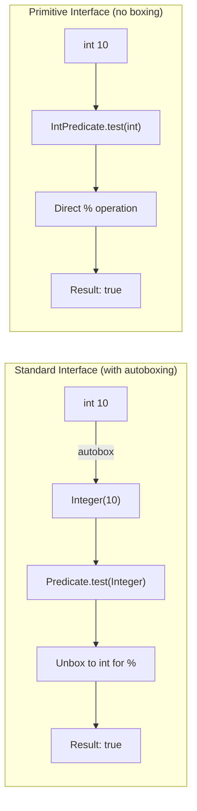
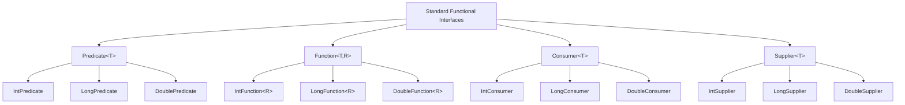
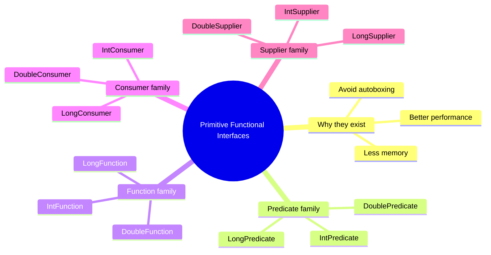

# 📘 Introduction to Primitive Functional Interfaces

---

## 📌 Introduction

### 🧠 What is this about?
Primitive functional interfaces are specialized versions of the standard functional interfaces (`Function`, `Predicate`, `Consumer`, `Supplier`) that work **directly with primitive types** (`int`, `long`, `double`) — avoiding the performance overhead of autoboxing.

### 🌍 Real-World Problem First
You're using `Predicate<Integer>` to check if numbers are even in a stream of 10 million values. Every time you pass an `int` to `test()`, Java silently wraps it into an `Integer` object (autoboxing). That's 10 million tiny object allocations — eating memory and slowing your code. What if you could skip the wrapping entirely?

### ❓ Why does it matter?
- **Autoboxing overhead:** Every `int → Integer` conversion creates an object on the heap
- **Memory waste:** An `Integer` object takes ~16 bytes vs 4 bytes for a raw `int`
- **GC pressure:** Millions of wrapper objects mean more garbage collection pauses
- **Solution:** Primitive functional interfaces bypass autoboxing completely

### 🗺️ What we'll learn (Learning Map)
- What autoboxing is and why it's a problem
- The complete family of primitive functional interfaces
- Which primitive interface maps to which standard interface
- When to use primitive vs standard interfaces

---

## 🧩 Concept 1: The Autoboxing Problem

### 🧠 Layer 1: The Simple Version
Java generics (like `Predicate<T>`) can't work with primitive types directly — they need objects. So when you pass an `int`, Java secretly wraps it in an `Integer` box. This "boxing" has a cost.

### 🔍 Layer 2: The Developer Version
**Autoboxing** is the automatic conversion of a primitive type (`int`, `long`, `double`) into its corresponding wrapper class (`Integer`, `Long`, `Double`). **Unboxing** is the reverse. Both happen silently wherever generics are used.

```java
Predicate<Integer> isEven = n -> n % 2 == 0;
isEven.test(10);  // 10 (int) → autoboxed to Integer(10) → passed to test()
```

### 🌍 Layer 3: The Real-World Analogy
Imagine you're shipping individual apples. Instead of tossing them in a truck directly (primitives), someone insists on putting each apple in its own decorative gift box first (autoboxing), then loading the boxes. For 10 apples, who cares? For 10 million apples, you've wasted a fortune on boxes and doubled your loading time.

| Analogy Part | Technical Mapping |
|---|---|
| Raw apple | Primitive `int` (4 bytes) |
| Gift box | `Integer` wrapper object (~16 bytes) |
| Boxing each apple | Autoboxing (`int` → `Integer`) |
| Shipping directly | Using `IntPredicate` (no boxing) |
| Wasted boxes in the garbage | GC collecting unused wrappers |

### ⚙️ Layer 4: The Performance Impact



The primitive path skips two conversions — the autobox going in and the unbox for computation. With millions of calls, this difference is significant.

### 💻 Layer 5: Code — Prove It!

```java
// ❌ Standard interface — autoboxing on every call
Predicate<Integer> isEvenBoxed = n -> n % 2 == 0;
isEvenBoxed.test(10);  // int 10 → Integer(10) → test() → unbox → 10 % 2

// ✅ Primitive interface — zero boxing
IntPredicate isEvenPrimitive = n -> n % 2 == 0;
isEvenPrimitive.test(10);  // int 10 → test(int) → 10 % 2 — no wrapping!
```

---

### ✅ Key Takeaways for This Concept

→ Autoboxing converts primitives to wrapper objects automatically — it's invisible but costly  
→ Each wrapper object takes ~4x the memory of its primitive  
→ In hot loops and streams, autoboxing creates millions of throwaway objects  
→ Primitive functional interfaces eliminate this overhead entirely

---

> Now that we understand *why* primitive interfaces exist, let's see the complete family.

---

## 🧩 Concept 2: The Primitive Functional Interface Family

### 🧠 Layer 1: The Simple Version
Java provides primitive versions of the four core functional interfaces, each supporting `int`, `long`, and `double`.

### 🔍 Layer 2: The Developer Version

| Standard Interface | Primitive Versions | What it does |
|---|---|---|
| `Predicate<T>` | `IntPredicate`, `LongPredicate`, `DoublePredicate` | Test a condition → `boolean` |
| `Function<T, R>` | `IntFunction<R>`, `LongFunction<R>`, `DoubleFunction<R>` | Transform a primitive → result |
| `Consumer<T>` | `IntConsumer`, `LongConsumer`, `DoubleConsumer` | Consume a primitive → void |
| `Supplier<T>` | `IntSupplier`, `LongSupplier`, `DoubleSupplier` | Supply a primitive → value |

**The naming pattern:** Prefix the standard interface name with the primitive type. `Int` + `Predicate` = `IntPredicate`.

### ⚙️ Layer 4: Visual Overview



### 💻 Layer 5: Code — Quick Comparison

```java
// Standard                          →  Primitive
Predicate<Integer> p = n -> n > 0;   →  IntPredicate p = n -> n > 0;
Function<Integer, String> f = ...;   →  IntFunction<String> f = ...;
Consumer<Integer> c = n -> ...;      →  IntConsumer c = n -> ...;
Supplier<Integer> s = () -> ...;     →  IntSupplier s = () -> ...;
```

**Notice:** Primitive interfaces don't need type parameters for the primitive part — `IntPredicate` has no generics at all. `IntFunction<R>` only needs the *output* type.

---

### 💡 Pro Tips

**Tip 1:** Use primitive interfaces with streams for maximum performance
```java
// ❌ Uses Stream<Integer> — autoboxing
List.of(1, 2, 3).stream().filter(n -> n > 1);

// ✅ Uses IntStream — no autoboxing
IntStream.of(1, 2, 3).filter(n -> n > 1);
```

**Tip 2:** When to stay with standard interfaces
- When your data is already wrapped (e.g., `List<Integer>`)
- When you need `null` values (primitives can't be null)
- When the performance gain doesn't matter (small data sets)

---

### ✅ Key Takeaways for This Concept

→ 12 primitive functional interfaces: 4 standard × 3 primitive types  
→ Naming convention: `{PrimitiveType}{InterfaceName}` (e.g., `IntPredicate`)  
→ Use them when working with `int`, `long`, or `double` in performance-sensitive code  
→ They integrate with `IntStream`, `LongStream`, and `DoubleStream`

---

## 🎯 Final Summary

### 🧠 The Big Picture



### ✅ Master Takeaways
→ Autoboxing is the silent performance killer — primitive interfaces are the cure  
→ Use `IntXxx`, `LongXxx`, `DoubleXxx` when working directly with primitives  
→ The biggest win is in streams and loops processing millions of values  
→ All are in the `java.util.function` package

### 🔗 What's Next?
Now that we know the overview, let's dive into each family starting with **IntPredicate, LongPredicate, and DoublePredicate** — seeing concrete examples of each.
