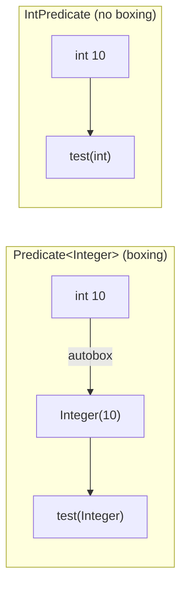
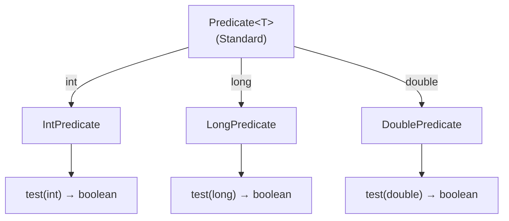

# 📘 IntPredicate, LongPredicate, and DoublePredicate Interfaces

---

## 📌 Introduction

### 🧠 What is this about?
`IntPredicate`, `LongPredicate`, and `DoublePredicate` are primitive versions of the standard `Predicate<T>` interface — they test a condition on a primitive value and return `boolean`, without the autoboxing overhead.

### 🌍 Real-World Problem First
You're filtering a stream of 1 million sensor readings (all `double` values) to find those above a threshold. Using `Predicate<Double>`, every reading gets boxed into a `Double` object. With `DoublePredicate`, you work with raw `double` values — no boxing, no garbage, faster execution.

### ❓ Why does it matter?
- `IntPredicate` → works with `int` directly (no `Integer` boxing)
- `LongPredicate` → works with `long` directly (no `Long` boxing)
- `DoublePredicate` → works with `double` directly (no `Double` boxing)
- All three eliminate autoboxing overhead in conditional checks

### 🗺️ What we'll learn (Learning Map)
- How each primitive predicate replaces its standard counterpart
- `IntPredicate` example: checking even numbers
- `LongPredicate` example: checking positive values
- `DoublePredicate` example: comparing against a threshold

---

## 🧩 Concept 1: IntPredicate — Avoiding Integer Boxing

### 🧠 Layer 1: The Simple Version
`IntPredicate` is a yes/no checker for `int` values that doesn't waste time wrapping them in `Integer` objects.

### 🔍 Layer 2: The Developer Version
`IntPredicate` has a single abstract method `test(int value)` that takes a raw `int` (not `Integer`) and returns `boolean`. No generics needed.

```java
@FunctionalInterface
public interface IntPredicate {
    boolean test(int value);     // Takes primitive int directly
    
    default IntPredicate and(IntPredicate other);
    default IntPredicate or(IntPredicate other);
    default IntPredicate negate();
}
```

### ⚙️ Layer 4: Standard vs Primitive — Side by Side



### 💻 Layer 5: Code — Prove It!

```java
import java.util.function.Predicate;
import java.util.function.IntPredicate;

public class IntPredicateExample {
    public static void main(String[] args) {
        // ❌ Standard Predicate — autoboxing occurs when passing primitive int
        Predicate<Integer> isEvenBoxed = n -> n % 2 == 0;
        System.out.println(isEvenBoxed.test(10));  // Output: true (10 autoboxed to Integer)
        System.out.println(isEvenBoxed.test(15));  // Output: false

        // ✅ IntPredicate — no autoboxing, works with int directly
        IntPredicate isEven = n -> n % 2 == 0;
        System.out.println(isEven.test(10));  // Output: true (raw int, no boxing)
        System.out.println(isEven.test(15));  // Output: false
    }
}
```

**The difference:** With `Predicate<Integer>`, calling `test(10)` autoboxes `10` into `new Integer(10)` before evaluation. With `IntPredicate`, `10` stays as a raw `int` the entire time.

---

### ✅ Key Takeaways for This Concept

→ Replace `Predicate<Integer>` with `IntPredicate` for zero-boxing boolean checks on `int`  
→ Same methods available: `test()`, `and()`, `or()`, `negate()`  
→ No generic type parameter needed — it's always `int`

---

> IntPredicate handles `int` values. What about `long`? Let's see `LongPredicate`.

---

## 🧩 Concept 2: LongPredicate — For Long Values

### 🧠 Layer 1: The Simple Version
`LongPredicate` is like `IntPredicate` but for `long` values — useful for IDs, timestamps, and large counters.

### 🔍 Layer 2: The Developer Version
`LongPredicate` has `test(long value)` that takes a raw `long` primitive.

```java
@FunctionalInterface
public interface LongPredicate {
    boolean test(long value);  // Takes primitive long directly
}
```

### 💻 Layer 5: Code — Prove It!

```java
import java.util.function.LongPredicate;

public class LongPredicateExample {
    public static void main(String[] args) {
        // LongPredicate to check if a number is positive
        LongPredicate isPositive = num -> num > 0;

        System.out.println(isPositive.test(100L));   // Output: true
        System.out.println(isPositive.test(-100L));  // Output: false
    }
}
```

**When to use:** Checking timestamps (`System.currentTimeMillis()`), validating database IDs, range checks on counters — any `long` condition.

---

### ✅ Key Takeaways for This Concept

→ `LongPredicate` = `Predicate<Long>` without autoboxing  
→ Append `L` to long literals: `100L`, `-100L`  
→ Ideal for timestamp checks, ID validation, large number conditions

---

> Now let's complete the trio with `DoublePredicate` for floating-point checks.

---

## 🧩 Concept 3: DoublePredicate — For Double Values

### 🧠 Layer 1: The Simple Version
`DoublePredicate` tests conditions on `double` values — temperatures, prices, measurements — without boxing.

### 🔍 Layer 2: The Developer Version
`DoublePredicate` has `test(double value)` that takes a raw `double` primitive.

```java
@FunctionalInterface
public interface DoublePredicate {
    boolean test(double value);  // Takes primitive double directly
}
```

### 💻 Layer 5: Code — Prove It!

```java
import java.util.function.DoublePredicate;

public class DoublePredicateExample {
    public static void main(String[] args) {
        // DoublePredicate to check if a number is greater than 10.0
        DoublePredicate isGreaterThanTen = num -> num > 10.0;

        System.out.println(isGreaterThanTen.test(15.5));  // Output: true
        System.out.println(isGreaterThanTen.test(9.5));   // Output: false
    }
}
```

**When to use:** Temperature thresholds, price comparisons, scientific measurements — any `double` condition.

---

### ✅ Key Takeaways for This Concept

→ `DoublePredicate` = `Predicate<Double>` without autoboxing  
→ Use decimal values: `10.0`, `15.5`  
→ Ideal for financial calculations, sensor readings, scientific data

---

## 🎯 Final Summary

### 🧠 The Big Picture



### 📊 Quick Reference

| Interface | Input Type | Method | Use For |
|-----------|-----------|--------|---------|
| `IntPredicate` | `int` | `test(int)` | Even/odd, ranges, counts |
| `LongPredicate` | `long` | `test(long)` | IDs, timestamps, counters |
| `DoublePredicate` | `double` | `test(double)` | Prices, temperatures, measurements |

### ✅ Master Takeaways
→ All three are primitive versions of `Predicate` — same concept, no autoboxing  
→ All support composition: `and()`, `or()`, `negate()`  
→ Use `IntPredicate` for `int`, `LongPredicate` for `long`, `DoublePredicate` for `double`  
→ The performance gain matters most with large data sets and streams

### 🔗 What's Next?
We've covered primitive predicates. Next, we'll look at **IntFunction, LongFunction, and DoubleFunction** — the primitive versions of `Function` that transform primitive values into results without autoboxing.
