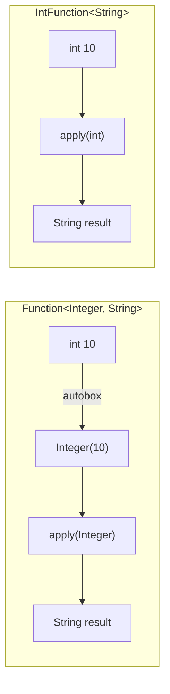
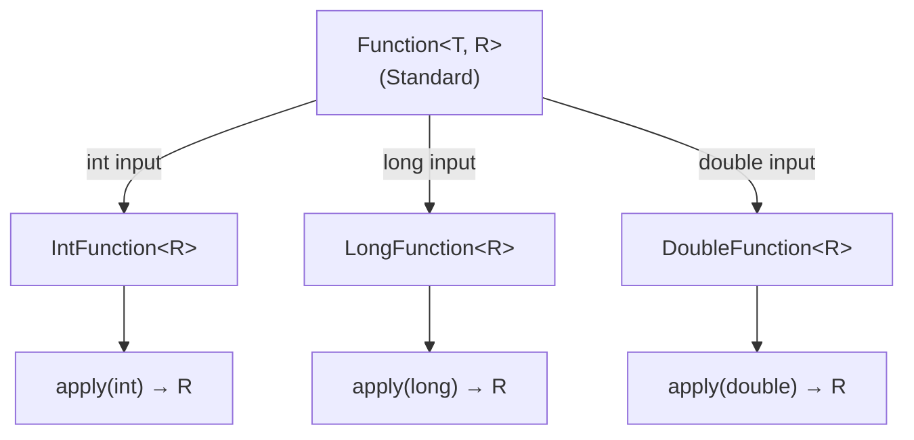

# 📘 IntFunction, LongFunction, and DoubleFunction Interfaces

---

## 📌 Introduction

### 🧠 What is this about?
`IntFunction<R>`, `LongFunction<R>`, and `DoubleFunction<R>` are primitive versions of the `Function<T, R>` interface. They take a **primitive input** (`int`, `long`, or `double`) and return a **result of any type** `R` — without autoboxing the input.

### 🌍 Real-World Problem First
You need a function that converts an integer employee ID into a formatted string like `"Employee #42"`. With `Function<Integer, String>`, every `int` ID gets autoboxed to `Integer`. With `IntFunction<String>`, the `int` goes straight in — no wrapping needed.

### ❓ Why does it matter?
- The **input** side avoids autoboxing — the primitive goes directly into the function
- The **output** side stays flexible — you can return any type `R`
- Used in stream operations like `IntStream.mapToObj()`

### 🗺️ What we'll learn (Learning Map)
- How each primitive function replaces its standard counterpart
- `IntFunction<R>` example: int → String conversion
- `LongFunction<R>` example: radius → area calculation
- `DoubleFunction<R>` example: price → discounted price

---

## 🧩 Concept 1: IntFunction — Primitive Int Input, Any Output

### 🧠 Layer 1: The Simple Version
`IntFunction<R>` takes a raw `int` and returns whatever type you want. The `int` input never gets boxed.

### 🔍 Layer 2: The Developer Version
`IntFunction<R>` has a single abstract method `apply(int value)` that returns type `R`. Notice: only the *output* type `R` is generic — the input is always `int`.

```java
@FunctionalInterface
public interface IntFunction<R> {
    R apply(int value);  // Primitive int in, any type R out
}
```

### ⚙️ Layer 4: Standard vs Primitive



### 💻 Layer 5: Code — Prove It!

```java
import java.util.function.Function;
import java.util.function.IntFunction;

public class IntFunctionExample {
    public static void main(String[] args) {
        // ❌ Standard Function — autoboxing on input
        Function<Integer, String> intToStringBoxed = num -> "Number: " + num;
        System.out.println(intToStringBoxed.apply(10));  // Output: Number: 10

        // ✅ IntFunction — no autoboxing on input
        IntFunction<String> intToString = num -> "Number: " + num;
        System.out.println(intToString.apply(10));  // Output: Number: 10
    }
}
```

**Key difference:** `IntFunction` removes the need for `Integer` as the input type parameter. The `int` is passed directly to `apply()`.

---

### ✅ Key Takeaways for This Concept

→ `IntFunction<R>` = `Function<Integer, R>` without autoboxing the input  
→ The output type `R` is still flexible — return String, List, or anything  
→ Use when transforming `int` values into other types

---

> Now let's see `LongFunction` for `long` inputs.

---

## 🧩 Concept 2: LongFunction — For Long Inputs

### 🧠 Layer 1: The Simple Version
`LongFunction<R>` takes a raw `long` and returns any type. Perfect for converting large numeric values into other forms.

### 🔍 Layer 2: The Developer Version

```java
@FunctionalInterface
public interface LongFunction<R> {
    R apply(long value);  // Primitive long in, any type R out
}
```

### 💻 Layer 5: Code — Prove It!

```java
import java.util.function.LongFunction;

public class LongFunctionExample {
    public static void main(String[] args) {
        // LongFunction to calculate area of circle given radius
        LongFunction<Double> areaOfCircle = radius -> Math.PI * radius * radius;

        System.out.println("Area of circle: " + areaOfCircle.apply(10));
        // Output: Area of circle: 314.1592653589793
    }
}
```

**Why `LongFunction<Double>` here?** The input (radius) is a `long` primitive — no boxing. The output is a `Double` object (the result type `R` can be any object type). If you wanted to avoid boxing on the output too, you'd use `LongToDoubleFunction` instead.

---

### ✅ Key Takeaways for This Concept

→ `LongFunction<R>` = `Function<Long, R>` without autoboxing the input  
→ Use for timestamp conversions, ID lookups, large number transformations  
→ The output type remains generic — return any object type

---

> Finally, let's see `DoubleFunction` for `double` inputs.

---

## 🧩 Concept 3: DoubleFunction — For Double Inputs

### 🧠 Layer 1: The Simple Version
`DoubleFunction<R>` takes a raw `double` and returns any type. Ideal for financial calculations and scientific computations.

### 🔍 Layer 2: The Developer Version

```java
@FunctionalInterface
public interface DoubleFunction<R> {
    R apply(double value);  // Primitive double in, any type R out
}
```

### 💻 Layer 5: Code — Prove It!

```java
import java.util.function.DoubleFunction;

public class DoubleFunctionExample {
    public static void main(String[] args) {
        // DoubleFunction to calculate discounted price (20% off)
        DoubleFunction<Double> calculateDiscount = price -> price * 0.80;

        System.out.println(calculateDiscount.apply(123.75));
        // Output: 99.0
    }
}
```

**When to use:** Price calculations, unit conversions, applying percentages — any `double` → result transformation.

---

### ✅ Key Takeaways for This Concept

→ `DoubleFunction<R>` = `Function<Double, R>` without autoboxing the input  
→ The `double` primitive goes directly into `apply()` — no `Double` wrapper  
→ Use for financial, scientific, or measurement computations

---

## 🎯 Final Summary

### 🧠 The Big Picture



### 📊 Quick Reference

| Interface | Input Type | Output Type | Method | Example Use |
|-----------|-----------|-------------|--------|-------------|
| `IntFunction<R>` | `int` | Any `R` | `apply(int)` | ID → String conversion |
| `LongFunction<R>` | `long` | Any `R` | `apply(long)` | Radius → area calculation |
| `DoubleFunction<R>` | `double` | Any `R` | `apply(double)` | Price → discount calculation |

### ✅ Master Takeaways
→ Primitive function interfaces avoid autoboxing on the **input** side  
→ The output type `R` remains generic — return whatever you need  
→ Use when the input is naturally a primitive type (`int`, `long`, `double`)  
→ For fully primitive operations (e.g., `int → double`), use specialized interfaces like `IntToDoubleFunction`

### 🔗 What's Next?
We've covered primitive predicates and functions. Next, let's look at **IntConsumer, LongConsumer, and DoubleConsumer** — the primitive versions of `Consumer` that perform side effects on primitive values without autoboxing.
