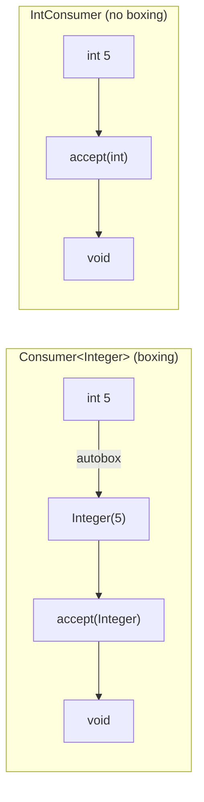
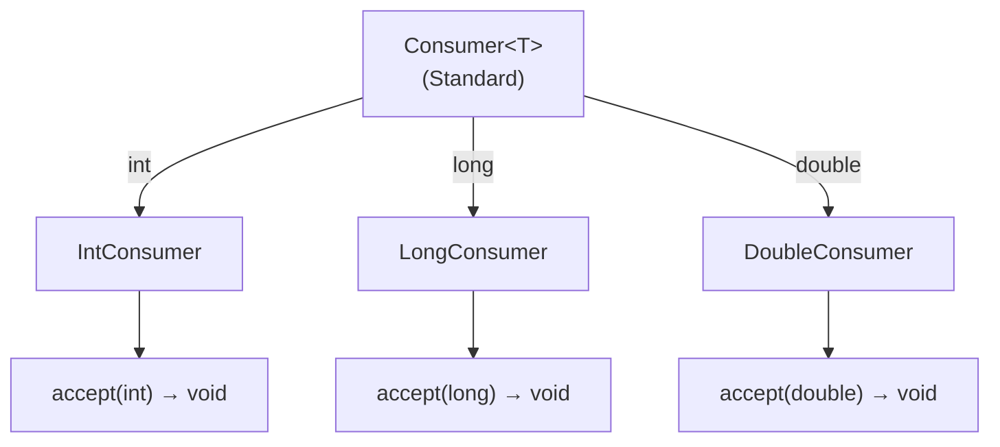

# 📘 IntConsumer, LongConsumer, and DoubleConsumer Interfaces

---

## 📌 Introduction

### 🧠 What is this about?
`IntConsumer`, `LongConsumer`, and `DoubleConsumer` are primitive versions of the `Consumer<T>` interface. They **consume** a primitive value (perform an action like printing or logging) **without returning anything** — and without the autoboxing overhead.

### 🌍 Real-World Problem First
You're logging every integer transaction ID in a high-throughput system. Using `Consumer<Integer>`, each `int` ID gets autoboxed to an `Integer` object. In a system processing millions of transactions, that's millions of unnecessary object allocations. `IntConsumer` takes the raw `int` directly.

### ❓ Why does it matter?
- Eliminates autoboxing for void operations on primitives
- Used in `IntStream.forEach()`, `LongStream.forEach()`, `DoubleStream.forEach()`
- Memory efficient for high-volume logging, printing, and side-effect operations

### 🗺️ What we'll learn (Learning Map)
- `IntConsumer` example: printing values
- `LongConsumer` example: logging timestamps
- `DoubleConsumer` example: recording expenses
- When to use each variant

---

## 🧩 Concept 1: IntConsumer — Consuming int Values

### 🧠 Layer 1: The Simple Version
`IntConsumer` takes an `int` and does something with it (print, log, store) — but doesn't give anything back.

### 🔍 Layer 2: The Developer Version

```java
@FunctionalInterface
public interface IntConsumer {
    void accept(int value);  // Primitive int in, nothing out
    
    default IntConsumer andThen(IntConsumer after);
}
```

### ⚙️ Layer 4: Standard vs Primitive



### 💻 Layer 5: Code — Prove It!

```java
import java.util.function.Consumer;
import java.util.function.IntConsumer;

public class IntConsumerExample {
    public static void main(String[] args) {
        // ❌ Standard Consumer — autoboxing occurs
        Consumer<Integer> printValueBoxed = val -> System.out.println("Value: " + val);
        printValueBoxed.accept(5);  // int 5 autoboxed to Integer(5)
        // Output: Value: 5

        // ✅ IntConsumer — no autoboxing
        IntConsumer printValue = val -> System.out.println("Value: " + val);
        printValue.accept(5);  // Raw int 5 passed directly
        // Output: Value: 5
    }
}
```

---

### ✅ Key Takeaways for This Concept

→ `IntConsumer` replaces `Consumer<Integer>` — same behavior, no autoboxing  
→ Use `accept(int)` to consume the value  
→ Supports `andThen()` for chaining multiple operations

---

> IntConsumer handles `int`. What about large values like timestamps? That's where `LongConsumer` comes in.

---

## 🧩 Concept 2: LongConsumer — For Long Values

### 🧠 Layer 1: The Simple Version
`LongConsumer` consumes `long` values directly — perfect for timestamps, large IDs, and counters.

### 🔍 Layer 2: The Developer Version

```java
@FunctionalInterface
public interface LongConsumer {
    void accept(long value);  // Primitive long in, nothing out
}
```

### 💻 Layer 5: Code — Prove It!

```java
import java.util.function.LongConsumer;

public class LongConsumerExample {
    public static void main(String[] args) {
        // LongConsumer to log timestamp values
        LongConsumer logTimestamp = timestamp ->
            System.out.println("Timestamp: " + timestamp);

        logTimestamp.accept(System.currentTimeMillis());
        // Output: Timestamp: 1745654321000 (current timestamp in millis)
    }
}
```

**Practical use case:** Logging `System.currentTimeMillis()` returns a `long`. Using `LongConsumer` avoids boxing this into a `Long` object.

---

### ✅ Key Takeaways for This Concept

→ `LongConsumer` = `Consumer<Long>` without autoboxing  
→ Ideal for timestamps, IDs, and counters  
→ Pair with `LongStream.forEach()` for streaming long values

---

> Now let's handle `double` values with `DoubleConsumer`.

---

## 🧩 Concept 3: DoubleConsumer — For Double Values

### 🧠 Layer 1: The Simple Version
`DoubleConsumer` consumes `double` values directly — useful for logging financial transactions, scientific measurements, or sensor readings.

### 🔍 Layer 2: The Developer Version

```java
@FunctionalInterface
public interface DoubleConsumer {
    void accept(double value);  // Primitive double in, nothing out
}
```

### 💻 Layer 5: Code — Prove It!

```java
import java.util.function.DoubleConsumer;

public class DoubleConsumerExample {
    public static void main(String[] args) {
        // DoubleConsumer to log expenses
        DoubleConsumer logExpense = expense ->
            System.out.println("Expense recorded: $" + expense);

        logExpense.accept(99.99);
        // Output: Expense recorded: $99.99
    }
}
```

**When to use:** Financial applications where prices are `double`, sensor readings, any floating-point logging.

---

### ✅ Key Takeaways for This Concept

→ `DoubleConsumer` = `Consumer<Double>` without autoboxing  
→ Use for precision floating-point operations  
→ Pair with `DoubleStream.forEach()` for streaming double values

---

## 🎯 Final Summary

### 🧠 The Big Picture



### 📊 Quick Reference — When to Use Which

| Interface | Input Type | Use For |
|-----------|-----------|---------|
| `IntConsumer` | `int` | Printing counts, processing IDs, logging small numbers |
| `LongConsumer` | `long` | Logging timestamps, processing large IDs/counters |
| `DoubleConsumer` | `double` | Recording expenses, logging measurements/temperatures |

### ✅ Master Takeaways
→ All three consume a primitive value and return nothing — they're for side effects  
→ Eliminate autoboxing compared to `Consumer<Integer>`, `Consumer<Long>`, `Consumer<Double>`  
→ All support `andThen()` for chaining multiple operations  
→ Integrate with `IntStream.forEach()`, `LongStream.forEach()`, `DoubleStream.forEach()`

### 🔗 What's Next?
We've covered primitive predicates, functions, and consumers. The last family is **IntSupplier, LongSupplier, and DoubleSupplier** — primitive versions of `Supplier` that generate primitive values without autoboxing. Let's explore them next.
