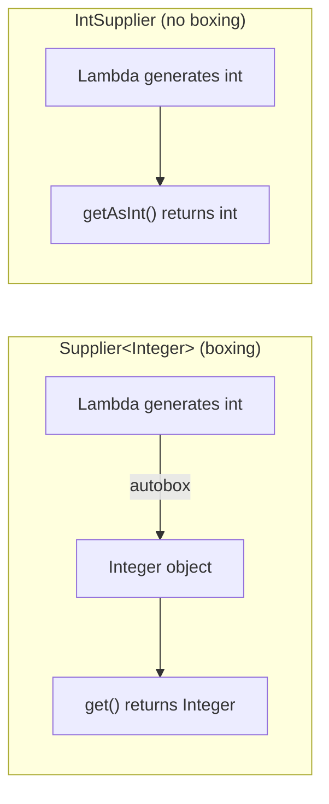
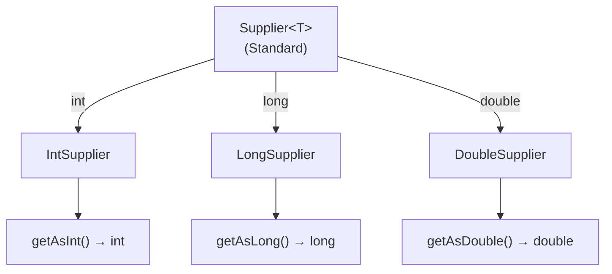

# 📘 IntSupplier, LongSupplier, and DoubleSupplier Interfaces

---

## 📌 Introduction

### 🧠 What is this about?
`IntSupplier`, `LongSupplier`, and `DoubleSupplier` are primitive versions of the `Supplier<T>` interface. They **supply (produce) a primitive value** without taking any input — and without autoboxing the result.

### 🌍 Real-World Problem First
You're using `Supplier<Integer>` to generate random numbers. Each time `get()` is called, the `int` result gets autoboxed into an `Integer` object before being returned. In a random-number-heavy application (games, simulations), that's thousands of unnecessary object allocations per second. `IntSupplier` returns the raw `int` directly.

### ❓ Why does it matter?
- `Supplier<Integer>.get()` autoboxes the return value — `IntSupplier.getAsInt()` does not
- Used in `OptionalInt.orElseGet()`, `IntStream.generate()`, and lazy value providers
- Completes the primitive functional interface family

### 🗺️ What we'll learn (Learning Map)
- How primitive suppliers avoid autoboxing on the **output** side
- `IntSupplier` example: generating random integers
- `LongSupplier` example: getting current timestamp
- `DoubleSupplier` example: simulating temperature readings
- When to use each variant

---

## 🧩 Concept 1: IntSupplier — Supplying int Values

### 🧠 Layer 1: The Simple Version
`IntSupplier` is a factory that produces `int` values on demand — no input needed, raw `int` output.

### 🔍 Layer 2: The Developer Version
`IntSupplier` has a single abstract method `getAsInt()` that takes no arguments and returns a primitive `int`. Note: it's `getAsInt()`, **not** `get()` — the method name signals the primitive return type.

```java
@FunctionalInterface
public interface IntSupplier {
    int getAsInt();  // No input, primitive int output
}
```

### ⚙️ Layer 4: Standard vs Primitive



### 💻 Layer 5: Code — Prove It!

```java
import java.util.function.Supplier;
import java.util.function.IntSupplier;

public class IntSupplierExample {
    public static void main(String[] args) {
        // ❌ Standard Supplier — autoboxing on return
        Supplier<Integer> randomBoxed = () -> (int) (Math.random() * 100);
        System.out.println(randomBoxed.get());  // int result autoboxed to Integer

        // ✅ IntSupplier — no autoboxing
        IntSupplier randomValue = () -> (int) (Math.random() * 100);
        System.out.println(randomValue.getAsInt());  // Raw int returned
    }
}
```

**Key difference:** `Supplier.get()` returns `Integer` (boxed). `IntSupplier.getAsInt()` returns `int` (raw). The method name `getAsInt` explicitly tells you: "This returns a primitive int."

---

### ✅ Key Takeaways for This Concept

→ `IntSupplier` replaces `Supplier<Integer>` — avoids autoboxing the return value  
→ Method is `getAsInt()` (not `get()`) — the name signals primitive return type  
→ Use for random number generators, counters, lazy int values

---

> IntSupplier handles `int`. For large values like timestamps, use `LongSupplier`.

---

## 🧩 Concept 2: LongSupplier — Supplying Long Values

### 🧠 Layer 1: The Simple Version
`LongSupplier` produces `long` values on demand — ideal for timestamps and large counters.

### 🔍 Layer 2: The Developer Version

```java
@FunctionalInterface
public interface LongSupplier {
    long getAsLong();  // No input, primitive long output
}
```

### 💻 Layer 5: Code — Prove It!

```java
import java.util.function.LongSupplier;

public class LongSupplierExample {
    public static void main(String[] args) {
        // LongSupplier to get current system timestamp in milliseconds
        LongSupplier timestampSupplier = () -> System.currentTimeMillis();

        System.out.println(timestampSupplier.getAsLong());
        // Output: 1745654321000 (current timestamp)
    }
}
```

**Why this matters:** `System.currentTimeMillis()` returns a `long`. Using `LongSupplier` keeps it as a `long` — no wrapping into a `Long` object.

---

### ✅ Key Takeaways for This Concept

→ `LongSupplier` = `Supplier<Long>` without autoboxing  
→ Method is `getAsLong()`  
→ Perfect for timestamps, large IDs, and counters

---

> Finally, let's see `DoubleSupplier` for floating-point values.

---

## 🧩 Concept 3: DoubleSupplier — Supplying Double Values

### 🧠 Layer 1: The Simple Version
`DoubleSupplier` produces `double` values on demand — great for temperature readings, random decimals, and scientific values.

### 🔍 Layer 2: The Developer Version

```java
@FunctionalInterface
public interface DoubleSupplier {
    double getAsDouble();  // No input, primitive double output
}
```

### 💻 Layer 5: Code — Prove It!

```java
import java.util.function.DoubleSupplier;

public class DoubleSupplierExample {
    public static void main(String[] args) {
        // DoubleSupplier to simulate temperature sensor reading
        DoubleSupplier temperatureSupplier = () -> 36.5 + Math.random() * 10;

        System.out.println("Temperature: " + temperatureSupplier.getAsDouble());
        // Output: Temperature: 42.3... (random between 36.5 and 46.5)
    }
}
```

**Practical use:** Simulating sensor data, generating random prices, supplying mathematical constants.

---

### ✅ Key Takeaways for This Concept

→ `DoubleSupplier` = `Supplier<Double>` without autoboxing  
→ Method is `getAsDouble()`  
→ Use for scientific calculations, financial simulations, random decimals

---

## 🎯 Final Summary

### 🧠 The Big Picture



### 📊 Complete Primitive Interface Family — Quick Reference

| Standard | Primitive Versions | Method Names |
|----------|-------------------|-------------|
| `Predicate<T>` | `IntPredicate`, `LongPredicate`, `DoublePredicate` | `test(int/long/double)` |
| `Function<T, R>` | `IntFunction<R>`, `LongFunction<R>`, `DoubleFunction<R>` | `apply(int/long/double)` |
| `Consumer<T>` | `IntConsumer`, `LongConsumer`, `DoubleConsumer` | `accept(int/long/double)` |
| `Supplier<T>` | `IntSupplier`, `LongSupplier`, `DoubleSupplier` | `getAsInt/Long/Double()` |

**Notice the naming pattern:**
- Input-taking interfaces: same method name (`test`, `apply`, `accept`)
- Supplier (output only): method name includes the type (`getAsInt`, `getAsLong`, `getAsDouble`)

### ✅ Master Takeaways
→ Primitive suppliers avoid autoboxing on the **output** side  
→ Method names are `getAsInt()`, `getAsLong()`, `getAsDouble()` — not just `get()`  
→ Use with `IntStream.generate()`, `OptionalInt.orElseGet()`, and lazy value providers  
→ This completes all 12 primitive functional interfaces: 4 families × 3 primitive types

### 🔗 What's Next?
We've now mastered the complete functional interfaces ecosystem — standard and primitive. Next, we'll enter the world of **Java Streams** — a powerful API that uses all these functional interfaces to process collections of data in a clean, functional style.
