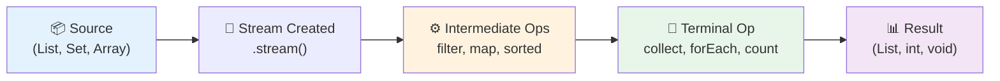
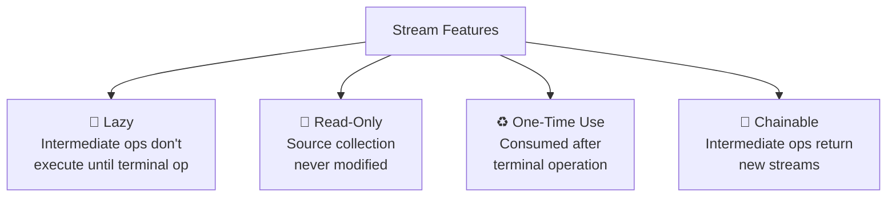
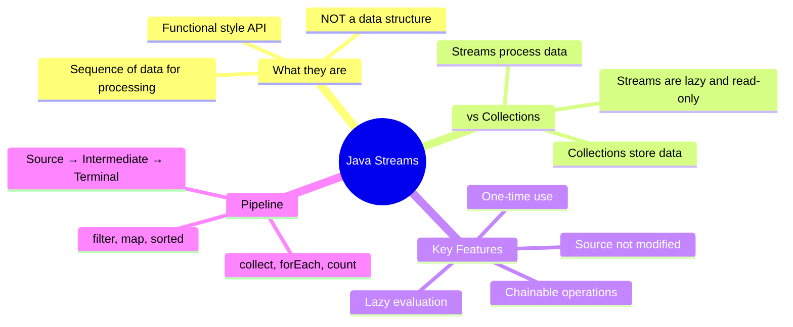

# 📘 Introduction to Java Streams

---

## 📌 Introduction

### 🧠 What is this about?
Java Streams, introduced in Java 8, provide a **functional-style API for processing sequences of data**. They let you filter, map, sort, and reduce collections in clean, readable pipelines — replacing verbose loops and if-statements with expressive, declarative code.

### 🌍 Real-World Problem First
You have a list of 10,000 employees. You need to find all employees older than 30, extract their names, sort alphabetically, and collect into a new list. With traditional Java, that's a for-loop, an if-statement, a temporary list, a `Collections.sort()` call, and another loop to extract names. With Streams, it's **one readable pipeline**.

### ❓ Why does it matter?
- **Cleaner code:** Replace 15 lines of loops with 3-4 chained method calls
- **Efficiency:** Lazy evaluation processes only what's needed
- **Parallelism:** Switch to parallel processing with one method call (`.parallelStream()`)
- **Functional style:** Use lambdas and functional interfaces you've already learned

### 🗺️ What we'll learn (Learning Map)
- What a Stream is (and what it's NOT)
- Streams vs Collections — the fundamental differences
- Key features of Streams
- The conceptual model of stream processing

---

## 🧩 Concept 1: What is a Stream?

### 🧠 Layer 1: The Simple Version
A Stream is a **sequence of data flowing through a pipeline of operations**. Think of it as a conveyor belt in a factory — items flow through, get processed at each station, and come out transformed at the end.

### 🔍 Layer 2: The Developer Version
A `Stream<T>` is an interface in `java.util.stream` that represents a sequence of elements supporting sequential and parallel aggregate operations. Streams don't store data — they carry data from a source through a pipeline of operations.

```java
// Traditional approach — imperative style
List<String> names = new ArrayList<>();
for (Employee emp : employees) {
    if (emp.getAge() > 30) {
        names.add(emp.getName());
    }
}
Collections.sort(names);

// Stream approach — functional style
List<String> names = employees.stream()
    .filter(emp -> emp.getAge() > 30)     // Keep only age > 30
    .map(Employee::getName)                // Extract names
    .sorted()                              // Sort alphabetically
    .collect(Collectors.toList());         // Collect into a List
```

### 🌍 Layer 3: The Real-World Analogy
Think of a **water treatment plant**:

| Analogy Part | Technical Mapping |
|---|---|
| Water source (river/lake) | Data source (List, Set, Array) |
| Water flowing through pipes | Stream of elements |
| Filter station (removes debris) | `.filter()` — removes unwanted elements |
| Treatment station (adds chemicals) | `.map()` — transforms elements |
| Sorting station (by quality) | `.sorted()` — orders elements |
| Storage tank (final output) | `.collect()` — gathers results |
| Water flows once through the plant | Stream is consumed once |
| Plant doesn't store the river | Stream doesn't store the data |

### ⚙️ Layer 4: The Stream Pipeline Model



**Three phases:**
1. **Source** — Where the data comes from (List, Set, Map, Array, File)
2. **Intermediate Operations** — Transform the stream (filter, map, sort) — these are **lazy**
3. **Terminal Operation** — Triggers execution and produces a result (collect, forEach, count)

---

### ✅ Key Takeaways for This Concept

→ A Stream is a pipeline for processing data, not a data structure for storing it  
→ Streams use functional-style operations (filter, map, reduce) instead of loops  
→ Every stream has three parts: source → intermediate operations → terminal operation

---

> Now that we know what streams are, let's understand how they fundamentally differ from collections.

---

## 🧩 Concept 2: Streams vs Collections

### 🧠 Layer 1: The Simple Version
Collections **store** data. Streams **process** data. A collection is like a warehouse. A stream is like a conveyor belt moving items through a factory.

### 🔍 Layer 2: The Developer Version

The differences go deeper than just "store vs process":

### 📊 Layer 6: Comparison

| Feature | Collections | Streams |
|---------|------------|---------|
| **Purpose** | Store and manage data | Process data |
| **Storage** | Hold elements in memory | Don't store elements |
| **Reusability** | Can iterate multiple times | One-time use — consumed after terminal op |
| **Data loading** | **Eager** — all data loaded at once | **Lazy** — data processed on-demand |
| **Modification** | Can add/remove/update elements | Read-only — don't modify the source |
| **Style** | Imperative (for-loops, if-else) | Functional (filter, map, reduce) |

**Why these differences exist:**

- **Streams are one-time use** because they're designed as *pipelines*, not containers. Once water flows through a pipe, it's gone. If you need to process again, you create a new pipeline (stream) from the same source (collection).

- **Streams are lazy** because this enables optimization. If you `filter()` → `map()` → `findFirst()`, the stream doesn't filter ALL elements, then map ALL results. It processes elements one by one — and **stops as soon as it finds the first match**. This is hugely efficient for large datasets.

- **Streams don't modify the source** because immutability makes code safer. Your original collection stays intact — no surprises, no concurrent modification issues.

### 💻 Layer 5: Code — Prove It!

**🔍 Stream doesn't modify the original collection:**
```java
List<String> fruits = new ArrayList<>(List.of("Banana", "Apple", "Orange"));

// Stream processing — creates a NEW sorted list
List<String> sorted = fruits.stream()
    .sorted()
    .collect(Collectors.toList());

System.out.println(fruits);  // Output: [Banana, Apple, Orange] ← unchanged!
System.out.println(sorted);  // Output: [Apple, Banana, Orange] ← new list
```

**🔍 Stream is one-time use:**
```java
Stream<String> fruitStream = fruits.stream();
fruitStream.forEach(System.out::println);  // Works fine

// ❌ Trying to reuse the same stream
fruitStream.forEach(System.out::println);  
// Throws: IllegalStateException: stream has already been operated upon or closed
```

---

### ✅ Key Takeaways for This Concept

→ Collections = data storage; Streams = data processing  
→ Streams are **lazy** (process on-demand), **read-only** (don't change source), and **one-time** (consumed after use)  
→ This design enables powerful optimizations like short-circuiting and parallel processing

---

## 🧩 Concept 3: Key Features of Streams

### 🧠 Layer 1: The Simple Version
Streams have three superpowers: they're lazy (don't work until told to), read-only (don't touch your data), and pipeline-able (chain operations together).

### 🔍 Layer 2: The Developer Version

**1. Streams are NOT data structures:**
They don't store data. They're a view over a data source that applies transformations.

**2. Streams are lazy:**
Intermediate operations like `filter()` and `map()` don't execute immediately. They're recorded as a recipe. The actual computation happens only when a terminal operation (like `collect()` or `forEach()`) is called.

**3. Streams are read-only:**
They produce new results without modifying the source collection. This immutability makes streams safe for concurrent processing.



---

### ✅ Key Takeaways for This Concept

→ **Lazy:** Nothing happens until a terminal operation triggers the pipeline  
→ **Read-only:** Original data is never modified  
→ **One-time:** A stream can only be consumed once — create a new one for reprocessing  
→ **Chainable:** Intermediate operations return streams, enabling fluent pipelines

---

## 🎯 Final Summary

### 🧠 The Big Picture



### ✅ Master Takeaways
→ Streams = functional pipelines for processing data from collections, arrays, or other sources  
→ They don't store data, don't modify the source, and can only be used once  
→ Lazy evaluation means only the work that's needed actually happens  
→ All those functional interfaces we learned (Predicate, Function, Consumer) are the building blocks streams use  

### 🔗 What's Next?
Now that we understand what streams are, let's look deeper at the **Stream Pipeline** — how the source, intermediate operations, and terminal operations work together in a complete processing chain.
