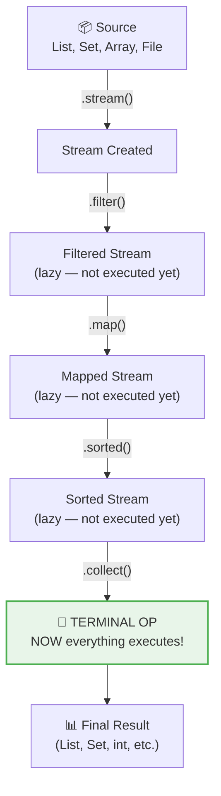
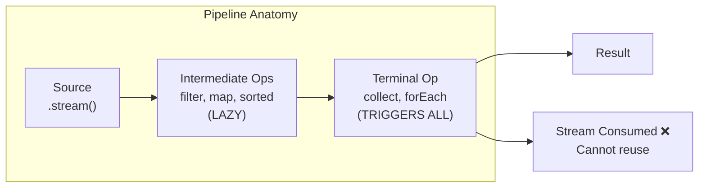

# 📘 Java Stream Pipeline

---

## 📌 Introduction

### 🧠 What is this about?
A **Stream Pipeline** is the complete end-to-end flow of data processing in Java Streams: from **creating a stream** from a source, through **intermediate operations** that transform it, to a **terminal operation** that produces the final result.

### 🌍 Real-World Problem First
You have raw ingredients (data source), a recipe with multiple cooking steps (intermediate operations), and a final plating step (terminal operation). The Stream Pipeline is that recipe — it describes the entire journey from raw data to finished result.

### ❓ Why does it matter?
- Understanding the pipeline model is essential for writing correct stream code
- **Lazy evaluation** means intermediate operations don't execute until the terminal operation is called
- Once a terminal operation runs, the stream is **consumed** — you can't reuse it
- Pipeline ordering directly affects performance

### 🗺️ What we'll learn (Learning Map)
- The three phases of a stream pipeline
- How lazy evaluation works in practice
- Why streams are consumed after terminal operations
- The power of chaining operations

---

## 🧩 Concept 1: The Three Phases of a Pipeline

### 🧠 Layer 1: The Simple Version
Every stream pipeline has exactly three phases: **Source** → **Intermediate Operations** → **Terminal Operation**. The source provides data, intermediate ops transform it, and the terminal op delivers the result.

### 🔍 Layer 2: The Developer Version

```java
List<String> result = dataSource.stream()     // Phase 1: CREATE stream from source
    .filter(x -> x.length() > 3)              // Phase 2: INTERMEDIATE — filter
    .map(String::toUpperCase)                  // Phase 2: INTERMEDIATE — transform
    .sorted()                                  // Phase 2: INTERMEDIATE — sort
    .collect(Collectors.toList());             // Phase 3: TERMINAL — produce result
```

### ⚙️ Layer 4: How the Pipeline Executes



**The critical insight:** Steps C, D, and E are **lazy** — they're recorded as instructions but don't actually process any data. Only when Step F (the terminal operation) is called does the entire pipeline execute.

### 🌍 Layer 3: The Real-World Analogy
Think of a **food ordering app**:

| Phase | Analogy | Stream Pipeline |
|-------|---------|-----------------|
| Source | Restaurant menu (all dishes) | `collection.stream()` |
| Intermediate | Applying filters: "vegetarian only", "sort by price" | `.filter()`, `.sorted()` |
| Terminal | Clicking "Place Order" — NOW the kitchen starts working | `.collect()`, `.forEach()` |

**The key:** Browsing and filtering the menu doesn't cook anything. Only "Place Order" triggers actual work. That's exactly how stream pipelines work.

### 💻 Layer 5: Code — Prove It!

**🔍 Lazy Evaluation in Action:**
```java
List<String> names = List.of("Alice", "Bob", "Charlie", "Dave");

// Nothing happens here — operations are just recorded
Stream<String> pipeline = names.stream()
    .filter(name -> {
        System.out.println("Filtering: " + name);
        return name.length() > 3;
    })
    .map(name -> {
        System.out.println("Mapping: " + name);
        return name.toUpperCase();
    });

System.out.println("Pipeline created — no output yet!");

// NOW everything executes when we call the terminal operation
List<String> result = pipeline.collect(Collectors.toList());
// Output:
// Pipeline created — no output yet!
// Filtering: Alice
// Mapping: Alice
// Filtering: Bob       ← filtered OUT (length 3, not > 3)
// Filtering: Charlie
// Mapping: Charlie
// Filtering: Dave
// Mapping: Dave
```

**Notice:** "Pipeline created — no output yet!" prints BEFORE any filtering or mapping. The intermediate operations are truly lazy — they wait for `collect()`.

**Also notice:** Elements are processed **one at a time** through the entire pipeline. Alice goes through filter → map, then Bob goes through filter (rejected), then Charlie goes through filter → map, etc. This is called **vertical processing** (not horizontal).

---

### ⚠️ Pitfalls & Mistakes

**Mistake 1: Trying to reuse a consumed stream**
- 👤 What devs do: Store a stream in a variable and call terminal operations twice
- 💥 Why it breaks: After the first terminal operation, the stream is consumed — its internal state is gone
- ✅ Fix: Create a new stream from the source

```java
// ❌ Stream already consumed
Stream<String> stream = names.stream().filter(n -> n.length() > 3);
stream.forEach(System.out::println);  // Works
stream.count();  // Throws IllegalStateException!

// ✅ Create a fresh stream each time
names.stream().filter(n -> n.length() > 3).forEach(System.out::println);
long count = names.stream().filter(n -> n.length() > 3).count();
```

---

### ✅ Key Takeaways for This Concept

→ Pipeline = Source → Intermediate Operations → Terminal Operation  
→ Intermediate operations are **lazy** — recorded but not executed  
→ Terminal operation **triggers** the entire pipeline  
→ Streams are consumed after the terminal operation — create a new one for reprocessing  
→ Elements flow through the pipeline one at a time (vertical processing)

---

## 🎯 Final Summary

### 🧠 The Big Picture



### ✅ Master Takeaways
→ The pipeline model is the foundation of all stream processing  
→ Lazy evaluation is the key optimization — only needed work is performed  
→ **One terminal operation per stream** — it both triggers execution and ends the stream  
→ Chaining intermediate operations creates readable, declarative data processing  

### 🔗 What's Next?
We've seen the pipeline model at a high level. Now let's dive deeper into the **two types of operations** — intermediate and terminal — understanding their differences, common methods, and how they work together.
