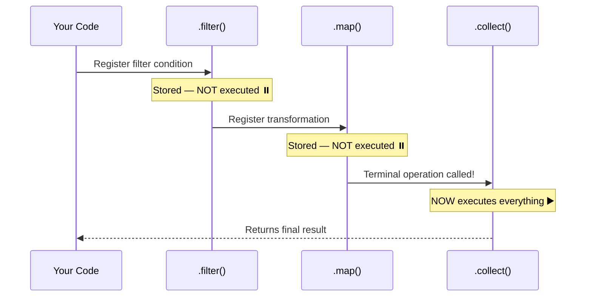
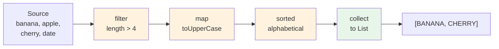
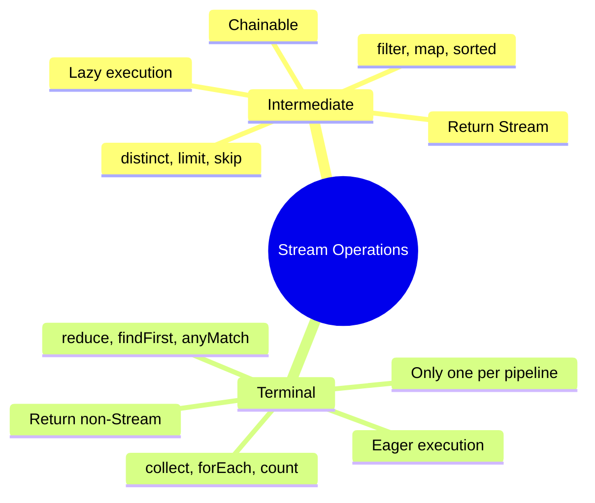

# 📘 Types of Stream Operations

---

## 📌 Introduction

### 🧠 What is this about?
Streams have exactly **two types of operations**: **Intermediate Operations** (transform the stream and return a new stream) and **Terminal Operations** (trigger execution and produce a final result). Understanding the difference is fundamental to writing correct stream code.

### 🌍 Real-World Problem First
You're building a data processing pipeline. Some steps transform data (filtering, sorting) and pass it along. One final step produces the output (saving to database, printing). If you confuse which is which — for example, expecting `filter()` to give you a list — your code won't work as expected.

### ❓ Why does it matter?
- Intermediate operations are **lazy** — they don't do anything alone
- Terminal operations are **eager** — they trigger the entire pipeline
- Only intermediate operations can be **chained** (they return streams)
- Only **one** terminal operation per stream pipeline

### 🗺️ What we'll learn (Learning Map)
- Intermediate operations: what they are, common examples, and why they're lazy
- Terminal operations: what they are, common examples, and why they trigger execution
- Key differences between the two types
- How they work together in a pipeline

---

## 🧩 Concept 1: Intermediate Operations

### 🧠 Layer 1: The Simple Version
Intermediate operations are the **middle steps** of a pipeline. They transform data but don't produce a final answer. They're lazy — they just set up instructions and wait for the terminal operation to say "Go!"

### 🔍 Layer 2: The Developer Version
An intermediate operation:
- Takes a `Stream` as input
- Returns a **new** `Stream` as output
- Is **lazy** — doesn't execute until a terminal operation is called
- Can be **chained** — because each one returns a stream

### ⚙️ Layer 4: How Lazy Evaluation Works



### 📊 Common Intermediate Operations

| Operation | What it does | Takes | Returns |
|-----------|-------------|-------|---------|
| `filter(Predicate)` | Keeps elements matching the condition | `Predicate<T>` | `Stream<T>` |
| `map(Function)` | Transforms each element | `Function<T, R>` | `Stream<R>` |
| `flatMap(Function)` | Flattens nested streams | `Function<T, Stream<R>>` | `Stream<R>` |
| `distinct()` | Removes duplicates | — | `Stream<T>` |
| `sorted()` | Sorts elements | — or `Comparator` | `Stream<T>` |
| `peek(Consumer)` | Performs action without changing stream | `Consumer<T>` | `Stream<T>` |
| `limit(long)` | Truncates to first n elements | `long` | `Stream<T>` |
| `skip(long)` | Skips first n elements | `long` | `Stream<T>` |

**Notice the functional interfaces column:** `filter()` uses `Predicate`, `map()` uses `Function`, `peek()` uses `Consumer` — these are the same interfaces we learned earlier! Streams are built on top of functional interfaces.

### 💻 Layer 5: Code — Prove It!

```java
// Each intermediate op returns a Stream — enabling chaining
Stream<String> pipeline = names.stream()
    .filter(name -> name.length() > 3)   // Returns Stream<String>
    .map(String::toUpperCase)            // Returns Stream<String>
    .sorted();                           // Returns Stream<String>

// Nothing has happened yet! No filtering, no mapping, no sorting.
// The pipeline is just a set of instructions waiting to execute.
```

---

### ✅ Key Takeaways for This Concept

→ Intermediate operations return a **new Stream** — enabling method chaining  
→ They are **lazy** — no execution until a terminal operation triggers them  
→ You can chain **any number** of intermediate operations  
→ They use the functional interfaces you already know: `Predicate`, `Function`, `Consumer`

---

> Intermediate operations set up the pipeline. But who presses the "Go" button? Terminal operations.

---

## 🧩 Concept 2: Terminal Operations

### 🧠 Layer 1: The Simple Version
Terminal operations are the **final step** that says "OK, execute everything and give me the result." Once a terminal operation runs, the stream is done — consumed and closed.

### 🔍 Layer 2: The Developer Version
A terminal operation:
- Takes a `Stream` as input
- Returns a **non-stream result** (a value, a collection, or void)
- Is **eager** — executes immediately when called
- **Triggers** all queued intermediate operations
- **Consumes** the stream — it cannot be used again

### 📊 Common Terminal Operations

| Operation | What it does | Returns |
|-----------|-------------|---------|
| `collect(Collector)` | Gathers results into a collection | `List`, `Set`, `Map`, etc. |
| `forEach(Consumer)` | Performs action on each element | `void` |
| `count()` | Counts elements | `long` |
| `reduce(BinaryOperator)` | Combines elements into one value | `Optional<T>` or `T` |
| `toArray()` | Converts to array | `Object[]` or `T[]` |
| `anyMatch(Predicate)` | Checks if any element matches | `boolean` |
| `allMatch(Predicate)` | Checks if all elements match | `boolean` |
| `noneMatch(Predicate)` | Checks if no elements match | `boolean` |
| `findFirst()` | Returns first element | `Optional<T>` |
| `findAny()` | Returns any element | `Optional<T>` |
| `min(Comparator)` | Returns minimum element | `Optional<T>` |
| `max(Comparator)` | Returns maximum element | `Optional<T>` |

### 💻 Layer 5: Code — Prove It!

```java
List<String> names = List.of("Alice", "Bob", "Charlie", "Dave", "Eve");

// Terminal: collect — gathers filtered names into a List
List<String> longNames = names.stream()
    .filter(n -> n.length() > 3)
    .collect(Collectors.toList());
System.out.println(longNames);  // Output: [Alice, Charlie, Dave]

// Terminal: count — returns the count
long count = names.stream()
    .filter(n -> n.length() > 3)
    .count();
System.out.println(count);  // Output: 3

// Terminal: forEach — performs action (void return)
names.stream()
    .filter(n -> n.length() > 3)
    .forEach(System.out::println);
// Output:
// Alice
// Charlie
// Dave

// Terminal: anyMatch — checks if any element matches
boolean hasLongName = names.stream()
    .anyMatch(n -> n.length() > 5);
System.out.println(hasLongName);  // Output: true (Charlie has 7 chars)
```

---

### ✅ Key Takeaways for This Concept

→ Terminal operations **trigger** the pipeline — nothing happens without them  
→ They return **non-stream values**: `List`, `long`, `boolean`, `void`, `Optional`  
→ Only **one** terminal operation per stream  
→ After the terminal operation, the stream is **consumed** — cannot be reused

---

> Now let's see the key differences between these two types side by side.

---

## 🧩 Concept 3: Intermediate vs Terminal — The Key Differences

### 📊 Layer 6: Comparison

| Aspect | Intermediate Operations | Terminal Operations |
|--------|------------------------|---------------------|
| **Returns** | A new `Stream` | Non-stream value (List, int, void) |
| **Chainable** | ✅ Yes (return streams) | ❌ No (don't return streams) |
| **Count** | 0 or more per pipeline | Exactly **1** per pipeline |
| **Execution** | **Lazy** — deferred | **Eager** — immediate |
| **Position** | Middle of the pipeline | End of the pipeline |
| **Examples** | `filter`, `map`, `sorted`, `distinct` | `collect`, `forEach`, `count`, `reduce` |

**Why this design?** Lazy intermediate operations enable **optimization**. If your terminal operation is `findFirst()`, the stream doesn't need to process ALL elements through all intermediate operations — it can stop as soon as the first match is found. This short-circuit optimization is only possible because intermediate operations don't eagerly execute.

### 💻 Layer 5: Code — Complete Pipeline

```java
// Intermediate ops: filter, map, sorted (lazy — chained)
// Terminal op: collect (eager — triggers everything)
List<String> result = List.of("banana", "apple", "cherry", "date")
    .stream()                                    // Source
    .filter(fruit -> fruit.length() > 4)         // Intermediate: keep length > 4
    .map(String::toUpperCase)                    // Intermediate: to uppercase
    .sorted()                                    // Intermediate: sort alphabetically
    .collect(Collectors.toList());               // Terminal: collect to List

System.out.println(result);  // Output: [BANANA, CHERRY]
```



---

### ✅ Key Takeaways for This Concept

→ Intermediate = lazy, chainable, returns Stream  
→ Terminal = eager, final, returns non-Stream value  
→ A pipeline needs at least one terminal operation to execute  
→ The lazy-then-eager design enables short-circuit optimizations

---

## 🎯 Final Summary

### 🧠 The Big Picture



### ✅ Master Takeaways
→ Two types: **Intermediate** (transform) and **Terminal** (execute + produce result)  
→ Intermediate ops are lazy and chainable — they build the recipe  
→ Terminal ops are eager — they cook the dish  
→ **No terminal operation = no execution** — the pipeline sits idle  
→ Functional interfaces power everything: `Predicate` for filter, `Function` for map, `Consumer` for forEach

### 🔗 What's Next?
We know the types of operations. But before we can use them, we need to **create a stream** from our data. In the next note, we'll explore all the different ways to create Stream objects — from lists, sets, maps, arrays, and more.
