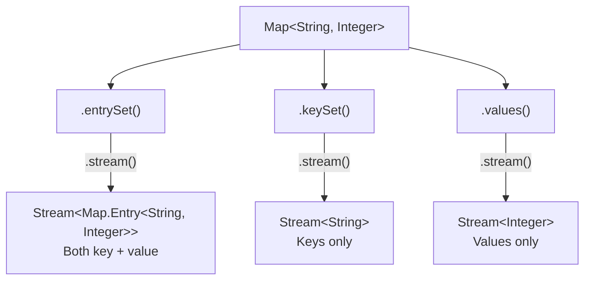
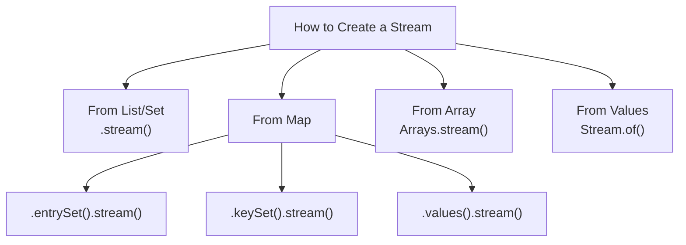

# 📘 Create Stream Objects — Different Ways

---

## 📌 Introduction

### 🧠 What is this about?
Before you can filter, map, or collect, you need to **create a stream** from your data source. Java provides multiple ways to create streams from lists, sets, maps, arrays, and even individual values. Each data source has its own approach.

### 🌍 Real-World Problem First
You have data in all sorts of containers — an `ArrayList` of names, a `HashMap` of products and prices, a `String[]` array of cities. You want to process them all with streams. But each container has a slightly different way to create a stream. How do you know which method to use for which source?

### ❓ Why does it matter?
- Different sources use different methods: `.stream()`, `Arrays.stream()`, `Stream.of()`
- Maps require a special approach (no direct `.stream()` method)
- Choosing the right creation method matters for type safety and readability
- Understanding stream creation is the first step in every pipeline

### 🗺️ What we'll learn (Learning Map)
- Creating streams from `List`
- Creating streams from `Set`
- Creating streams from `Map` (entries, keys, values)
- Creating streams from arrays
- Creating streams from individual values with `Stream.of()`

---

## 🧩 Concept 1: Stream from List

### 🧠 Layer 1: The Simple Version
Lists have a `.stream()` method. Call it, and you get a stream of all the elements in insertion order.

### 🔍 Layer 2: The Developer Version
`Collection` interface (parent of `List`) defines the `stream()` method. So any `List` implementation (`ArrayList`, `LinkedList`) can create a stream. The stream maintains the list's **insertion order**.

### 💻 Layer 5: Code — Prove It!

```java
import java.util.*;
import java.util.stream.Stream;

public class StreamFromList {
    public static void main(String[] args) {
        List<String> fruitList = Arrays.asList("Banana", "Mango", "Apple", "Orange");

        // Create stream from list
        Stream<String> stream = fruitList.stream();

        // Print elements using forEach (terminal operation)
        stream.forEach(System.out::println);
        // Output:
        // Banana
        // Mango
        // Apple
        // Orange  ← maintains insertion order
    }
}
```

**Key point:** The stream preserves the list's insertion order. Elements come out in the same sequence they were added.

---

### ✅ Key Takeaways for This Concept

→ Call `.stream()` on any `List` to create a stream  
→ Insertion order is preserved  
→ Works with `ArrayList`, `LinkedList`, `List.of()`, `Arrays.asList()`

---

> Lists are straightforward. What about Sets?

---

## 🧩 Concept 2: Stream from Set

### 🧠 Layer 1: The Simple Version
Sets also have `.stream()`. But unlike lists, `HashSet` doesn't guarantee insertion order — the stream elements may come out in a different order.

### 🔍 Layer 2: The Developer Version
`Set` extends `Collection`, so it inherits `.stream()`. However, the element order depends on the `Set` implementation:
- `HashSet` → **no guaranteed order**
- `LinkedHashSet` → **insertion order preserved**
- `TreeSet` → **sorted order**

### 💻 Layer 5: Code — Prove It!

```java
Set<String> fruitSet = new HashSet<>(Arrays.asList("Banana", "Mango", "Apple", "Orange"));

Stream<String> stream = fruitSet.stream();
stream.forEach(System.out::println);
// Output (order may vary — HashSet has no order guarantee):
// Apple
// Mango
// Orange
// Banana
```

**Why the different order?** `HashSet` stores elements based on their hash codes, not insertion sequence. The stream reflects whatever internal order the set uses.

---

### ✅ Key Takeaways for This Concept

→ Call `.stream()` on any `Set` to create a stream  
→ Element order depends on the Set implementation  
→ `HashSet` → unpredictable order; `TreeSet` → sorted order

---

> Lists and Sets are simple — they both have `.stream()`. Maps are different. Let's see why.

---

## 🧩 Concept 3: Stream from Map

### 🧠 Layer 1: The Simple Version
`Map` doesn't have a direct `.stream()` method. You need to first get the **entries**, **keys**, or **values** as a Set/Collection, and then call `.stream()` on that.

### 🔍 Layer 2: The Developer Version
`Map` is not a `Collection`, so it doesn't inherit `.stream()`. But `Map` provides three views that ARE collections:

| View Method | Returns | Use When |
|-------------|---------|----------|
| `entrySet()` | `Set<Map.Entry<K, V>>` | You need both key AND value |
| `keySet()` | `Set<K>` | You only need keys |
| `values()` | `Collection<V>` | You only need values |

### ⚙️ Layer 4: Three Ways to Stream a Map



### 💻 Layer 5: Code — Prove It!

```java
import java.util.*;
import java.util.stream.Stream;

public class StreamFromMap {
    public static void main(String[] args) {
        Map<String, Integer> fruitMap = new HashMap<>();
        fruitMap.put("Apple", 10);
        fruitMap.put("Mango", 15);
        fruitMap.put("Orange", 20);
        fruitMap.put("Banana", 5);

        // 1. Stream from entries (key-value pairs)
        Stream<Map.Entry<String, Integer>> entryStream = fruitMap.entrySet().stream();
        entryStream.forEach(System.out::println);
        // Output:
        // Apple=10
        // Mango=15
        // Orange=20
        // Banana=5

        // 2. Stream from keys only
        Stream<String> keyStream = fruitMap.keySet().stream();
        keyStream.forEach(System.out::println);
        // Output: Apple, Mango, Orange, Banana

        // 3. Stream from values only
        Stream<Integer> valueStream = fruitMap.values().stream();
        valueStream.forEach(System.out::println);
        // Output: 10, 15, 20, 5
    }
}
```

**Why Map doesn't have `.stream()` directly:** A `Map` has TWO dimensions — keys and values. The framework can't assume which one you want to stream over. By requiring you to choose (`entrySet()`, `keySet()`, or `values()`) first, it forces clarity.

---

### ⚠️ Pitfalls & Mistakes

**Mistake 1: Calling `.stream()` directly on a Map**
- 👤 What devs do: `map.stream()` — expecting it to compile
- 💥 Why it breaks: `Map` doesn't implement `Collection`, so no `.stream()` method exists
- ✅ Fix: Use `map.entrySet().stream()`, `map.keySet().stream()`, or `map.values().stream()`

```java
// ❌ Compile error — Map has no stream() method
fruitMap.stream();

// ✅ Stream via entrySet
fruitMap.entrySet().stream();
```

---

### ✅ Key Takeaways for This Concept

→ `Map` doesn't have `.stream()` — use `entrySet()`, `keySet()`, or `values()` first  
→ `entrySet().stream()` gives `Stream<Map.Entry<K, V>>` — both key and value  
→ `keySet().stream()` gives `Stream<K>` — keys only  
→ `values().stream()` gives `Stream<V>` — values only

---

> We've covered collections. What about plain arrays?

---

## 🧩 Concept 4: Stream from Array

### 🧠 Layer 1: The Simple Version
Arrays don't have a `.stream()` method (they're not objects with methods). Use `Arrays.stream(array)` instead.

### 🔍 Layer 2: The Developer Version
The `Arrays` utility class (from `java.util`) provides a static `stream()` method that accepts an array and returns a `Stream`. The stream maintains the array's order.

### 💻 Layer 5: Code — Prove It!

```java
import java.util.Arrays;
import java.util.stream.Stream;

public class StreamFromArray {
    public static void main(String[] args) {
        String[] fruitArray = {"Banana", "Mango", "Apple"};

        // Create stream from array using Arrays.stream()
        Stream<String> arrayStream = Arrays.stream(fruitArray);

        arrayStream.forEach(System.out::println);
        // Output:
        // Banana
        // Mango
        // Apple  ← maintains array order
    }
}
```

---

### ✅ Key Takeaways for This Concept

→ Use `Arrays.stream(array)` to create a stream from an array  
→ The stream preserves the array's index order  
→ Works with both object arrays (`String[]`) and primitive arrays (`int[]` → `IntStream`)

---

> What if you just have a few individual values — no collection or array?

---

## 🧩 Concept 5: Stream from Individual Values — Stream.of()

### 🧠 Layer 1: The Simple Version
`Stream.of()` lets you create a stream directly from individual values — no collection or array needed. It's like creating a quick, inline stream.

### 🔍 Layer 2: The Developer Version
`Stream.of(T... values)` is a static factory method that creates a stream from varargs. It's useful when you have a small number of elements and don't want to create a collection first.

### 💻 Layer 5: Code — Prove It!

```java
import java.util.stream.Stream;

public class StreamOfExample {
    public static void main(String[] args) {
        // Create stream directly from individual values
        Stream<String> ofStream = Stream.of("Apple", "Banana", "Mango");

        ofStream.forEach(System.out::println);
        // Output:
        // Apple
        // Banana
        // Mango
    }
}
```

**When to use `Stream.of()`:** Quick tests, small inline streams, when you don't have a pre-existing collection. For large datasets, prefer creating a collection first and streaming from it.

---

### ✅ Key Takeaways for This Concept

→ `Stream.of(values...)` creates a stream from individual values  
→ No collection or array needed — pass values directly  
→ Best for small, inline streams and quick prototyping

---

## 🎯 Final Summary

### 🧠 The Big Picture



### 📊 Quick Reference — All Creation Methods

| Source | Method | Returns |
|--------|--------|---------|
| `List<T>` | `list.stream()` | `Stream<T>` |
| `Set<T>` | `set.stream()` | `Stream<T>` |
| `Map<K,V>` entries | `map.entrySet().stream()` | `Stream<Map.Entry<K,V>>` |
| `Map<K,V>` keys | `map.keySet().stream()` | `Stream<K>` |
| `Map<K,V>` values | `map.values().stream()` | `Stream<V>` |
| `T[]` array | `Arrays.stream(array)` | `Stream<T>` |
| Individual values | `Stream.of(v1, v2, ...)` | `Stream<T>` |

### ✅ Master Takeaways
→ `List` and `Set` → `.stream()` (inherited from `Collection`)  
→ `Map` → choose your view first (`entrySet`, `keySet`, `values`) → then `.stream()`  
→ Arrays → `Arrays.stream(array)`  
→ Inline values → `Stream.of(values...)`  
→ All streams support the same operations — once created, the source doesn't matter

### 🔗 What's Next?
Now that we can create streams from any data source, we're ready to start **processing data**! In upcoming notes, we'll explore intermediate operations like `filter()`, `map()`, and `sorted()` — using real examples to transform and query data.
