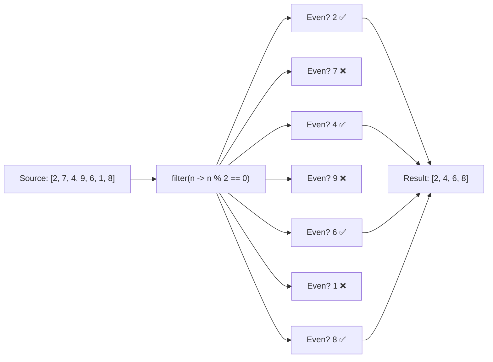

# 📘 Java Stream filter() Method — Example 1

---

## 📌 Introduction

### 🧠 What is this about?
The `filter()` method is one of the most commonly used intermediate operations in Java Streams. It lets you **select only the elements that match a given condition** — like sifting flour to remove lumps, keeping only the fine powder.

### 🌍 Real-World Problem First
Imagine you have a list of thousands of products in an e-commerce app. A user searches for "electronics under ₹10,000." Without `filter()`, you'd write verbose loops with `if` checks, temporary lists, and manual iteration. With `filter()`, you express the intent in a single, readable line.

### ❓ Why does it matter?
- Without `filter()`, every selection operation requires a manual loop + conditional + new list — boilerplate that obscures your intent
- `filter()` makes code **declarative** — you say *what* you want, not *how* to get it
- It composes beautifully with other stream operations like `map()`, `sorted()`, and `collect()`

### 🗺️ What we'll learn
- How `filter()` works with `Predicate`
- Filtering a list of integers (even numbers)
- Filtering strings by a condition (starts with a letter)
- How `filter()` fits in the stream pipeline

---

## 🧩 Concept 1: Understanding the filter() Method

### 🧠 Layer 1: The Simple Version
`filter()` is a gatekeeper. You give it a rule, and it only lets through the elements that pass that rule. Everything else is discarded.

### 🔍 Layer 2: The Developer Version
`filter()` is an **intermediate operation** that takes a `Predicate<T>` (a functional interface that returns `boolean`) and returns a new stream containing only the elements for which the predicate returns `true`.

```java
Stream<T> filter(Predicate<? super T> predicate)
```

Key characteristics:
- **Intermediate** — returns a new `Stream`, so you can chain more operations
- **Lazy** — doesn't execute until a terminal operation is called
- **Non-mutating** — the original collection is untouched

### 🌍 Layer 3: The Real-World Analogy

Think of `filter()` as a **security checkpoint at an airport**:

| Airport Analogy | Stream filter() Equivalent |
|----------------|---------------------------|
| All passengers in line | The source stream elements |
| Security scanner rule (e.g., "valid boarding pass") | The `Predicate` you pass to `filter()` |
| Passengers who pass security | Elements that return `true` from the predicate |
| Passengers turned away | Elements that return `false` — excluded from the new stream |
| The gate area after security | The new filtered stream |

Every passenger (element) is tested against the rule (predicate). Only those who pass move forward.

### ⚙️ Layer 4: How It Works Internally (Step-by-Step)

**Step 1 — Stream creation:** You create a stream from a source (list, array, etc.)
**Step 2 — filter() registered:** The `filter()` operation is registered in the pipeline but does NOT execute yet (lazy evaluation)
**Step 3 — Terminal operation called:** When you call `collect()`, `forEach()`, etc., the pipeline triggers
**Step 4 — Element-by-element evaluation:** Each element flows through the pipeline. The predicate is tested on each element. If `true` → element passes through. If `false` → element is skipped.
**Step 5 — Result collected:** Surviving elements reach the terminal operation



### 💻 Layer 5: Code — Prove It!

**🔍 Example 1: Filter even numbers from a list**
```java
List<Integer> numbers = Arrays.asList(2, 7, 4, 9, 6, 1, 8, 3, 5);

// Create stream → filter even numbers → collect to list
List<Integer> evenNumbers = numbers.stream()
        .filter(n -> n % 2 == 0)  // Predicate: keep only even numbers
        .toList();

System.out.println(evenNumbers); // Output: [2, 4, 6, 8]
```

**🔍 Example 2: Filter strings that start with "A"**
```java
List<String> names = Arrays.asList("Alice", "Bob", "Amit", "Charlie", "Ananya");

List<String> aNames = names.stream()
        .filter(name -> name.startsWith("A"))  // Predicate: starts with "A"
        .toList();

System.out.println(aNames); // Output: [Alice, Amit, Ananya]
```

**❌ Common Mistake: Forgetting that filter() is lazy**
```java
List<Integer> numbers = Arrays.asList(1, 2, 3, 4, 5);

// ❌ This does NOTHING by itself — no terminal operation!
numbers.stream().filter(n -> {
    System.out.println("Checking: " + n);  // Never prints!
    return n > 3;
});
// Nothing happens. The stream is created but never consumed.
```

**✅ The Fix: Always end with a terminal operation**
```java
List<Integer> result = numbers.stream()
        .filter(n -> {
            System.out.println("Checking: " + n);  // Now prints!
            return n > 3;
        })
        .toList();  // ✅ Terminal operation triggers the pipeline

// Output:
// Checking: 1
// Checking: 2
// Checking: 3
// Checking: 4
// Checking: 5
// result = [4, 5]
```

---

### ⚠️ Pitfalls & Mistakes

**Mistake 1: Modifying the source collection inside filter()**
- 👤 What devs do: Try to remove elements from the original list inside the predicate
- 💥 Why it breaks: `ConcurrentModificationException` — the stream is backed by the list, and modifying it during iteration corrupts the internal state
- ✅ Fix: Never modify the source inside a stream operation. Use `filter()` to produce a new collection.

---

### 💡 Pro Tips

**Tip 1:** Chain multiple `filter()` calls for readability, or combine predicates with `&&`
- Why it works: Each `filter()` produces a new stream, so chaining is safe. Combined predicates evaluate in a single pass.
- When to use: When you have multiple conditions — prefer chaining for readability, combine for performance-critical code

```java
// Chained (more readable):
list.stream().filter(n -> n > 10).filter(n -> n < 50).toList();

// Combined (single pass):
list.stream().filter(n -> n > 10 && n < 50).toList();
```

---

### ✅ Key Takeaways for This Concept

→ `filter()` takes a `Predicate<T>` and keeps only elements where the predicate returns `true`
→ It's an **intermediate operation** — lazy, returns a new stream, needs a terminal operation to execute
→ Never modify the source collection inside a `filter()` predicate
→ Think of it as a gatekeeper: elements either pass or get dropped

---

> Now that we understand how `filter()` works with simple types like integers and strings, let's see a more practical example — filtering objects with multiple conditions.

---

## 🎯 Final Summary

### ✅ Master Takeaways
→ `filter(predicate)` is the stream equivalent of "keep only what matches"
→ The `Predicate` is a `boolean`-returning lambda — the single deciding rule
→ Without a terminal operation, `filter()` does absolutely nothing (lazy evaluation)
→ Chain `filter()` with `map()`, `sorted()`, and `collect()` for powerful data pipelines

### 🔗 What's Next?
In the next note, we'll explore **filter() with more complex conditions** — filtering objects using multiple fields and combining predicates with logical operators like `and()`, `or()`, and `negate()`.
