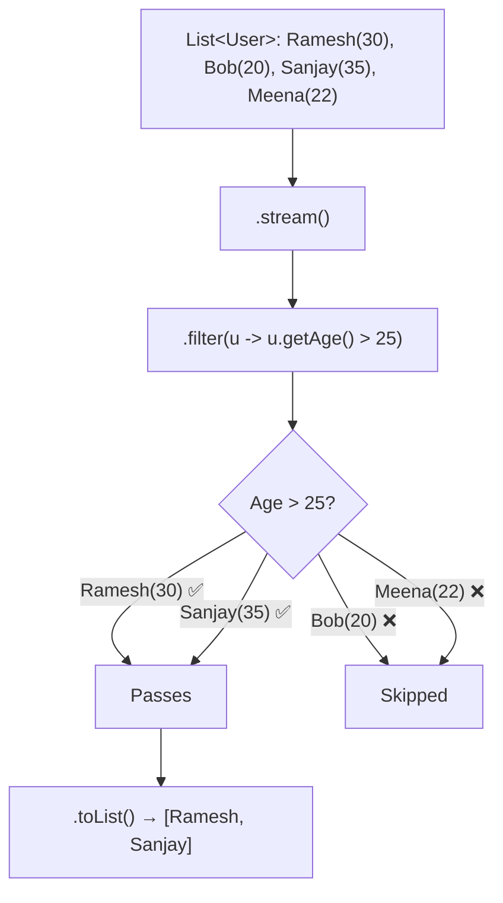
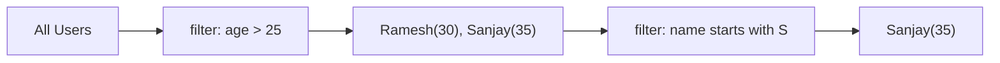

# 📘 Java Stream filter() Method — Example 2

---

## 📌 Introduction

### 🧠 What is this about?
Building on the basics of `filter()`, this note dives into **filtering custom objects** and **combining multiple predicates**. Real-world code rarely filters simple integers — you filter `User` objects by age, `Product` objects by price, `Order` objects by status.

### 🌍 Real-World Problem First
You have a list of employees. HR needs: "Show me all employees older than 25." That means filtering objects by a specific field — and you need to know how to extract that field inside the predicate.

### ❓ Why does it matter?
- Most production code filters domain objects, not primitives
- Knowing how to write predicates that access object fields is fundamental
- Combining multiple filters lets you build complex queries declaratively

### 🗺️ What we'll learn
- Filtering a list of custom objects (by age, by name)
- Writing predicates that access object fields
- Chaining multiple `filter()` calls

---

## 🧩 Concept 1: Filtering Custom Objects

### 🧠 Layer 1: The Simple Version
Instead of filtering numbers, you filter **objects** — and the predicate checks a **field** inside each object. Like filtering job applications: "Only keep applicants with 3+ years of experience."

### 🔍 Layer 2: The Developer Version
When you have a `List<User>`, the `filter()` predicate receives a `User` object. Inside the lambda, you call getter methods to access the field you want to test.

```java
// The predicate receives the full object
.filter(user -> user.getAge() > 25)
//       ^^^^         ^^^^^^^^
//    User object    accessing a field
```

### 🌍 Layer 3: The Real-World Analogy

Think of it as a **resume screening process**:

| Resume Screening | Stream filter() on Objects |
|-----------------|---------------------------|
| Stack of resumes | `List<User>` — your source |
| Recruiter's rule: "Must have > 25 years" | `Predicate`: `user -> user.getAge() > 25` |
| Recruiter reads each resume | Stream evaluates each `User` object |
| Resume passes → shortlisted pile | Element passes predicate → included in new stream |
| Resume fails → rejected pile | Element fails predicate → excluded |

### ⚙️ Layer 4: How It Works Internally

**Step 1 — Create User class** with fields like `name` and `age`
**Step 2 — Create a list of User objects** (the source)
**Step 3 — Stream the list** and apply `filter()` with a predicate on a field
**Step 4 — Collect results** into a new list



### 💻 Layer 5: Code — Prove It!

**🔍 Setup: The User class**
```java
class User {
    private String name;
    private int age;

    public User(String name, int age) {
        this.name = name;
        this.age = age;
    }

    public String getName() { return name; }
    public int getAge() { return age; }

    @Override
    public String toString() {
        return "User{name='" + name + "', age=" + age + "}";
    }
}
```

**🔍 Filter users older than 25:**
```java
List<User> users = Arrays.asList(
    new User("Ramesh", 30),
    new User("Bob", 20),
    new User("Sanjay", 35),
    new User("Meena", 22)
);

List<User> olderThan25 = users.stream()
        .filter(user -> user.getAge() > 25)  // Predicate on the age field
        .toList();

olderThan25.forEach(System.out::println);
// Output:
// User{name='Ramesh', age=30}
// User{name='Sanjay', age=35}
```

**🔍 Filter users whose name starts with "S":**
```java
List<User> sNames = users.stream()
        .filter(user -> user.getName().startsWith("S"))
        .toList();

sNames.forEach(System.out::println);
// Output:
// User{name='Sanjay', age=35}
```

---

## 🧩 Concept 2: Chaining Multiple Filters

### 🧠 Layer 1: The Simple Version
Sometimes one condition isn't enough. You want users who are older than 25 **AND** whose name starts with "S". You can stack multiple `filter()` calls — each one narrows down the results further.

### 🔍 Layer 2: The Developer Version
Each `filter()` returns a new stream, so you can chain them. Alternatively, combine conditions in a single predicate with `&&`. Both approaches are functionally equivalent.

```java
// Approach 1: Chained filters (more readable)
.filter(user -> user.getAge() > 25)
.filter(user -> user.getName().startsWith("S"))

// Approach 2: Combined predicate (single pass)
.filter(user -> user.getAge() > 25 && user.getName().startsWith("S"))
```

### ⚙️ Layer 4: How It Works



### 💻 Layer 5: Code — Prove It!

```java
List<User> result = users.stream()
        .filter(user -> user.getAge() > 25)
        .filter(user -> user.getName().startsWith("S"))
        .toList();

result.forEach(System.out::println);
// Output:
// User{name='Sanjay', age=35}
```

**❌ Mistake: Using `||` when you mean `&&`**
```java
// ❌ This returns users who are EITHER older than 25 OR start with "S"
.filter(user -> user.getAge() > 25 || user.getName().startsWith("S"))
// Returns: Ramesh(30), Sanjay(35) — Ramesh passes age, not name
```

**✅ Fix: Use `&&` for "both conditions must be true"**
```java
// ✅ Both conditions must pass
.filter(user -> user.getAge() > 25 && user.getName().startsWith("S"))
// Returns: Sanjay(35) — only one passes both
```

---

### ⚠️ Pitfalls & Mistakes

**Mistake 1: NullPointerException in predicates**
- 👤 What devs do: `filter(user -> user.getName().startsWith("S"))` when some users have `null` names
- 💥 Why it breaks: Calling `.startsWith()` on `null` throws `NullPointerException`
- ✅ Fix: Add a null check: `filter(user -> user.getName() != null && user.getName().startsWith("S"))`

---

### 💡 Pro Tips

**Tip 1:** Extract complex predicates into named variables for readability
```java
Predicate<User> isOlderThan25 = user -> user.getAge() > 25;
Predicate<User> nameStartsWithS = user -> user.getName().startsWith("S");

List<User> result = users.stream()
        .filter(isOlderThan25.and(nameStartsWithS))  // Compose predicates!
        .toList();
```
- Why it works: `Predicate` has `and()`, `or()`, and `negate()` methods for composing predicates cleanly
- When to use: When predicates are reused across multiple stream operations

---

### ✅ Key Takeaways

→ To filter custom objects, access fields via getter methods inside the predicate lambda
→ Chain multiple `filter()` calls or use `&&` / `||` inside a single predicate
→ Use `Predicate.and()` and `Predicate.or()` for reusable, composable conditions
→ Always guard against `null` values in predicates to avoid `NullPointerException`

---

## 🎯 Final Summary

### ✅ Master Takeaways
→ `filter()` on objects = predicate that calls getter methods on each object
→ Multiple conditions can be chained (`filter().filter()`) or combined (`&&`)
→ Named `Predicate` variables + `and()` / `or()` = clean, reusable filtering logic

### 🔗 What's Next?
Next, we'll see a **real-world use case** — filtering an employee list based on department and salary, mimicking what you'd do in a production Spring Boot application.
