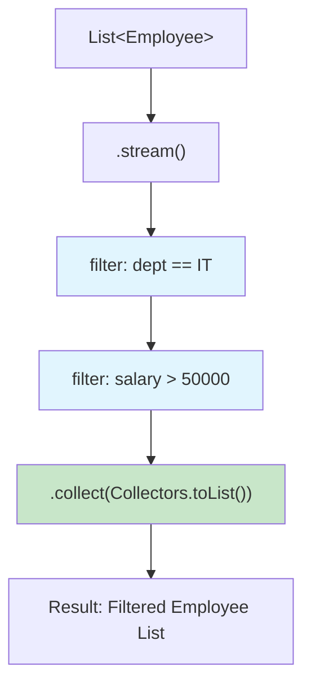
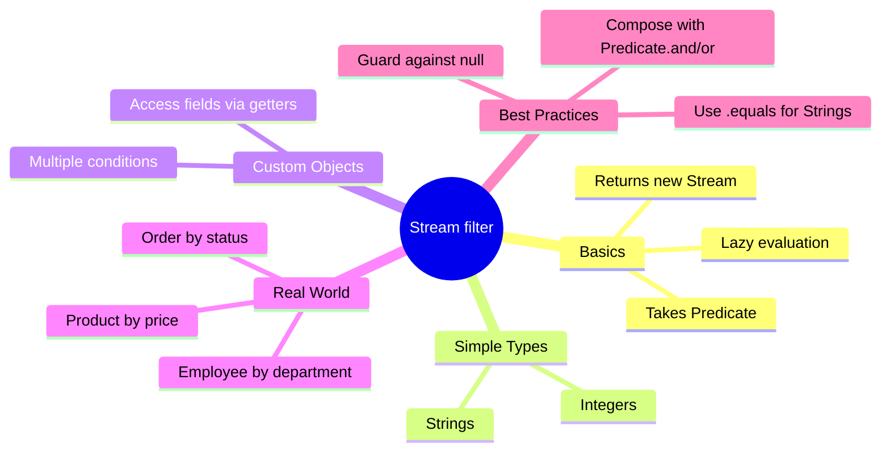

# 📘 Real-World Use Case — Java Stream filter() Method

---

## 📌 Introduction

### 🧠 What is this about?
This note brings `filter()` into the **real world** — filtering employees by department and salary, exactly as you'd do in a production application. We combine everything we've learned: custom objects, multiple predicates, and meaningful domain logic.

### 🌍 Real-World Problem First
You're building an HR dashboard. The manager asks: *"Show me all employees in the IT department who earn more than ₹50,000."* This is a classic filter-on-multiple-fields scenario — and `filter()` makes it elegant.

### ❓ Why does it matter?
- In real projects, you filter domain objects (Employee, Product, Order) by business rules
- Multiple conditions on different fields is the norm, not the exception
- This pattern appears in every REST API, report generator, and data pipeline

### 🗺️ What we'll learn
- Creating a realistic Employee class with multiple fields
- Filtering by a single field (department)
- Filtering by multiple fields (department + salary)
- The complete real-world pipeline: stream → filter → collect

---

## 🧩 Concept 1: Real-World Employee Filtering

### 🧠 Layer 1: The Simple Version
You have a list of employees. You want to pluck out only the ones that match your business criteria — like fishing with a net that only catches fish of a certain size.

### 🔍 Layer 2: The Developer Version
In a real application, your `Employee` class has fields like `name`, `department`, `salary`. The `filter()` predicate accesses these fields to apply business rules. The result is a clean, filtered list ready for display or further processing.

### 🌍 Layer 3: The Real-World Analogy

| HR Dashboard | Stream Pipeline |
|-------------|----------------|
| Employee database | `List<Employee>` |
| Manager's filter: "IT dept, salary > 50K" | `.filter(e -> "IT".equals(e.getDepartment()) && e.getSalary() > 50000)` |
| Matching employees on screen | Filtered list collected via `.toList()` |
| Clicking "Export to Excel" | Terminal operation that consumes the stream |

### ⚙️ Layer 4: How It Works (Step-by-Step)



📊 DIAGRAM PROMPT:
────────────────────────────────────────────────────────────
"Draw a stream pipeline diagram for employee filtering. Show a list of 5 employee cards on the left. An arrow labeled '.stream()' leads to a filter funnel labeled 'Department = IT'. A second filter funnel labeled 'Salary > 50000'. On the right, show the 2 employees that pass both filters collected into a new list. Use blue for filters, green for results. Clean whiteboard style."
────────────────────────────────────────────────────────────

### 💻 Layer 5: Code — Prove It!

**🔍 Setup: The Employee class**
```java
class Employee {
    private String name;
    private String department;
    private double salary;

    public Employee(String name, String department, double salary) {
        this.name = name;
        this.department = department;
        this.salary = salary;
    }

    public String getName() { return name; }
    public String getDepartment() { return department; }
    public double getSalary() { return salary; }

    @Override
    public String toString() {
        return "Employee{name='" + name + "', dept='" + department + "', salary=" + salary + "}";
    }
}
```

**🔍 Filter by department only:**
```java
List<Employee> employees = Arrays.asList(
    new Employee("Ramesh", "IT", 60000),
    new Employee("Sanjay", "HR", 45000),
    new Employee("Meena", "IT", 70000),
    new Employee("Pramod", "Finance", 55000),
    new Employee("Bob", "IT", 40000)
);

// Filter: only IT department
List<Employee> itEmployees = employees.stream()
        .filter(emp -> "IT".equals(emp.getDepartment()))
        .toList();

itEmployees.forEach(System.out::println);
// Output:
// Employee{name='Ramesh', dept='IT', salary=60000.0}
// Employee{name='Meena', dept='IT', salary=70000.0}
// Employee{name='Bob', dept='IT', salary=40000.0}
```

**🔍 Filter by department AND salary:**
```java
// Filter: IT department AND salary > 50000
List<Employee> highPaidIT = employees.stream()
        .filter(emp -> "IT".equals(emp.getDepartment()))
        .filter(emp -> emp.getSalary() > 50000)
        .toList();

highPaidIT.forEach(System.out::println);
// Output:
// Employee{name='Ramesh', dept='IT', salary=60000.0}
// Employee{name='Meena', dept='IT', salary=70000.0}
```

> 💡 **The Aha Moment:** Notice how Bob (IT, salary=40000) got filtered out by the second `filter()`. Each filter narrows the stream progressively — first by department, then by salary. It reads exactly like the English requirement: *"IT employees who earn more than 50K."*

**❌ Mistake: Using `==` instead of `.equals()` for String comparison**
```java
// ❌ WRONG: == compares object references, not values!
.filter(emp -> emp.getDepartment() == "IT")
// Might return empty even when employees have "IT" department
```

**✅ Fix: Always use `.equals()` for String comparison**
```java
// ✅ CORRECT: .equals() compares the actual string content
.filter(emp -> "IT".equals(emp.getDepartment()))
// Placing "IT" first also avoids NullPointerException if getDepartment() returns null
```

---

### ⚠️ Pitfalls & Mistakes

**Mistake 1: Using `==` for String comparison in predicates**
- 👤 What devs do: `emp.getDepartment() == "IT"`
- 💥 Why it breaks: `==` compares memory addresses (references), not string content. String literals might share the same reference (string pool), but strings from databases, JSON parsing, or user input create new objects — so `==` returns `false` even when the text is identical.
- ✅ Fix: Always use `.equals()`. Pro move: put the constant first — `"IT".equals(dept)` — to avoid NPE.

**Mistake 2: Reusing a consumed stream**
- 👤 What devs do: Call `.toList()` on a stream, then try to `filter()` the same stream again
- 💥 Why it breaks: `IllegalStateException: stream has already been operated upon or closed` — a stream can only be consumed once
- ✅ Fix: Create a new stream from the source each time

---

### 💡 Pro Tips

**Tip 1:** Use method references for cleaner predicates when possible
```java
// Instead of:
.filter(emp -> emp.getDepartment().equals("IT"))

// Consider extracting a method:
private static boolean isITDepartment(Employee emp) {
    return "IT".equals(emp.getDepartment());
}

// Then use method reference:
.filter(MyClass::isITDepartment)
```
- Why it works: Named methods improve readability and enable reuse
- When to use: When the same predicate logic appears in multiple places

---

### ✅ Key Takeaways

→ Real-world filtering = accessing object fields via getters inside the predicate
→ Chain `filter()` calls to progressively narrow results — reads like English
→ Always use `.equals()` for String comparison, never `==`
→ Put the constant first in `.equals()` calls to avoid `NullPointerException`
→ A stream can only be consumed once — create a fresh stream for each operation

---

## 🎯 Final Summary

### 🧠 The Big Picture



### ✅ Master Takeaways
→ `filter()` is the workhouse of stream-based data selection
→ From simple integers to complex domain objects, the pattern is the same: `stream → filter(predicate) → collect`
→ Chain filters for readability, combine with `&&` for performance
→ In production, this replaces verbose loops with clean, declarative pipelines

### 🔗 What's Next?
Now that we can **select** elements with `filter()`, the next question is: *"What if I don't want the whole object — just one field from each element?"* That's exactly what the `map()` method does. Let's explore **Stream map()** next.
