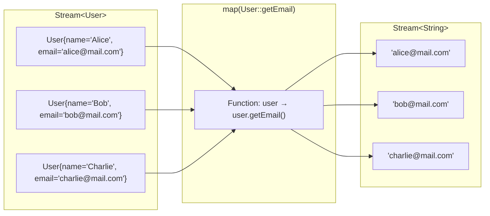

# 📘 Understanding Stream map() Method

---

## 📌 Introduction

### 🧠 What is this about?
The `map()` method is a **transformation** operation in Java Streams. While `filter()` selects elements, `map()` **changes** each element into something else — like translating every word in a sentence from English to Spanish.

### 🌍 Real-World Problem First
You have a list of `User` objects, but the API only needs to return their email addresses — not the full user object. Without `map()`, you'd loop through the list, call `getEmail()` on each user, and manually build a new list. With `map()`, it's a single, elegant line.

### ❓ Why does it matter?
- `map()` lets you **transform** data shape — extract one field, convert types, or reshape objects
- It's the most fundamental transformation operation in functional programming
- Combined with `filter()` and `collect()`, it forms the backbone of every stream pipeline
- In real projects, you use it for: Entity → DTO conversion, extracting fields, formatting data

### 🗺️ What we'll learn
- What `map()` does and how it differs from `filter()`
- The `Function<T, R>` interface that powers `map()`
- How `map()` transforms each element independently
- Visual understanding of input stream → transformation → output stream

---

## 🧩 Concept 1: What is the map() Method?

### 🧠 Layer 1: The Simple Version
`map()` takes each element in a stream and **converts** it into something else. You give it a recipe, and it applies that recipe to every single element, producing a new stream of transformed results.

### 🔍 Layer 2: The Developer Version
`map()` is an intermediate operation that takes a `Function<T, R>` — a functional interface that accepts one type (`T`) and returns another type (`R`). It applies this function to every element, producing a new `Stream<R>`.

```java
<R> Stream<R> map(Function<? super T, ? extends R> mapper)
```

Key characteristics:
- **Intermediate** — returns a new stream (chainable)
- **Lazy** — doesn't execute until a terminal operation
- **One-to-one** — each input element produces exactly one output element
- **Type-changing** — input and output types can differ (`Stream<User>` → `Stream<String>`)

### 🌍 Layer 3: The Real-World Analogy

Think of `map()` as a **factory assembly line**:

| Factory Assembly Line | Stream map() |
|----------------------|-------------|
| Raw materials (iron, plastic) | Input stream elements (`User` objects) |
| Machine that shapes each piece | The `Function` you pass to `map()` |
| Shaped products (phone cases) | Output stream elements (email strings) |
| Each raw material → one product | Each input element → one output element |
| Materials go in one end, products come out the other | `Stream<User>` in → `Stream<String>` out |

The machine (function) doesn't skip any item and doesn't produce extras — every input becomes exactly one output.

### ⚙️ Layer 4: How It Works Internally

**Step 1 — Source stream:** You start with a `Stream<T>` (e.g., `Stream<User>`)
**Step 2 — map() registered:** The transformation function is registered but not executed (lazy)
**Step 3 — Terminal operation triggers:** When you call `collect()` or `forEach()`, elements flow through
**Step 4 — Transformation applied:** Each element enters the function, gets transformed, and exits as a new type
**Step 5 — New stream formed:** The output is a `Stream<R>` (e.g., `Stream<String>` of emails)



📊 DIAGRAM PROMPT:
────────────────────────────────────────────────────────────
"Draw a stream transformation diagram. On the left, show 3 colored boxes labeled 'User objects' with fields (name, email, age). In the middle, show a function box labeled 'map(user → user.getEmail())'. On the right, show 3 smaller boxes containing only email strings. Use arrows from each input to the function to the corresponding output. Blue for input, orange for function, green for output. Clean whiteboard style."
────────────────────────────────────────────────────────────

### 💻 Layer 5: Code — Prove It!

**🔍 Simple example: Convert integers to their squares**
```java
List<Integer> numbers = Arrays.asList(1, 2, 3, 4, 5);

List<Integer> squares = numbers.stream()
        .map(n -> n * n)  // Function: Integer → Integer
        .toList();

System.out.println(squares); // Output: [1, 4, 9, 16, 25]
```

**🔍 Type-changing example: String to its length**
```java
List<String> words = Arrays.asList("Java", "Stream", "Map");

List<Integer> lengths = words.stream()
        .map(String::length)  // Function: String → Integer
        .toList();

System.out.println(lengths); // Output: [4, 6, 3]
```

**🔍 Convert strings to uppercase:**
```java
List<String> names = Arrays.asList("alice", "bob", "charlie");

List<String> upperNames = names.stream()
        .map(String::toUpperCase)  // Function: String → String
        .toList();

System.out.println(upperNames); // Output: [ALICE, BOB, CHARLIE]
```

### 📊 Layer 6: Comparison — filter() vs map()

| Feature | `filter()` | `map()` |
|---------|-----------|---------|
| Purpose | **Select** elements | **Transform** elements |
| Input type → Output type | `T → T` (same type) | `T → R` (can change type) |
| Element count | Can **reduce** count | Always **same** count |
| Parameter | `Predicate<T>` (returns boolean) | `Function<T, R>` (returns new value) |
| Think of it as | A gatekeeper | A converter/translator |

**Why the difference?** `filter()` answers yes/no for each element (keep or discard), so it can only reduce the count. `map()` transforms each element 1-to-1, so the count stays the same — but the type and content can change completely.

---

### ⚠️ Pitfalls & Mistakes

**Mistake 1: Confusing map() with filter()**
- 👤 What devs do: Try to use `map()` to remove elements
- 💥 Why it breaks: `map()` always produces one output per input. If you return `null` for unwanted elements, you get a list with `null` values — not a smaller list
- ✅ Fix: Use `filter()` to remove elements, then `map()` to transform the survivors

```java
// ❌ Wrong: trying to "filter" with map
List<String> result = names.stream()
    .map(name -> name.startsWith("A") ? name : null)  // Returns nulls!
    .toList();
// result = ["Alice", null, null] — NOT what you want

// ✅ Correct: filter first, then map
List<String> result = names.stream()
    .filter(name -> name.startsWith("A"))  // Select
    .map(String::toUpperCase)              // Transform
    .toList();
// result = ["ALICE"]
```

---

### 💡 Pro Tips

**Tip 1:** Use method references for simple transformations
```java
// Lambda:
.map(user -> user.getEmail())

// Method reference (shorter, cleaner):
.map(User::getEmail)
```
- Why it works: When the lambda simply calls a single method, the method reference is a shorthand
- When to use: Always, when the lambda body is a single method call

---

### ✅ Key Takeaways for This Concept

→ `map()` transforms every element — it doesn't filter or skip any
→ It takes a `Function<T, R>` — input type `T`, output type `R` (can be different!)
→ It's a 1-to-1 mapping: same number of elements in, same number out
→ Use method references (`User::getEmail`) for clean, readable code
→ `filter()` selects, `map()` transforms — they complement each other perfectly

---

> Now that we understand what `map()` does conceptually, let's see it in action with a concrete coding example.

---

## 🎯 Final Summary

### ✅ Master Takeaways
→ `map()` = "apply this function to every element"
→ The `Function<T, R>` interface is the engine: takes one type, returns another
→ `filter()` + `map()` together = "select the right data, then reshape it" — the most common stream pattern
→ Always prefer method references for readability

### 🔗 What's Next?
In the next note, we'll put `map()` to work in a **hands-on coding example** — converting a list of strings using `map()` and seeing the full pipeline in action.
